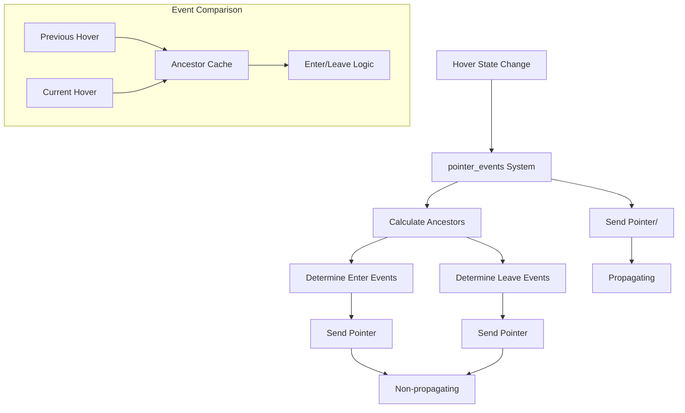

+++
title = "#22991 Adds `Pointer<Enter>` and `Pointer<Leave>` Events - Hierarchy aware versions of `Pointer<Over>` and `Pointer<Out>`"
date = "2026-02-19T00:00:00"
draft = false
template = "pull_request_page.html"
in_search_index = true

[taxonomies]
list_display = ["show"]

[extra]
current_language = "en"
available_languages = {"en" = { name = "English", url = "/pull_request/bevy/2026-02/pr-22991-en-20260219" }, "zh-cn" = { name = "中文", url = "/pull_request/bevy/2026-02/pr-22991-zh-cn-20260219" }}
labels = ["C-Feature", "A-UI", "D-Modest", "A-Picking"]
+++

# Title
Adds `Pointer<Enter>` and `Pointer<Leave>` Events - Hierarchy aware versions of `Pointer<Over>` and `Pointer<Out>`

## Basic Information
- **Title**: Adds `Pointer<Enter>` and `Pointer<Leave>` Events - Hierarchy aware versions of `Pointer<Over>` and `Pointer<Out>`
- **PR Link**: https://github.com/bevyengine/bevy/pull/22991
- **Author**: kfc35
- **Status**: MERGED
- **Labels**: C-Feature, A-UI, S-Ready-For-Final-Review, D-Modest, A-Picking
- **Created**: 2026-02-17T04:56:33Z
- **Merged**: 2026-02-19T00:13:34Z
- **Merged By**: alice-i-cecile

## Description Translation
The PR description is already in English, so it is included as-is.

# Objective

- Fixes #16289 (it's in the 0.19 milestone so I decided to attempt a solution)
- To quote the current `bevy_picking` documentation:
> When the hovering focus shifts between children, parent entities may receive redundant [`Out`] → [`Over`] pairs. In the context of UI, this is especially problematic. Additional hierarchy-aware events will be added in a future release

This PR attempts to add a hierarchy-aware version of the [`Out`] and [`Over`] events

## Solution

- `Enter` and `Leave` are two new events that function like `Out` and `Over`, but they do not auto-propagate. Instead they are sent without propagation in `pointer_events()`. To especially handle the case where children are sticking out of parents, ancestors of hovered items are stored and used when deciding who to send `Enter` and `Leave` events to.

## Testing

- I tested the mesh picking (`cargo run --example mesh_picking`) example after replacing `Over` and `Out` with `Enter` and `Leave` respectively, and it works fine.
- I tested the ui_drag_and_drop (`cargo run --example ui_drag_and_drop`) example as well with the replacements, and that was good too.
- I wrote my own little example (code in the showcase) to ensure that counts for `Enter` and `Leave` events were as I suspect. It utilizes UI nodes, a Red parent, and one blue (although it looks indigo in the example) and one green child that overlap in the middle (the more blue looking area). As you hover over the different color areas, the event counts increase depending on what events are fired. Notably, if you hover over the indigo/green child, and then hover back to the parent, the parent's `Enter` and `Leave` counts do *not* increase. They only increase if you leave the red area for the outside altogether. The `Over` and `Out` counts are provided to show current functionality.

https://github.com/user-attachments/assets/822a88cb-2f63-4471-8011-977dbc241b4a

---

## Showcase

<details>
  <summary>Code for Mini Example</summary>

```rust
//! Demonstrates Enter, Exit, Out, and Over events

use bevy::prelude::*;

fn main() {
    App::new()
        .add_plugins(DefaultPlugins)
        .add_systems(Startup, setup)
        .run();
}

#[derive(Component, Default)]
struct OverCount(u32);

#[derive(Component, Default)]
struct EnterCount(u32);

#[derive(Component, Default)]
struct LeaveCount(u32);

#[derive(Component, Default)]
struct OutCount(u32);

#[derive(Component, Default)]
#[require(OverCount, EnterCount, LeaveCount, OutCount)]
struct EventCounter(String);

#[derive(Component)]
struct TextToUpdate(Entity);

fn setup(mut commands: Commands) {
    commands.spawn(Camera2d);
    commands
        .spawn((
            Node {
                width: percent(100),
                height: percent(100),
                align_items: AlignItems::Center,
                justify_content: JustifyContent::Center,
                ..Default::default()
            },
            Pickable::IGNORE,
        ))
        .with_children(|grand_parent| {
            let gp_text_entity = grand_parent.spawn((
                Node {
                    position_type: PositionType::Absolute,
                    top: px(10),
                    left: px(10),
                    ..default()
                },
                Text::new("Red [Over: 0, Enter: 0, Leave: 0, Out: 0]"),
            )).id();
            let p_text_entity = grand_parent.spawn((
                Node {
                    position_type: PositionType::Absolute,
                    top: px(40),
                    left: px(10),
                    ..default()
                },
                Text::new("Green [Over: 0, Enter: 0, Leave: 0, Out: 0]"),
            )).id();
            let b_text_entity = grand_parent.spawn((
                Node {
                    position_type: PositionType::Absolute,
                    top: px(70),
                    left: px(10),
                    ..default()
                },
                Text::new("Indigo [Over: 0, Enter: 0, Leave: 0, Out: 0]"),
            )).id();
            grand_parent
                .spawn((
                    Node {
                        padding: UiRect::all(Val::Percent(20.)),
                        border: UiRect::all(Val::Px(2.)),
                        ..Default::default()
                    },
                    BackgroundColor(Color::srgba(1., 0., 0., 0.9)),
                    EventCounter("Red".to_string()),
                    Pickable {
                        should_block_lower: false,
                        is_hoverable: true,
                    },
                    TextToUpdate(gp_text_entity)
                ))
                .observe(handle_over)
                .observe(handle_enter)
                .observe(handle_leave)
                .observe(handle_out)
                .with_children(|parent| {
                    parent.spawn((
                        Node {
                            position_type: PositionType::Absolute,
                            bottom: px(-50),
                            right: px(0),
                            padding: UiRect::all(Val::Px(50.)),
                            ..Default::default()
                        },
                        BackgroundColor(Color::srgba(0., 1., 0., 0.9)),
                        EventCounter("Green".to_string()),
                        Pickable {
                            should_block_lower: false,
                            is_hoverable: true,
                        },
                        TextToUpdate(p_text_entity)
                    ))    
                    .observe(handle_over)
                    .observe(handle_enter)
                    .observe(handle_leave)
                    .observe(handle_out);

                    parent.spawn((
                        Node {
                            position_type: PositionType::Absolute,
                            bottom: px(-50),
                            right: px(50),
                            padding: UiRect::all(Val::Px(50.)),
                            ..Default::default()
                        },
                        BackgroundColor(Color::srgba(0., 0., 1., 0.9)),
                        EventCounter("Indigo".to_string()),
                        Pickable {
                            should_block_lower: false,
                            is_hoverable: true,
                        },
                        TextToUpdate(b_text_entity)
                    ))    
                    .observe(handle_over)
                    .observe(handle_enter)
                    .observe(handle_leave)
                    .observe(handle_out);
                });
        });
}

fn handle_over(
    on_over: On<Pointer<Over>>,
    mut query: Query<(
        &EventCounter,
        &mut OverCount,
        &EnterCount,
        &LeaveCount,
        &OutCount,
        &TextToUpdate,
    )>,
    mut text_query: Query<&mut Text>
) {
    if let Ok((event_counter, mut over_count, enter_count, leave_count, out_count, text_to_update)) =
        query.get_mut(on_over.event_target())
    {
        over_count.0 += 1;
        text_query.get_mut(text_to_update.0).unwrap().0 = format!(
            "{} [Over: {}, Enter: {}, Leave: {}, Out: {}]",
            event_counter.0, over_count.0, enter_count.0, leave_count.0, out_count.0
        );
    }
}

fn handle_enter(
    on_over: On<Pointer<Enter>>,
    mut query: Query<(
        &EventCounter,
        &OverCount,
        &mut EnterCount,
        &LeaveCount,
        &OutCount,
        &TextToUpdate,
    )>,
    mut text_query: Query<&mut Text>
) {
    if let Ok((event_counter, over_count, mut enter_count, leave_count, out_count, text_to_update)) =
        query.get_mut(on_over.event_target())
    {
        enter_count.0 += 1;
        text_query.get_mut(text_to_update.0).unwrap().0 = format!(
            "{} [Over: {}, Enter: {}, Leave: {}, Out: {}]",
            event_counter.0, over_count.0, enter_count.0, leave_count.0, out_count.0
        );
    }
}

fn handle_leave(
    on_over: On<Pointer<Leave>>,
    mut query: Query<(
        &EventCounter,
        &OverCount,
        &EnterCount,
        &mut LeaveCount,
        &OutCount,
        &TextToUpdate,
    )>,
    mut text_query: Query<&mut Text>
) {
    if let Ok((event_counter, over_count, enter_count, mut leave_count, out_count, text_to_update)) =
        query.get_mut(on_over.event_target())
    {
        leave_count.0 += 1;
        text_query.get_mut(text_to_update.0).unwrap().0 = format!(
            "{} [Over: {}, Enter: {}, Leave: {}, Out: {}]",
            event_counter.0, over_count.0, enter_count.0, leave_count.0, out_count.0
        );
    }
}

fn handle_out(
    on_over: On<Pointer<Out>>,
    mut query: Query<(
        &EventCounter,
        &OverCount,
        &EnterCount,
        &LeaveCount,
        &mut OutCount,
        &TextToUpdate,
    )>,
    mut text_query: Query<&mut Text>
) {
    if let Ok((event_counter, over_count, enter_count, leave_count, mut out_count, text_to_update)) =
        query.get_mut(on_over.event_target())
    {
        out_count.0 += 1;
        text_query.get_mut(text_to_update.0).unwrap().0 = format!(
            "{} [Over: {}, Enter: {}, Leave: {}, Out: {}]",
            event_counter.0, over_count.0, enter_count.0, leave_count.0, out_count.0
        );
    }
}
```
</details>

## The Story of This Pull Request

This PR addresses a long-standing problem in Bevy's picking system where parent entities receive redundant `Pointer<Out>` → `Pointer<Over>` event pairs when hovering moves between child elements. The issue (#16289) was documented in the picking system's own documentation, which acknowledged that "Additional hierarchy-aware events will be added in a future release."

The core problem stemmed from how `Pointer<Out>` and `Pointer<Over>` events propagate through the entity hierarchy. When a pointer moves from one child to another within the same parent, the parent entity would receive both an `Out` event (for losing hover from the first child) and an `Over` event (for gaining hover through the second child), even though the pointer never actually left the parent's area. This behavior was particularly problematic for UI elements where developers often need to track when the pointer enters or leaves a container, not just individual children.

The solution introduces two new event types: `Pointer<Enter>` and `Pointer<Leave>`. These events are specifically designed to be hierarchy-aware and provide the intuitive behavior that developers expect. Unlike `Over` and `Out`, which propagate automatically to all ancestors, `Enter` and `Leave` events are sent without propagation and use a more sophisticated algorithm to determine which entities should receive them.

The implementation required several interconnected changes. First, the `Pointer<E>` struct was extended with a `propagate` field to control whether events should bubble up through the hierarchy. The existing `Pointer::new` constructor creates propagating events, while a new `Pointer::new_without_propagate` constructor creates non-propagating events. The `PointerTraversal` system was modified to respect this flag, preventing `Enter` and `Leave` events from automatically propagating to parent entities.

The core logic for determining which entities receive `Enter` and `Leave` events is in the `pointer_events` system. The system maintains a cache of ancestors for each hovered entity using a new `HoveredEntityAncestors` type. When the pointer moves, the system calculates which entities should receive `Leave` events by comparing the ancestors of previously hovered entities with those currently hovered. Similarly, it determines which entities should receive `Enter` events by comparing current hovered entities with previously hovered ones. This ancestor-based approach ensures that shared ancestors don't receive redundant events when hovering moves between their children.

The events themselves include additional context: `Enter` has an `is_in_bounds` field indicating whether the pointer directly entered the entity's bounds (as opposed to entering a child that extends beyond the parent), and `Leave` has a corresponding `was_in_bounds` field. This matches the behavior of `mouseenter` and `mouseleave` events in web browsers, providing a familiar API for developers.

Two helper functions were added to `hover.rs` to support this logic: `get_hovered_entities` extracts all entities hovered by a specific pointer, and `is_directly_hovered` checks if an entity is directly hovered (as opposed to receiving hover through propagation).

The PR includes comprehensive tests that verify the correct behavior of the new events in various scenarios, including when children extend beyond parent bounds and when hovering moves between siblings. The tests demonstrate that shared ancestors correctly don't receive `Enter` or `Leave` events when hovering moves between their children.

From an architectural perspective, this change maintains backward compatibility. The existing `Over` and `Out` events continue to work as before, providing the bubbling behavior that some use cases might still require. The new `Enter` and `Leave` events offer an alternative for developers who need hierarchy-aware behavior. The implementation is efficient, using cached ancestor sets to avoid repeated hierarchy traversals during the event dispatch process.

This PR represents a significant improvement to Bevy's picking system, addressing a known pain point for UI development while maintaining the flexibility and performance characteristics expected in a game engine.

## Visual Representation



## Key Files Changed

### `crates/bevy_picking/src/events.rs` (+575/-18)
This is the main file with the majority of changes. It adds the new `Enter` and `Leave` event types, extends the `Pointer` struct with propagation control, implements the ancestor caching logic, and updates the `pointer_events` system to handle the new events.

Key additions:
1. New `Enter` and `Leave` event structs with additional context fields
2. `propagate` field added to `Pointer<E>` struct
3. `HoveredEntityAncestors` cache type for efficient ancestor lookups
4. Updated `pointer_events` system with logic for dispatching `Enter` and `Leave` events
5. Comprehensive test suite for the new functionality

Example of the new event types:
```rust
#[derive(Clone, PartialEq, Debug, Reflect)]
#[reflect(Clone, PartialEq)]
pub struct Enter {
    pub hit: HitData,
    pub is_in_bounds: bool,
}

#[derive(Clone, PartialEq, Debug, Reflect)]
#[reflect(Clone, PartialEq)]
pub struct Leave {
    pub hit: HitData,
    pub was_in_bounds: bool,
}
```

### `crates/bevy_picking/src/hover.rs` (+28/-0)
Added helper functions to support the new event logic:
- `get_hovered_entities`: Extracts all entities hovered by a pointer
- `is_directly_hovered`: Checks if an entity is directly hovered (not through propagation)

Example:
```rust
pub(crate) fn get_hovered_entities(
    hover_map: &HashMap<PointerId, HashMap<Entity, HitData>>,
    pointer_id: &PointerId,
) -> HashSet<Entity> {
    hover_map
        .get(pointer_id)
        .map_or(HashSet::default(), |entity_hit| {
            entity_hit
                .iter()
                .map(|(&entity, _)| entity)
                .collect::<HashSet<Entity>>()
        })
}
```

### `examples/ui/navigation/directional_navigation.rs` (+6/-6) and `examples/ui/navigation/directional_navigation_overrides.rs` (+6/-6)
Updated examples to use the new `Pointer::new` constructor API. The examples were previously using struct literal syntax which was deprecated in favor of the constructor method.

Before:
```rust
commands.trigger(Pointer::<Click> {
    entity: focused_entity,
    // ... other fields
});
```

After:
```rust
commands.trigger(Pointer::new(
    PointerId::Mouse,
    Location { /* ... */ },
    Click { /* ... */ },
    focused_entity,
));
```

### `crates/bevy_picking/src/lib.rs` (+2/-0)
Registered the new `Pointer<Enter>` and `Pointer<Leave>` events with Bevy's message system so they can be used by applications.

## Further Reading
- [Bevy Picking Documentation](https://docs.rs/bevy_picking/latest/bevy_picking/) - For understanding the picking system architecture
- [DOM mouseenter/mouseleave Events](https://developer.mozilla.org/en-US/docs/Web/API/Element/mouseenter_event) - The web standard that inspired this implementation
- [Event Bubbling and Capturing](https://developer.mozilla.org/en-US/docs/Learn/JavaScript/Building_blocks/Events#event_bubbling_and_capture) - Concepts relevant to understanding the difference between propagating and non-propagating events