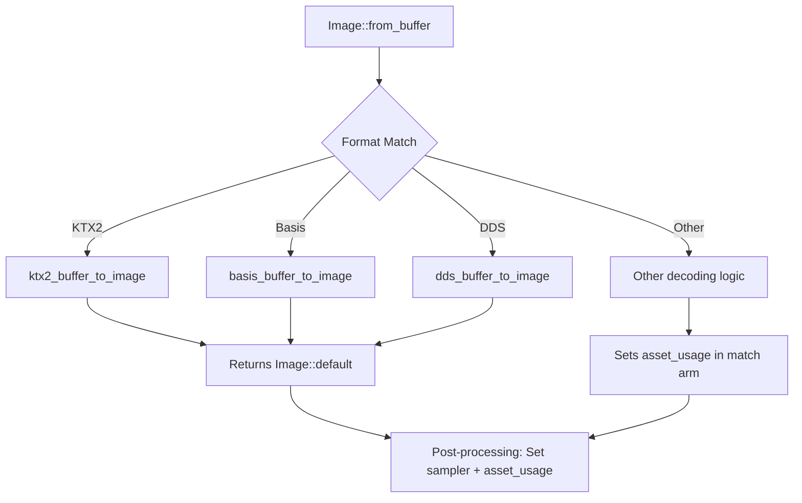

+++
title = "#22992 Ktx2, Basis, and DDS files ignoring RenderAssetUsages from .meta files"
date = "2026-02-17T00:00:00"
draft = false
template = "pull_request_page.html"
in_search_index = true

[taxonomies]
list_display = ["show"]

[extra]
current_language = "en"
available_languages = {"en" = { name = "English", url = "/pull_request/bevy/2026-02/pr-22992-en-20260217" }, "zh-cn" = { name = "中文", url = "/pull_request/bevy/2026-02/pr-22992-zh-cn-20260217" }}
labels = ["C-Bug", "A-Rendering", "D-Straightforward"]
+++

# Title
Ktx2, Basis, and DDS files ignoring RenderAssetUsages from .meta files

## Basic Information
- **Title**: Ktx2, Basis, and DDS files ignoring RenderAssetUsages from .meta files
- **PR Link**: https://github.com/bevyengine/bevy/pull/22992
- **Author**: mholiv
- **Status**: MERGED
- **Labels**: C-Bug, A-Rendering, S-Ready-For-Final-Review, D-Straightforward
- **Created**: 2026-02-17T08:27:39Z
- **Merged**: 2026-02-17T17:23:27Z
- **Merged By**: alice-i-cecile

## Description Translation
**Objective**

Fixes #22969

Setting asset_usage in a .meta file (e.g. `RenderAssetUsages("RENDER_WORLD")`) is silently ignored for KTX2, Basis, and DDS textures. The texture always loads with the default `MAIN_WORLD | RENDER_WORLD`, so CPU-side pixel data is never freed after GPU upload.

This happens because `asset_usage` is only applied inside the catch-all `_` arm of the format match in `Image::from_buffer`. The KTX2, Basis, and DDS arms call their own `*_buffer_to_image` functions which create an `Image::default()`, bypassing the setting entirely.

**Solution**

Set `image.asset_usage = asset_usage` after the format match in from_buffer, right next to where `image.sampler` is already set. This applies the correct usage for all formats uniformly.

**Testing**

cargo test -p bevy_image, all tests pass.

Edit: Tested this patch in my game, ktx files no longer in system memory after transfer to GPU renderworld.

## The Story of This Pull Request

This pull request addresses a memory management issue in Bevy's texture loading system. The problem involves specific compressed texture formats - KTX2, Basis, and DDS - not respecting memory usage flags configured in metadata files.

The core issue was that when textures are loaded, Bevy uses the `RenderAssetUsages` setting to determine whether to keep CPU-side pixel data after uploading to the GPU. This is a critical optimization: for textures that only need to exist on the GPU (like most game textures), we want to free the CPU memory after the GPU upload completes. This is controlled via `.meta` files where developers can specify `RenderAssetUsages("RENDER_WORLD")`.

The bug occurred because the `Image::from_buffer` method was inconsistently applying the `asset_usage` parameter. Looking at the code structure, when loading standard formats like PNG or JPEG, the code followed the catch-all `_` arm in a match statement, which correctly set the `asset_usage` field. However, for specialized compressed formats (KTX2, Basis, and DDS), separate `*_buffer_to_image` functions were called that returned `Image::default()` instances, bypassing the intended `asset_usage` setting entirely.

The consequence was predictable: these compressed textures would always load with the default `MAIN_WORLD | RENDER_WORLD` usage, meaning their CPU data was never freed after GPU upload. In memory-constrained environments or with many textures, this could significantly increase memory usage without providing any benefit.

The fix is straightforward and demonstrates good software engineering practice. Rather than modifying each of the three separate `*_buffer_to_image` functions or duplicating code, the solution moves the `asset_usage` assignment to a common location after the format-specific decoding logic completes. This placement next to where the `sampler` is already set makes logical sense - both are post-processing steps that should apply uniformly regardless of the decoding path.

The change is minimal (adding just one line) but effectively solves the problem for all formats. This approach maintains clean separation of concerns: the format-specific decoders focus on decoding the compressed data, while the calling function handles the uniform application of rendering-specific configuration.

From an architectural perspective, this fix highlights the importance of considering all code paths when implementing configuration propagation. The original implementation had the right idea - setting `asset_usage` - but only applied it to one code path. The fix ensures consistency across all supported texture formats.

Testing confirms the solution works: all existing tests pass, and the author verified in their actual game that KTX files no longer remain in system memory after GPU transfer. This is exactly the behavior developers expect when setting `RenderAssetUsages("RENDER_WORLD")` in their metadata files.

## Visual Representation



## Key Files Changed

### `crates/bevy_image/src/image.rs` (+1/-0)

**What changed and why**: Added a single line to ensure the `asset_usage` parameter is applied to all `Image` instances created by `Image::from_buffer`, regardless of the image format. Previously, this setting was only applied in the catch-all case of a match statement, missing KTX2, Basis, and DDS formats.

**Code snippet showing the change**:

```rust
// The relevant section of Image::from_buffer method

// Before (simplified representation):
let mut image = match format {
    ImageFormat::Ktx2 => ktx2_buffer_to_image(buffer, format, supported_compressed_formats)?,
    ImageFormat::Basis => basis_buffer_to_image(buffer, format, supported_compressed_formats)?,
    ImageFormat::Dds => dds_buffer_to_image(buffer, format, supported_compressed_formats)?,
    _ => {
        // ... decoding logic for other formats ...
        image.asset_usage = asset_usage;  // Only set here
        image
    }
};
image.sampler = image_sampler;
// asset_usage not set for KTX2/Basis/DDS here

// After:
let mut image = match format {
    ImageFormat::Ktx2 => ktx2_buffer_to_image(buffer, format, supported_compressed_formats)?,
    ImageFormat::Basis => basis_buffer_to_image(buffer, format, supported_compressed_formats)?,
    ImageFormat::Dds => dds_buffer_to_image(buffer, format, supported_compressed_formats)?,
    _ => {
        // ... decoding logic for other formats ...
        // Note: asset_usage no longer set here
        image
    }
};
image.sampler = image_sampler;
image.asset_usage = asset_usage;  // Now set uniformly for all formats
```

**How these changes relate to the overall purpose**: This single-line addition fixes the memory leak issue for compressed textures by ensuring all image formats respect the `asset_usage` configuration from `.meta` files. The change moves the setting to a common location after format-specific decoding, guaranteeing consistent behavior.

## Further Reading

1. [Bevy Asset System Documentation](https://bevyengine.org/learn/quick-start/assets/) - Understanding how assets and metadata work in Bevy
2. [RenderAssetUsages API Documentation](https://docs.rs/bevy/latest/bevy/render/render_resource/enum.RenderAssetUsages.html) - Official documentation for the RenderAssetUsages enum
3. [Compressed Texture Formats in Graphics Programming](https://www.khronos.org/opengl/wiki/Compressed_Texture) - Background on KTX2, Basis, and DDS formats
4. [Memory Management in Game Engines](https://gameprogrammingpatterns.com/object-pool.html) - Patterns for efficient resource management in games