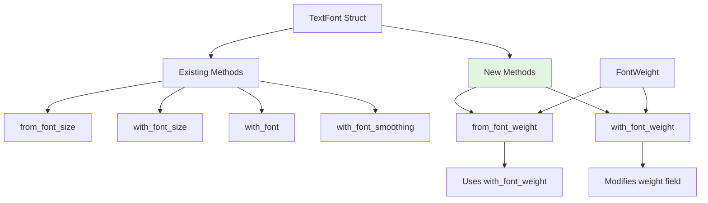

+++
title = "#23007 Adding `TextFont` font weight helper methods"
date = "2026-02-17T00:00:00"
draft = false
template = "pull_request_page.html"
in_search_index = true

[taxonomies]
list_display = ["show"]

[extra]
current_language = "en"
available_languages = {"en" = { name = "English", url = "/pull_request/bevy/2026-02/pr-23007-en-20260217" }, "zh-cn" = { name = "中文", url = "/pull_request/bevy/2026-02/pr-23007-zh-cn-20260217" }}
labels = ["D-Trivial", "C-Usability", "A-Text"]
+++

# Title
Adding `TextFont` font weight helper methods

## Basic Information
- **Title**: Adding `TextFont` font weight helper methods
- **PR Link**: https://github.com/bevyengine/bevy/pull/23007
- **Author**: Cr0a3
- **Status**: MERGED
- **Labels**: D-Trivial, C-Usability, S-Ready-For-Final-Review, A-Text
- **Created**: 2026-02-17T16:34:45Z
- **Merged**: 2026-02-17T19:52:19Z
- **Merged By**: alice-i-cecile

## Description Translation

# Objective

This pr adds an additional constructure for the `TextFont` structure, enabeling it, to be constructed from the font weight.

## Solution

I've added folloing methodes:
```rust
fn TextFont::from_font_weight(impl Into<FontWeight>) -> Self { ... }
fn TextFont::with_font_weight(self, impl Into<FontWeight>) -> Self { ... }
```

### Additional context

This pr is relevant to #23006

## The Story of This Pull Request

This PR addresses a minor but noticeable gap in Bevy's text API ergonomics. The `TextFont` struct, which controls font rendering properties, already had builder-style methods for several properties like font face, font size, and font smoothing. However, it was missing similar convenience methods for controlling font weight - a common typographic property that determines how thick or thin the characters appear.

The issue was straightforward: developers working with text in Bevy could easily set font weight by directly modifying the `weight` field of a `TextFont` instance, but the API lacked the convenience methods that existed for other properties. This created inconsistency in the API surface and made code that heavily used builder patterns less clean.

The developer implemented a solution that follows existing patterns in the codebase. They added two methods to the `TextFont` implementation:
- `from_font_weight()`: A static constructor that creates a new `TextFont` with default values for all fields except the weight
- `with_font_weight()`: A builder method that takes an existing `TextFont` instance and returns a new one with the weight modified

Both methods accept any type that implements `Into<FontWeight>`, providing flexibility in how developers specify the weight. This is consistent with other similar methods in the API like `with_font_size()`.

The implementation is minimal and focused. The `from_font_weight()` method leverages the existing default constructor and chains it with the new `with_font_weight()` method, following the DRY principle. The `with_font_weight()` method modifies the `weight` field directly and returns the modified `self`, enabling method chaining.

This change doesn't introduce new functionality but improves developer experience by making the API more consistent and complete. Developers can now use the same fluent interface patterns for font weight that they use for other font properties. The PR is appropriately labeled as both trivial (D-Trivial) and a usability improvement (C-Usability), reflecting its straightforward nature and positive impact on API ergonomics.

The PR references issue #23006, suggesting this might be part of a broader effort to improve text-related APIs in Bevy, though the connection isn't explicitly detailed in the PR description itself.

## Visual Representation



## Key Files Changed

**crates/bevy_text/src/text.rs** (+11/-0)

This file contains the `TextFont` struct definition and its implementation. The changes add two new methods to the existing implementation block.

**Key modifications:**

1. Added `from_font_weight()` static constructor method:
```rust
/// Returns a new [`TextFont`] with the specified font weight
pub fn from_font_weight(weight: impl Into<FontWeight>) -> Self {
    Self::default().with_font_weight(weight)
}
```

2. Added `with_font_weight()` builder method:
```rust
/// Returns this [`TextFont`] with the specified [`FontWeight`].
pub fn with_font_weight(mut self, weight: impl Into<FontWeight>) -> Self {
    self.weight = weight.into();
    self
}
```

**How these changes relate to the overall purpose:**
These methods follow the exact same pattern as existing methods in the `TextFont` implementation. For example, comparing with the existing `from_font_size()` and `with_font_size()` methods shows the consistent pattern:

```rust
// Existing pattern for font size
pub fn from_font_size(font_size: impl Into<FontSize>) -> Self {
    Self::default().with_font_size(font_size)
}

pub fn with_font_size(mut self, font_size: impl Into<FontSize>) -> Self {
    self.font_size = font_size.into();
    self
}
```

The new methods simply extend this pattern to the `weight` field, completing the set of builder methods for all `TextFont` properties.

## Further Reading

1. **Bevy Text Documentation**: The official Bevy documentation for text rendering provides context on how `TextFont` is used in the larger text system.

2. **Builder Pattern in Rust**: This PR exemplifies the builder pattern in Rust, which is commonly used for creating complex objects with many optional parameters. Resources on Rust design patterns would provide deeper understanding of this approach.

3. **Typographic Concepts**: Understanding font weight (thin, regular, bold, etc.) and other typographic properties helps appreciate why this API improvement is useful for game developers working with text.

4. **Rust's `Into` Trait**: The use of `impl Into<FontWeight>` in method signatures demonstrates Rust's trait system for accepting flexible input types. Documentation on the `Into` and `From` traits would explain this pattern further.

5. **Related PR #23006**: While not detailed in this PR, the referenced issue might provide additional context about broader text API improvements in Bevy.