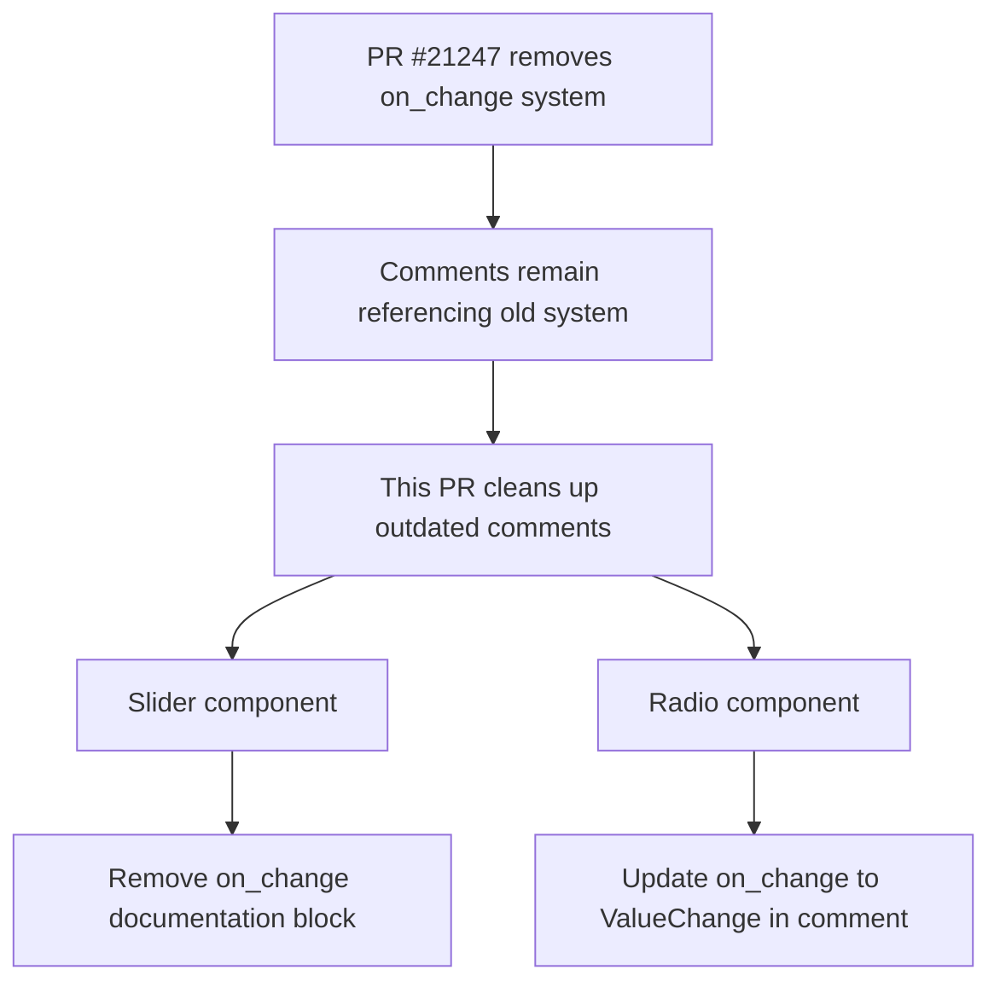

+++
title = "#23009 Fix comments still referring to `on_change` callbacks"
date = "2026-02-17T00:00:00"
draft = false
template = "pull_request_page.html"
in_search_index = true

[taxonomies]
list_display = ["show"]

[extra]
current_language = "en"
available_languages = {"en" = { name = "English", url = "/pull_request/bevy/2026-02/pr-23009-en-20260217" }, "zh-cn" = { name = "中文", url = "/pull_request/bevy/2026-02/pr-23009-zh-cn-20260217" }}
labels = ["D-Trivial", "A-UI", "C-Code-Quality"]
+++

# Fix comments still referring to `on_change` callbacks

## Basic Information
- **Title**: Fix comments still referring to `on_change` callbacks
- **PR Link**: https://github.com/bevyengine/bevy/pull/23009
- **Author**: goodartistscopy
- **Status**: MERGED
- **Labels**: D-Trivial, A-UI, C-Code-Quality, S-Ready-For-Final-Review
- **Created**: 2026-02-17T19:40:04Z
- **Merged**: 2026-02-17T20:40:53Z
- **Merged By**: alice-i-cecile

## Description
PR #21247 removed `on_change` callbacks but left some mentions of them in comments. This removes them.

## The Story of This Pull Request

This PR addresses a straightforward but important code quality issue in the Bevy UI widgets system. The problem originated from PR #21247, which removed the old `on_change` callback system but left behind documentation comments that still referenced the removed functionality. These outdated comments created confusion for developers trying to understand how the UI widgets currently work.

The issue was identified in two key UI components: radio buttons and sliders. In both cases, comments in the source code were still describing behavior that no longer existed in the codebase. The `on_change` callback system had been replaced with a more modern event-driven approach using `ValueChange` events, but the documentation hadn't been updated to reflect this architectural change.

Looking at the `slider.rs` file, we can see the core of the problem. A large block of comments (lines 51-58) was still explaining how the `on_change` property worked, describing concepts like "internal or external state management" and "one-shot system which is passed the new slider value." This documentation was completely obsolete since the actual code no longer contained any `on_change` property or callback mechanism. The comment was essentially describing a phantom feature that didn't exist, which could mislead developers trying to understand the slider implementation.

The solution was surgical and precise: simply remove the outdated comments. In `slider.rs`, the developer deleted the entire block of text that described the old `on_change` system. Additionally, they updated another comment that mentioned "using the `on_change` callback" to instead explain the current reality: the `SetSliderValue` event triggers a `ValueChange` event, and the application remains responsible for hooking up the corresponding change to `SliderValue` via the `slider_self_update` system.

The change in `radio.rs` was similarly focused. The comment on line 146 originally referred to triggering "the on_change event" but was updated to correctly reference "the `ValueChange` event." This small change ensures consistency in terminology throughout the codebase.

From an engineering perspective, this PR demonstrates the importance of maintaining documentation hygiene during architectural migrations. When PR #21247 removed the `on_change` callback system, it represented a significant shift in how UI components communicate state changes. However, without updating the accompanying documentation, the knowledge transfer to other developers remained incomplete. This kind of documentation drift is a common technical debt that accumulates during rapid codebase evolution.

The implementation approach here is correct for the problem scope. Since the comments were describing functionality that no longer exists, complete removal was the appropriate action rather than attempting to rewrite them. The alternative approach would have been to update the comments to describe the new event system, but given that other documentation likely covers the `ValueChange` event system more comprehensively, removing the obsolete explanations reduces duplication and potential inconsistency.

The impact of these changes is primarily on developer experience and code maintainability. New developers exploring the UI widget code will no longer be misled by documentation describing a deprecated system. This reduces cognitive load and prevents potential misunderstandings that could lead to incorrect implementations when extending or modifying these components. Additionally, by cleaning up these comments, the codebase becomes slightly easier to search - developers looking for references to the current event system won't be distracted by false positives from old documentation.

The technical lesson here is about the importance of comprehensive cleanup during architectural migrations. When removing a significant feature like `on_change` callbacks, it's not enough to just delete the code; all references in documentation, comments, and examples must also be updated. This PR serves as a follow-up cleanup that completes the work started in PR #21247.

## Visual Representation



## Key Files Changed

### `crates/bevy_ui_widgets/src/slider.rs` (+3/-8)
This file contained the most significant outdated documentation about the removed `on_change` callback system.

**Before:**
```rust
/// The presence of the `on_change` property controls whether the slider uses internal or external
/// state management. If the `on_change` property is `None`, then the slider updates its own state
/// automatically. Otherwise, the `on_change` property contains the id of a one-shot system which is
/// passed the new slider value. In this case, the slider value is not modified, it is the
/// responsibility of the callback to trigger whatever data-binding mechanism is used to update the
/// slider's value.
```

**After:**
(Entire block removed)

**Before:**
```rust
/// An [`EntityEvent`] that can be triggered on a slider to modify its value (using the `on_change` callback).
```

**After:**
```rust
/// An [`EntityEvent`] that can be triggered on a slider to modify its value (it will actually trigger
/// a [`ValueChange`] event, hooking up a corresponding change to [`SliderValue`] is still the app's responsibility,
/// see [`slider_self_update`]).
```

### `crates/bevy_ui_widgets/src/radio.rs` (+1/-1)
This file had a single comment that needed updating to use the correct terminology.

**Before:**
```rust
// Trigger the on_change event for the newly checked radio button on radio group
```

**After:**
```rust
// Trigger the `ValueChange` event for the newly checked radio button on radio group
```

## Further Reading

1. **PR #21247**: The original PR that removed the `on_change` callback system, providing context for why these comments were outdated.
2. **Bevy UI Event System Documentation**: For understanding the current `ValueChange` event system that replaced the old callback approach.
3. **Code Comment Hygiene Best Practices**: Resources on maintaining accurate documentation during codebase evolution and architectural migrations.
4. **Technical Debt Management**: Strategies for identifying and addressing accumulated technical debt like outdated documentation.

## Full Code Diff
```
diff --git a/crates/bevy_ui_widgets/src/radio.rs b/crates/bevy_ui_widgets/src/radio.rs
index ec625bc0a74fa..ca6b056e74203 100644
--- a/crates/bevy_ui_widgets/src/radio.rs
+++ b/crates/bevy_ui_widgets/src/radio.rs
@@ -143,7 +143,7 @@ fn radio_group_on_key_input(
                 source: next_id,
                 value: true,
             });
-            // Trigger the on_change event for the newly checked radio button on radio group
+            // Trigger the `ValueChange` event for the newly checked radio button on radio group
             commands.trigger(ValueChange::<Entity> {
                 source: ev.focused_entity,
                 value: next_id,
diff --git a/crates/bevy_ui_widgets/src/slider.rs b/crates/bevy_ui_widgets/src/slider.rs
index 453aaa12e65ed..92bd1e37ca166 100644
--- a/crates/bevy_ui_widgets/src/slider.rs
+++ b/crates/bevy_ui_widgets/src/slider.rs
@@ -51,13 +51,6 @@ pub enum TrackClick {
 /// You can also control the slider remotely by triggering a [`SetSliderValue`] event on it. This
 /// can be useful in a console environment for controlling the value gamepad inputs.
 ///
-/// The presence of the `on_change` property controls whether the slider uses internal or external
-/// state management. If the `on_change` property is `None`, then the slider updates its own state
-/// automatically. Otherwise, the `on_change` property contains the id of a one-shot system which is
-/// passed the new slider value. In this case, the slider value is not modified, it is the
-/// responsibility of the callback to trigger whatever data-binding mechanism is used to update the
-/// slider's value.
-///
 /// Typically a slider will contain entities representing the "track" and "thumb" elements. The core
 /// slider makes no assumptions about the hierarchical structure of these elements, but expects that
 /// the thumb will be marked with a [`SliderThumb`] component.
@@ -502,7 +495,9 @@ pub(crate) fn slider_on_insert_step(insert: On<Insert, SliderStep>, mut world: D
     }
 }
 
-/// An [`EntityEvent`] that can be triggered on a slider to modify its value (using the `on_change` callback).
+/// An [`EntityEvent`] that can be triggered on a slider to modify its value (it will actually trigger
+/// a [`ValueChange`] event, hooking up a corresponding change to [`SliderValue`] is still the app's responsibility,
+/// see [`slider_self_update`]).
 /// This can be used to control the slider via gamepad buttons or other inputs. The value will be
 /// clamped when the event is processed.
 ///
```