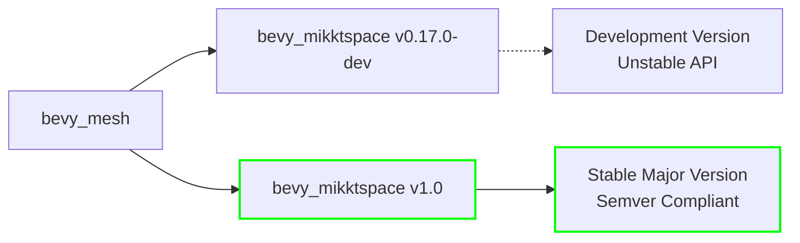

+++
title = "#23010 bevy_mikktspace 1.0"
date = "2026-02-17T00:00:00"
draft = false
template = "pull_request_page.html"
in_search_index = true

[taxonomies]
list_display = ["show"]

[extra]
current_language = "en"
available_languages = {"en" = { name = "English", url = "/pull_request/bevy/2026-02/pr-23010-en-20260217" }, "zh-cn" = { name = "中文", url = "/pull_request/bevy/2026-02/pr-23010-zh-cn-20260217" }}
labels = ["C-Dependencies"]
+++

# Title
bevy_mikktspace 1.0

## Basic Information
- **Title**: bevy_mikktspace 1.0
- **PR Link**: https://github.com/bevyengine/bevy/pull/23010
- **Author**: atlv24
- **Status**: MERGED
- **Labels**: C-Dependencies, S-Ready-For-Final-Review
- **Created**: 2026-02-17T19:40:50Z
- **Merged**: 2026-02-17T20:43:07Z
- **Merged By**: alice-i-cecile

## Description Translation
# Objective

- use bevy_mikktspace 1.0

## The Story of This Pull Request

This PR represents a routine but important dependency management update in the Bevy game engine. The change updates the version specification for the `bevy_mikktspace` dependency from a development version (`0.17.0-dev`) to a stable major version (`1`).

Dependency management in Rust projects follows semantic versioning (semver) conventions. The previous version (`0.17.0-dev`) indicated a pre-1.0 development version with potentially unstable APIs. The move to version `1` signals that the `bevy_mikktspace` crate has reached API stability, meaning the maintainers are committing to backward compatibility for future releases within the 1.x series.

The `bevy_mikktspace` crate is an optional dependency of `bevy_mesh` that implements the MikkTSpace algorithm for generating tangent spaces. Tangent spaces are essential for normal mapping in 3D graphics, which creates the illusion of surface detail without adding geometry. The MikkTSpace algorithm produces consistent tangent bases across different 3D modeling tools, ensuring that normal maps render correctly regardless of how the mesh was created.

The update from a development version to a stable major version provides several practical benefits. First, it reduces the risk of breaking changes, as the 1.0.0 release follows semver rules that prevent breaking API changes in patch or minor updates. Second, it signals to users that the crate's API is mature and stable. Third, it aligns with good dependency management practices by using stable releases rather than development snapshots in production codebases.

The implementation is straightforward - a one-line change in the `Cargo.toml` file that updates the version constraint. The change from `"0.17.0-dev"` to `"1"` uses a flexible version specifier that will match any 1.x.x version while excluding 2.0.0 and above, providing stability while still allowing for bug fixes and non-breaking improvements through minor and patch updates.

This type of dependency update is common in mature software projects as dependencies evolve from development to stable releases. It demonstrates the maintainers' commitment to using stable, well-versioned dependencies rather than development snapshots, which contributes to the overall stability and predictability of the Bevy engine.

## Visual Representation



## Key Files Changed

### `crates/bevy_mesh/Cargo.toml`

This file contains the dependency specification for the `bevy_mesh` crate. The change updates the version constraint for the optional `bevy_mikktspace` dependency from a development version to a stable major version.

**Code Change:**
```toml
# File: crates/bevy_mesh/Cargo.toml
# Before:
bevy_mikktspace = { version = "0.17.0-dev", optional = true }

# After:
bevy_mikktspace = { version = "1", optional = true }
```

The change replaces the specific development version `"0.17.0-dev"` with the major version specifier `"1"`. This allows Cargo to use any 1.x.x version of `bevy_mikktspace` that satisfies the dependency requirements while maintaining API compatibility guarantees provided by semantic versioning.

## Further Reading

1. **Semantic Versioning (Semver)**: https://semver.org/
2. **Cargo Documentation on Specifying Dependencies**: https://doc.rust-lang.org/cargo/reference/specifying-dependencies.html
3. **MikkTSpace Algorithm**: The original algorithm documentation and implementation details
4. **Normal Mapping and Tangent Spaces**: Graphics programming concepts essential for understanding why tangent space generation matters
5. **Bevy's Dependency Management Practices**: How Bevy handles dependencies across the ecosystem

# Full Code Diff
```diff
diff --git a/crates/bevy_mesh/Cargo.toml b/crates/bevy_mesh/Cargo.toml
index 8bdb7fd2a59f5..d89aadcb0bab9 100644
--- a/crates/bevy_mesh/Cargo.toml
+++ b/crates/bevy_mesh/Cargo.toml
@@ -17,7 +17,7 @@ bevy_math = { path = "../bevy_math", version = "0.19.0-dev" }
 bevy_reflect = { path = "../bevy_reflect", version = "0.19.0-dev" }
 bevy_ecs = { path = "../bevy_ecs", version = "0.19.0-dev" }
 bevy_transform = { path = "../bevy_transform", version = "0.19.0-dev" }
-bevy_mikktspace = { version = "0.17.0-dev", optional = true }
+bevy_mikktspace = { version = "1", optional = true }
 bevy_derive = { path = "../bevy_derive", version = "0.19.0-dev" }
 bevy_platform = { path = "../bevy_platform", version = "0.19.0-dev", default-features = false, features = [
   "std",
```