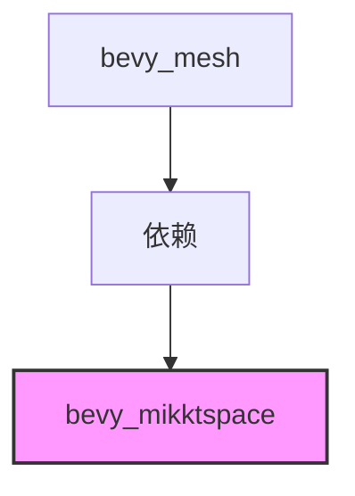

+++
title = "#23010 bevy_mikktspace 1.0"
date = "2026-02-17T00:00:00"
draft = false
template = "pull_request_page.html"
in_search_index = false

[extra]
current_language = "zh-cn"
available_languages = {"en" = { name = "English", url = "/pull_request/bevy/2026-02/pr-23010-en-20260217" }, "zh-cn" = { name = "中文", url = "/pull_request/bevy/2026-02/pr-23010-zh-cn-20260217" }}
+++

# bevy_mikktspace 1.0

## 基本信息
- **标题**: bevy_mikktspace 1.0
- **PR链接**: https://github.com/bevyengine/bevy/pull/23010
- **作者**: atlv24
- **状态**: 已合并
- **标签**: C-依赖项, S-准备最终审查
- **创建时间**: 2026-02-17T19:40:50Z
- **合并时间**: 2026-02-17T20:43:07Z
- **合并者**: alice-i-cecile

## 描述翻译

# 目标

- 使用 bevy_mikktspace 1.0

## 本次PR的技术故事

这是一个非常简单的依赖项更新PR。开发者需要将`bevy_mesh`crate中依赖的`bevy_mikktspace`版本从`0.17.0-dev`升级到`1`版本。

在软件工程实践中，依赖项管理是维护健康代码库的重要环节。当依赖项发布稳定版本时，及时更新到主版本通常意味着：
1. API已经稳定，减少了未来破坏性变更的可能性
2. 可以获取最新的性能优化和bug修复
3. 遵循语义化版本控制(semantic versioning)的最佳实践

`bevy_mikktspace`是Bevy游戏引擎中用于计算MikkTSpace切线空间的库，这是计算机图形学中处理法线贴图(normal mapping)的重要组件。MikkTSpace算法由Morten Mikkelsen开发，旨在为3D网格(mesh)生成一致的切线空间(tangent space)，确保法线贴图在不同软件和渲染器之间具有一致的渲染效果。

从开发版本(`0.17.0-dev`)升级到主版本(`1`)表明该库已经达到了API稳定状态。这种升级通常是向后兼容的，不会引入破坏性变更，因为按照语义化版本控制的规则，主版本号的增加通常表示包含破坏性变更。但在这个特定案例中，从开发版本到第一个稳定版本的升级，更多是表示项目成熟度的里程碑，而非API的重大变更。

值得注意的是，这个更新仅修改了一行代码，展示了Bevy项目依赖管理的整洁性。依赖项被集中声明在`Cargo.toml`文件中，使得版本更新过程简单明了。这种设计遵循了Rust/Cargo生态系统的最佳实践，将依赖声明与业务逻辑分离。

从工程角度看，这种小规模但重要的更新反映了健康开源项目的维护模式：及时跟踪依赖项更新，保持技术栈现代化，同时最小化变更范围以降低风险。

## 视觉表示



## 关键文件变更

**crates/bevy_mesh/Cargo.toml** (修改1处，删除1处，添加1处)

这是一个依赖声明文件的更新，将`bevy_mikktspace`依赖的版本从开发版本更新到稳定主版本。

变更详情：
```toml
# 文件: crates/bevy_mesh/Cargo.toml
# 之前:
bevy_mikktspace = { version = "0.17.0-dev", optional = true }

# 之后:
bevy_mikktspace = { version = "1", optional = true }
```

这个变更的影响：
1. **版本号更新**：从`0.17.0-dev`变为`1`，表示依赖项已达到稳定状态
2. **可选依赖保持不变**：`optional = true`标志保留，表明`bevy_mikktspace`仍然是可选依赖项
3. **简化版本声明**：版本号简化为`"1"`，遵循Cargo的版本规范

这个变更与PR的目标完全一致：更新到`bevy_mikktspace` 1.0版本。由于只是版本号变更，不涉及API调用方式的改变，因此对代码库的其他部分没有影响。

## 进一步阅读

对于想深入了解相关技术的开发者，建议参考以下资源：

1. **MikkTSpace算法**：
   - 原始论文和实现：http://www.mikktspace.com/
   - 算法在游戏开发中的应用：切线空间法线贴图的基础原理

2. **Rust依赖管理**：
   - Cargo官方文档：https://doc.rust-lang.org/cargo/
   - 语义化版本控制规范：https://semver.org/

3. **Bevy引擎相关**：
   - Bevy网格处理文档
   - 法线贴图和切线空间在实时渲染中的应用

4. **计算机图形学基础**：
   - 《Real-Time Rendering》中的法线贴图章节
   - 切线空间和法线贴图的数学原理

# 完整代码差异
diff --git a/crates/bevy_mesh/Cargo.toml b/crates/bevy_mesh/Cargo.toml
index 8bdb7fd2a59f5..d89aadcb0bab9 100644
--- a/crates/bevy_mesh/Cargo.toml
+++ b/crates/bevy_mesh/Cargo.toml
@@ -17,7 +17,7 @@ bevy_math = { path = "../bevy_math", version = "0.19.0-dev" }
 bevy_reflect = { path = "../bevy_reflect", version = "0.19.0-dev" }
 bevy_ecs = { path = "../bevy_ecs", version = "0.19.0-dev" }
 bevy_transform = { path = "../bevy_transform", version = "0.19.0-dev" }
-bevy_mikktspace = { version = "0.17.0-dev", optional = true }
+bevy_mikktspace = { version = "1", optional = true }
 bevy_derive = { path = "../bevy_derive", version = "0.19.0-dev" }
 bevy_platform = { path = "../bevy_platform", version = "0.19.0-dev", default-features = false, features = [
   "std",