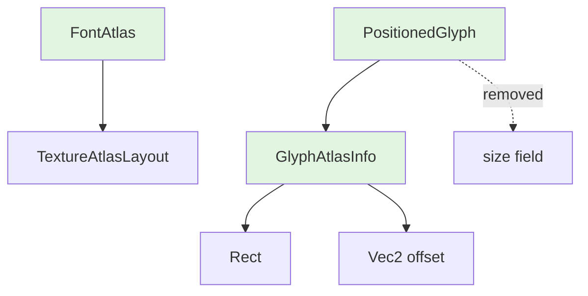

+++
title = "#23012 FontAtlas Improvements"
date = "2026-02-18T00:00:00"
draft = false
template = "pull_request_page.html"
in_search_index = true

[taxonomies]
list_display = ["show"]

[extra]
current_language = "en"
available_languages = {"en" = { name = "English", url = "/pull_request/bevy/2026-02/pr-23012-en-20260218" }, "zh-cn" = { name = "中文", url = "/pull_request/bevy/2026-02/pr-23012-zh-cn-20260218" }}
labels = ["C-Docs", "A-Rendering", "C-Performance", "C-Code-Quality", "M-Migration-Guide", "A-Text", "D-Straightforward"]
+++

# Title: FontAtlas Improvements

## Basic Information
- **Title**: `FontAtlas` improvements
- **PR Link**: https://github.com/bevyengine/bevy/pull/23012
- **Author**: ickshonpe
- **Status**: MERGED
- **Labels**: C-Docs, A-Rendering, C-Performance, C-Code-Quality, S-Ready-For-Final-Review, M-Migration-Guide, A-Text, D-Straightforward
- **Created**: 2026-02-17T20:54:24Z
- **Merged**: 2026-02-18T03:09:53Z
- **Merged By**: alice-i-cecile

## Description Translation

# Objective

Improve the `FontAtlas` implementation. Should help simplify the assets as entities (#22939) text changes, as well mitigate some of the performance regressions due to the parley migration (#22879).

* `FontAtlas` has a handle to a `TextureAtlasLayout` asset, but it would be less complicated and more efficient for it to just hold the layout itself directly. 
* `PositionedGlyph`'s `size` field isn't used for anything. The size can be gotten from the atlas rect. The doc comment is wrong as well: it's in physical pixels, not logical.
* `GlyphAtlasInfo` can just store the atlas rect directly, replacing the atlas layout handle and index.
*  The offset and rect values should use f32s not i32s, they aren't ever used except after conversion.
* `GlyphAtlasInfo::offset` should be stored with the correct orientation, instead of negating its y axis each time.

## Solution

* Font atlas layouts are now stored in `FontAtlas` directly, not as assets.
* Removed `PositionedGlyph`'s `size` field.
* `GlyphAtlasInfo`'s `texture_atlas` and `location` fields have been removed, replaced with `rect` and `offset` fields.
*  `get_outlined_glyph_texture` returns a `Vec2` instead of an `IVec2` with the y value negated.

## The Story of This Pull Request

This PR addresses several structural inefficiencies in Bevy's text rendering system, specifically in how `FontAtlas` manages texture atlas layouts. The changes simplify the architecture, reduce overhead, and fix orientation issues that were causing unnecessary computation.

The core problem was that `FontAtlas` stored a handle to a `TextureAtlasLayout` asset rather than storing the layout directly. This created unnecessary indirection - every time the system needed to access the layout, it had to perform an asset lookup. Since font atlases are tightly coupled with their layouts and not meant to be shared across multiple atlases, the asset abstraction added overhead without benefit.

Additionally, the data structures had accumulated technical debt: `PositionedGlyph` contained a redundant `size` field (which could be derived from the atlas rectangle), and `GlyphAtlasInfo` stored integer-based coordinates that were immediately converted to floating-point for rendering.

The implementation approach was straightforward: remove the asset indirection and streamline the data structures. The `FontAtlas` struct now directly contains a `TextureAtlasLayout` instead of a handle to it. This change ripples through the codebase, eliminating the need to pass `Assets<TextureAtlasLayout>` resources to multiple systems.

Looking at the changes in `font_atlas.rs`, the `FontAtlas::new` method signature changes from requiring a `texture_atlases_layout: &mut Assets<TextureAtlasLayout>` parameter to not needing it at all. This is because the atlas layout is created directly and stored:

```rust
// Before:
pub fn new(
    textures: &mut Assets<Image>,
    texture_atlases_layout: &mut Assets<TextureAtlasLayout>,
    size: UVec2,
    font_smoothing: FontSmoothing,
) -> FontAtlas {
    // ...
    let texture_atlas = texture_atlases_layout.add(TextureAtlasLayout::new_empty(size));
    // ...
}

// After:
pub fn new(
    textures: &mut Assets<Image>,
    size: UVec2,
    font_smoothing: FontSmoothing,
) -> FontAtlas {
    // ...
    Self {
        texture_atlas: TextureAtlasLayout::new_empty(size),
        // ...
    }
}
```

This change eliminates the asset management overhead for font atlas layouts. The `add_glyph` method similarly loses its `atlas_layouts: &mut Assets<TextureAtlasLayout>` parameter, instead working directly with `self.texture_atlas`.

The `GlyphAtlasInfo` struct undergoes a significant simplification. Previously, it stored an asset ID for the texture atlas and a `GlyphAtlasLocation` containing an index and offset. Now it stores a `Rect` and `Vec2 offset` directly:

```rust
// Before:
pub struct GlyphAtlasInfo {
    pub texture: AssetId<Image>,
    pub texture_atlas: AssetId<TextureAtlasLayout>,
    pub location: GlyphAtlasLocation,
}

// After:
pub struct GlyphAtlasInfo {
    pub texture: AssetId<Image>,
    pub rect: Rect,
    pub offset: Vec2,
}
```

This change eliminates the need to look up the texture atlas layout to find the rectangle for each glyph. The rectangle is now stored directly, which is more efficient since glyph rectangles are accessed frequently during rendering.

The `get_outlined_glyph_texture` function fixes an orientation issue. Previously, it returned an `IVec2` with the y-value negated, requiring subsequent code to apply the negation again. Now it returns a `Vec2` with the correct orientation:

```rust
// Before:
IVec2::new(left, top)

// After:
Vec2::new(left as f32, -top as f32)
```

This change simplifies the downstream code, as seen in `pipeline.rs` where the offset is now used directly without additional transformation.

The removal of `PositionedGlyph`'s `size` field is a cleanup of redundant data. The size was already available from the atlas rectangle, and removing it reduces memory usage. The doc comment was also incorrect - the size was in physical pixels, not logical pixels.

These changes propagate through the rendering systems. In `text2d/mod.rs`, `bevy_ui_render/lib.rs`, and elsewhere, code that previously looked up texture atlas layouts to get glyph rectangles now uses the directly stored `rect` field. This eliminates multiple asset lookups per glyph during extraction, improving performance.

The migration guide provides clear instructions for updating code, noting that `TextureAtlasLayout` parameters have been removed from `FontAtlas` methods and that several fields have been renamed or replaced.

## Visual Representation



## Key Files Changed

### `crates/bevy_text/src/font_atlas.rs` (+13/-37)
This file contains the core `FontAtlas` implementation changes. The most significant change is that `FontAtlas` now stores a `TextureAtlasLayout` directly instead of a handle to it.

Key changes:
```rust
// Before:
pub struct FontAtlas {
    // ...
    pub texture_atlas: Handle<TextureAtlasLayout>,
    // ...
}

// After:
pub struct FontAtlas {
    // ...
    pub texture_atlas: TextureAtlasLayout,
    // ...
}
```

The `add_glyph` method signature changes to remove the texture atlas asset parameter:
```rust
// Before:
pub fn add_glyph(
    &mut self,
    textures: &mut Assets<Image>,
    atlas_layouts: &mut Assets<TextureAtlasLayout>,
    key: GlyphCacheKey,
    texture: &Image,
    offset: IVec2,
) -> Result<(), TextError>

// After:
pub fn add_glyph(
    &mut self,
    textures: &mut Assets<Image>,
    key: GlyphCacheKey,
    texture: &Image,
    offset: Vec2,
) -> Result<(), TextError>
```

### `crates/bevy_text/src/glyph.rs` (+6/-11)
This file contains changes to the glyph data structures, removing redundant fields and fixing data types.

`PositionedGlyph` loses its `size` field:
```rust
// Before:
pub struct PositionedGlyph {
    pub position: Vec2,
    pub size: Vec2,  // Removed
    pub atlas_info: GlyphAtlasInfo,
    // ...
}

// After:
pub struct PositionedGlyph {
    pub position: Vec2,
    pub atlas_info: GlyphAtlasInfo,
    // ...
}
```

`GlyphAtlasInfo` is simplified to store data directly:
```rust
// Before:
pub struct GlyphAtlasInfo {
    pub texture: AssetId<Image>,
    pub texture_atlas: AssetId<TextureAtlasLayout>,
    pub location: GlyphAtlasLocation,
}

// After:
pub struct GlyphAtlasInfo {
    pub texture: AssetId<Image>,
    pub rect: Rect,
    pub offset: Vec2,
}
```

### `crates/bevy_sprite_render/src/text2d/mod.rs` (+6/-18)
This file shows how the rendering code is simplified by using the directly stored rectangle data.

Before, the code had to look up the texture atlas to get the rectangle:
```rust
// Before:
let rect = texture_atlases
    .get(atlas_info.texture_atlas)
    .unwrap()
    .textures[atlas_info.location.glyph_index]
    .as_rect();
```

After, it uses the directly stored rectangle:
```rust
// After:
rect: atlas_info.rect,
```

### `crates/bevy_text/src/pipeline.rs` (+6/-11)
The text pipeline no longer needs to access texture atlas assets, simplifying the method signature:
```rust
// Before:
pub fn update_text_layout_info(
    &mut self,
    layout_info: &mut TextLayoutInfo,
    font_atlas_set: &mut FontAtlasSet,
    texture_atlases: &mut Assets<TextureAtlasLayout>,  // Removed
    textures: &mut Assets<Image>,
    // ...
)

// After:
pub fn update_text_layout_info(
    &mut self,
    layout_info: &mut TextLayoutInfo,
    font_atlas_set: &mut FontAtlasSet,
    textures: &mut Assets<Image>,
    // ...
)
```

### `release-content/migration-guides/FontAtlas-texture-atlas-layout.md` (+16/-0)
This new file provides migration instructions for the breaking changes:
- Texture atlas layouts are no longer separate assets
- Method parameter changes
- Field changes in `GlyphAtlasInfo` and `PositionedGlyph`

## Further Reading

- Bevy Text Rendering Documentation: Understanding the text rendering pipeline
- Texture Atlases in Computer Graphics: Fundamentals of texture atlasing
- Entity Component System (ECS) Patterns: How Bevy manages assets and components
- Rust Ownership and Borrowing: Key concepts for understanding the API changes