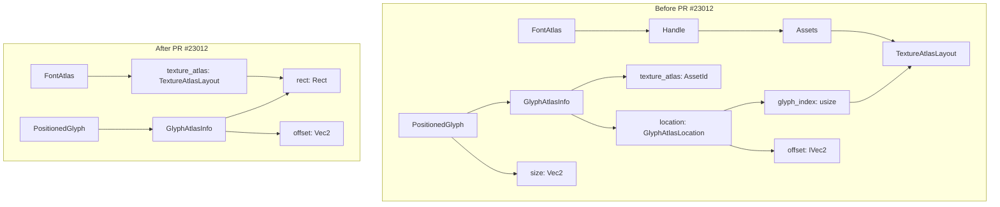

+++
title = "#23012 `FontAtlas` improvements"
date = "2026-02-18T00:00:00"
draft = false
template = "pull_request_page.html"
in_search_index = false

[extra]
current_language = "zh-cn"
available_languages = {"en" = { name = "English", url = "/pull_request/bevy/2026-02/pr-23012-en-20260218" }, "zh-cn" = { name = "中文", url = "/pull_request/bevy/2026-02/pr-23012-zh-cn-20260218" }}
labels = ["C-Docs", "A-Rendering", "C-Performance", "C-Code-Quality", "M-Migration-Guide", "A-Text", "D-Straightforward"]
+++

# FontAtlas improvements

## Basic Information
- **Title**: `FontAtlas` improvements
- **PR Link**: https://github.com/bevyengine/bevy/pull/23012
- **Author**: ickshonpe
- **Status**: MERGED
- **Labels**: C-Docs, A-Rendering, C-Performance, C-Code-Quality, S-Ready-For-Final-Review, M-Migration-Guide, A-Text, D-Straightforward
- **Created**: 2026-02-17T20:54:24Z
- **Merged**: 2026-02-18T03:09:53Z
- **Merged By**: alice-i-cecile

## Description Translation
**目标**

改进 `FontAtlas` 的实现。这有助于简化 assets as entities (#22939) 的文本更改，并缓解由于 parley 迁移 (#22879) 带来的一些性能回归。

* `FontAtlas` 持有一个 `TextureAtlasLayout` 资产的句柄（handle），但如果它直接持有布局本身会更简单高效。
* `PositionedGlyph` 的 `size` 字段没有被使用。尺寸可以从图集矩形（atlas rect）中获取。文档注释也是错误的：它是物理像素，不是逻辑像素。
* `GlyphAtlasInfo` 可以直接存储图集矩形，替代图集布局句柄和索引。
* 偏移量（offset）和矩形值应该使用 f32 而不是 i32，因为它们只在转换后被使用。
* `GlyphAtlasInfo::offset` 应该以正确的方向存储，而不是每次都对其 y 轴取负。

**解决方案**

* 字体图集布局现在直接存储在 `FontAtlas` 中，而不是作为资产。
* 移除了 `PositionedGlyph` 的 `size` 字段。
* `GlyphAtlasInfo` 的 `texture_atlas` 和 `location` 字段被移除，替换为 `rect` 和 `offset` 字段。
* `get_outlined_glyph_texture` 返回一个 `Vec2` 而不是 `IVec2`，并且 y 值不再被取负。

## The Story of This Pull Request

这个PR的核心目标是优化Bevy引擎中字体图集（`FontAtlas`）的数据结构和相关流程，以提升性能并简化代码。其背景是为了支持即将到来的“assets as entities”重构，并为解决parley文本布局迁移引入的性能问题做准备。

**问题根源：不必要的间接引用与冗余数据**

原有的设计中，`FontAtlas` 通过一个句柄（`Handle<TextureAtlasLayout>`）引用一个独立的 `TextureAtlasLayout` 资产。这意味着每次需要访问图集布局信息（例如，获取一个字形在纹理中的位置）时，都需要通过资产系统进行查找。这种间接引用带来了额外的开销，尤其是在文本渲染这种高频操作中。

同时，`GlyphAtlasInfo` 结构体存储了 `texture_atlas`（资产ID）和 `location`（包含`glyph_index`和`IVec2 offset`）。要获取一个字形在纹理中的实际矩形区域（`Rect`），需要先通过 `texture_atlas` 找到 `TextureAtlasLayout` 资产，再用 `glyph_index` 去索引。这个过程在渲染管线的多个阶段（如 `extract` 阶段）重复进行，造成了浪费。

此外，`PositionedGlyph` 结构体包含一个 `size: Vec2` 字段，但该字段的值可以从图集矩形中推导出来，实际上是冗余的。其文档注释也错误地声称它是逻辑像素，而实际是物理像素。

**解决方案：数据扁平化与直接存储**

PR采取了直接而有效的策略：将 `TextureAtlasLayout` 数据内联（inline）到 `FontAtlas` 结构体中，并让 `GlyphAtlasInfo` 直接存储计算好的 `rect: Rect` 和正确方向的 `offset: Vec2`。

1.  **移除资产句柄**：`FontAtlas::texture_atlas` 字段的类型从 `Handle<TextureAtlasLayout>` 改为 `TextureAtlasLayout`。这使得 `FontAtlas` 成为一个自包含的单元，无需外部资产查找。
2.  **简化 `GlyphAtlasInfo`**：它不再存储需要二次查找的 `texture_atlas` 和 `location`，而是直接存储最终结果：字形在纹理中的边界 `rect` 和放置时的偏移量 `offset`。这消除了渲染时的大量间接寻址。
3.  **删除冗余字段**：`PositionedGlyph::size` 被移除。任何需要字形尺寸的地方，现在都通过 `atlas_info.rect.size()` 获取。这使数据来源单一，避免了不一致的风险。
4.  **类型与方向修正**：偏移量从 `IVec2` 改为 `Vec2`，因为其值最终用于浮点计算。同时，在 `get_outlined_glyph_texture` 函数中，返回的 `offset` 的 `y` 分量现在直接存储为负值（`-top as f32`），而不是在每次使用时再取负。这符合图形坐标系（Y轴向下为正）的约定，并使后续计算更直观。

**实现细节与影响**

更改波及整个文本渲染管线。`FontAtlas::new` 和 `FontAtlas::add_glyph` 不再需要 `&mut Assets<TextureAtlasLayout>` 参数。负责将字形添加到图集的 `add_glyph_to_atlas` 函数以及文本布局管道 `TextPipeline::update_text_layout_info` 也因此移除了对纹理图集资产存储的依赖。

在渲染提取（extract）阶段（如 `extract_text2d_sprite` 和 `extract_text_sections`），代码不再需要通过 `texture_atlases: Res<Assets<TextureAtlasLayout>>` 来查询字形矩形，而是直接使用 `atlas_info.rect`。这减少了运行时的资产查找开销，并简化了提取逻辑。

**性能与代码质量收益**

这项重构带来了多重好处：
* **性能提升**：最直接的收益是减少了CPU端的资产查找和间接调用。在文本密集的场景中，这能减轻由parley迁移带来的部分性能压力。
* **内存与数据局部性**：数据结构更紧凑，减少了间接指针，可能提升缓存效率。
* **代码简化**：移除了复杂的资产依赖关系，使得 `FontAtlas` 的逻辑更清晰，也更容易测试和理解。这为后续的“assets as entities”重构扫清了一个障碍，因为资产关系的减少意味着更少的迁移工作。
* **正确性**：修正了偏移量的方向和 `size` 字段的误导性文档，提高了代码的可维护性。

总的来说，这是一个典型的数据导向设计优化案例。通过分析数据流和使用模式，将高频访问的派生数据提前计算并直接存储，同时消除不必要的抽象层，从而在保持功能不变的前提下，提升性能并简化架构。

## Visual Representation



## Key Files Changed

### `crates/bevy_text/src/font_atlas.rs` (+13/-37)
这是重构的核心文件，`FontAtlas` 结构体的定义和关键方法被修改。

**关键更改：**
1.  `FontAtlas` 的 `texture_atlas` 字段类型从 `Handle<TextureAtlasLayout>` 变为 `TextureAtlasLayout`。
2.  `FontAtlas::new` 和 `FontAtlas::add_glyph` 方法不再接收 `&mut Assets<TextureAtlasLayout>` 参数。
3.  `get_outlined_glyph_texture` 返回的偏移量类型从 `IVec2` 改为 `Vec2`，并且Y值在返回时已正确处理为负值。

```rust
// Before:
pub struct FontAtlas {
    pub texture_atlas: Handle<TextureAtlasLayout>,
    // ...
}
pub fn new(
    textures: &mut Assets<Image>,
    texture_atlases_layout: &mut Assets<TextureAtlasLayout>, // <-- 参数
    size: UVec2,
    font_smoothing: FontSmoothing,
) -> FontAtlas { /* ... */ }

// After:
pub struct FontAtlas {
    pub texture_atlas: TextureAtlasLayout, // <-- 直接存储
    // ...
}
pub fn new(
    textures: &mut Assets<Image>,
    // texture_atlases_layout 参数被移除
    size: UVec2,
    font_smoothing: FontSmoothing,
) -> FontAtlas { /* ... */ }
```

### `crates/bevy_text/src/glyph.rs` (+6/-11)
定义了字形相关数据结构，进行了大幅简化。

**关键更改：**
1.  移除 `PositionedGlyph::size` 字段。
2.  `GlyphAtlasInfo` 移除 `texture_atlas` 和 `location` 字段，新增 `rect` 和 `offset` 字段。
3.  `GlyphAtlasLocation::offset` 类型从 `IVec2` 改为 `Vec2`。

```rust
// Before:
pub struct PositionedGlyph {
    pub position: Vec2,
    pub size: Vec2, // <-- 被移除的字段
    pub atlas_info: GlyphAtlasInfo,
    // ...
}
pub struct GlyphAtlasInfo {
    pub texture: AssetId<Image>,
    pub texture_atlas: AssetId<TextureAtlasLayout>, // <-- 被移除
    pub location: GlyphAtlasLocation, // <-- 被移除
}
pub struct GlyphAtlasLocation {
    pub glyph_index: usize,
    pub offset: IVec2,
}

// After:
pub struct PositionedGlyph {
    pub position: Vec2,
    // size 字段消失
    pub atlas_info: GlyphAtlasInfo,
    // ...
}
pub struct GlyphAtlasInfo {
    pub texture: AssetId<Image>,
    pub rect: Rect,   // <-- 新增
    pub offset: Vec2, // <-- 新增
}
pub struct GlyphAtlasLocation {
    pub glyph_index: usize,
    pub offset: Vec2, // <-- 类型更改
}
```

### `crates/bevy_sprite_render/src/text2d/mod.rs` (+6/-18) 与 `crates/bevy_ui_render/src/lib.rs` (+2/-14)
这两个文件包含2D精灵和UI的文本渲染提取逻辑。更改模式一致：移除对 `texture_atlases: Res<Assets<TextureAtlasLayout>>` 的依赖，并直接使用 `atlas_info.rect`。

```rust
// Before (extract_text2d_sprite):
let rect = texture_atlases
    .get(atlas_info.texture_atlas)
    .unwrap()
    .textures[atlas_info.location.glyph_index]
    .as_rect();
extracted_slices.slices.push(ExtractedSlice {
    offset: *position,
    rect,
    size: rect.size(),
});

// After:
extracted_slices.slices.push(ExtractedSlice {
    offset: *position,
    rect: atlas_info.rect,      // <-- 直接使用
    size: atlas_info.rect.size(), // <-- 直接使用
});
```

### `crates/bevy_text/src/pipeline.rs` (+6/-11)
文本管道更新函数签名更改，移除了 `texture_atlases` 参数。

```rust
// Before:
pub fn update_text_layout_info(
    &mut self,
    layout_info: &mut TextLayoutInfo,
    font_atlas_set: &mut FontAtlasSet,
    texture_atlases: &mut Assets<TextureAtlasLayout>, // <-- 被移除的参数
    textures: &mut Assets<Image>,
    // ...
)

// After:
pub fn update_text_layout_info(
    &mut self,
    layout_info: &mut TextLayoutInfo,
    font_atlas_set: &mut FontAtlasSet,
    // texture_atlases 参数消失
    textures: &mut Assets<Image>,
    // ...
)
```

### `release-content/migration-guides/FontAtlas-texture-atlas-layout.md` (+16/-0)
新增的迁移指南，清晰地总结了所有破坏性变更，帮助用户升级代码。

## Further Reading
* [Bevy 官方文档 - 文本](https://bevyengine.org/learn/quick-start/ui/text/)
* [数据导向设计（Data-Oriented Design）相关理念](https://en.wikipedia.org/wiki/Data-oriented_design)
* [原PR #22879: Parley 文本布局迁移](https://github.com/bevyengine/bevy/pull/22879)
* [原PR #22939: Assets as Entities](https://github.com/bevyengine/bevy/pull/22939)