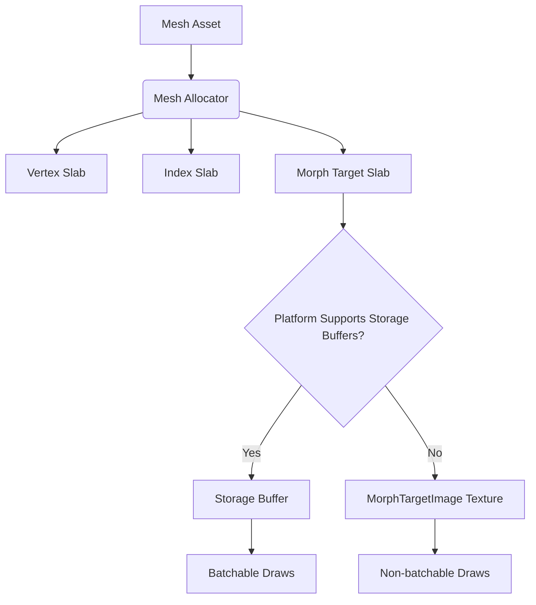

+++
title = "#23023 Batch meshes with morph targets."
date = "2026-02-28T00:00:00"
draft = false
template = "pull_request_page.html"
in_search_index = false

[extra]
current_language = "zh-cn"
available_languages = {"en" = { name = "English", url = "/pull_request/bevy/2026-02/pr-23023-en-20260228" }, "zh-cn" = { name = "中文", url = "/pull_request/bevy/2026-02/pr-23023-zh-cn-20260228" }}
labels = ["A-Rendering", "C-Performance", "M-Migration-Guide"]
+++

# Title

## Basic Information
- **Title**: Batch meshes with morph targets.
- **PR Link**: https://github.com/bevyengine/bevy/pull/23023
- **Author**: pcwalton
- **Status**: MERGED
- **Labels**: A-Rendering, C-Performance, S-Ready-For-Review, M-Migration-Guide
- **Created**: 2026-02-17T22:32:42Z
- **Merged**: 2026-02-28T21:41:57Z
- **Merged By**: alice-i-cecile

## Description Translation
目前，Bevy无法将具有变形目标的网格批量处理在一起，因为变形目标被打包到一个变形纹理中，该纹理是非无绑定的（non-bindless）。为了解决这个问题，本PR添加了在支持存储缓冲区（storage buffers）的平台上将变形目标批量处理在一起的支持。变形位移使用网格分配器（mesh allocator）进行分配，就像顶点和索引缓冲区一样。

本PR还改进了向网格提供变形目标的API。目前，应用程序必须显式创建一个`MorphTargetImage`来存储变形目标，这很繁琐。本补丁更改了`Mesh` API，改为接受一个扁平的向量作为变形目标。在内部，如果平台不支持存储缓冲区，变形目标将被转换为变形目标图像；如果平台支持存储缓冲区，变形目标则被打包到网格分配器中。

此补丁是皮肤缓存（skin caching）的前提，因为皮肤缓存也适用于变形目标，并且皮肤缓存希望一次处理多个网格。使用变形目标图像将需要批次中断逻辑或无绑定，这两者对于一个希望简单且能在WebGPU上工作的功能来说都是不可取的，因此我选择使变形目标可批量处理。

在`many_morph_targets`示例中，我从每帧5.55毫秒提升到2.80毫秒，速度提升了1.98倍。

## The Story of This Pull Request

### 问题与背景
在Bevy中，变形目标动画（morph target animation）是一种通过预定义的顶点位移来改变网格形状的技术。在PR #23023之前，Bevy将每个网格的变形目标数据打包成一个3D纹理（`MorphTargetImage`），并在着色器中采样。这种方法存在两个主要问题：
1. **无法批量处理**：由于每个网格的变形目标纹理是独立的，且WebGPU不支持无绑定纹理（bindless textures），渲染具有变形目标的网格时无法进行批次合并（batching），导致每个网格都需要单独绘制调用，性能低下。
2. **API繁琐**：开发者必须手动创建`MorphTargetImage`资源，并将其句柄（Handle）赋给网格。这增加了使用复杂度，且不符合Bevy其他部分（如顶点和索引数据）的处理模式。

此外，未来的皮肤缓存功能也需要批量处理变形目标，因为皮肤缓存希望一次处理多个网格的蒙皮计算。因此，需要一个支持批处理的变形目标实现。

### 解决方案
PR的作者pcwalton提出的解决方案是：**利用网格分配器（MeshAllocator）来存储变形目标数据，使其可以像顶点和索引数据一样进行批量处理**。具体来说：
- 在支持存储缓冲区的平台（如现代桌面GPU）上，将变形目标数据放入存储缓冲区（storage buffer），而不是纹理中。存储缓冲区支持无绑定访问，从而允许批次合并。
- 在不支持存储缓冲区的平台（如WebGPU的一些配置）上，回退到原有的纹理方式，但通过改进API简化使用。
- 统一API：无论底层使用存储缓冲区还是纹理，都允许开发者直接传递一个`Vec<MorphAttributes>`（变形属性数组）给网格，由引擎内部处理转换。

### 实现细节
该PR涉及多个模块的修改，核心改动包括：

#### 1. 网格分配器支持变形目标
- 扩展了`MeshAllocator`，使其能够为变形目标数据分配存储缓冲区空间。新增了`ElementClass::MorphTarget`枚举变体，用于标识存储变形目标数据的缓冲区。
- 在`MeshAllocator::allocate_meshes`中，如果网格包含变形目标，则为其分配存储空间。
- 添加了`MeshAllocator::mesh_morph_target_slice`和`MeshAllocator::morph_target_slabs`等方法，用于查询变形目标数据的位置。

#### 2. 新的变形目标资源管理
- 引入了`RenderMorphTargetAllocator`资源，用于管理变形目标数据。它是一个枚举，包含`Image`和`Storage`两个变体，分别对应纹理和存储缓冲区两种模式。
- 在支持存储缓冲区的平台上，使用`Storage`变体，数据由网格分配器管理；在不支持的平台上，使用`Image`变体，数据被包装为`MorphTargetImage`。
- `RenderMesh`的准备阶段（prepare）现在会根据平台选择将变形目标数据存入存储缓冲区或生成纹理。

#### 3. 着色器和绑定组调整
- 修改了着色器（`morph.wgsl`），使其能够从存储缓冲区读取变形目标数据。通过`#ifdef`分支，根据平台选择不同的数据读取方式。
- 更新了绑定组布局（`mesh_bindings.rs`），以支持存储缓冲区作为变形目标数据源。
- 在`mesh.rs`中，修改了`MeshPhaseBindGroups`和相关结构，以支持根据变形目标数据存储方式（纹理 vs 存储缓冲区）选择不同的绑定组。

#### 4. API简化
- 修改了`Mesh`结构体的API，将`morph_targets`字段从`Handle<Image>`改为`Vec<MorphAttributes>`。开发者现在可以直接传递一个顶点位移数组。
- 更新了gltf加载器，使其直接使用新的API，而不再创建`MorphTargetImage`。
- 在`morph.rs`中，`MorphAttributes`结构体增加了填充字段（pad），以确保内存对齐（16字节边界），满足存储缓冲区的访问要求。

#### 5. 性能优化：批量处理
- 修改了批次键（batch key）的结构，将原先独立的`vertex_slab`和`index_slab`合并为`MeshSlabs`结构体，其中包含了`morph_target_slab_id`字段。这使得批次系统可以识别变形目标数据是否位于同一个存储缓冲区slab中，从而决定是否可以进行批次合并。
- 在`queue_material_meshes`等队列系统中，使用`MeshSlabs`来构建批次键。
- 对于不支持存储缓冲区的平台，仍然通过`no_automatic_morph_batching`系统为具有变形目标的网格插入`NoAutomaticBatching`组件，禁用批量处理。

### 技术洞察
1. **平台兼容性**：该PR通过运行时检测平台能力，实现了两种不同的变形目标数据存储策略。这确保了功能在支持存储缓冲区和不支持存储缓冲区的平台上都能工作，同时在不支持的平台上回退到原有行为（但API更友好）。
2. **内存对齐**：存储缓冲区对数据对齐有严格要求。`MorphAttributes`结构体通过添加填充字段，确保每个向量（Vec3）起始于16字节边界，避免未对齐访问导致的性能下降或错误。
3. **数据驱动设计**：通过将变形目标数据视为网格数据的一部分，并使用网格分配器统一管理，该PR使得变形目标可以受益于已有的批处理和GPU预处理基础设施。
4. **API设计**：将变形目标数据的存储细节对开发者隐藏，提供统一的向量接口，降低了使用门槛，同时保持了向后兼容性（通过迁移指南）。

### 影响
- **性能提升**：在支持存储缓冲区的平台上，具有变形目标的网格现在可以参与批次合并，减少了绘制调用和CPU开销。在`many_morph_targets`示例中，性能提升了近一倍（从5.55毫秒/帧到2.80毫秒/帧）。
- **API改进**：开发者不再需要手动创建`MorphTargetImage`，简化了变形目标的使用流程。
- **为皮肤缓存铺平道路**：由于变形目标数据现在可以批量处理，未来实现皮肤缓存时，可以同时处理网格的蒙皮和变形，进一步提高性能。
- **代码维护性**：将变形目标数据的管理集成到网格分配器中，减少了特殊处理代码，使系统更加统一。

## Visual Representation



## Key Files Changed

### 1. `crates/bevy_pbr/src/render/mesh.rs` (+460/-96)
**变化描述**：此文件包含了网格渲染的核心逻辑。主要改动包括：
- 引入了`MeshMorphTargetBindGroups`枚举，用于管理变形目标绑定组（根据平台选择纹理或存储缓冲区）。
- 修改了`MeshPhaseBindGroups`结构，使其能够根据变形目标数据存储方式选择合适的绑定组。
- 更新了`prepare_mesh_bind_groups`系统，以创建基于存储缓冲区的变形目标绑定组。
- 在`MeshUniform`和`MeshInputUniform`结构体中添加了`morph_descriptor_index`字段，用于在着色器中查找变形目标描述符。

**关键代码片段**：
```rust
// 新增的枚举，表示变形目标绑定组的类型
pub enum MeshMorphTargetBindGroups {
    Uniform(HashMap<AssetId<Mesh>, MeshBindGroupPair>),
    Storage(HashMap<SlabId, MeshMorphTargetStorageBindGroups>),
}

// MeshUniform 新增字段
pub struct MeshUniform {
    // ... 其他字段
    pub morph_descriptor_index: u32,
}
```

### 2. `crates/bevy_pbr/src/render/morph.rs` (+322/-34)
**变化描述**：此文件处理变形目标的提取和准备。主要改动包括：
- 将`MorphIndices`从简单的结构体改为枚举，支持`Uniform`和`Storage`两种模式，分别对应纹理和存储缓冲区。
- 引入了`MorphWeightsInfo`和`GpuMorphDescriptor`结构体，用于在存储缓冲区模式下存储变形目标的元数据。
- 新增了`prepare_morph_descriptors`系统，用于将变形目标描述符写入GPU缓冲区。
- 修改了`extract_morphs`系统，以支持新的存储模式。

**关键代码片段**：
```rust
// MorphIndices 现在是一个枚举
pub enum MorphIndices {
    Uniform {
        current: MainEntityHashMap<MorphIndex>,
        prev: MainEntityHashMap<MorphIndex>,
    },
    Storage {
        morph_weights_info: MainEntityHashMap<MorphWeightsInfo>,
        gpu_descriptor_indices: MainEntityHashMap<MorphDescriptorIndex>,
        gpu_descriptor_free_list: Vec<MorphDescriptorIndex>,
    },
}

// 新增的 GpuMorphDescriptor 结构体
#[derive(Clone, Copy, Default, ShaderType, Pod, Zeroable)]
#[repr(C)]
pub struct GpuMorphDescriptor {
    pub current_weights_offset: u32,
    pub prev_weights_offset: u32,
    pub targets_offset: u32,
    pub vertex_count: u32,
    pub weight_count: u32,
}
```

### 3. `crates/bevy_pbr/src/render/mesh_bindings.rs` (+198/-99)
**变化描述**：此文件定义了网格渲染的绑定组布局。主要改动包括：
- 修改了绑定组布局创建函数，使其根据平台支持情况选择使用uniform缓冲区还是存储缓冲区。
- 更新了`morphed_layout`、`morphed_motion_layout`等函数，以包含变形目标描述符缓冲区（当使用存储缓冲区时）。
- 修改了绑定组创建函数，以接受`MorphTargetsResource`枚举（可能是纹理视图或存储缓冲区）。

**关键代码片段**：
```rust
// 绑定组布局条目构建器，根据平台选择
pub(super) fn weights(limits: &WgpuLimits) -> BindGroupLayoutEntryBuilder {
    if skin::skins_use_uniform_buffers(limits) {
        uniform_buffer_sized(true, BufferSize::new(MORPH_BUFFER_SIZE as u64))
    } else {
        storage_buffer_read_only::<f32>(false)
    }
}
```

### 4. `crates/bevy_render/src/mesh/morph.rs` (+274/-0)
**变化描述**：这是一个新文件，包含了变形目标图像和分配器的实现。主要功能包括：
- 定义了`MorphTargetImage`结构体，用于在不支持存储缓冲区的平台上打包变形目标数据为纹理。
- 定义了`RenderMorphTargetAllocator`资源，用于管理变形目标数据的分配（纹理或存储缓冲区）。
- 提供了`lowest_2d`辅助函数，用于计算纹理尺寸。

**关键代码片段**：
```rust
pub enum RenderMorphTargetAllocator {
    Image {
        mesh_id_to_image: HashMap<AssetId<Mesh>, MorphTargetImage>,
    },
    Storage,
}

impl RenderMorphTargetAllocator {
    pub fn allocate(&mut self, ...) { ... }
    pub fn free(&mut self, mesh_id: AssetId<Mesh>) { ... }
}
```

### 5. `examples/stress_tests/many_morph_targets.rs` (+200/-53)
**变化描述**：此示例文件被大幅修改，以展示新的变形目标批处理性能。主要改动包括：
- 增加了多种网格生成模式（如`Instant`、`Gradual`、`RegularCycle`等），用于测试不同场景下的性能。
- 引入了状态管理（`State`结构体）和随机数生成器，以控制网格的生成和销毁。
- 更新了动画播放逻辑，以使用新的变形目标API。

**关键代码片段**：
```rust
enum ArgSpawning {
    Instant,
    Gradual,
    RegularCycle,
    RandomCycle,
    RandomSteady,
}

#[derive(Resource)]
struct State {
    ticks: usize,
    slot_count: usize,
    spawned: Vec<(usize, Entity)>,
    despawned: Vec<usize>,
    cycle: CycleState,
}
```

## Further Reading
1. **WebGPU Storage Buffers**: [WebGPU Storage Buffers Specification](https://gpuweb.github.io/gpuweb/#storage-buffer)
2. **Bevy Mesh Allocator**: [Bevy Mesh Allocator Documentation](https://docs.rs/bevy_render/latest/bevy_render/mesh/allocator/index.html)
3. **Morph Target Animation**: [Wikipedia Article on Morph Target Animation](https://en.wikipedia.org/wiki/Morph_target_animation)
4. **Bevy Rendering Pipeline**: [Bevy Rendering Book](https://bevy-cheatbook.github.io/rendering.html)