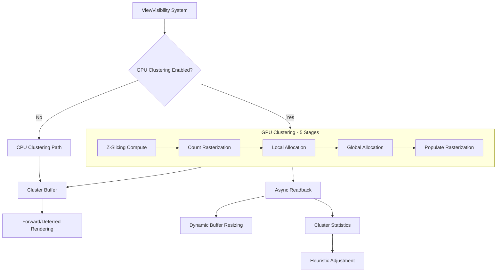

+++
title = "#23036 Implement GPU clustering for lights, light probes, and decals."
date = "2026-02-28T00:00:00"
draft = false
template = "pull_request_page.html"
in_search_index = false

[extra]
current_language = "zh-cn"
available_languages = {"en" = { name = "English", url = "/pull_request/bevy/2026-02/pr-23036-en-20260228" }, "zh-cn" = { name = "中文", url = "/pull_request/bevy/2026-02/pr-23036-zh-cn-20260228" }}
+++

# 实现 GPU 聚类：Bevy 渲染性能的飞跃

## 基本信息
- **标题**: Implement GPU clustering for lights, light probes, and decals.
- **PR 链接**: https://github.com/bevyengine/bevy/pull/23036
- **作者**: pcwalton
- **状态**: MERGED
- **标签**: A-Rendering, C-Performance, S-Ready-For-Final-Review, M-Release-Note
- **创建时间**: 2026-02-18T06:30:21Z
- **合并时间**: 2026-02-28T17:36:54Z
- **合并者**: alice-i-cecile

## 描述翻译
目前，Bevy 在 CPU 上进行光照聚类。这通常不再被认为是最佳实践，并且在诸如 `many_lights` 这样的工作负载中可能成为瓶颈。此外，它阻止了像 [Hanabi] 这样的 GPU 系统创建可聚类的对象（如灯光和贴花），而无需往返 CPU。

此 PR 在硬件支持时引入了 GPU 光照聚类。该算法与现有的 GPU 光照聚类相同，但在所有集群上并行化，并且生成的集群的 GPU 格式保持不变。GPU 光照聚类使用硬件光栅化器进行计算目的，作为一种在 2D 轴对齐边界框内自动分配工作负载的方式，而无需实际渲染任何像素，这在 Bevy 中是首次。算法如下，每个步骤对应一个光栅化或计算命令：

1. *Z 切片*：我们有一个大小为 WxHxD 的 3D 集群 froxel 网格，并寻求光栅化 D 个轴对齐的四边形，每个大小为 WxH，表示每个可聚类对象的范围。在这个计算阶段，我们为每个可聚类对象生成 D 个间接实例，用于后续的间接绘制。

2. *计数光栅化*：我们使用实例化间接绘制来光栅化步骤 1 中生成的每个四边形到大小为 WxH 的视口，颜色写入被禁用。每个光栅化的片段代表一个集群-对象对。在片段着色器中，我们检查对象是否与集群相交，如果相交，我们原子地增加一个计数器，该计数器对应于给定类型的对象与所讨论集群相交的数量。在这个阶段我们不记录对象的 ID；我们只是计算对象的数量。

3. *本地分配*：现在我们知道每个集群中每种类型对象的数量，我们可以继续在聚类对象缓冲区中为每个聚类对象列表分配空间。为此，我们需要执行 [*前缀和*] 操作，以便每个列表与其他列表紧密打包。例如，如果相邻的集群有 2、5 和 3 个对象，它们将分别被分配到偏移量 0、2 和 7。这个*本地*步骤使用共享内存中的 [Hillis-Steele 扫描] 来计算每个 256 个集群块的前缀和。在这个本地步骤中，我们不能超过 256 个集群，因为 256 是 `wgpu` 中的最大工作组大小。

4. *全局分配*：为了处理步骤 3 中无法计算超过 256 个集群的前缀和的问题，我们采用第二步，对每个 256 集群块进行顺序循环，传播前缀和。在此步骤结束时，每个聚类对象列表都被分配。

5. *填充光栅化*：最后，我们使用与步骤 (2) 相同的参数发出一个实例化间接绘制命令。我们测试每个集群-对象对是否相交，如果测试通过，我们将每个聚类对象的 ID 记录到列表中的正确空间，使用原子暂存缓冲区来存储每个列表中下一个对象的位置。

聚类对象缓冲区具有固定大小并且可能溢出。我们通过异步 CPU 读回检测这种情况，并自动为后续帧增长缓冲区。在这种情况下，我们还会记录一条消息，以便开发人员可以选择更大的初始缓冲区大小并避免任何错误的帧。此外，与 #22874 类似，自动聚类启发式方法会从帧到帧动态调整，通过在 GPU 上记录统计数据并使用 CPU 读回将它们下载回 CPU 进行处理。

作为此 PR 的一部分，我重构了聚类可见性，以便聚类对象与其他对象一样通过相同的 `ViewVisibility` 系统，而不是使用 `VisibleClusterableObjects`。这是一个很好的简化。

在 `many_lights` 基准测试中，大约有 100,000 个灯光中的 8,000 个可见，此过程在我的 NVIDIA GeForce RTX 4070 Laptop GPU 上大约需要 0.099 毫秒。然而，AMD Ryzen 9 8945HS CPU 执行相同任务需要 2.12 毫秒。因此，GPU 版本速度提升了 21 倍。

`main` `assign_objects_to_clusters` 时间，2.12 毫秒：


GPU 聚类 GPU 时间，0.099 毫秒：


`main`，5.71 毫秒中值帧时间，175 FPS：


GPU 聚类，4.88 毫秒中值帧时间，205 FPS：


[Hanabi]: https://github.com/djeedai/bevy_hanabi

[*前缀和*]: https://en.wikipedia.org/wiki/Prefix_sum

[Hillis-Steele 扫描]: https://en.wikipedia.org/wiki/Prefix_sum#Algorithm_1:_Shorter_span,_more_parallel

## Alice 的 PM 注释来自 @kfc35

修复了 https://github.com/bevyengine/bevy/issues/22957 和 https://github.com/bevyengine/bevy/issues/22904。

## 这个 Pull Request 的故事

### 问题与背景
在图形渲染中，光照聚类（Light Clustering）是一种将光源分配到空间网格（称为 froxel 或 cluster）的技术，用于加速每像素光照计算。在 PR #23036 之前，Bevy 完全在 CPU 上执行这一过程。这种方法存在两个主要问题：
1. **性能瓶颈**：CPU 聚类算法（如迭代球体细化）是计算密集型的，在包含大量光源的场景（如 `many_lights` 基准测试）中成为显著的性能瓶颈。
2. **架构限制**：CPU 聚类阻止了纯 GPU 系统（如粒子效果库 Hanabi）动态创建光源或贴花（decals）并让它们参与聚类，因为这将需要昂贵的 CPU-GPU 往返。

此外，现有的聚类可见性系统使用了专门的 `VisibleClusterableObjects` 组件，这与 Bevy 中其他实体使用的 `ViewVisibility` 系统不一致，增加了代码复杂性。

### 解决方案
这个 PR 引入了一个可选的 GPU 聚类系统，当硬件支持时自动启用。GPU 聚类使用硬件光栅化器和计算着色器并行执行聚类操作，算法分为五个步骤：
1. **Z 切片**：为每个可聚类对象（光源、光探针、贴花）计算其在 Z 轴上的切片范围，生成间接绘制实例。
2. **计数光栅化**：利用光栅化器，为每个对象-切片对生成片段，在片段着色器中原子增加每个集群的对象计数。
3. **本地分配**：使用 Hillis-Steele 扫描算法在共享内存中计算每个 256 集群块的前缀和，确定每个集群在全局缓冲区中的偏移量。
4. **全局分配**：跨多个 256 集群块传播前缀和，完成全局分配。
5. **填充光栅化**：再次光栅化，将对象索引写入到分配好的缓冲区位置。

这种方法巧妙地利用了光栅化器来并行处理大量对象-集群相交测试，避免了在 CPU 上进行复杂的几何计算。

### 实现细节
PR 对代码库进行了广泛修改，涉及 19 个文件。核心变化包括：

**新模块 `crates/bevy_pbr/src/cluster/gpu.rs`**
这个新文件包含了 GPU 聚落的完整实现，包括：
- 五个阶段的管线设置（Z 切片计算、计数光栅化、本地/全局分配、填充光栅化）
- 缓冲区管理（Z 切片列表、集群元数据、暂存缓冲区）
- 异步 CPU 读回机制，用于动态调整缓冲区大小和收集统计信息
- 与现有渲染架构的集成点

```rust
// 示例：GPU 聚类的主要调度函数
fn cluster_on_gpu(
    view_query: ViewQuery<(...)>,
    pipeline_cache: Res<PipelineCache>,
    clustering_mesh_buffers: Res<GpuClusteringMeshBuffers>,
    render_view_clustering_readback_data: Res<RenderViewClusteringReadbackData>,
    mut render_context: RenderContext,
) {
    // ... 依次执行五个阶段
}
```

**修改 `crates/bevy_light/src/cluster/assign.rs`**
CPU 聚类逻辑被重构为可选路径。当 GPU 聚类启用时，`assign_objects_to_clusters` 系统仅收集可见对象而不执行实际聚类。此外，系统现在使用标准的 `ViewVisibility` 组件而不是专用的 `VisibleClusterableObjects`。

```rust
// 修改前：总是执行 CPU 聚类
pub(crate) fn assign_objects_to_clusters(
    mut commands: Commands,
    mut views: Query<(Entity, ...)>,
    // ... 多个查询
)

// 修改后：根据设置选择路径
pub(crate) fn assign_objects_to_clusters(
    mut views: Query<(...)>, // 移除了 commands 参数
    // ... 查询现在包含 ViewVisibility
    global_cluster_settings: Res<GlobalClusterSettings>,
) {
    if global_cluster_settings.gpu_clustering.is_none() {
        // 仅当 GPU 聚类禁用时才执行 CPU 聚类
    }
}
```

**新的 WGSL 着色器**
- `cluster_z_slice.wgsl`：计算每个对象的 Z 切片范围
- `cluster_raster.wgsl`：执行计数和填充光栅化
- `cluster_allocate.wgsl`：执行前缀和分配
- `cluster.wgsl`：包含共享的实用函数和结构定义

这些着色器实现了算法描述中的数学运算，包括视图空间转换、球体-AABB 相交测试和前缀和计算。

**架构调整**
- 移除了 `VisibleClusterableObjects` 组件，使用 `ViewVisibility` 统一处理
- 修改了 `Clusters` 组件以支持 CPU 和 GPU 两种存储模式
- 扩展了 `GlobalClusterSettings` 以包含 GPU 聚类配置选项
- 更新了光照和贴花系统以与新的可见性系统配合工作

### 技术洞察
1. **硬件光栅化器作为计算单元**：这个实现的一个关键创新是使用光栅化器来并行执行对象-集群相交测试。通过禁用颜色写入，光栅化阶段仅用于生成片段着色器调用，每个调用对应一个需要测试的潜在相交对。这比在计算着色器中手动调度工作更高效。

2. **两阶段前缀和**：由于 WebGPU 限制工作组大小为 256，分配阶段采用了经典的两级前缀和方法。首先在每个 256 集群块内并行计算局部前缀和，然后通过顺序循环传播块之间的累积值。这种模式在并行算法设计中很常见。

3. **动态缓冲区管理**：GPU 聚类缓冲区具有固定大小，但通过异步读回机制可以检测溢出并自动调整大小。系统记录溢出警告，允许开发人员调整初始分配以避免临时性能下降。

4. **向后兼容性**：实现通过 `GlobalClusterSettings` 中的 `gpu_clustering` 选项保持向后兼容性。当 GPU 聚类不可用（如 WebGL2）或显式禁用时，系统回退到 CPU 聚类。

### 影响
1. **性能显著提升**：在作者的测试中，GPU 聚类比 CPU 聚类快 21 倍（0.099 ms vs 2.12 ms）。这直接转化为帧时间减少和 FPS 增加，在 `many_lights` 基准测试中从 175 FPS 提升到 205 FPS。

2. **架构简化**：通过移除 `VisibleClusterableObjects` 和使用统一的 `ViewVisibility` 系统，代码库变得更一致且更易于维护。

3. **为 GPU 驱动效果铺平道路**：现在像 Hanabi 这样的系统可以在 GPU 上创建光源和贴花，而无需 CPU 干预，开启了新的渲染可能性。

4. **自适应启发式改进**：与 #22874 类似，这个 PR 扩展了动态聚类调整机制，使用 GPU 计算的统计信息（如最远 Z 值）来优化后续帧的聚类参数。

## 视觉表示



## 关键文件更改

### `crates/bevy_pbr/src/cluster/gpu.rs` (+1714/-0)
这是全新的 GPU 聚类实现模块。它包含了：
1. 五个聚类阶段的管线定义和绑定组布局
2. 缓冲区管理结构（`ViewGpuClusteringBuffers`、`RenderViewClusteringReadbackData`）
3. 主要的调度函数 `cluster_on_gpu`
4. 与 Bevy 渲染架构的集成点

关键代码片段：
```rust
// GPU 聚类的主循环，依次执行五个阶段
fn cluster_on_gpu(
    view_query: ViewQuery<(...)>,
    pipeline_cache: Res<PipelineCache>,
    // ...
) {
    // Pass 1: Z slicing
    run_clustering_z_slicing_pass(...);
    
    // Pass 2: Count raster
    run_clustering_rasterization_pass(..., false);
    
    // Pass 3: local allocation
    run_clustering_allocation_pass(..., false);
    
    // Pass 4: global allocation
    run_clustering_allocation_pass(..., true);
    
    // Pass 5: populate raster
    run_clustering_rasterization_pass(..., true);
    
    // Schedule readback for dynamic resizing
    schedule_readback_staging(...);
}
```

### `crates/bevy_light/src/cluster/assign.rs` (+463/-485)
CPU 聚类逻辑被大幅修改以支持可选路径。主要变化包括：
1. 移除对 `VisibleClusterableObjects` 的依赖，改用 `ViewVisibility`
2. 添加 GPU 聚类启用检查，跳过 CPU 聚类计算
3. 重构查询以包含 `ViewVisibility` 组件

关键代码片段：
```rust
// 修改后的函数签名，移除了 Commands 参数
pub(crate) fn assign_objects_to_clusters(
    mut views: Query<(
        &GlobalTransform,
        &Camera,
        &Frustum,
        Option<&ClusterConfig>,
        &mut Clusters,
        Option<&RenderLayers>,
    )>,
    // 所有查询现在都包含 &ViewVisibility
    point_lights_query: Query<(
        Entity,
        &GlobalTransform,
        &ViewVisibility,  // 新增
        &PointLight,
        // ...
    )>,
    global_cluster_settings: Res<GlobalClusterSettings>,  // 新增
) {
    // 仅在 GPU 聚类禁用时执行 CPU 聚类
    if global_cluster_settings.gpu_clustering.is_none() {
        // 收集和聚类对象的逻辑
    }
}
```

### `crates/bevy_pbr/src/cluster/cluster_raster.wgsl` (+525/-0)
这是计数和填充光栅化阶段使用的着色器。它包含了：
1. 对象-集群相交测试的逻辑
2. 球体与 AABB 相交的数学计算
3. 原子计数器操作用于计数和索引分配

关键代码片段：
```wgsl
// 片段着色器：测试对象是否与集群相交并记录结果
@fragment
fn fragment_main(varyings: Varyings) -> @location(0) vec4<f32> {
    // 计算集群的 AABB
    let cluster_aabb = compute_aabb_for_cluster(...);
    
    // 测试球体与 AABB 相交
    let object_intersects_cluster_aabb = sphere_intersects_aabb(...);
    
    if (!object_intersects_cluster_aabb) {
        return vec4<f32>(0.0);
    }
    
    // 聚光灯的额外剔除
    if (object_type == CLUSTERABLE_OBJECT_TYPE_SPOT_LIGHT && cull_spot_light(...)) {
        return vec4<f32>(0.0);
    }
    
    // 在计数阶段增加计数器，或在填充阶段分配索引
    #ifdef POPULATE_PASS
    let output_index = allocate_list_entry(cluster_index, object_type);
    index_lists.data[output_index] = object_index;
    #else
    increment_object_count(cluster_index, object_type);
    #endif
    
    return vec4<f32>(0.0);
}
```

### `crates/bevy_pbr/src/cluster/mod.rs` (+173/-46)
集群系统的主要模块，进行了以下修改：
1. 扩展 `GlobalClusterSettings` 以包含 GPU 聚类配置
2. 修改 `Clusters` 组件以支持 `ClusterableObjects` 枚举（CPU 或 GPU 模式）
3. 添加 GPU 聚落的运行条件和提取函数

关键代码片段：
```rust
// 新的 GlobalClusterSettings 结构，包含 GPU 聚类选项
#[derive(Clone, Resource, Debug)]
pub struct GlobalClusterSettings {
    pub supports_storage_buffers: bool,
    pub clustered_decals_are_usable: bool,
    pub gpu_clustering: Option<GlobalClusterGpuSettings>,  // 新增
    pub max_uniform_buffer_clusterable_objects: usize,
    pub view_cluster_bindings_max_indices: usize,
}

// 修改后的 Clusters 组件，现在使用枚举区分存储模式
#[derive(Component, Debug)]
pub struct Clusters {
    // ... 现有字段
    pub clusterable_objects: ClusterableObjects,  // 从 Vec<ObjectsInCluster> 修改
}

#[derive(Debug)]
pub enum ClusterableObjects {
    Cpu(Vec<ObjectsInClusterCpu>),
    Gpu,
}
```

### `crates/bevy_pbr/src/cluster/cluster_z_slice.wgsl` (+203/-0)
Z 切片计算着色器，为每个可聚类对象计算其在集群网格中的 Z 范围。

关键代码片段：
```wgsl
// 计算每个对象的 Z 切片范围
@compute @workgroup_size(64, 1, 1)
fn z_slice_main(...) {
    // 根据对象类型获取位置和半径
    let cluster_bounds = calculate_sphere_cluster_bounds(
        position,
        radius,
        view.view_from_world,
        view.clip_from_view,
        view_from_world_scale,
        lights.cluster_dimensions.xyz,
        lights.cluster_factors.zw,
        is_orthographic
    );
    
    // 为每个 Z 切片写入一个实例
    for (var z_slice = cluster_bounds.min.z; z_slice <= cluster_bounds.max.z; z_slice += 1u) {
        try_write_z_slice(object_index, object_type, z_slice);
    }
}
```

## 进一步阅读

1. **Practical Clustered Shading** - 聚类着色的原始论文，介绍了 CPU 端使用的迭代球体细化算法：
   http://newq.net/dl/pub/s2015_practical.pdf

2. **前缀和算法** - GPU 并行计算中的基础算法，用于分配阶段：
   https://en.wikipedia.org/wiki/Prefix_sum

3. **Hillis-Steele 扫描** - 一种并行前缀和算法：
   https://en.wikipedia.org/wiki/Prefix_sum#Algorithm_1:_Shorter_span,_more_parallel

4. **WebGPU 规范** - 了解工作组大小限制和存储缓冲区约束：
   https://www.w3.org/TR/webgpu/

5. **Bevy 渲染架构** - 了解 Bevy 的 ECS 渲染系统如何工作：
   https://bevyengine.org/learn/quick-start/introduction/

6. **Hanabi 粒子系统** - 一个受益于 GPU 聚落的 Bevy 粒子效果库：
   https://github.com/djeedai/bevy_hanabi