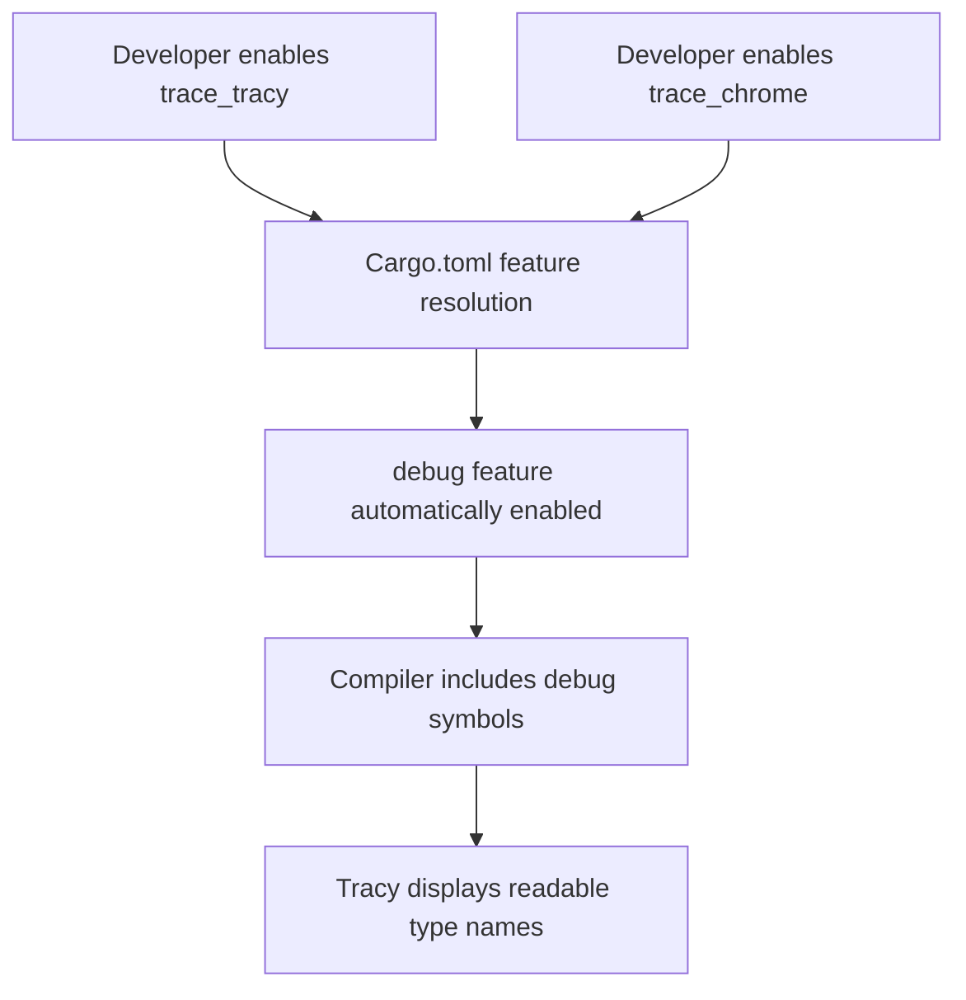

+++
title = "#23048 Enable `debug` feature when `trace_tracy` is enabled"
date = "2026-02-24T00:00:00"
draft = false
template = "pull_request_page.html"
in_search_index = true

[taxonomies]
list_display = ["show"]

[extra]
current_language = "en"
available_languages = {"en" = { name = "English", url = "/pull_request/bevy/2026-02/pr-23048-en-20260224" }, "zh-cn" = { name = "中文", url = "/pull_request/bevy/2026-02/pr-23048-zh-cn-20260224" }}
labels = ["D-Trivial", "C-Usability", "A-Dev-Tools"]
+++

# Title

## Basic Information
- **Title**: Enable `debug` feature when `trace_tracy` is enabled
- **PR Link**: https://github.com/bevyengine/bevy/pull/23048
- **Author**: IceSentry
- **Status**: MERGED
- **Labels**: D-Trivial, C-Usability, S-Ready-For-Final-Review, A-Dev-Tools
- **Created**: 2026-02-19T01:28:01Z
- **Merged**: 2026-02-24T00:57:53Z
- **Merged By**: alice-i-cecile

## Description Translation

# Objective

- When running tracy you generally want to be able to see the full names of things

## Solution

- Enable `debug` when `trace_tracy` is enabled.

## The Story of This Pull Request

This pull request addresses a straightforward but important quality-of-life issue for developers using Tracy, a real-time performance profiler, with the Bevy game engine. The core problem was that when using the `trace_tracy` feature to profile Bevy applications, developers couldn't see the full, human-readable names of Rust types, functions, and other identifiers in the Tracy profiler interface. Instead, they would see mangled or abbreviated names, making it harder to interpret profiling data.

The root cause was that the `trace_tracy` feature didn't automatically enable the `debug` feature in Bevy's Cargo.toml. In Rust, the `debug` feature typically controls whether debug symbols and full type names are included in the compiled output. When disabled for optimization, the compiler strips out or mangles these names to reduce binary size. Tracy relies on these debug symbols to display meaningful names in its profiling UI.

The solution implemented in this PR is minimal and surgical. The developer modified the feature definitions in Cargo.toml to add the `debug` feature as a dependency of both `trace_chrome` and `trace_tracy` features. This ensures that when developers enable either tracing feature, they automatically get debug symbols without needing to manually enable the `debug` feature separately.

The implementation approach is correct for several technical reasons. First, it uses Cargo's feature dependency mechanism correctly - adding `"debug"` to the feature's dependency list means it gets enabled whenever the parent feature is enabled. Second, it applies the fix to both tracing features (`trace_chrome` and `trace_tracy`) for consistency, even though the PR description only mentions Tracy. This prevents the same issue from affecting Chrome tracing users. Third, the change is backward compatible - existing code continues to work, but now with better profiling visibility when tracing is enabled.

One important consideration is that enabling debug symbols increases binary size and may slightly impact performance. However, this is an acceptable trade-off for profiling scenarios, where developers prioritize diagnostic information over optimal performance. The debug symbols are only included when explicitly opting into profiling via the tracing features, not in release builds by default.

The impact of this change is significant for developers using Tracy with Bevy. They can now immediately see clear, readable names in their profiling sessions without additional configuration steps. This reduces friction in the profiling workflow and makes performance analysis more efficient. The change also establishes a sensible default - when you're profiling, you almost always want debug symbols available.

From an architectural perspective, this change demonstrates good feature flag design. It creates a logical dependency between features that are commonly used together, reducing the cognitive load on developers who need to remember which feature combinations work correctly. It's a small example of how thoughtful feature flag management can improve developer experience in large codebases.

## Visual Representation



## Key Files Changed

**Cargo.toml** (+2/-2)

This is the only file changed in this PR. The modifications are in the feature definitions section where the `trace_chrome` and `trace_tracy` features are defined.

1. **What changed and why**: The `debug` feature was added as a dependency to both `trace_chrome` and `trace_tracy` features. This ensures that when either tracing feature is enabled, debug symbols are automatically included in the build, allowing profiling tools to display readable type and function names.

2. **Code snippets showing the key modifications**:

```toml
# File: Cargo.toml
# Before:
trace_chrome = ["trace", "bevy_internal/trace_chrome"]
trace_tracy = ["trace", "bevy_internal/trace_tracy"]

# After:
trace_chrome = ["trace", "bevy_internal/trace_chrome", "debug"]
trace_tracy = ["trace", "bevy_internal/trace_tracy", "debug"]
```

3. **How these changes relate to the overall purpose**: These two lines are the entire implementation of the PR. By adding `"debug"` to each feature's dependency array, Cargo automatically enables the debug feature whenever either tracing feature is enabled. This solves the problem described in the PR where Tracy couldn't display full names because debug symbols were missing.

## Further Reading

1. **Rust Features Documentation**: The official Cargo documentation on features provides detailed information about feature dependencies and resolution: https://doc.rust-lang.org/cargo/reference/features.html

2. **Tracy Profiler**: The official Tracy website and documentation for understanding how the profiler works and uses debug symbols: https://github.com/wolfpld/tracy

3. **Debug Symbols in Rust**: Rust Reference section on debug symbols and how they affect binary output: https://doc.rust-lang.org/rustc/codegen-options/index.html#debuginfo

4. **Bevy Profiling Guide**: The Bevy book's section on profiling and performance analysis: https://bevyengine.org/learn/books/introduction/profiling

5. **Feature Flags Best Practices**: An article on effective use of feature flags in Rust projects: https://bennetthardwick.com/blog/rust-feature-flags-best-practices/

# Full Code Diff

```
diff --git a/Cargo.toml b/Cargo.toml
index 036057fa254cf..3fb7d3923262a 100644
--- a/Cargo.toml
+++ b/Cargo.toml
@@ -426,10 +426,10 @@ raw_vulkan_init = ["bevy_internal/raw_vulkan_init"]
 type_label_buffers = ["bevy_internal/type_label_buffers"]
 
 # Tracing support, saving a file in Chrome Tracing format
-trace_chrome = ["trace", "bevy_internal/trace_chrome"]
+trace_chrome = ["trace", "bevy_internal/trace_chrome", "debug"]
 
 # Tracing support, exposing a port for Tracy
-trace_tracy = ["trace", "bevy_internal/trace_tracy"]
+trace_tracy = ["trace", "bevy_internal/trace_tracy", "debug"]
 
 # Tracing support, with memory profiling, exposing a port for Tracy
 trace_tracy_memory = ["bevy_internal/trace_tracy_memory"]
```