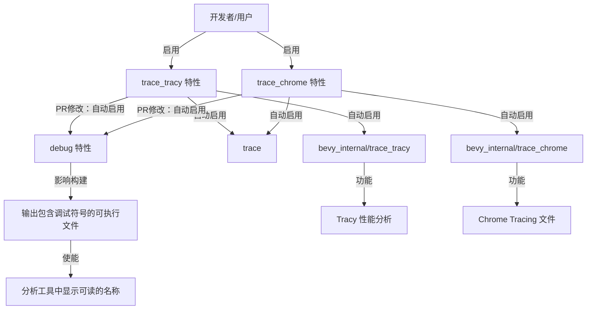

+++
title = "#23048 Enable `debug` feature when `trace_tracy` is enabled"
date = "2026-02-24T00:00:00"
draft = false
template = "pull_request_page.html"
in_search_index = false

[extra]
current_language = "zh-cn"
available_languages = {"en" = { name = "English", url = "/pull_request/bevy/2026-02/pr-23048-en-20260224" }, "zh-cn" = { name = "中文", url = "/pull_request/bevy/2026-02/pr-23048-zh-cn-20260224" }}
+++

# Title

## Basic Information
- **标题**: Enable `debug` feature when `trace_tracy` is enabled
- **PR链接**: https://github.com/bevyengine/bevy/pull/23048
- **作者**: IceSentry
- **状态**: 已合并
- **标签**: D-Trivial, C-Usability, S-Ready-For-Final-Review, A-Dev-Tools
- **创建时间**: 2026-02-19T01:28:01Z
- **合并时间**: 2026-02-24T00:57:53Z
- **合并者**: alice-i-cecile

## Description Translation
### 目标 (Objective)
- 当运行 tracy 时，你通常希望能够看到事物的完整名称。

### 解决方案 (Solution)
- 当启用 `trace_tracy` 特性时，同时启用 `debug` 特性。

## The Story of This Pull Request

这个故事从一个非常具体且常见的开发者痛点开始：当你使用像 Tracy 这样的强大性能分析工具时，你期望看到清晰、完整的函数和类型名称来理解性能瓶颈。然而，在 Bevy 中，仅仅启用 `trace_tracy` 特性（用于集成 Tracy 追踪功能）并不足以确保编译出的二进制文件包含这些易于阅读的调试符号（debug symbols）。

问题的根源在于 Rust 的编译优化和 Cargo 的特性系统。为了获得最佳运行时性能，Rust 编译器默认会进行各种优化，包括函数名重整和符号剥离。要保留人类可读的符号信息，需要启用 `debug` 特性（通常意味着在 `Cargo.toml` 的 `[profile]` 部分设置 `debug = true` 或使用 `--debug` 标志）。但在 Bevy 这样的框架中，特性被组织成更高级别的功能开关（例如 `trace_chrome`, `trace_tracy`），用户可能不知道或忘记需要同时启用底层 `debug` 特性才能获得理想的性能分析体验。

开发者 IceSentry 识别到这个用户体验上的缺口。这是一个典型的“开发者工具”范畴的问题：工具本身（Tracy）功能强大，但使用前的配置步骤可能导致其无法发挥全部效用。解决方案直接而优雅：既然 `trace_tracy` 和 `trace_chrome` 这两个特性的唯一目的就是用于性能分析和调试，那么它们就应该默认提供最有用的输出。因此，最合理的做法是修改这两个特性的定义，让它们在激活时自动带入 `debug` 特性。

从技术实现上看，这个改动极其简单，只涉及 `Cargo.toml` 中两个特性的依赖列表。它利用了 Cargo 特性的一种标准用法：特性可以依赖其他特性。在 `Cargo.toml` 的 `[features]` 部分，像 `trace_tracy = ["trace", "bevy_internal/trace_tracy", "debug"]` 这样的定义意味着，当用户启用 `trace_tracy` 特性时，Cargo 会自动启用其右侧列表中的所有特性。这里，`"debug"` 就是新添加的依赖项。这里的 `debug` 很可能是指 Bevy 工作空间或内部 crate 中定义的一个特性，用于控制是否生成调试信息。

这一改动的工程决策考量是清晰且合理的：
1.  **用户友好性**：消除了一个“陷阱”（pitfall），开发者无需查阅文档或经历一次失败的追踪尝试来发现需要额外启用 `debug`。
2.  **一致性**：`trace_chrome`（生成 Chrome Tracing 格式文件）和 `trace_tracy` 同属追踪工具，因此对两者的处理应该一致。PR 中也一并修改了 `trace_chrome`。
3.  **最小影响**：该改动不会对不使用这些追踪特性的用户产生任何影响。它只是在启用特定开发工具时，调整了构建配置以获得更优的调试体验。
4.  **符合惯例**：这是一个配置上的“便利性”增强，类似于许多框架中“development”或“dev”特性会自动启用日志和调试工具的模式。

这个 PR 的 impact 虽小但明确：它提升了 Bevy 开发者在进行性能剖析（profiling）时的开箱即用体验。从代码库管理的角度看，它是一个典型的“trivial but useful”的贡献——改动量小，风险极低，但能切实改善日常工作流。它提醒我们，良好的框架设计不仅要提供强大的功能，还要通过合理的默认配置来降低这些功能的使用门槛。

## Visual Representation



## Key Files Changed

### 1. `Cargo.toml`
**修改描述与原因**：修改了 `trace_chrome` 和 `trace_tracy` 两个 Cargo 特性的定义，为它们添加了对 `debug` 特性的依赖。这样，当用户启用任一追踪特性时，构建过程会自动包含调试信息，从而确保性能分析工具能显示完整的函数和类型名称。

**关键代码修改**：
```toml
# File: Cargo.toml
# 修改前：
trace_chrome = ["trace", "bevy_internal/trace_chrome"]
trace_tracy = ["trace", "bevy_internal/trace_tracy"]

# 修改后：
trace_chrome = ["trace", "bevy_internal/trace_chrome", "debug"]
trace_tracy = ["trace", "bevy_internal/trace_tracy", "debug"]
```

**与 PR 目标的关联**：这是实现 PR 目标的唯一且直接的修改。通过调整特性间的依赖关系，解决了用户需要手动同时启用两个特性才能获得有效追踪输出的问题。

## Further Reading
1.  **Cargo 文档 - 特性 (Features)**: 了解 Cargo 特性的定义、依赖和条件编译是如何工作的。
    *   https://doc.rust-lang.org/cargo/reference/features.html
2.  **Tracy 性能分析器**: 了解这个强大的实时性能分析工具。
    *   https://github.com/wolfpld/tracy
3.  **Chrome Tracing 格式**: 了解 Chrome 开发者工具使用的追踪文件格式。
    *   https://docs.google.com/document/d/1CvAClvFfyA5R-PhYUmn5OOQtYMH4h6I0nSsKchNAySU/preview
4.  **Rust 调试信息 (Debuginfo)**: 了解 Rust 中如何生成和控制调试符号。
    *   https://doc.rust-lang.org/rustc/codegen-options/index.html#debuginfo

# Full Code Diff
diff --git a/Cargo.toml b/Cargo.toml
index 036057fa254cf..3fb7d3923262a 100644
--- a/Cargo.toml
+++ b/Cargo.toml
@@ -426,10 +426,10 @@ raw_vulkan_init = ["bevy_internal/raw_vulkan_init"]
 type_label_buffers = ["bevy_internal/type_label_buffers"]
 
 # Tracing support, saving a file in Chrome Tracing format
-trace_chrome = ["trace", "bevy_internal/trace_chrome"]
+trace_chrome = ["trace", "bevy_internal/trace_chrome", "debug"]
 
 # Tracing support, exposing a port for Tracy
-trace_tracy = ["trace", "bevy_internal/trace_tracy"]
+trace_tracy = ["trace", "bevy_internal/trace_tracy", "debug"]
 
 # Tracing support, with memory profiling, exposing a port for Tracy
 trace_tracy_memory = ["bevy_internal/trace_tracy_memory"]