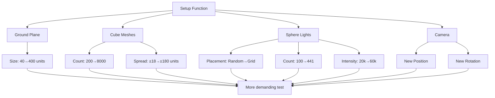

+++
title = "#23050 Solari: Improved many lights test"
date = "2026-02-20T00:00:00"
draft = false
template = "pull_request_page.html"
in_search_index = true

[taxonomies]
list_display = ["show"]

[extra]
current_language = "en"
available_languages = {"en" = { name = "English", url = "/pull_request/bevy/2026-02/pr-23050-en-20260220" }, "zh-cn" = { name = "中文", url = "/pull_request/bevy/2026-02/pr-23050-zh-cn-20260220" }}
labels = ["D-Trivial", "A-Rendering", "C-Examples"]
+++

# Solari: Improved many lights test

## Basic Information
- **Title**: Solari: Improved many lights test
- **PR Link**: https://github.com/bevyengine/bevy/pull/23050
- **Author**: JMS55
- **Status**: MERGED
- **Labels**: D-Trivial, A-Rendering, C-Examples, S-Ready-For-Final-Review
- **Created**: 2026-02-19T02:07:47Z
- **Merged**: 2026-02-20T01:53:56Z
- **Merged By**: alice-i-cecile

## Description Translation

Make the test harder. The previous one was too easy.


## The Story of This Pull Request

The Solari example in Bevy is a stress test designed to evaluate the engine's rendering performance under heavy loads, specifically testing the global illumination system's ability to handle many light sources. The developer noticed that the existing test configuration was insufficient for properly stress-testing the system—it was "too easy." The problem was that the test didn't push the engine's capabilities enough to reveal performance bottlenecks or rendering issues that would only appear under more demanding conditions.

The solution approach was straightforward: scale up the test parameters to create a more challenging scenario. Rather than modifying the rendering algorithms or adding new features, the developer simply increased the scale and complexity of the scene. This approach makes sense because the purpose of the example is to serve as a benchmark and stress test, not to demonstrate new functionality. By making the test more demanding, it becomes more useful for identifying performance regressions and testing optimization improvements.

The implementation involves several coordinated changes that work together to increase the test's difficulty. First, the ground plane was expanded from 40×40 units to 400×400 units to accommodate more objects. This change prevents clustering and gives objects more space to spread out. Second, the sphere mesh generation was made explicit by using `Sphere::new(1.0)` instead of the default constructor, though this is a minor technical detail that doesn't affect the test's difficulty.

The most significant change is the increase in cube count from 200 to 8000, a 40× increase. These cubes serve as both geometry and light sources, dramatically increasing the rendering workload. To accommodate this increase, their placement range was expanded from ±18 units to ±180 units, matching the expanded plane size.

The light placement strategy was completely redesigned. Instead of 100 randomly placed emissive spheres, the new implementation creates a 21×21 grid (441 total lights) with consistent 20-unit spacing. This grid pattern creates a more uniform lighting distribution and eliminates the randomness that could lead to inconsistent test results between runs. The light intensity was also increased from 20000 to 60000 per channel, making the lights brighter and the lighting calculations more demanding.

Finally, the camera's starting position and rotation were adjusted to provide a better view of the expanded scene. The new camera position (6.11, 166.75, 451.82) gives a high-altitude overview of the entire test area.

From a technical perspective, this test now exercises several important aspects of the rendering system simultaneously: it tests the engine's ability to handle thousands of light sources, evaluates performance with large numbers of draw calls, stresses the global illumination calculations, and tests memory management for large scenes. The grid-based light placement is particularly valuable because it creates predictable, reproducible test conditions that make performance comparisons more meaningful.

The impact of these changes is that the Solari example now provides a much more rigorous test of Bevy's rendering capabilities. Developers working on performance optimizations can use this test to measure improvements, and the engine maintainers can use it to catch performance regressions. The increased scale also makes the test more representative of real-world game scenes with complex lighting setups.

## Visual Representation



## Key Files Changed

### `examples/3d/solari.rs` (+33/-31)

This is the only file modified in the PR. The changes transform a moderately complex lighting test into a much more demanding stress test by scaling up various parameters and changing the light placement strategy.

**Key modifications:**

1. **Ground plane expansion** - The base plane was increased from 40×40 to 400×400 units to accommodate more objects:
```rust
// Before:
let mut plane_mesh = Plane3d::default()
    .mesh()
    .size(40.0, 40.0)
    .build()

// After:
let mut plane_mesh = Plane3d::default()
    .mesh()
    .size(400.0, 400.0)
    .build()
```

2. **Sphere mesh explicit radius** - Changed from default sphere to explicit 1.0 radius sphere:
```rust
// Before:
let sphere_mesh = meshes.add(
    Sphere::default()
        .mesh()
        .build()

// After:
let sphere_mesh = meshes.add(
    Sphere::new(1.0)
        .mesh()
        .build()
```

3. **Cube count increased 40×** - From 200 to 8000 cubes:
```rust
// Before:
for _ in 0..200 {

// After:
for _ in 0..8000 {
```

4. **Cube placement range expanded** - To match the larger ground plane:
```rust
// Before:
    .with_translation(Vec3::new(
        rng.random_range(-18.0..=18.0),
        0.2,
        rng.random_range(-18.0..=18.0),

// After:
    .with_translation(Vec3::new(
        rng.random_range(-180.0..=180.0),
        0.2,
        rng.random_range(-180.0..=180.0),
```

5. **Light placement strategy changed** - From random placement to a structured grid:
```rust
// Before (random placement of 100 lights):
for _ in 0..100 {
    commands
        .spawn((
            // ...
            Transform::default().with_translation(Vec3::new(
                rng.random_range(-18.0..=18.0),
                rng.random_range(6.0..=9.0),
                rng.random_range(-18.0..=18.0),

// After (21×21 grid of 441 lights):
for x in -10..=10 {
    for y in -10..=10 {
        commands
            .spawn((
                // ...
                Transform::default().with_translation(Vec3::new(
                    (x * 20) as f32,
                    7.0,
                    (y * 20) as f32,
```

6. **Light intensity increased** - From 20000 to 60000 per channel:
```rust
// Before:
    emissive: Color::linear_rgb(
        rng.random::<f32>() * 20000.0,
        rng.random::<f32>() * 20000.0,
        rng.random::<f32>() * 20000.0,

// After:
    emissive: Color::linear_rgb(
        rng.random::<f32>() * 60000.0,
        rng.random::<f32>() * 60000.0,
        rng.random::<f32>() * 60000.0,
```

7. **Camera position updated** - To view the expanded scene:
```rust
// Before:
    Transform::from_translation(Vec3::new(0.0919233, 7.5015035, 28.449198))
        .with_rotation(Quat::from_xyzw(-0.18394549, 0.0019948867, 0.0003733214, 0.98293436)),

// After:
    Transform::from_translation(Vec3::new(6.11329, 166.74896, 451.8226))
        .with_rotation(Quat::from_xyzw(-0.183938, 0.009093744, 0.0017017953, 0.9828943)),
```

These changes work together to create a much more demanding test that better exercises Bevy's rendering capabilities, particularly the global illumination system.

## Further Reading

1. [Bevy's Rendering Documentation](https://bevyengine.org/learn/book/rendering/) - Understanding Bevy's rendering architecture
2. [Global Illumination Concepts](https://en.wikipedia.org/wiki/Global_illumination) - Background on the rendering techniques being tested
3. [Performance Profiling in Bevy](https://bevyengine.org/learn/book/performance/) - How to measure and optimize rendering performance
4. [Stress Testing in Game Engines](https://gameprogrammingpatterns.com/optimization-patterns.html) - Patterns for creating effective performance tests