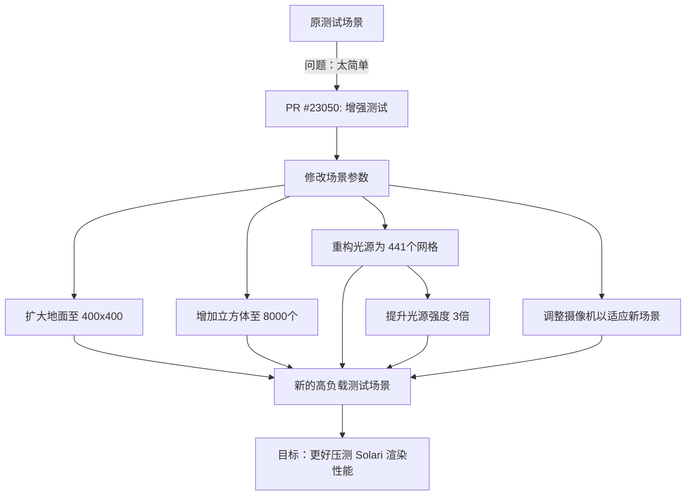

+++
title = "#23050 Solari: Improved many lights test"
date = "2026-02-20T00:00:00"
draft = false
template = "pull_request_page.html"
in_search_index = false

[extra]
current_language = "zh-cn"
available_languages = {"en" = { name = "English", url = "/pull_request/bevy/2026-02/pr-23050-en-20260220" }, "zh-cn" = { name = "中文", url = "/pull_request/bevy/2026-02/pr-23050-zh-cn-20260220" }}
+++

# Solari: Improved many lights test

## 基本信息
- **标题**: Solari: Improved many lights test
- **PR链接**: https://github.com/bevyengine/bevy/pull/23050
- **作者**: JMS55
- **状态**: 已合并
- **标签**: D-Trivial, A-Rendering, C-Examples, S-Ready-For-Final-Review
- **创建时间**: 2026-02-19T02:07:47Z
- **合并时间**: 2026-02-20T01:53:56Z
- **合并者**: alice-i-cecile

## 描述翻译
提高测试难度。之前的测试太简单了。


## 本次PR的完整说明

这个PR的核心目标很直接：增强`solari`示例（一个渲染性能测试场景）的压力测试能力。原测试场景的复杂度不足以充分验证Bevy的Solari渲染系统（一种光线追踪/路径追踪渲染器）在多光源和复杂场景下的性能表现。

### 问题与背景
在图形引擎开发中，基准测试（benchmark）和压力测试（stress test）至关重要。它们用于验证渲染系统在极限负载下的表现，识别性能瓶颈，并确保新功能或优化不会导致性能退化。原来的`solari`示例场景规模较小，包含的地面、立方体和发光球体数量有限，无法充分压榨现代GPU的渲染管线，尤其是针对多光源渲染（many-lights rendering）这种计算密集型的场景。如果一个测试“太简单”，它就无法暴露系统在真实高负载下可能出现的问题。

### 解决方案
解决方案是全面且成比例地提升测试场景的各项参数，以指数级增加渲染负载。开发者没有改变任何算法或架构，而是通过调整现有的场景生成参数来实现。这种方法的好处是风险极低，因为只修改了常量值，但效果立竿见影。

### 具体实现
实现集中在`examples/3d/solari.rs`文件的`setup_many_lights`函数中。所有改动都是数值调整，可以分为以下几类：

1.  **扩大场景范围**：地面平面的大小从`40.0 x 40.0`单位扩大到`400.0 x 400.0`单位。这为放置更多物体提供了空间，也增加了摄像机的可见区域，从而影响裁剪和着色计算。

2.  **增加物体数量**：
    *   随机放置的立方体数量从`200`个激增到`8000`个。
    *   相应地，立方体的生成位置范围也从`±18.0`扩大到了`±180.0`，与地面尺寸的扩大保持同步。
    *   这些立方体也拥有随机缩放和作为光源的发射材质（emissive material），大量增加它们会急剧提升场景的几何复杂度和光照计算量。

3.  **重构并增加光源布局**：
    *   这是最重要的改动。原本`100`个作为光源的球体是随机放置的（位置范围`±18.0`，高度`6.0..=9.0`）。
    *   现在改为使用嵌套循环 (`for x in -10..=10`和`for y in -10..=10`) 生成一个`21x21`的网格，总共`441`个光源球体。
    *   这些光源被精确地放置在`(x * 20, 7.0, y * 20)`坐标上，形成一个间距为20单位的规整网格。这虽然减少了随机性，但确保了光源在扩大后的场景中均匀分布，避免了因随机聚集而可能导致的测试结果不一致。
    *   每个光源的发射光强度从`20000.0`提高到了`60000.0`，增加了3倍，使得光源对场景的贡献更显著。

4.  **调整摄像机**：
    *   初始摄像机的位置和旋转被完全重设。新的摄像机位置 (`Vec3::new(6.11329, 166.74896, 451.8226)`) 比原来高得多、远得多。
    *   这个调整是必要的，因为场景变大了。摄像机需要拉远以获得一个能覆盖大部分新场景的视角，否则测试开始时可能只能看到一片空白或地面的一小部分。

### 技术洞察
*   **测试哲学**：好的性能测试应该能稳定地让系统达到其性能极限。通过将光源布局从随机改为网格，这个PR提高了测试的可重复性。随机布局可能导致某次运行中光源恰好聚集，性能很差，而另一次运行中光源分散，性能较好。网格化布局消除了这种随机性，使每次测试的负载基本一致。
*   **负载维度**：这个改动从多个维度增加了GPU负载：
    1.  **几何负载**：8000个立方体 vs 200个。
    2.  **光照计算负载**：441个均匀分布的强光源 vs 100个随机分布的较弱光源。
    3.  **屏幕空间负载**：更大的地面和更多的物体会产生更多的像素需要着色。
    4.  **内存与带宽负载**：更多的网格、材质实例和变换数据。
*   **Solari系统**：虽然PR没有修改Solari的代码，但它直接测试了该系统在极端多光源和复杂场景下的健壮性和效率。这对于一个实时光线追踪/路径追踪渲染器来说是关键用例。

### 影响
这个PR的直接影响是，`solari`示例现在成为一个严格得多的性能基准和压力测试工具。开发者或贡献者在运行此示例时，将能更清晰地观察到：
*   帧率下降，更容易识别性能瓶颈。
*   内存使用情况。
*   渲染系统的稳定性。
*   未来对Solari或相关渲染代码的优化是否有效。

这是一个典型的“强化测试”操作，通过最小的代码改动（仅修改常量），显著提升了测试的效用价值，有助于保障渲染模块的质量。

## 组件关系图


## 关键文件变更
- `examples/3d/solari.rs` (+33/-31)

这是本次PR修改的唯一文件。所有改动都集中在`setup_many_lights`函数中，目的是显著增加渲染场景的复杂度以进行更有效的性能测试。

**关键修改**：

1. **扩大地面尺寸**：为容纳更多物体做准备。
```rust
// 之前:
.size(40.0, 40.0)

// 之后:
.size(400.0, 400.0)
```

2. **明确球体尺寸**：代码风格改进，使意图更清晰。
```rust
// 之前:
Sphere::default()

// 之后:
Sphere::new(1.0)
```

3. **大幅增加物体数量并扩大分布范围**：
```rust
// 之前: 200个立方体，分布在±18范围内
for _ in 0..200 {
    ...
    .with_translation(Vec3::new(
        rng.random_range(-18.0..=18.0),
        0.2,
        rng.random_range(-18.0..=18.0),
    )),

// 之后: 8000个立方体，分布在±180范围内
for _ in 0..8000 {
    ...
    .with_translation(Vec3::new(
        rng.random_range(-180.0..=180.0),
        0.2,
        rng.random_range(-180.0..=180.0),
    )),
```

4. **重构光源布局**：从随机分布改为规整的网格分布，并增加数量和强度。
```rust
// 之前: 100个随机放置的球体光源，强度因子20000.0
for _ in 0..100 {
    ...
    Color::linear_rgb(rng.random::<f32>() * 20000.0, ...)
    ...
    .with_translation(Vec3::new(
        rng.random_range(-18.0..=18.0),
        rng.random_range(6.0..=9.0),
        rng.random_range(-18.0..=18.0),
    )),

// 之后: 441个（21x21网格）规则放置的球体光源，强度因子60000.0
for x in -10..=10 {
    for y in -10..=10 {
        ...
        Color::linear_rgb(rng.random::<f32>() * 60000.0, ...)
        ...
        .with_translation(Vec3::new(
            (x * 20) as f32,
            7.0,
            (y * 20) as f32,
        )),
```

5. **调整摄像机**：移动到更远更高的位置以观察扩大后的场景。
```rust
// 之前:
Transform::from_translation(Vec3::new(0.0919233, 7.5015035, 28.449198))

// 之后:
Transform::from_translation(Vec3::new(6.11329, 166.74896, 451.8226))
```

这些修改共同作用，将`solari`示例从一个中等复杂度的演示，转变为一个能够对Bevy的Solari渲染器进行高强度压力测试的场景。

## 进一步阅读
1.  **Bevy 官方文档 - 渲染**：了解Bevy渲染架构的基础。
2.  **路径追踪 (Path Tracing) 与光线追踪 (Ray Tracing)**：学习Solari示例背后使用的渲染技术原理。
3.  **计算机图形学性能分析与基准测试**：了解如何设计和评估图形应用的性能测试。
4.  **GPU 渲染管线**：深入理解顶点着色、光栅化、片元着色等阶段，有助于分析此类压力测试可能暴露的瓶颈。

## 完整代码差异
```diff
diff --git a/examples/3d/solari.rs b/examples/3d/solari.rs
index de1bcb67ae4a7..5139f9dcd3445 100644
--- a/examples/3d/solari.rs
+++ b/examples/3d/solari.rs
@@ -211,7 +211,7 @@ fn setup_many_lights(
 
     let mut plane_mesh = Plane3d::default()
         .mesh()
-        .size(40.0, 40.0)
+        .size(400.0, 400.0)
         .build()
         .with_generated_tangents()
         .unwrap();
@@ -230,7 +230,7 @@ fn setup_many_lights(
             .unwrap(),
     );
     let sphere_mesh = meshes.add(
-        Sphere::default()
+        Sphere::new(1.0)
             .mesh()
             .build()
             .with_generated_tangents()
@@ -258,7 +258,7 @@ fn setup_many_lights(
         ))
         .insert_if(Mesh3d(plane_mesh), || args.pathtracer != Some(true));
 
-    for _ in 0..200 {
+    for _ in 0..8000 {
         commands
             .spawn((
                 RaytracingMesh3d(cube_mesh.clone()),
@@ -274,38 +274,40 @@ fn setup_many_lights(
                         z: rng.random_range(0.2..=2.0),
                     })
                     .with_translation(Vec3::new(
-                        rng.random_range(-18.0..=18.0),
+                        rng.random_range(-180.0..=180.0),
                         0.2,
-                        rng.random_range(-18.0..=18.0),
+                        rng.random_range(-180.0..=180.0),
                     )),
             ))
             .insert_if(Mesh3d(cube_mesh.clone()), || args.pathtracer != Some(true));
     }
 
-    for _ in 0..100 {
-        commands
-            .spawn((
-                RaytracingMesh3d(sphere_mesh.clone()),
-                MeshMaterial3d(
-                    materials.add(StandardMaterial {
-                        emissive: Color::linear_rgb(
-                            rng.random::<f32>() * 20000.0,
-                            rng.random::<f32>() * 20000.0,
-                            rng.random::<f32>() * 20000.0,
-                        )
-                        .into(),
-                        ..default()
-                    }),
-                ),
-                Transform::default().with_translation(Vec3::new(
-                    rng.random_range(-18.0..=18.0),
-                    rng.random_range(6.0..=9.0),
-                    rng.random_range(-18.0..=18.0),
-                )),
-            ))
-            .insert_if(Mesh3d(sphere_mesh.clone()), || {
-                args.pathtracer != Some(true)
-            });
+    for x in -10..=10 {
+        for y in -10..=10 {
+            commands
+                .spawn((
+                    RaytracingMesh3d(sphere_mesh.clone()),
+                    MeshMaterial3d(
+                        materials.add(StandardMaterial {
+                            emissive: Color::linear_rgb(
+                                rng.random::<f32>() * 60000.0,
+                                rng.random::<f32>() * 60000.0,
+                                rng.random::<f32>() * 60000.0,
+                            )
+                            .into(),
+                            ..default()
+                        }),
+                    ),
+                    Transform::default().with_translation(Vec3::new(
+                        (x * 20) as f32,
+                        7.0,
+                        (y * 20) as f32,
+                    )),
+                ))
+                .insert_if(Mesh3d(sphere_mesh.clone()), || {
+                    args.pathtracer != Some(true)
+                });
+        }
     }
 
     let mut camera = commands.spawn((
@@ -319,8 +321,8 @@ fn setup_many_lights(
             run_speed: 10.0,
             ..Default::default()
         },
-        Transform::from_translation(Vec3::new(0.0919233, 7.5015035, 28.449198)).with_rotation(
-            Quat::from_xyzw(-0.18394549, 0.0019948867, 0.0003733214, 0.98293436),
+        Transform::from_translation(Vec3::new(6.11329, 166.74896, 451.8226)).with_rotation(
+            Quat::from_xyzw(-0.183938, 0.009093744, 0.0017017953, 0.9828943),
         ),
         // Msaa::Off and CameraMainTextureUsages with STORAGE_BINDING are required for Solari
         CameraMainTextureUsages::default().with(TextureUsages::STORAGE_BINDING),
```