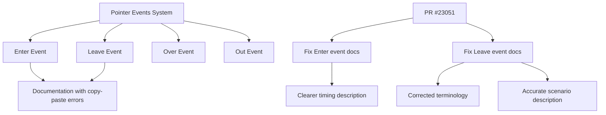

+++
title = "#23051 Docs: Fix up copypasta in `Leave` event"
date = "2026-02-24T00:00:00"
draft = false
template = "pull_request_page.html"
in_search_index = true

[taxonomies]
list_display = ["show"]

[extra]
current_language = "en"
available_languages = {"en" = { name = "English", url = "/pull_request/bevy/2026-02/pr-23051-en-20260224" }, "zh-cn" = { name = "中文", url = "/pull_request/bevy/2026-02/pr-23051-zh-cn-20260224" }}
labels = ["C-Docs", "D-Trivial", "A-UI", "A-Picking"]
+++

# Docs: Fix up copypasta in `Leave` event

## Basic Information
- **Title**: Docs: Fix up copypasta in `Leave` event
- **PR Link**: https://github.com/bevyengine/bevy/pull/23051
- **Author**: kfc35
- **Status**: MERGED
- **Labels**: C-Docs, D-Trivial, A-UI, S-Ready-For-Final-Review, A-Picking
- **Created**: 2026-02-19T02:18:55Z
- **Merged**: 2026-02-24T01:11:28Z
- **Merged By**: alice-i-cecile

## Description
Decided to re-read what I wrote on a whim and noticed I didn't update the text thoroughly 🤦 

## The Story of This Pull Request

This pull request addresses a straightforward but important documentation issue in Bevy's picking system. The problem was discovered when the author, kfc35, was reviewing their own documentation for the `Leave` event and noticed they had made a classic copy-paste error.

The issue exists in the documentation comments for the `Leave` event in the `bevy_picking` crate. When implementing the documentation, the author had originally copied the structure and content from the `Enter` event documentation, which makes sense as these events are conceptually similar but opposite. However, they failed to update all the terminology and descriptions to correctly reflect the behavior of the `Leave` event.

Specifically, the documentation for `Leave` contained references to "entering" and "`Enter` events" that should have been changed to "leaving" and "`Leave` events". This kind of copy-paste error is common in documentation, especially when two related components have similar but inverted behaviors.

The fix is minimal but important for user understanding. The picking system's events are crucial for UI interactions, and developers need accurate documentation to understand when these events fire and how to use them correctly. The corrected documentation now properly describes the scenario where a child's bounds extend beyond its parent's bounds, and the pointer leaves from within those extended bounds.

Interestingly, the author also took the opportunity to slightly improve the wording in the `Enter` event documentation. They changed the phrasing from "check the value of `is_in_bounds`" to "check the value of `was_in_bounds`" for the `Leave` event, which is more precise. For the `Enter` event, they clarified the timing by changing "upon entering" to "immediately upon entering."

These changes don't affect the code's functionality at all—they're purely documentation improvements. However, they significantly improve the developer experience by providing accurate information about when these events fire and what the associated boolean fields (`is_in_bounds` for `Enter` and `was_in_bounds` for `Leave`) actually mean.

The technical context here is that Bevy's picking system provides events that track pointer interactions with UI elements. These events follow the same bubbling behavior as web events like `mouseenter` and `mouseleave`, which is why the documentation references web standards. Understanding these events correctly is essential for building responsive UI systems in Bevy.

The fix demonstrates an important practice in software engineering: reviewing your own work, even after it's been merged. The author noticed the issue "on a whim" while re-reading their documentation, which shows the value of periodic code reviews and documentation audits.

## Visual Representation



## Key Files Changed

### `crates/bevy_picking/src/events.rs` (+9/-9)

This file contains the event definitions for Bevy's picking system. The changes fix documentation copy-paste errors and improve clarity.

**Key changes:**

1. **Enter event documentation improvements:**
```rust
// Before:
/// To find out whether a pointer is within an entity's bounds upon entering,
/// check the value of [`is_in_bounds`](Enter::is_in_bounds).

// After:
/// To find out whether a pointer is within the target entity's bounds
/// immediately upon entering, check the value of [`is_in_bounds`](Enter::is_in_bounds).
```

2. **Leave event documentation corrections:**
```rust
// Before:
/// Note: An [`Leave`] event may be fired for an ancestor even if the pointer does not leave
/// the ancestor's bounds. More concretely, if a child's bounds extend beyond the parent's,
/// and the pointer enters the child's bounds without crossing into the parent's,
/// two [`Enter`] events are still emitted for both the child and the parent.
/// This matches the triggering behavior of `mouseleave` events on the web.
/// To find out whether the pointer was within an entity's bounds before leaving,
/// check the value of [`was_in_bounds`](Leave::was_in_bounds).

// After:
/// Note: A [`Leave`] event may be fired for an ancestor even if the pointer does not leave
/// the ancestor's bounds. More concretely, if a child's bounds extend beyond the parent's
/// and the pointer leaves from within those extended bounds,
/// two [`Leave`] events are still emitted for both the child and the parent.
/// This matches the triggering behavior of `mouseleave` events on the web.
/// To find out whether the pointer was within the target entity's bounds
/// right before leaving, check the value of [`was_in_bounds`](Leave::was_in_bounds).
```

The changes correct several issues:
- Changed "An `Leave`" to "A `Leave`" (grammar fix)
- Changed "enters" to "leaves" in the scenario description
- Changed "`Enter` events" to "`Leave` events" 
- Changed "before leaving" to "right before leaving" for temporal clarity
- Changed "an entity's bounds" to "the target entity's bounds" for precision

## Further Reading

1. **Bevy Picking System Documentation**: For more information about Bevy's picking system and how these events work in practice.
2. **MDN Web Docs - mouseenter/mouseleave Events**: Understanding the web standards that inspired Bevy's implementation can help clarify the behavior.
3. **Rust Documentation Best Practices**: Learning how to write effective documentation in Rust, including when to use doc comments and how to structure them.
4. **Code Review Practices**: Techniques for effective code reviews, including how to catch copy-paste errors and other common documentation issues.