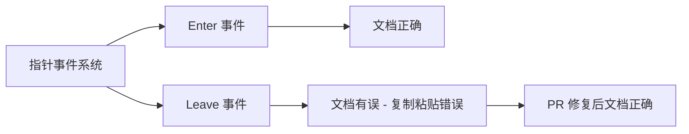

+++
title = "#23051 Docs: Fix up copypasta in `Leave` event"
date = "2026-02-24T00:00:00"
draft = false
template = "pull_request_page.html"
in_search_index = false

[extra]
current_language = "zh-cn"
available_languages = {"en" = { name = "English", url = "/pull_request/bevy/2026-02/pr-23051-en-20260224" }, "zh-cn" = { name = "中文", url = "/pull_request/bevy/2026-02/pr-23051-zh-cn-20260224" }}
+++

# Docs: Fix up copypasta in `Leave` event

## 基本信息
- **标题**: Docs: Fix up copypasta in `Leave` event  
- **PR 链接**: https://github.com/bevyengine/bevy/pull/23051
- **作者**: kfc35
- **状态**: 已合并
- **标签**: C-Docs, D-Trivial, A-UI, S-Ready-For-Final-Review, A-Picking
- **创建时间**: 2026-02-19T02:18:55Z
- **合并时间**: 2026-02-24T01:11:28Z
- **合并者**: alice-i-cecile

## 描述翻译
心血来潮重新读了下我写的内容，发现没有彻底更新文本 🤦

## 关于本次 Pull Request 的故事

这是一个文档修复的简单 PR。作者在重新阅读自己编写的代码文档时，发现了一个复制粘贴（copypasta）错误。具体来说，在 `Leave` 事件的文档注释中，描述文本错误地复制了 `Enter` 事件的内容，没有根据 `Leave` 事件的实际情况进行彻底更新。

这种文档错误在实际开发中很常见。当工程师需要为两个类似但对称的功能编写文档时（比如 enter/leave、push/pop、add/remove），有时会复制一个功能的文档，然后修改部分内容。但在这个过程中，可能会遗漏一些需要修改的地方，导致文档与实际情况不符。

在这个案例中，`Leave` 事件的文档中有一段描述直接复制了 `Enter` 事件的例子："if a child's bounds extend beyond the parent's, and the pointer enters the child's bounds without crossing into the parent's, two [`Enter`] events are still emitted for both the child and the parent." 这明显是错误的，因为对于 `Leave` 事件，应该描述指针离开的情况，而不是进入。

作者迅速发现了这个问题并进行了修正。修正后的文档将例子改为："if a child's bounds extend beyond the parent's and the pointer leaves from within those extended bounds, two [`Leave`] events are still emitted for both the child and the parent." 这样就更准确地描述了 `Leave` 事件的行为。

虽然这个修复看起来很小，但它对用户体验很重要。不准确的文档会误导开发者，让他们对 API 行为产生错误的理解。特别是对于 Bevy 这样的游戏引擎，指针事件系统是 UI 交互的基础，准确的文档对于开发者正确使用这些事件至关重要。

从工程实践的角度看，这次修复提醒我们在编写和维护文档时需要仔细检查，特别是在使用复制粘贴时。即使是很小的文档错误，也可能给其他开发者带来困惑。同时，这也体现了开源社区自我修正的能力——即使是原作者也会回头检查自己的工作，并及时修正发现的问题。

## 视觉表示



## 主要更改文件

### `crates/bevy_picking/src/events.rs` (+9/-9)

这是唯一被修改的文件，包含了 `Leave` 事件文档注释的修复。

**更改内容**：
- 修复了 `Leave` 事件文档中的复制粘贴错误
- 将错误的 `Enter` 事件示例描述替换为正确的 `Leave` 事件描述
- 更新了相关的解释性文本，使其与 `Leave` 事件的行为一致

**关键代码片段**：
```rust
// 修复前（错误的复制粘贴）：
/// Note: A [`Leave`] event may be fired for an ancestor even if the pointer does not leave
/// the ancestor's bounds. More concretely, if a child's bounds extend beyond the parent's,
/// and the pointer enters the child's bounds without crossing into the parent's,
/// two [`Enter`] events are still emitted for both the child and the parent.
/// This matches the triggering behavior of `mouseleave` events on the web.
/// To find out whether the pointer was within an entity's bounds before leaving,
/// check the value of [`was_in_bounds`](Leave::was_in_bounds).

// 修复后（正确的描述）：
/// Note: A [`Leave`] event may be fired for an ancestor even if the pointer does not leave
/// the ancestor's bounds. More concretely, if a child's bounds extend beyond the parent's
/// and the pointer leaves from within those extended bounds,
/// two [`Leave`] events are still emitted for both the child and the parent.
/// This matches the triggering behavior of `mouseleave` events on the web.
/// To find out whether the pointer was within the target entity's bounds
/// right before leaving, check the value of [`was_in_bounds`](Leave::was_in_bounds).
```

**与 PR 目的的关系**：
这个更改直接实现了 PR 的目标：修复 `Leave` 事件文档中的复制粘贴错误。通过将错误的 `Enter` 事件示例替换为正确的 `Leave` 事件描述，确保了文档的准确性。

## 完整代码差异

```
diff --git a/crates/bevy_picking/src/events.rs b/crates/bevy_picking/src/events.rs
index b552bc524d5b7..ab47b8eab01c0 100644
--- a/crates/bevy_picking/src/events.rs
+++ b/crates/bevy_picking/src/events.rs
@@ -205,12 +205,12 @@ pub struct Over {
 /// An [`Enter`] event would not be sent for A because it is a shared ancestor of both C and E.
 ///
 /// Note: An [`Enter`] event may be fired for an ancestor even if the pointer does not enter
-/// within the ancestor's bounds. More concretely, if a child's bounds extend beyond the parent's,
+/// within the ancestor's bounds. More concretely, if a child's bounds extend beyond the parent's
 /// and the pointer enters the child's bounds without crossing into the parent's,
 /// two [`Enter`] events are still emitted for both the child and the parent.
 /// This matches the triggering behavior of `mouseenter` events on the web.
-/// To find out whether a pointer is within an entity's bounds upon entering,
-/// check the value of [`is_in_bounds`](Enter::is_in_bounds).
+/// To find out whether a pointer is within the target entity's bounds
+/// immediately upon entering, check the value of [`is_in_bounds`](Enter::is_in_bounds).
 ///
 /// Refer to [`pointer_events`] for more information on how these events are triggered.
 #[derive(Clone, PartialEq, Debug, Reflect)]
@@ -254,13 +254,13 @@ pub struct Out {
 /// [`Leave`] events would be sent for both C and its direct ancestor B.
 /// A [`Leave`] event would not be sent for A because it is a shared ancestor of both C and E.
 ///
-/// Note: An [`Leave`] event may be fired for an ancestor even if the pointer does not leave
-/// the ancestor's bounds. More concretely, if a child's bounds extend beyond the parent's,
-/// and the pointer enters the child's bounds without crossing into the parent's,
-/// two [`Enter`] events are still emitted for both the child and the parent.
+/// Note: A [`Leave`] event may be fired for an ancestor even if the pointer does not leave
+/// the ancestor's bounds. More concretely, if a child's bounds extend beyond the parent's
+/// and the pointer leaves from within those extended bounds,
+/// two [`Leave`] events are still emitted for both the child and the parent.
 /// This matches the triggering behavior of `mouseleave` events on the web.
-/// To find out whether the pointer was within an entity's bounds before leaving,
-/// check the value of [`was_in_bounds`](Leave::was_in_bounds).
+/// To find out whether the pointer was within the target entity's bounds
+/// right before leaving, check the value of [`was_in_bounds`](Leave::was_in_bounds).
 ///
 /// Refer to [`pointer_events`] for more information on how these events are triggered.
 #[derive(Clone, PartialEq, Debug, Reflect)]
```

## 扩展阅读

1. **Bevy 指针事件系统文档**：了解 Bevy 中完整的指针事件系统
   - https://docs.rs/bevy_picking/latest/bevy_picking/

2. **W3C Pointer Events 标准**：理解指针事件的标准化行为
   - https://www.w3.org/TR/pointerevents/

3. **Rust 文档注释指南**：学习如何编写清晰、准确的 Rust 文档
   - https://doc.rust-lang.org/rustdoc/how-to-write-documentation.html

4. **代码审查中的文档检查**：了解在代码审查中如何检查文档质量
   - https://google.github.io/eng-practices/review/reviewer/looking-for.html#documentation