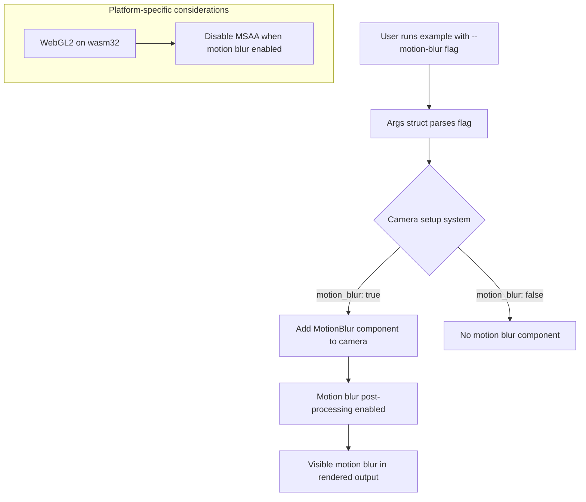

+++
title = "#23060 Add motion blur option to various stress tests"
date = "2026-02-24T00:00:00"
draft = false
template = "pull_request_page.html"
in_search_index = true

[taxonomies]
list_display = ["show"]

[extra]
current_language = "en"
available_languages = {"en" = { name = "English", url = "/pull_request/bevy/2026-02/pr-23060-en-20260224" }, "zh-cn" = { name = "中文", url = "/pull_request/bevy/2026-02/pr-23060-zh-cn-20260224" }}
labels = ["A-Rendering", "C-Benchmarks", "D-Straightforward"]
+++

# Title
Add motion blur option to various stress tests

## Basic Information
- **Title**: Add motion blur option to various stress tests
- **PR Link**: https://github.com/bevyengine/bevy/pull/23060
- **Author**: greeble-dev
- **Status**: MERGED
- **Labels**: A-Rendering, S-Ready-For-Final-Review, C-Benchmarks, D-Straightforward
- **Created**: 2026-02-19T18:22:15Z
- **Merged**: 2026-02-24T19:02:50Z
- **Merged By**: alice-i-cecile

## Description Translation

## Objective

Add a motion blur option to various stress tests. This is useful for benchmarking, but also for bug reproduction - not many examples use motion blur. In particular, I want this to repro a suspected bug with motion blur and morph targets.

## Solution

Add an opt-in `--motion-blur` argument to `many_foxes`, `many_morph_targets` and `many_cubes`.

I'm a bit unhappy about the cut and paste. Maybe there should be some shared utilities for the stress tests.

## Testing

Tested on Native/Win10/Nvidia/Vulkan.

```sh
cargo run --example many_foxes -- --motion-blur
cargo run --example many_morph_targets -- --motion-blur
cargo run --example many_many_cubes -- --motion-blur
```

## The Story of This Pull Request

The PR addresses a practical issue in the Bevy engine's test suite: the lack of motion blur examples in stress tests. The developer needed a reliable way to reproduce a suspected bug involving motion blur interacting with morph targets, but discovered that most stress test examples didn't include motion blur functionality.

The problem had two dimensions. First, from a debugging perspective, there was no straightforward way to test motion blur under realistic stress conditions. Second, for benchmarking purposes, there was a gap in being able to measure the performance impact of motion blur in scenes with many moving entities. The existing examples either didn't support motion blur or weren't set up to demonstrate it clearly.

The solution approach was straightforward: add a command-line flag to three existing stress test examples (`many_foxes`, `many_morph_targets`, and `many_cubes`) that would enable motion blur when specified. The implementation needed to be minimal and non-invasive, adding functionality without changing the default behavior of the examples.

The implementation follows a consistent pattern across all three files. Each example's `Args` struct gains a new boolean field:
```rust
/// whether to enable motion blur.
#[argh(switch)]
motion_blur: bool,
```

In the camera setup logic, a conditional check adds the `MotionBlur` component when the flag is true:
```rust
if args.motion_blur {
    camera.insert((
        MotionBlur {
            // Use an unrealistically large shutter angle so that motion blur is clearly visible.
            shutter_angle: 3.0,
            ..Default::default()
        },
        // MSAA and MotionBlur are not compatible on WebGL.
        #[cfg(all(
            feature = "webgl2",
            target_arch = "wasm32",
            not(feature = "webgpu")
        ))]
        Msaa::Off,
    ));
}
```

This implementation shows attention to platform-specific considerations. The code includes a conditional compilation directive for WebGL platforms where MSAA (Multisample Anti-Aliasing) and motion blur are incompatible. When targeting WebGL2 on wasm32 without webgpu support, it disables MSAA when motion blur is enabled.

The `shutter_angle` is set to 3.0 radians (approximately 172 degrees), which the comment correctly notes is "unrealistically large" but makes the motion blur effect clearly visible for debugging and demonstration purposes. This is a sensible choice for stress tests where the goal is to make effects visible rather than achieve photorealistic results.

A technical insight here is the use of Bevy's component system. The `MotionBlur` component is part of Bevy's post-processing pipeline, and adding it to the camera entity automatically enables the motion blur effect without requiring additional setup in the rendering pipeline. This demonstrates Bevy's data-oriented design where rendering features are often implemented as components that systems can query and process.

The developer expressed some dissatisfaction with the cut-and-paste approach, noting that "maybe there should be some shared utilities for the stress tests." This is a valid observation - the same motion blur setup code appears in three places with only minor variations. In a larger codebase, this duplication could become a maintenance burden, especially if the motion blur API changes or if additional configuration options need to be added. However, for a focused PR adding a specific feature to examples, the duplication is acceptable and keeps each example self-contained.

The impact of this PR is practical and immediate. It provides developers with:
1. A way to reproduce motion blur-related bugs in stress scenarios
2. A means to benchmark motion blur performance with many entities
3. Clear examples of how to integrate motion blur into Bevy applications
4. Documentation of the WebGL compatibility constraint with MSAA

The changes are backward compatible - existing command-line invocations continue to work without modification, and the new `--motion-blur` flag is entirely optional.

## Visual Representation



## Key Files Changed

### `examples/stress_tests/many_cubes.rs` (+21/-1)
This file gained motion blur support for the cube stress test. The changes include:
1. Added `MotionBlur` import
2. Added `motion_blur` boolean field to `Args` struct
3. Added conditional motion blur setup in camera spawning

Key code addition:
```rust
if args.motion_blur {
    camera.insert((
        MotionBlur {
            // Use an unrealistically large shutter angle so that motion blur is clearly visible.
            shutter_angle: 3.0,
            ..Default::default()
        },
        // MSAA and MotionBlur are not compatible on WebGL.
        #[cfg(all(
            feature = "webgl2",
            target_arch = "wasm32",
            not(feature = "webgpu")
        ))]
        Msaa::Off,
    ));
}
```

### `examples/stress_tests/many_foxes.rs` (+21/-1)
This file gained motion blur support for the fox animation stress test. The changes are similar to `many_cubes.rs` but with different camera positioning logic.

Key differences:
- The `args` parameter needed to be added to the `setup` function signature
- The camera is spawned first, then motion blur components are conditionally added

Code addition:
```rust
if args.motion_blur {
    camera.insert((
        MotionBlur {
            // Use an unrealistically large shutter angle so that motion blur is clearly visible.
            shutter_angle: 3.0,
            ..Default::default()
        },
        // MSAA and MotionBlur are not compatible on WebGL.
        #[cfg(all(feature = "webgl2", target_arch = "wasm32", not(feature = "webgpu")))]
        Msaa::Off,
    ));
}
```

### `examples/stress_tests/many_morph_targets.rs` (+19/-1)
This file gained motion blur support specifically for testing morph targets with motion blur, which was the original motivation mentioned in the PR description.

The implementation follows the same pattern as the other files, with the camera distance determined by the existing `camera` argument (near or far positioning).

Code addition:
```rust
if args.motion_blur {
    camera.insert((
        MotionBlur {
            // Use an unrealistically large shutter angle so that motion blur is clearly visible.
            shutter_angle: 3.0,
            ..Default::default()
        },
        // MSAA and MotionBlur are not compatible on WebGL.
        #[cfg(all(feature = "webgl2", target_arch = "wasm32", not(feature = "webgpu")))]
        Msaa::Off,
    ));
}
```

## Further Reading

1. **Bevy Motion Blur Documentation**: The `MotionBlur` component documentation in Bevy's API reference
2. **Post-processing in Bevy**: How Bevy's post-processing pipeline works and how to create custom post-processing effects
3. **Temporal Anti-Aliasing and Motion Blur**: The relationship between TAA and motion blur in modern rendering pipelines
4. **Command-line Argument Parsing with Argh**: The `argh` crate used for parsing command-line arguments in these examples
5. **WebGL Limitations in Graphics APIs**: Understanding platform-specific constraints like the MSAA/motion blur incompatibility on WebGL