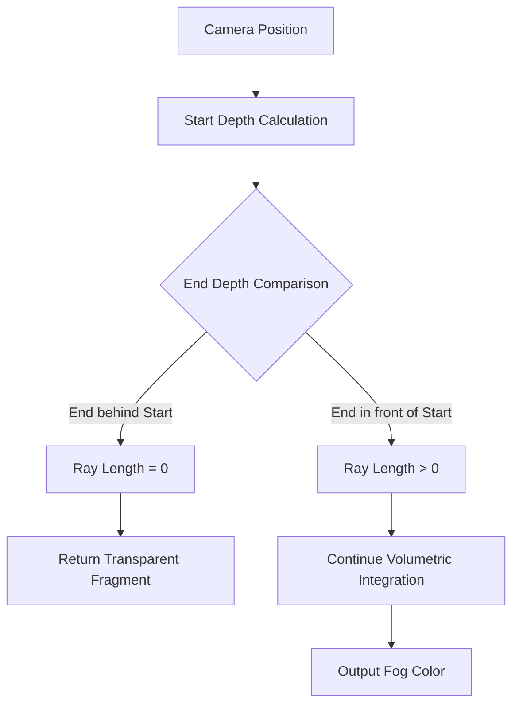

+++
title = "#23062 Fix volumetric rendering order problem"
date = "2026-02-24T00:00:00"
draft = false
template = "pull_request_page.html"
in_search_index = true

[taxonomies]
list_display = ["show"]

[extra]
current_language = "en"
available_languages = {"en" = { name = "English", url = "/pull_request/bevy/2026-02/pr-23062-en-20260224" }, "zh-cn" = { name = "中文", url = "/pull_request/bevy/2026-02/pr-23062-zh-cn-20260224" }}
labels = ["C-Bug", "D-Trivial", "A-Rendering"]
+++

# Title

## Basic Information
- **Title**: Fix volumetric rendering order problem
- **PR Link**: https://github.com/bevyengine/bevy/pull/23062
- **Author**: dan-dozen
- **Status**: MERGED
- **Labels**: C-Bug, D-Trivial, A-Rendering, S-Ready-For-Final-Review
- **Created**: 2026-02-19T22:00:00Z
- **Merged**: 2026-02-24T03:08:28Z
- **Merged By**: alice-i-cecile

## Description Translation
**Objective**
- Fixes an issue where volumetric fog renders behind other meshes. Fixes https://github.com/bevyengine/bevy/issues/17429

**Solution**
- Updates the shader to not render when behind other geometry

**Testing**
- Tested on macOS 15.7.3 (24G419) Apple M3 Pro
- Needs testing on other platforms
- Test this change by patching in  https://github.com/dan-dozen/bevy/pull/1/changes and running `examples/3d/volumetric_fog.rs`. I'm happy to include the changes to the example too.

---

**Showcase**

<details>
  <summary>Click to view showcase</summary>

Before the change, you can see the volumetric fog inside of the house, even though it is behind the front wall:


After the change, it's no longer visible:


</details>

## The Story of This Pull Request

This PR addresses a specific visual bug in Bevy's volumetric fog rendering system. The problem was straightforward: volumetric fog particles were incorrectly rendering behind opaque geometry like walls, when they should have been occluded. This violated the expected depth ordering in 3D rendering where objects closer to the camera should obscure objects further away.

The issue stemmed from how the volumetric fog fragment shader handled depth calculations. The original implementation calculated the ray length between the camera and the fog volume using an absolute value function. This mathematical approach caused the fog to render even when it was positioned behind opaque surfaces, because the absolute value always returned a positive length regardless of depth ordering.

The solution implemented a more physically accurate depth comparison. Instead of using `abs()` to calculate ray length, the fix uses `max(0.0, end_depth_view - start_depth_view)`. This ensures that if the fog volume's end depth is behind the start depth (meaning it's occluded by nearer geometry), the calculated ray length will be zero. The shader then checks for this zero-length condition and returns a transparent color (RGBA 0,0,0,0), effectively discarding the fragment.

This approach is both efficient and correct. The early exit when `ray_length_view == 0.0` avoids unnecessary computation for occluded fragments, providing a minor performance optimization in addition to fixing the visual bug. The implementation follows standard graphics programming patterns for depth-aware rendering, where fragments behind opaque surfaces should be culled early to save GPU cycles.

From an architectural perspective, this change is minimal and localized to a single shader file, which reduces the risk of introducing regressions. The fix maintains compatibility with the existing rendering pipeline and doesn't require changes to other systems like material handling or camera setup. The logic is self-contained within the fragment shader's depth calculation phase, making it easy to understand and maintain.

The testing approach demonstrated good practice - the author tested on their development platform (macOS with Apple M3 Pro) and acknowledged the need for cross-platform validation. They provided clear reproduction steps using the existing `volumetric_fog.rs` example, which allows other developers to verify the fix works correctly in their environments.

This fix illustrates an important principle in graphics programming: depth calculations need careful handling of relative positions, not just absolute distances. The original `abs()` approach worked mathematically but didn't respect the visual hierarchy of the scene. The new implementation correctly models the physical reality that light from occluded objects doesn't reach the camera, and therefore shouldn't contribute to the final image.

## Visual Representation



## Key Files Changed

**crates/bevy_pbr/src/volumetric_fog/volumetric_fog.wgsl** (+7/-1)

This file contains the WebGPU Shading Language (WGSL) shader for volumetric fog rendering. The changes fix the depth ordering problem by modifying how the ray length is calculated and adding an early exit for occluded fragments.

**Before:**
```wgsl
fn fragment(@builtin(position) position: vec4<f32>) -> @location(0) vec4<f32> {
    // ... other code ...
    
    // We assume world and view have the same scale here.
    let start_depth_view = -depth_ndc_to_view_z(frag_coord.z);
    let ray_length_view = abs(end_depth_view - start_depth_view);
    
    // ... continue with volumetric integration ...
}
```

**After:**
```wgsl
fn fragment(@builtin(position) position: vec4<f32>) -> @location(0) vec4<f32> {
    // ... other code ...
    
    // We assume world and view have the same scale here.
    let start_depth_view = -depth_ndc_to_view_z(frag_coord.z);

    let ray_length_view = max(0.0, end_depth_view - start_depth_view);
    // If the end is behind the start of the first opaque pixel, then we know it
    // is occluded, and we don't need to render it
    if (ray_length_view == 0.0) {
        return vec4(0.0, 0.0, 0.0, 0.0);
    }
    let inv_step_count = 1.0 / f32(step_count);
    let step_size_world = ray_length_view * inv_step_count;
    
    // ... continue with volumetric integration ...
}
```

The key changes are:
1. Replaced `abs(end_depth_view - start_depth_view)` with `max(0.0, end_depth_view - start_depth_view)`
2. Added an early return of transparent black when `ray_length_view == 0.0`
3. Added a clarifying comment explaining the occlusion logic

## Further Reading

1. **WebGPU Shading Language (WGSL) Specification**: https://www.w3.org/TR/WGSL/
2. **Volumetric Fog Techniques**: https://developer.nvidia.com/gpugems/gpugems2/part-ii-shading-lighting-and-shadows/chapter-13-volumetric-fog-and-light
3. **Depth Buffer and Occlusion Culling**: https://learnopengl.com/Advanced-OpenGL/Depth-testing
4. **Bevy Rendering Pipeline Documentation**: https://bevyengine.org/learn/book/rendering/
5. **GPU Ray Marching for Volumetric Effects**: https://iquilezles.org/articles/volumetric/