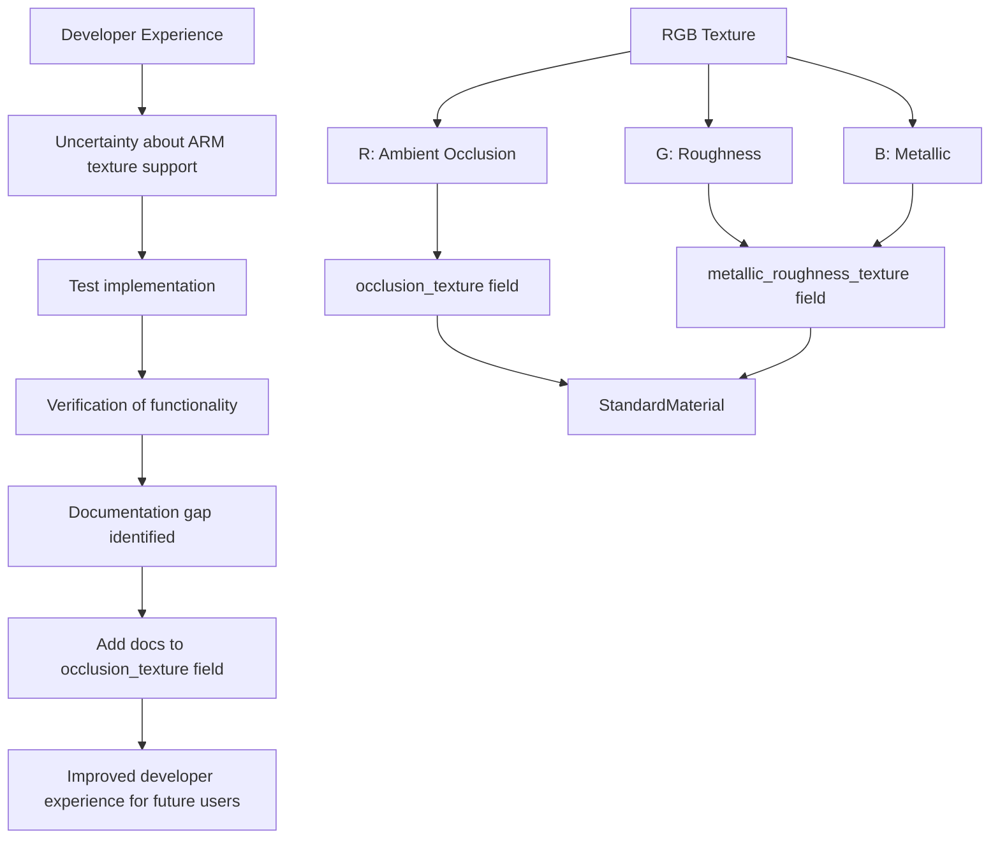

+++
title = "#23063 Add notes about using the R channel as the occlusion_texture"
date = "2026-02-20T00:00:00"
draft = false
template = "pull_request_page.html"
in_search_index = true

[taxonomies]
list_display = ["show"]

[extra]
current_language = "en"
available_languages = {"en" = { name = "English", url = "/pull_request/bevy/2026-02/pr-23063-en-20260220" }, "zh-cn" = { name = "中文", url = "/pull_request/bevy/2026-02/pr-23063-zh-cn-20260220" }}
labels = ["C-Docs", "A-Rendering", "D-Straightforward"]
+++

# Title
Add notes about using the R channel as the occlusion_texture

## Basic Information
- **Title**: Add notes about using the R channel as the occlusion_texture
- **PR Link**: https://github.com/bevyengine/bevy/pull/23063
- **Author**: janhohenheim
- **Status**: MERGED
- **Labels**: C-Docs, A-Rendering, S-Ready-For-Final-Review, D-Straightforward
- **Created**: 2026-02-19T22:14:20Z
- **Merged**: 2026-02-20T01:31:41Z
- **Merged By**: alice-i-cecile

## Description Translation
# Objective

- I wasn't sure if Bevy supported the common ARM-RGB encoding (r = AO, G = Roughness, B = Metallic). The docs weren't helpful here.

## Solution

- I set up a tiny test scene to make sure. Yes, Bevy works perfectly fine with that setup! Let's make it easier for future users by documenting it.
- This "Use the R channel for this texture" trick can also be used for other textures, like the clearcoat, but IME the most common thing is ambient occlusion, so I only added it there for now.

## Testing

- Local test project

## The Story of This Pull Request

When working with Physically Based Rendering (PBR) materials, a common pattern in game development is to pack multiple material properties into a single texture using different color channels. One widely used packing scheme is the ARM format, where:
- **R** channel stores Ambient Occlusion (AO)
- **G** channel stores Roughness  
- **B** channel stores Metallic

The PR author, janhohenheim, encountered a practical problem: while setting up PBR materials in Bevy, they wanted to use this ARM texture packing approach but couldn't find explicit documentation confirming whether Bevy's PBR implementation supported it. The existing documentation for the `StandardMaterial::occlusion_texture` field didn't mention channel usage or texture sharing patterns.

To resolve this uncertainty, the author took the pragmatic engineering approach of creating a minimal test project. This allowed them to verify empirically that Bevy's PBR shader does indeed correctly interpret the red channel of a texture as the occlusion value when using the ARM packing scheme. Once confirmed, they recognized this as a documentation gap that other developers would likely encounter.

The solution implemented is straightforward but valuable: adding clear documentation to the `occlusion_texture` field that explicitly:
1. States the common practice of using RGB textures with specific channel assignments
2. Explains how to implement this in Bevy (using the same image handle for both `occlusion_texture` and `metallic_roughness_texture`)
3. Provides context by mentioning that this is the standard setup used by glTF, linking to relevant Blender documentation

This documentation change serves as a form of "tribal knowledge" preservation. While the functionality already existed in the codebase, without explicit documentation, developers either need to discover it through experimentation (as the author did) or rely on community knowledge. By documenting this pattern directly in the code, the PR reduces the cognitive load for future developers and prevents redundant investigation.

The implementation is minimal - just five lines of documentation comments added to a single field. However, its impact is significant for developers working with PBR materials, especially those migrating from other engines or following common asset creation workflows. The PR author also notes that while this channel-sharing pattern could be applied to other material properties (like clearcoat), they focused on the most common use case for ambient occlusion to keep the change focused and avoid over-documenting less common patterns.

This PR demonstrates good documentation practices in action: identifying a knowledge gap through personal experience, verifying the technical details, and contributing that knowledge back to the project in a clear, concise manner that helps the entire community.

## Visual Representation



## Key Files Changed

**File:** `crates/bevy_pbr/src/pbr_material.rs`

**Changes:** Added documentation to the `occlusion_texture` field of the `StandardMaterial` struct to clarify that Bevy supports the common ARM texture packing format (Ambient Occlusion in R channel, Roughness in G channel, Metallic in B channel).

**Code Snippet:**
```rust
// File: crates/bevy_pbr/src/pbr_material.rs
// After the change (lines 424-434):
pub struct StandardMaterial {
    // ... other fields ...

    /// A tangent space normal map.
    ///
    /// A common way to create this is with a
    /// [`NormalMapPreprocess`](bevy_pbr::normal_map::NormalMapPreprocess) plugin
    /// that transforms a standard RGB normal map into a tangent space normal map.
    #[texture(6)]
    #[sampler(7)]
    #[dependency]
    pub normal_map_texture: Option<Handle<Image>>,
    /// A texture representing ambient occlusion, also known as "cavity."
    ///
    /// The material will be less lit in places where this texture is dark.
    /// This is similar to ambient occlusion, but built into the model.
    ///
    /// It is very common to use an RGB texture that uses the red channel for the [`StandardMaterial::occlusion_texture`],
    /// and the B and G channels for [`StandardMaterial::metallic_roughness_texture`].
    /// In such cases, use the same image handle for both fields.
    /// Notably, this is the setup used by [glTF](https://docs.blender.org/manual/en/latest/addons/import_export/scene_gltf2.html#baked-ambient-occlusion).
    #[texture(7)]
    #[sampler(8)]
    #[dependency]
    pub occlusion_texture: Option<Handle<Image>>,

    // ... more fields ...
}
```

**Why this change matters:**
The added documentation explicitly states that:
1. Bevy supports the ARM texture packing format (AO in R, Roughness in G, Metallic in B)
2. Developers should use the same image handle for both `occlusion_texture` and `metallic_roughness_texture` when using this format
3. This is the standard approach used by glTF, providing context and linking to external documentation

This eliminates ambiguity for developers and aligns with common industry practices for PBR material workflows.

## Further Reading

1. **Physically Based Rendering (PBR) Theory**: For understanding the fundamentals of PBR materials and why texture packing is used
   - [LearnOpenGL: Theory](https://learnopengl.com/PBR/Theory)
   - [Marmoset: PBR Theory](https://www.marmoset.co/posts/basic-theory-of-physically-based-rendering/)

2. **Texture Packing Techniques**: For more information on channel packing in game development
   - [GPU Optimization: Texture Channel Packing](https://developer.nvidia.com/gpugems/gpugems2/part-iv-image-oriented-computing/chapter-24-using-vertex-texture-fetch-ocean)
   - [Unity Documentation: Texture Channel Packing](https://docs.unity3d.com/Packages/com.unity.render-pipelines.high-definition@14.0/manual/Mask-Map-and-Detail-Map.html)

3. **glTF Material System**: For understanding the standard that Bevy's PBR implementation follows
   - [glTF 2.0 Specification: Materials](https://github.com/KhronosGroup/glTF/blob/main/specification/2.0/README.md#materials)
   - [Blender glTF Export Documentation](https://docs.blender.org/manual/en/latest/addons/import_export/scene_gltf2.html)

4. **Bevy PBR Documentation**: For context on Bevy's implementation
   - [Bevy Book: 3D Rendering](https://bevyengine.org/learn/book/3d-rendering/)
   - [Bevy Examples: PBR](https://github.com/bevyengine/bevy/tree/main/examples/3d)