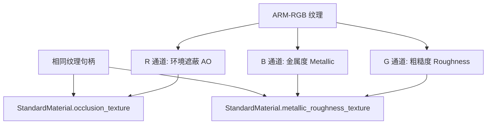

+++
title = "#23063 Add notes about using the R channel as the occlusion_texture"
date = "2026-02-20T00:00:00"
draft = false
template = "pull_request_page.html"
in_search_index = false

[extra]
current_language = "zh-cn"
available_languages = {"en" = { name = "English", url = "/pull_request/bevy/2026-02/pr-23063-en-20260220" }, "zh-cn" = { name = "中文", url = "/pull_request/bevy/2026-02/pr-23063-zh-cn-20260220" }}
+++

# Add notes about using the R channel as the occlusion_texture

## 基本信息
- **标题**: Add notes about using the R channel as the occlusion_texture
- **PR 链接**: https://github.com/bevyengine/bevy/pull/23063
- **作者**: janhohenheim
- **状态**: 已合并
- **标签**: C-Docs, A-Rendering, S-Ready-For-Final-Review, D-Straightforward
- **创建时间**: 2026-02-19T22:14:20Z
- **合并时间**: 2026-02-20T01:31:41Z
- **合并者**: alice-i-cecile

## 描述翻译
**目标**
- 我不确定 Bevy 是否支持常见的 ARM-RGB 编码（r = 环境遮蔽(AO)，G = 粗糙度(Roughness)，B = 金属度(Metallic)）。文档在这方面没有提供帮助。

**解决方案**
- 我建立了一个小型测试场景来确认。是的，Bevy 完全支持这种设置！让我们通过文档来帮助未来的用户。
- 这种"使用 R 通道作为这个纹理"的技巧也可以用于其他纹理，比如清漆层(clearcoat)，但根据我的经验，最常见的是环境遮蔽，所以我暂时只在那里添加了说明。

**测试**
- 本地测试项目

## 这个 PR 的故事

这个 PR 源于一个实际开发中遇到的困惑。当开发者 janhohenheim 在 Bevy 中使用 PBR（基于物理的渲染）材质时，遇到了一个常见的纹理打包模式：ARM-RGB 编码。在这种编码中，纹理的三个通道分别存储不同的材质属性：R 通道用于环境遮蔽(AO)，G 通道用于粗糙度(Roughness)，B 通道用于金属度(Metallic)。这种纹理打包技术在游戏开发中很常见，因为它可以节省纹理内存和采样开销。

然而，开发者发现 Bevy 的文档并没有明确说明是否支持这种模式。在现有的 `StandardMaterial` 结构中，有 `occlusion_texture` 和 `metallic_roughness_texture` 两个独立的字段，但没有说明它们是否可以共享同一个纹理资源。开发者不得不通过实际测试来验证这一点：建立一个测试场景，使用 ARM-RGB 编码的纹理，将同一个纹理句柄同时赋值给两个字段。

测试结果是积极的——Bevy 确实支持这种用法。这意味着开发者可以使用同一个纹理资源，让 GPU 着色器在采样时分别读取不同的通道来获取对应的材质属性。这不仅验证了一个常见的渲染实践在 Bevy 中的可行性，也揭示了一个文档缺失的问题。

基于这个发现，开发者决定添加文档说明来帮助未来的用户。这种文档改进属于"低风险、高价值"的类型：它不改变任何代码逻辑，只是提供信息，但可以节省其他开发者大量研究和测试的时间。

具体的实现很简单：在 `StandardMaterial` 结构体的 `occlusion_texture` 字段的文档注释中添加说明。这个说明清晰地表达了三个关键点：
1. 使用 RGB 纹理，其中 R 通道用于 `occlusion_texture`，B 和 G 通道用于 `metallic_roughness_texture` 是常见的做法
2. 在这种情况下，两个字段可以使用相同的图像句柄
3. 这种设置被 glTF 标准使用，提供了标准化参考

值得注意的是，开发者特别提到这个技巧也可以用于其他纹理（比如 clearcoat），但选择了只添加环境遮蔽的说明，因为这是最常见的使用场景。这种决策体现了实用的工程思维：解决最紧迫、最普遍的问题，而不是追求完美但可能过度复杂的解决方案。

从技术角度来看，这个 PR 揭示了 Bevy PBR 材质系统的一个设计特性：它支持纹理通道的灵活使用。这符合现代渲染引擎的常见模式，允许开发者根据性能需求选择纹理打包策略。ARM-RGB 编码不仅节省了纹理内存，还减少了纹理采样次数，这对性能敏感的应用尤其重要。

这个 PR 被快速合并（从创建到合并仅约 3 小时），标签表明它被认为是直接了当的文档改进。它不会引入任何破坏性变更，只是增加了清晰度，使 Bevy 的材质系统对新手开发者更加友好。

## 可视化表示



## 关键文件变更

**文件**: `crates/bevy_pbr/src/pbr_material.rs`

**变更描述**: 在 `StandardMaterial` 结构体的 `occlusion_texture` 字段文档中添加说明，解释 ARM-RGB 纹理编码的使用方法。

**变更前后对比**:
```rust
// 变更前:
#[doc = "
    ///
    /// The material will be less lit in places where this texture is dark.
    /// This is similar to ambient occlusion, but built into the model.
    "]
#[texture(7)]
#[sampler(8)]
#[dependency]
pub occlusion_texture: Option<Handle<Image>>,

// 变更后:
#[doc = "
    ///
    /// The material will be less lit in places where this texture is dark.
    /// This is similar to ambient occlusion, but built into the model.
    ///
    /// It is very common to use an RGB texture that uses the red channel for the [`StandardMaterial::occlusion_texture`],
    /// and the B and G channels for [`StandardMaterial::metallic_roughness_texture`].
    /// In such cases, use the same image handle for both fields.
    /// Notably, this is the setup used by [glTF](https://docs.blender.org/manual/en/latest/addons/import_export/scene_gltf2.html#baked-ambient-occlusion).
    "]
#[texture(7)]
#[sampler(8)]
#[dependency]
pub occlusion_texture: Option<Handle<Image>>,
```

**与 PR 目标的关系**: 这个变更直接解决了 PR 的目标——为常见的 ARM-RGB 纹理编码模式提供文档说明。通过在正确的字段文档中添加信息，开发者可以在查阅 API 文档时自然发现这个技巧。

## 进一步阅读

- [glTF 2.0 规范 - 材质](https://github.com/KhronosGroup/glTF/tree/main/specification/2.0#materials) - 了解标准 PBR 材质定义
- [Blender glTF 导出器文档](https://docs.blender.org/manual/en/latest/addons/import_export/scene_gltf2.html) - 查看实际的纹理打包实践
- [LearnOpenGL - PBR 理论](https://learnopengl.com/PBR/Theory) - 深入理解基于物理的渲染原理
- [Bevy PBR 材质文档](https://docs.rs/bevy_pbr/latest/bevy_pbr/struct.StandardMaterial.html) - 查看完整的 `StandardMaterial` API 文档

# 完整代码差异
diff --git a/crates/bevy_pbr/src/pbr_material.rs b/crates/bevy_pbr/src/pbr_material.rs
index 09e59bd05e39d..1fc266d2728dc 100644
--- a/crates/bevy_pbr/src/pbr_material.rs
+++ b/crates/bevy_pbr/src/pbr_material.rs
@@ -424,6 +424,11 @@ pub struct StandardMaterial {
     ///
     /// The material will be less lit in places where this texture is dark.
     /// This is similar to ambient occlusion, but built into the model.
+    ///
+    /// It is very common to use an RGB texture that uses the red channel for the [`StandardMaterial::occlusion_texture`],
+    /// and the B and G channels for [`StandardMaterial::metallic_roughness_texture`].
+    /// In such cases, use the same image handle for both fields.
+    /// Notably, this is the setup used by [glTF](https://docs.blender.org/manual/en/latest/addons/import_export/scene_gltf2.html#baked-ambient-occlusion).
     #[texture(7)]
     #[sampler(8)]
     #[dependency]