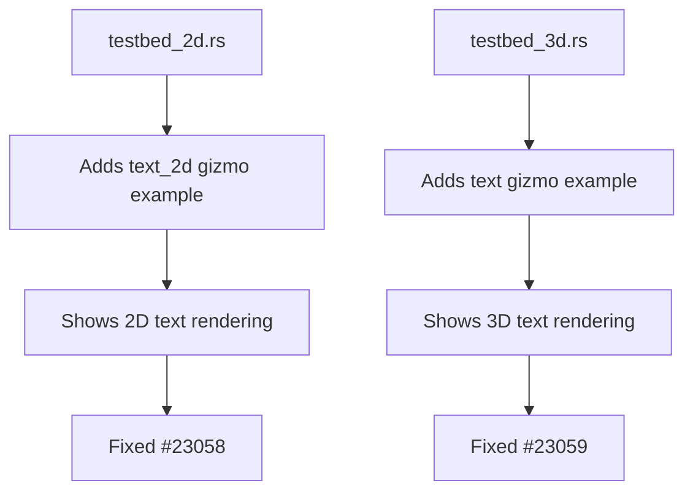

+++
title = "#23064 Adds text gizmos to testbeds"
date = "2026-02-20T00:00:00"
draft = false
template = "pull_request_page.html"
in_search_index = true

[taxonomies]
list_display = ["show"]

[extra]
current_language = "en"
available_languages = {"en" = { name = "English", url = "/pull_request/bevy/2026-02/pr-23064-en-20260220" }, "zh-cn" = { name = "中文", url = "/pull_request/bevy/2026-02/pr-23064-zh-cn-20260220" }}
labels = ["D-Trivial", "C-Testing", "A-Gizmos", "M-Deliberate-Rendering-Change"]
+++

# Title: Adds text gizmos to testbeds

## Basic Information
- **Title**: Adds text gizmos to testbeds
- **PR Link**: https://github.com/bevyengine/bevy/pull/23064
- **Author**: chintanbhatt2
- **Status**: MERGED
- **Labels**: D-Trivial, S-Ready-For-Final-Review, C-Testing, A-Gizmos, M-Deliberate-Rendering-Change
- **Created**: 2026-02-20T02:42:57Z
- **Merged**: 2026-02-20T06:16:04Z
- **Merged By**: alice-i-cecile

## Description Translation
# Objective

- Fixed both #23058 and #23059

## Solution

- Adds text gizmos to the 2D and 3D testbed examples

## Testing

Tested on Windows 11/Nvidia/Vulkan

---

## Showcase

<details>
  <summary>Click to view showcase</summary>

### testbed_2d


### testbed_3d


</details>

## The Story of This Pull Request

This PR addresses two related issues: #23058 and #23059. Both issues were gaps in the testbed examples where text gizmos were not being demonstrated. Testbeds in Bevy serve as comprehensive demonstration tools that showcase the engine's capabilities, particularly for debugging and visualization features like gizmos. When developers want to understand how to use text rendering with gizmos, they naturally look to these testbed examples for reference implementations.

The problem was straightforward: the 2D and 3D testbed examples included extensive demonstrations of various gizmo types (lines, circles, spheres, grids, etc.) but were missing examples of text gizmos. This created a documentation gap where developers couldn't easily find working examples of how to use the `text_2d` and `text` gizmo methods in their own projects.

The solution implemented is minimal and focused. In both the 2D and 3D testbed files, the developer added a single call to the appropriate text gizmo method within the existing `gizmos` module. The implementation follows the established pattern of the testbed examples - each gizmo type is demonstrated with specific parameters that make it clearly visible in the scene.

For the 2D testbed, the code adds a `text_2d` gizmo positioned at (-200, 0) with the label "text_2d gizmo", using a font size of 15 and white color. The text is centered (alignment at (0, 0)). This placement ensures the text doesn't overlap with other existing gizmos in the demonstration.

For the 3D testbed, the implementation is similar but uses the 3D `text` method instead. The text is positioned at (0, 1.5, 0) in world space, using a font size of 0.3 (appropriate for 3D scaling), and is also centered and white.

The engineering approach here is pragmatic. Rather than creating complex examples or extensive documentation, the developer opted for the most direct solution: adding working examples that demonstrate the API's basic usage. This follows the principle that good examples should show the common case clearly. The text labels are self-documenting - they literally say what they are ("text_2d gizmo" and "text gizmo"), which helps users identify what they're looking at in the testbed.

One technical consideration worth noting is the different parameter scales between 2D and 3D text gizmos. In 2D, the font size is in logical pixels (15), while in 3D, it's in world units (0.3). This reflects the different coordinate systems and scaling considerations between 2D and 3D rendering in Bevy. The examples correctly demonstrate these differences, which is important for users to understand.

The impact of this change is primarily educational. It makes the text gizmo functionality more discoverable and provides reference implementations that developers can copy and adapt. Since testbeds are often the first place developers look when learning how to use a feature, having complete examples reduces friction and potentially prevents issues from being opened in the future when users can't figure out how to use text gizmos.

## Visual Representation



## Key Files Changed

### 1. `examples/testbed/2d.rs` (+8/-0)
This file adds a text gizmo example to the 2D testbed. The change demonstrates how to use the `text_2d` method of the `Gizmos` trait in a 2D context.

```rust
// File: examples/testbed/2d.rs
// Added code:
gizmos.text_2d(
    Isometry2d::from_translation(Vec2::new(-200.0, 0.0)),
    "text_2d gizmo",
    15.,
    Vec2 { x: 0., y: 0. },
    Color::WHITE,
);
```

### 2. `examples/testbed/3d.rs` (+8/-0)
This file adds a text gizmo example to the 3D testbed. The change demonstrates how to use the `text` method of the `Gizmos` trait in a 3D context.

```rust
// File: examples/testbed/3d.rs
// Added code:
gizmos.text(
    Isometry3d::from_translation(Vec3::Y * 1.5),
    "text gizmo",
    0.3,
    Vec2 { x: 0., y: 0. },
    Color::WHITE,
);
```

## Further Reading

1. **Bevy Gizmos Documentation**: The official Bevy documentation on gizmos provides comprehensive details about the gizmo system and its capabilities.
2. **Bevy Examples Repository**: Other examples in the Bevy repository demonstrate more advanced uses of gizmos and text rendering.
3. **Coordinate Systems in Bevy**: Understanding the difference between 2D and 3D coordinate systems is crucial when working with text and other rendering primitives in different contexts.