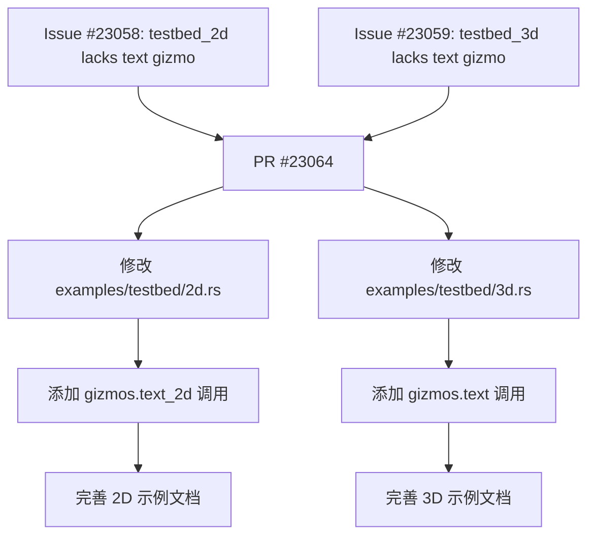

+++
title = "#23064 Adds text gizmos to testbeds"
date = "2026-02-20T00:00:00"
draft = false
template = "pull_request_page.html"
in_search_index = false

[extra]
current_language = "zh-cn"
available_languages = {"en" = { name = "English", url = "/pull_request/bevy/2026-02/pr-23064-en-20260220" }, "zh-cn" = { name = "中文", url = "/pull_request/bevy/2026-02/pr-23064-zh-cn-20260220" }}
+++

# Adds text gizmos to testbeds

## 基本信息
- **标题**: Adds text gizmos to testbeds
- **PR 链接**: https://github.com/bevyengine/bevy/pull/23064
- **作者**: chintanbhatt2
- **状态**: 已合并
- **标签**: D-简单, S-待最终审核, C-测试, A-Gizmos, M-有意渲染变更
- **创建时间**: 2026-02-20T02:42:57Z
- **合并时间**: 2026-02-20T06:16:04Z
- **合并者**: alice-i-cecile

## 描述翻译

# Objective (目标)

- 同时修复 #23058 和 #23059

## Solution (解决方案)

- 在 2D 和 3D 的 testbed（测试床）示例中添加文本 gizmos。

## Testing (测试)

已在 Windows 11/Nvidia/Vulkan 环境下测试。

---

## Showcase (效果展示)

<details>
  <summary>点击查看效果图</summary>

### testbed_2d


### testbed_3d


</details>

## 这个 Pull Request 的故事

这个 Pull Request 解决了一个在文档和示例上的缺口。用户可能在使用 Bevy 的 Gizmo API 绘制 2D 或 3D 文本时，难以找到直观的示例代码。虽然相关的 `text_2d` 和 `text` 方法已经存在于 API 中（属于 `Gizmos` 和 `Gizmos2d` 模块），但在官方的“测试床”示例中并没有展示它们的使用方法。这个测试床示例 (`testbed_2d` 和 `testbed_3d`) 是一个集中的演示场景，旨在展示 Bevy 中各种图形调试工具（gizmos）的功能。

因此，PR #23064 的目标非常明确：**完善示例**。它通过向两个关键的示例文件中添加几行代码，来演示如何调用 `text_2d` 和 `text` 方法。这是一个典型的“文档即代码”的实践，通过可运行的示例来补充 API 文档，从而提升开发者体验。

这个解决方案的实现极为直接。开发者没有修改任何引擎核心代码，也没有改变 API 的行为。他们只是扩展了现有的示例，在已有的 `gizmos` 模块内添加了对新 gizmo 类型的绘制调用。这使得 PR 的风险极低，因为它只影响示例程序的输出，而不会影响任何生产代码的逻辑。

从技术实现上看，添加到两个文件中的代码结构几乎对称。在 `testbed_2d.rs` 中，调用了 `gizmos.text_2d(...)`，传入一个二维等距变换（`Isometry2d`）来定位文本，以及字符串内容、字体大小、对齐方式和颜色。在 `testbed_3d.rs` 中，调用的是 `gizmos.text(...)`，传入三维等距变换（`Isometry3d`）和其他类似参数。这些调用被巧妙地放置在现有绘制其他形状（如线、球体、网格）的代码块附近，保持了示例代码的组织性。

这个 PR 的影响是积极的。它填补了示例的空白，使得开发者在查找如何绘制 3D 文本或 2D 场景中的文本调试信息时，能直接在官方的测试示例中找到参考。这降低了学习成本，并增强了 Gizmo 功能的可发现性。同时，由于改动仅限于示例，合并过程非常顺畅，没有引入任何向后兼容性问题或性能顾虑。

总结来说，这是一个高质量的维护性 PR。它遵循了“小即是美”的原则，专注于解决一个具体的、被明确报告的问题（两个 issue），并通过最小化的、清晰的代码更改达到了目的，同时附上了验证截图，确保了变更的有效性。

## 视觉表示



## 关键文件更改

列表中最显著的文件更改：
- `examples/testbed/2d.rs` (+8/-0)
- `examples/testbed/3d.rs` (+8/-0)

**1. `examples/testbed/2d.rs`**
   - **描述与原因**：此文件包含 2D 测试床示例。添加了 `text_2d` gizmo 的调用，以演示如何在 2D 场景中绘制调试文本。这解决了 issue #23058。
   - **代码修改**：
        ```rust
        // 文件：examples/testbed/2d.rs
        // 在已有的 gizmos 绘制循环中添加了以下代码块：
        gizmos.text_2d(
            Isometry2d::from_translation(Vec2::new(-200.0, 0.0)),
            "text_2d gizmo",
            15.,
            Vec2 { x: 0., y: 0. },
            Color::WHITE,
        );
        ```

**2. `examples/testbed/3d.rs`**
   - **描述与原因**：此文件包含 3D 测试床示例。添加了 `text` gizmo 的调用，以演示如何在 3D 场景中绘制调试文本。这解决了 issue #23059。
   - **代码修改**：
        ```rust
        // 文件：examples/testbed/3d.rs
        // 在已有的 gizmos 绘制循环中添加了以下代码块：
        gizmos.text(
            Isometry3d::from_translation(Vec3::Y * 1.5),
            "text gizmo",
            0.3,
            Vec2 { x: 0., y: 0. },
            Color::WHITE,
        );
        ```

## 延伸阅读

1.  **Bevy Gizmos 官方文档**: 了解 `Gizmos` 和 `Gizmos2d` 所有可用的绘制方法。
    - 链接: https://docs.rs/bevy/latest/bevy/gizmos/struct.Gizmos.html
    - 链接: https://docs.rs/bevy/latest/bevy/gizmos/struct.Gizmos2d.html
2.  **Bevy 示例库**: 查看其他使用 gizmos 的官方示例，例如 `gizmos` 和 `2d_gizmos`。
    - 链接: https://github.com/bevyengine/bevy/tree/main/examples
3.  **Issue #23058 & #23059**: 查看本 PR 所解决的具体问题的原始上下文。
    - 链接: https://github.com/bevyengine/bevy/issues/23058
    - 链接: https://github.com/bevyengine/bevy/issues/23059

# Full Code Diff

```
diff --git a/examples/testbed/2d.rs b/examples/testbed/2d.rs
index 573c42427bd2b..9f1ca518b26b1 100644
--- a/examples/testbed/2d.rs
+++ b/examples/testbed/2d.rs
@@ -395,6 +395,14 @@ mod gizmos {
             )
             .resolution(64);
 
+        gizmos.text_2d(
+            Isometry2d::from_translation(Vec2::new(-200.0, 0.0)),
+            "text_2d gizmo",
+            15.,
+            Vec2 { x: 0., y: 0. },
+            Color::WHITE,
+        );
+
         // 2d grids with all variations of outer edges on or off
         for i in 0..4 {
             let x = 200.0 * (1.0 + (i % 2) as f32);
diff --git a/examples/testbed/3d.rs b/examples/testbed/3d.rs
index c1f1152057af6..de8b0c6e28a09 100644
--- a/examples/testbed/3d.rs
+++ b/examples/testbed/3d.rs
@@ -358,6 +358,14 @@ mod gizmos {
             .sphere(Isometry3d::from_translation(Vec3::X * -3.5), 0.75, GREEN)
             .resolution(30_000 / 3);
 
+        gizmos.text(
+            Isometry3d::from_translation(Vec3::Y * 1.5),
+            "text gizmo",
+            0.3,
+            Vec2 { x: 0., y: 0. },
+            Color::WHITE,
+        );
+
         // 3d grids with all variations of outer edges on or off
         for i in 0..8 {
             let x = 1.5 * (i % 4) as f32;
```