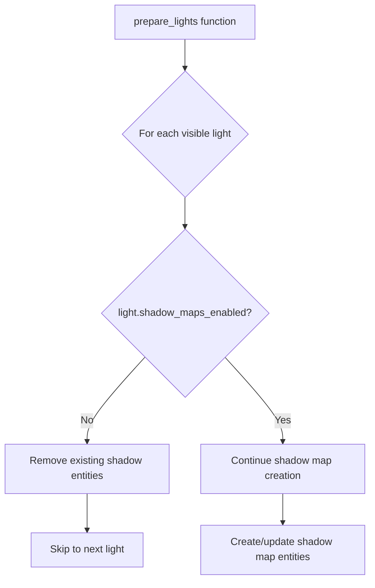

+++
title = "#23070 Restore shadow_maps_enabled check."
date = "2026-02-21T00:00:00"
draft = false
template = "pull_request_page.html"
in_search_index = true

[taxonomies]
list_display = ["show"]

[extra]
current_language = "en"
available_languages = {"en" = { name = "English", url = "/pull_request/bevy/2026-02/pr-23070-en-20260221" }, "zh-cn" = { name = "中文", url = "/pull_request/bevy/2026-02/pr-23070-zh-cn-20260221" }}
labels = ["C-Bug", "A-Rendering"]
+++

# Title

## Basic Information
- **Title**: Restore shadow_maps_enabled check.
- **PR Link**: https://github.com/bevyengine/bevy/pull/23070
- **Author**: tychedelia
- **Status**: MERGED
- **Labels**: C-Bug, A-Rendering, S-Ready-For-Final-Review
- **Created**: 2026-02-20T07:55:38Z
- **Merged**: 2026-02-21T00:55:39Z
- **Merged By**: mockersf

## Description Translation
Fixes `light_probe_blending` and `spherical_area_lights` examples.

## The Story of This Pull Request

### The Problem and Context
This PR addresses a regression in Bevy's rendering system where lights with shadow maps disabled were still having shadow map entities created for them. The issue manifested as broken examples (`light_probe_blending` and `spherical_area_lights`) that rely on lights without shadow maps.

In Bevy's Physically Based Rendering (PBR) system, when lights are prepared for rendering, the system processes visible lights and creates necessary shadow map entities for those that have shadows enabled. The `Light` component has a `shadow_maps_enabled` field that controls whether shadow maps should be generated for that light. However, a previous change removed the check for this flag during light preparation, causing the system to create shadow map entities for all lights regardless of their shadow configuration.

### The Solution Approach
The fix restores a previously removed conditional check that skips shadow map creation for lights where `shadow_maps_enabled` is false. This is a straightforward regression fix that adds back the missing logic in exactly one location.

The solution is minimal and targeted: it adds a check early in the light preparation loop to skip processing for lights without shadow maps enabled. When such lights are encountered, any existing shadow map entities are cleaned up and the light is skipped for shadow map creation.

### The Implementation
The implementation adds a simple conditional block in the `prepare_lights` function. Here's the key addition:

```rust
if !light.shadow_maps_enabled {
    if let Some(entities) = light_view_entities.remove(&entity) {
        despawn_entities(&mut commands, entities);
    }
    continue;
}
```

This code does three things:
1. Checks if shadow maps are disabled for the current light
2. If shadow map entities already exist (from a previous frame or state), removes them from tracking and despawns them
3. Skips the rest of the shadow map preparation logic for this light

The placement of this check is important - it comes after the light extraction but before any shadow map entity creation logic. This ensures that lights without shadow maps don't consume unnecessary resources or cause rendering issues.

### Technical Insights
The fix demonstrates an important pattern in graphics programming: early culling of unnecessary work. By checking `shadow_maps_enabled` at the beginning of the loop, we avoid:
- Unnecessary shadow map texture allocations
- Extra draw calls for shadow map rendering
- Potential GPU memory waste
- Possible rendering artifacts from unexpected shadow maps

The code also properly handles cleanup of existing entities through `light_view_entities.remove()` and `despawn_entities()`. This ensures that if a light's shadow configuration changes from enabled to disabled between frames, the old shadow map entities are properly cleaned up.

### The Impact
This fix resolves immediate issues in the affected examples and restores correct behavior for all lights configured without shadow maps. The change is performance-positive since it prevents unnecessary shadow map creation and rendering work for lights that don't need it.

From an architectural perspective, this reinforces the importance of respecting component configuration flags throughout the rendering pipeline. The `shadow_maps_enabled` flag exists for a reason - to give developers control over performance/quality tradeoffs - and the rendering system must honor these settings consistently.

## Visual Representation



## Key Files Changed

### `crates/bevy_pbr/src/render/light.rs` (+7/-0)

**What changed**: Added a check for `shadow_maps_enabled` in the `prepare_lights` function to skip shadow map creation for lights that don't have shadows enabled.

**Key modifications**:
```rust
// The added code block in the prepare_lights function:
if !light.shadow_maps_enabled {
    if let Some(entities) = light_view_entities.remove(&entity) {
        despawn_entities(&mut commands, entities);
    }
    continue;
}
```

**How it relates to the PR purpose**: This single conditional block fixes the regression by preventing shadow map entity creation for lights with `shadow_maps_enabled = false`. The cleanup of existing entities ensures proper state management when lights change their shadow configuration.

## Further Reading

1. [Bevy Rendering Documentation](https://docs.rs/bevy_pbr/latest/bevy_pbr/) - For understanding Bevy's PBR rendering pipeline
2. [Shadow Mapping Techniques](https://learnopengl.com/Advanced-Lighting/Shadows/Shadow-Mapping) - Background on shadow mapping in computer graphics
3. [Bevy Component Documentation](https://docs.rs/bevy/latest/bevy/reflect/trait.Component.html) - Understanding how components work in Bevy's ECS
4. [Graphics Performance Optimization](https://developer.nvidia.com/blog/opengl-rendering-pipeline-performance/) - Techniques for optimizing rendering pipelines