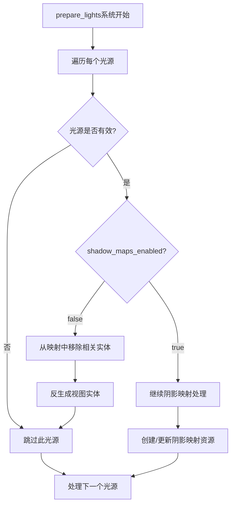

+++
title = "#23070 Restore shadow_maps_enabled check."
date = "2026-02-21T00:00:00"
draft = false
template = "pull_request_page.html"
in_search_index = false

[extra]
current_language = "zh-cn"
available_languages = {"en" = { name = "English", url = "/pull_request/bevy/2026-02/pr-23070-en-20260221" }, "zh-cn" = { name = "中文", url = "/pull_request/bevy/2026-02/pr-23070-zh-cn-20260221" }}
+++

# Title

## 基本信息
- **标题**: Restore shadow_maps_enabled check.
- **PR链接**: https://github.com/bevyengine/bevy/pull/23070
- **作者**: tychedelia
- **状态**: 已合并
- **标签**: C-Bug, A-Rendering, S-Ready-For-Final-Review
- **创建时间**: 2026-02-20T07:55:38Z
- **合并时间**: 2026-02-21T00:55:39Z
- **合并者**: mockersf

## 描述翻译
修复 `light_probe_blending` 和 `spherical_area_lights` 示例。

## 这个Pull Request的故事

### 问题与背景
这个PR解决的问题相对直接。在Bevy的PBR渲染系统中，光源的阴影映射是一个可选特性。每个光源实体都有一个`shadow_maps_enabled`标志，用于控制是否为此光源生成阴影映射。在某些情况下，开发者可能希望禁用特定光源的阴影映射以节省性能。

问题出现在`prepare_lights`函数中，这个函数负责在渲染前准备光源数据。具体来说，当处理一个光源时，即使`shadow_maps_enabled`设置为false，系统仍会尝试为该光源创建阴影映射所需的视图实体。这导致了两个示例（`light_probe_blending`和`spherical_area_lights`）出现异常行为，因为在这些示例中某些光源的阴影映射被禁用了。

从技术角度看，这是之前重构时引入的回归问题。检查`shadow_maps_enabled`的逻辑被意外移除，导致系统为所有光源都创建阴影映射实体，无论其配置如何。这不仅造成了不必要的资源消耗，还在某些配置下引发了运行时错误。

### 解决方案方法
解决方案是恢复对`shadow_maps_enabled`标志的检查。当发现光源的阴影映射被禁用时，系统需要：
1. 从`light_view_entities`映射中移除与该光源关联的实体
2. 反生成（despawn）这些视图实体
3. 跳过该光源的后续阴影映射处理流程

这种方法确保系统行为与光源配置一致，避免了为禁用阴影的光源创建不必要的渲染资源。从架构角度看，这是在渲染准备阶段进行的早期过滤，遵循"尽早失败"的原则，避免了后续不必要的处理开销。

### 具体实现
实现集中在`crates/bevy_pbr/src/render/light.rs`文件的`prepare_lights`函数中。在检查光源类型和提取器状态后，代码添加了一个对`light.shadow_maps_enabled`的条件检查。

关键实现细节：
```rust
if !light.shadow_maps_enabled {
    if let Some(entities) = light_view_entities.remove(&entity) {
        despawn_entities(&mut commands, entities);
    }
    continue;
}
```

这段代码执行以下逻辑：
- 如果光源的阴影映射被禁用（`!light.shadow_maps_enabled`）
- 从`light_view_entities`映射中尝试移除该光源对应的实体集合
- 如果存在这样的实体集合，通过`despawn_entities`函数销毁它们
- 使用`continue`跳过该光源的剩余处理流程

这个修改确保了阴影映射处理管道只对启用阴影的光源进行操作。`despawn_entities`函数调用是必要的，因为它清理了之前可能为该光源创建的视图实体，防止资源泄漏。

### 技术洞察
这个修复涉及几个重要的技术考虑：

1. **资源生命周期管理**：当光源配置改变时，必须正确清理之前创建的渲染资源。`despawn_entities`确保视图实体被正确销毁，避免孤儿实体积累。

2. **条件渲染优化**：通过在准备阶段早期跳过禁用阴影的光源，系统避免了：
   - 不必要的实体创建和组件分配
   - GPU资源的无效分配
   - 渲染图中的不必要节点

3. **配置一致性**：渲染系统必须尊重用户通过组件设置的配置。`shadow_maps_enabled`是`PointLight`和`DirectionalLight`等组件的一个字段，系统必须根据这个字段的值调整行为。

4. **错误恢复策略**：当检测到光源不应有阴影映射时，代码不仅跳过当前帧的处理，还清理了之前可能创建的残留实体。这确保了系统能从不一致的状态中恢复。

### 影响
这个修复带来了以下具体改进：

1. **修复示例运行**：`light_probe_blending`和`spherical_area_lights`示例现在可以正常运行，因为它们包含禁用阴影映射的光源配置。

2. **资源使用优化**：系统不再为禁用阴影的光源分配阴影映射所需的GPU和内存资源，这对性能有积极影响，特别是在包含多个禁用阴影的光源场景中。

3. **架构清晰性**：恢复这个检查使代码行为更符合预期，提高了系统的可维护性和可预测性。

4. **防止潜在错误**：避免为禁用阴影的光源创建阴影映射实体，防止了可能出现的渲染错误或不一致状态。

技术层面上，这个PR展示了在渲染系统中正确处理条件性功能的重要性，以及如何通过早期过滤来优化资源使用。它也强调了在重构后保持所有条件检查完整性的必要性。

## 视觉表示



## 关键文件更改

### 文件: `crates/bevy_pbr/src/render/light.rs`

**修改说明**: 在`prepare_lights`函数中添加了对`shadow_maps_enabled`标志的检查，当光源禁用阴影映射时，清理相关的视图实体并跳过后续处理。

**修改前后对比**:
```rust
// 修改前 (相关部分):
// 在检查光源类型后直接继续处理

// 修改后:
if !light.shadow_maps_enabled {
    if let Some(entities) = light_view_entities.remove(&entity) {
        despawn_entities(&mut commands, entities);
    }
    continue;
}
```

**与PR目的的关系**: 这个修改直接解决了问题，确保系统不为禁用阴影映射的光源创建阴影映射资源，修复了相关示例的运行问题。

## 进一步阅读

1. **Bevy渲染架构**:
   - [Bevy PBR渲染指南](https://bevyengine.org/learn/book/rendering/pbr/) - 了解Bevy的PBR渲染系统如何工作
   - [Bevy光照系统文档](https://docs.rs/bevy_pbr/latest/bevy_pbr/) - 深入理解光源和阴影映射的实现

2. **条件渲染优化**:
   - [早期裁剪(Early Culling)技术](https://en.wikipedia.org/wiki/Hidden-surface_determination#Viewing-frustum_culling) - 了解渲染中条件跳过的各种技术
   - [GPU资源管理最佳实践](https://developer.nvidia.com/blog/introduction-gpu-resource-management/) - 学习高效管理GPU资源的方法

3. **实体组件系统(ECS)模式**:
   - [Bevy ECS指南](https://bevyengine.org/learn/book/ecs/) - 理解Bevy如何组织渲染实体和组件
   - [数据驱动的渲染架构](https://www.gamedeveloper.com/programming/data-driven-rendering-architecture) - 探索现代游戏引擎的渲染架构设计

这个PR虽然改动不大，但体现了在复杂渲染系统中正确处理配置和资源生命周期的重要性。它展示了如何通过简单的条件检查避免不必要的处理，同时确保系统状态的一致性。