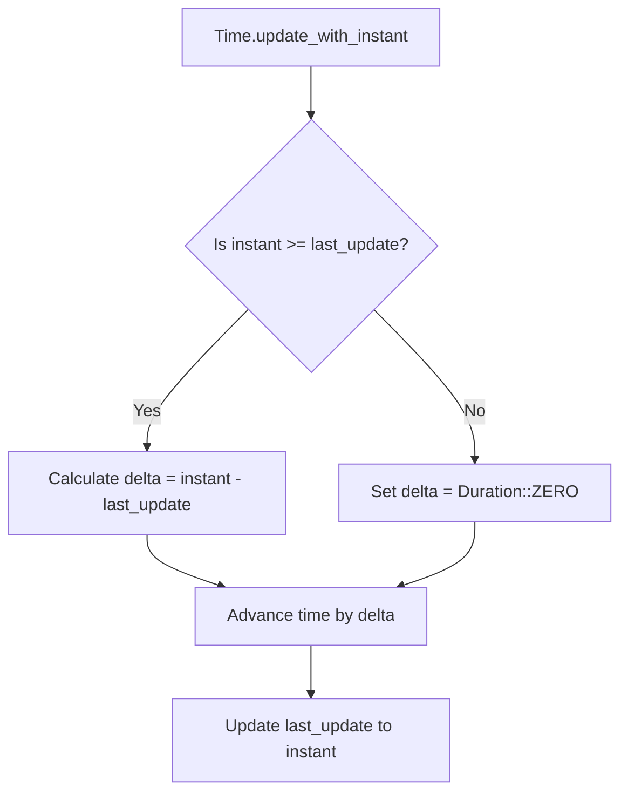

+++
title = "#23073 Panic fail-safe in real.rs during non-monotonic clock updates"
date = "2026-02-24T00:00:00"
draft = false
template = "pull_request_page.html"
in_search_index = true

[taxonomies]
list_display = ["show"]

[extra]
current_language = "en"
available_languages = {"en" = { name = "English", url = "/pull_request/bevy/2026-02/pr-23073-en-20260224" }, "zh-cn" = { name = "中文", url = "/pull_request/bevy/2026-02/pr-23073-zh-cn-20260224" }}
labels = ["C-Bug", "P-Crash", "A-Time", "D-Straightforward"]
+++

# Panic fail-safe in real.rs during non-monotonic clock updates

## Basic Information
- **Title**: Panic fail-safe in real.rs during non-monotonic clock updates
- **PR Link**: https://github.com/bevyengine/bevy/pull/23073
- **Author**: fcarvajalbrown
- **Status**: MERGED
- **Labels**: C-Bug, P-Crash, S-Ready-For-Final-Review, A-Time, D-Straightforward
- **Created**: 2026-02-20T11:05:15Z
- **Merged**: 2026-02-24T01:50:21Z
- **Merged By**: alice-i-cecile

## Description Translation
# Objective

Replaces the panicking subtraction in `update_with_instant` with a saturating alternative. Although `Instant` is generally monotonic, system-level clock jitter or manual mocking in tests may occasionally cause a backward time jump. The use of `saturating_duration_since` ensures that these edge cases produce a safe `Duration::ZERO` instead of a panic.

## Solution

In `bevy_time/src/real.rs`, changed the delta calculation to `instant.saturating_duration_since(last_update)` instead of `instant - last_update`.

## Testing

- Used `cargo test -p bevy_time` to ensure that all existing unit tests are still passing.

- Verified that all crate doctests compile and execute successfully.

- Manually tested that passing a past `Instant` is no longer a panic.

---

## The Story of This Pull Request

This pull request addresses a subtle but important edge case in Bevy's time system. The issue occurs in the `Time<Real>` implementation, which tracks real-world time progression for game updates. The core problem was that the code assumed system clocks would always move forward monotonically, but real-world systems don't always guarantee this behavior.

The `update_with_instant` method calculates the time delta between the current instant and the last recorded update. Originally, this used the subtraction operator (`instant - last_update`), which panics if `instant` is earlier than `last_update` (i.e., if time appears to move backward). While Rust's `Instant` type is designed to be monotonic, there are practical scenarios where this assumption breaks down.

System-level clock adjustments are one source of this issue. When the system clock jumps backward due to NTP synchronization or manual adjustments, `Instant` values can appear to go backward relative to each other. Another common scenario is in testing environments where developers manually mock time values for unit tests. In both cases, the panic would crash the application unexpectedly.

The solution implements a defensive programming approach by replacing the panicking subtraction with `instant.saturating_duration_since(last_update)`. This method returns `Duration::ZERO` when `instant` is earlier than `last_update`, effectively ignoring backward time jumps. This is a reasonable fallback because:
1. A zero delta means no time progression, which maintains game logic consistency
2. It prevents crashes in edge cases while preserving normal functionality
3. The next valid forward time progression will resume normal operation

The implementation change is minimal but significant. The `saturating_duration_since` method was introduced in Rust 1.66.0, and Bevy already requires a newer version, so there's no compatibility concern. This approach follows the principle of being conservative in what you accept (tolerating minor time anomalies) while being precise in what you produce (properly handling valid time progression).

Performance impact is negligible. The `saturating_duration_since` method has essentially the same cost as the subtraction operator, with just an additional branch check. Since backward time jumps should be rare exceptions rather than common occurrences, this doesn't affect normal performance.

The testing approach was comprehensive yet straightforward. Existing tests continue to pass, confirming backward compatibility. Manual testing verified the specific failure case no longer triggers a panic. This demonstrates the fix works while maintaining all existing functionality.

This change represents good engineering practice for handling edge cases in time-sensitive systems. It acknowledges that real-world systems have imperfections and provides a graceful degradation path rather than a hard failure. The zero-duration fallback is particularly appropriate for game engines, where missing a frame of time progression is generally preferable to crashing the entire application.

## Visual Representation



## Key Files Changed

### `crates/bevy_time/src/real.rs`

This file contains the `Time<Real>` implementation which manages real-time progression. The change replaces a panicking time delta calculation with a safe alternative that handles backward time jumps gracefully.

**Before:**
```rust
let delta = instant - last_update;
```

**After:**
```rust
let delta = instant.saturating_duration_since(last_update);
```

The change is a one-line substitution that addresses the core issue. The `saturating_duration_since` method was chosen over other alternatives like `checked_duration_since` (which returns `None`) because a zero duration is the most sensible fallback for game time progression when time appears to move backward.

## Further Reading

1. **Rust std::time::Instant documentation** - Details on `Instant` monotonic guarantees and available methods
2. **Rust RFC 3128: I/O Safety** - Background on Rust's approach to system interface safety
3. **Game Engine Architecture by Jason Gregory** - Discusses time management in game engines
4. **Defensive Programming Techniques** - General approaches for handling edge cases and system imperfections
5. **Bevy Time System Documentation** - Context on how time is managed within the Bevy engine