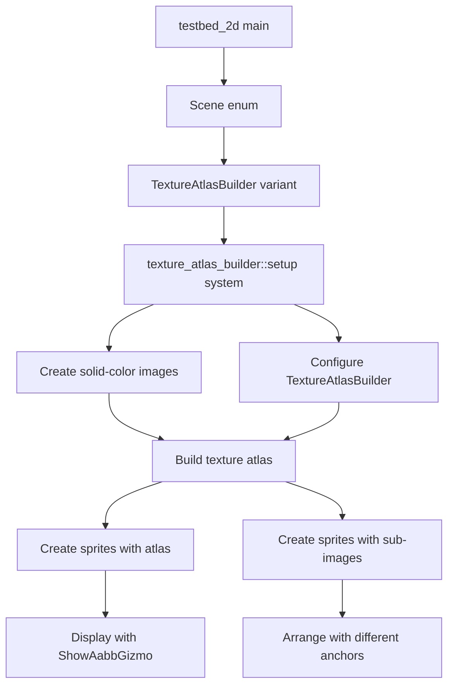

+++
title = "#23074 `testbed_2d` texture atlas builder scene"
date = "2026-02-24T00:00:00"
draft = false
template = "pull_request_page.html"
in_search_index = true

[taxonomies]
list_display = ["show"]

[extra]
current_language = "en"
available_languages = {"en" = { name = "English", url = "/pull_request/bevy/2026-02/pr-23074-en-20260224" }, "zh-cn" = { name = "中文", url = "/pull_request/bevy/2026-02/pr-23074-zh-cn-20260224" }}
labels = ["A-Rendering", "C-Examples", "C-Testing", "D-Straightforward"]
+++

# Title

## Basic Information
- **Title**: `testbed_2d` texture atlas builder scene
- **PR Link**: https://github.com/bevyengine/bevy/pull/23074
- **Author**: ickshonpe
- **Status**: MERGED
- **Labels**: A-Rendering, C-Examples, C-Testing, D-Straightforward, S-Ready-For-Final-Review
- **Created**: 2026-02-20T11:17:30Z
- **Merged**: 2026-02-24T01:58:40Z
- **Merged By**: alice-i-cecile

## Description Translation
The PR description is already in English:

# Objective

Add a scene displaying the output from `TextureAtlasBuilder`.

## Solution

Add a scene showing the atlases textures and padding and how it affects the sub images when they are drawn.

## Testing

```
cargo run --example testbed_2d -- textureatlasbuilder
```

## The Story of This Pull Request

This PR adds a new demonstration scene to Bevy's 2D testbed example that visualizes the behavior of `TextureAtlasBuilder`. The primary motivation was to provide a clear, interactive way for developers to understand how texture atlases are constructed, particularly how padding affects sprite rendering.

The `testbed_2d` example serves as a comprehensive demonstration tool for Bevy's 2D rendering capabilities. Prior to this change, it included scenes for shapes, text, sprites, sprite slicing, and gizmos, but lacked a dedicated scene for texture atlas construction. The `TextureAtlasBuilder` is a key utility in Bevy's 2D rendering pipeline that packs multiple textures into a single atlas texture to improve rendering performance by reducing draw calls.

The implementation approach is straightforward: add a new scene variant to the existing testbed structure and implement a setup function that creates visual examples. The developer chose to demonstrate two key scenarios: texture atlases with zero padding and with 2-pixel padding. This choice effectively shows how padding affects sprite rendering, particularly when using texture filtering.

The setup function creates four solid-color images (red, green, blue, and yellow) of 28×28 pixels each. These are packed into a 64×64 texture atlas using `TextureAtlasBuilder`. The code demonstrates several technical details:

1. **Texture creation**: Four solid-color images are generated programmatically using `Image::new_fill()`.
2. **Atlas construction**: The `TextureAtlasBuilder` is configured with specific padding and size constraints.
3. **Texture filtering**: Two versions of each atlas are created - one with linear filtering (default) and one with nearest-neighbor filtering. This is important because padding artifacts are more visible with linear filtering.
4. **Sprite rendering**: The atlas texture is displayed as a large sprite, and each sub-image is rendered as individual sprites using texture atlas coordinates.

A key insight in this implementation is the use of different sprite anchors (bottom-right, bottom-left, top-left, top-right) for the four sub-images. This creates a visually interesting arrangement where the sprites form a 2×2 grid below the main atlas display. The positioning is calculated using `anchor.as_vec()` to offset each sprite based on its anchor point.

The impact of this PR is primarily educational. It provides developers with a concrete reference implementation for using `TextureAtlasBuilder` and demonstrates important concepts like texture padding and filtering. The scene can be particularly helpful for debugging texture atlas issues or understanding how to properly configure atlases for different use cases.

One technical detail worth noting is the use of `ShowAabbGizmo::default()` on the main atlas sprite. This draws a bounding box around the atlas, making its boundaries clearly visible in the scene. This is a small but effective touch that enhances the educational value of the example.

## Visual Representation



## Key Files Changed

### `examples/testbed/2d.rs` (+119/-1)

This file was modified to add a new scene for demonstrating `TextureAtlasBuilder`. The changes include:

1. **Scene registration**: Added the new scene to the app builder
2. **Enum extension**: Added `TextureAtlasBuilder` variant to the `Scene` enum
3. **Scene cycling**: Updated the `Next` implementation to include the new scene in the cycle
4. **New module**: Added a complete `texture_atlas_builder` module with setup function

**Key changes in code:**

```rust
// Before (in main function):
.add_systems(OnEnter(Scene::Gizmos), gizmos::setup)
.add_systems(Update, switch_scene)
.add_systems(Update, gizmos::draw_gizmos.run_if(in_state(Scene::Gizmos)));

// After:
.add_systems(OnEnter(Scene::Gizmos), gizmos::setup)
.add_systems(
    OnEnter(Scene::TextureAtlasBuilder),
    texture_atlas_builder::setup,
)
.add_systems(Update, switch_scene)
.add_systems(Update, gizmos::draw_gizmos.run_if(in_state(Scene::Gizmos)));
```

```rust
// Before (Scene enum):
enum Scene {
    Shapes,
    Text,
    Sprite,
    SpriteSlicing,
    Gizmos,
}

// After:
enum Scene {
    Shapes,
    Text,
    Sprite,
    SpriteSlicing,
    Gizmos,
    TextureAtlasBuilder,
}
```

```rust
// Before (Next implementation for Scene):
impl Next for Scene {
    fn next(&self) -> Self {
        match self {
            Scene::Shapes => Scene::Text,
            Scene::Text => Scene::Sprite,
            Scene::Sprite => Scene::SpriteSlicing,
            Scene::SpriteSlicing => Scene::Gizmos,
            Scene::Gizmos => Scene::Shapes,
        }
    }
}

// After:
impl Next for Scene {
    fn next(&self) -> Self {
        match self {
            Scene::Shapes => Scene::Text,
            Scene::Text => Scene::Sprite,
            Scene::Sprite => Scene::SpriteSlicing,
            Scene::SpriteSlicing => Scene::Gizmos,
            Scene::Gizmos => Scene::TextureAtlasBuilder,
            Scene::TextureAtlasBuilder => Scene::Shapes,
        }
    }
}
```

The new `texture_atlas_builder` module demonstrates several important concepts:
- Creating solid-color textures programmatically
- Using `TextureAtlasBuilder` with padding
- Creating both linear and nearest-neighbor filtered versions of textures
- Rendering sprites using texture atlas coordinates
- Positioning sprites using different anchor points

## Further Reading

1. **Bevy Texture Atlas Documentation**: For understanding the `TextureAtlasBuilder` API and related types
2. **Texture Filtering**: Information on linear vs. nearest-neighbor filtering and when to use each
3. **Sprite Batching**: How texture atlases improve rendering performance by reducing draw calls
4. **UV Coordinates**: Understanding how texture coordinates work in 2D rendering
5. **Bevy ECS Patterns**: The example demonstrates common Bevy patterns like system setup and component spawning