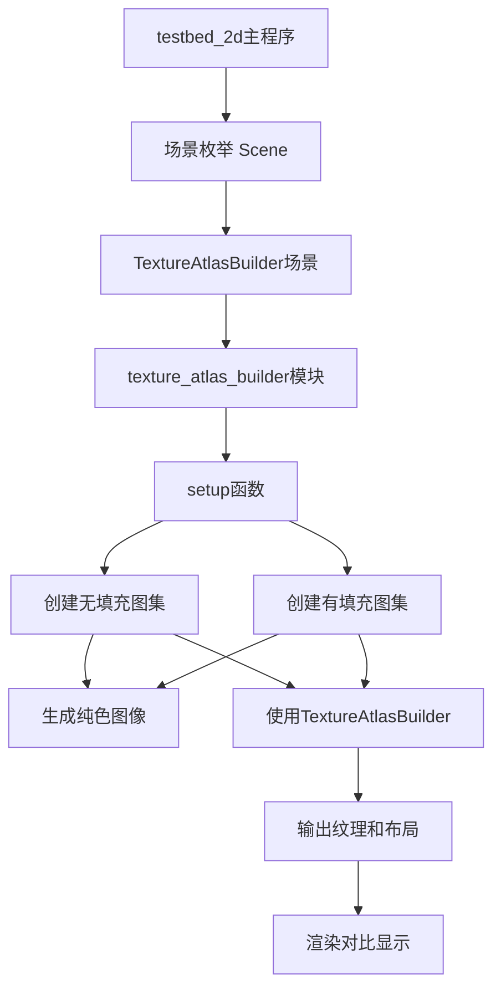

+++
title = "#23074 `testbed_2d` texture atlas builder scene"
date = "2026-02-24T00:00:00"
draft = false
template = "pull_request_page.html"
in_search_index = false

[extra]
current_language = "zh-cn"
available_languages = {"en" = { name = "English", url = "/pull_request/bevy/2026-02/pr-23074-en-20260224" }, "zh-cn" = { name = "中文", url = "/pull_request/bevy/2026-02/pr-23074-zh-cn-20260224" }}
labels = ["A-Rendering", "C-Examples", "C-Testing", "D-Straightforward"]
+++

# Title
`testbed_2d` texture atlas builder scene

## Basic Information
- **Title**: `testbed_2d` texture atlas builder scene
- **PR Link**: https://github.com/bevyengine/bevy/pull/23074
- **Author**: ickshonpe
- **Status**: MERGED
- **Labels**: A-Rendering, C-Examples, C-Testing, D-Straightforward, S-Ready-For-Final-Review
- **Created**: 2026-02-20T11:17:30Z
- **Merged**: 2026-02-24T01:58:40Z
- **Merged By**: alice-i-cecile

## Description Translation
添加一个展示`TextureAtlasBuilder`输出的场景。

## 解决方案

添加一个展示纹理图集纹理及其填充(padding)的场景，展示绘制子图像时如何影响它们。

## 测试

```
cargo run --example testbed_2d -- textureatlasbuilder
```

## The Story of This Pull Request

这个PR为Bevy的`testbed_2d`示例添加了一个新的场景，专门用于演示`TextureAtlasBuilder`的功能。`TextureAtlasBuilder`是Bevy中一个用于将多个小纹理组合成单个大纹理的工具，这对于优化渲染性能至关重要，因为它减少了渲染调用次数。

**问题与背景**：
在实际的2D游戏开发中，处理大量小纹理时，如果每个纹理都单独提交渲染，会造成大量的GPU状态切换和绘制调用。纹理图集(texture atlas)技术通过将多个小纹理打包到一个大纹理中来解决这个问题。Bevy的`TextureAtlasBuilder`提供了自动化的图集构建功能，但开发者需要一个直观的方式来理解其行为，特别是填充(padding)对最终结果的影响。

**解决方案方法**：
开发者选择在现有的`testbed_2d`示例中添加一个新的场景。这个选择是合理的，因为`testbed_2d`已经是一个展示各种2D功能的示例应用，添加新的场景可以保持代码组织的一致性。新场景需要直观展示有填充和无填充两种情况下的图集效果。

**实现细节**：
新增的`texture_atlas_builder`模块创建了两个图集进行对比：一个没有填充(padding)，另一个有2像素的填充。每个图集包含四个28×28像素的纯色图像（红、绿、蓝、黄）。图集总大小为64×64像素，这意味着四个28×28的图像（每个784像素）加上填充后能够刚好适应64×64（4096像素）的空间。

关键的技术细节在于填充是如何工作的：
- 没有填充时，图像在图集中紧密排列
- 有填充时，图像之间会有间隔，这可以防止纹理采样时出现边缘混合(bleeding)问题

代码展示了如何正确使用`TextureAtlasBuilder` API：
```rust
let mut texture_atlas_builder = TextureAtlasBuilder::default();
texture_atlas_builder
    .initial_size(ATLAS_SIZE)
    .max_size(ATLAS_SIZE)
    .padding(padding);
for image in &images {
    texture_atlas_builder.add_texture(None, image);
}
```

构建完成后，代码创建了两个版本的图集纹理：一个使用线性采样（默认），另一个使用最近邻采样。最近邻采样版本用于显示放大的图集，保持像素化外观，便于开发者观察细节。

**技术洞察**：
这个实现展示了几个重要的概念：
1. **纹理图集构建流程**：如何从多个独立图像构建图集
2. **填充的重要性**：填充防止了纹理边缘混合，这在旋转、缩放或使用特定纹理过滤时特别重要
3. **纹理采样模式**：不同采样模式对最终渲染效果的影响
4. **锚点系统**：Bevy的锚点系统如何与图集配合工作

场景中还使用了`ShowAabbGizmo`来显示图集的边界框，这提供了额外的视觉参考。

**影响**：
这个示例场景为Bevy开发者提供了一个重要的学习工具。通过可视化对比，开发者可以更容易地理解：
- 填充如何影响图集布局
- 图集中的子图像如何被访问和使用
- 不同的纹理采样模式如何影响最终渲染

这对于优化2D游戏性能至关重要，因为正确的图集使用可以显著减少绘制调用数量。

## Visual Representation



## Key Files Changed

### `examples/testbed/2d.rs` (+119/-1)

这是唯一的修改文件，添加了一个新的场景到现有的`testbed_2d`示例中。

**主要修改：**
1. **场景枚举扩展**：在`Scene`枚举中添加了`TextureAtlasBuilder`变体
2. **场景切换逻辑更新**：更新了`Next` trait的实现，将新场景加入循环
3. **系统注册**：在main函数中注册新场景的setup系统
4. **新模块实现**：添加了`texture_atlas_builder`模块及其`setup`函数

**代码示例：**
```rust
// 在Scene枚举中添加新变体
enum Scene {
    // ... 其他变体
    TextureAtlasBuilder,
}

// 更新场景切换逻辑
impl Next for Scene {
    fn next(&self) -> Self {
        match self {
            // ... 其他匹配
            Scene::Gizmos => Scene::TextureAtlasBuilder,
            Scene::TextureAtlasBuilder => Scene::Shapes,
        }
    }
}

// 在main函数中注册系统
.add_systems(
    OnEnter(Scene::TextureAtlasBuilder),
    texture_atlas_builder::setup,
)

// 新模块的实现
mod texture_atlas_builder {
    use bevy::{
        asset::RenderAssetUsages,
        image::ImageSampler,
        prelude::*,
        render::render_resource::{Extent3d, TextureDimension, TextureFormat},
        sprite::Anchor,
    };
    
    // 常量定义
    const ATLAS_SIZE: UVec2 = UVec2::splat(64);
    const IMAGE_SIZE: UVec2 = UVec2::splat(28);
    const PADDING_SIZE: UVec2 = UVec2::splat(2);
    const ATLAS_SCALE: f32 = 4.;
    const IMAGE_SCALE: f32 = 4.;
    
    pub fn setup(
        mut commands: Commands,
        mut textures: ResMut<Assets<Image>>,
        mut texture_atlases: ResMut<Assets<TextureAtlasLayout>>,
    ) {
        // ... 实现细节
    }
}
```

这些修改与PR的整体目标完全一致：创建一个展示`TextureAtlasBuilder`功能的场景，帮助开发者理解图集构建和填充的效果。

## Further Reading

1. **Bevy官方文档 - TextureAtlasBuilder**: 了解API的详细使用方法
2. **纹理图集最佳实践**: 学习游戏开发中纹理打包的最佳实践
3. **GPU渲染优化**: 理解纹理图集如何减少绘制调用并提高性能
4. **纹理采样和过滤**: 深入了解不同采样模式（如最近邻vs双线性）的影响
5. **Bevy的ECS架构**: 理解示例中使用的Commands、Resources和组件系统

# Full Code Diff
```diff
diff --git a/examples/testbed/2d.rs b/examples/testbed/2d.rs
index 9f1ca518b26b1..1247ee07e0ac9 100644
--- a/examples/testbed/2d.rs
+++ b/examples/testbed/2d.rs
@@ -30,6 +30,10 @@ fn main() {
         .add_systems(OnEnter(Scene::Sprite), sprite::setup)
         .add_systems(OnEnter(Scene::SpriteSlicing), sprite_slicing::setup)
         .add_systems(OnEnter(Scene::Gizmos), gizmos::setup)
+        .add_systems(
+            OnEnter(Scene::TextureAtlasBuilder),
+            texture_atlas_builder::setup,
+        )
         .add_systems(Update, switch_scene)
         .add_systems(Update, gizmos::draw_gizmos.run_if(in_state(Scene::Gizmos)));
 
@@ -53,6 +57,7 @@ enum Scene {
     Sprite,
     SpriteSlicing,
     Gizmos,
+    TextureAtlasBuilder,
 }
 
 impl std::str::FromStr for Scene {
@@ -78,7 +83,8 @@ impl Next for Scene {
             Scene::Text => Scene::Sprite,
             Scene::Sprite => Scene::SpriteSlicing,
             Scene::SpriteSlicing => Scene::Gizmos,
-            Scene::Gizmos => Scene::Shapes,
+            Scene::Gizmos => Scene::TextureAtlasBuilder,
+            Scene::TextureAtlasBuilder => Scene::Shapes,
         }
     }
 }
@@ -422,3 +428,115 @@ mod gizmos {
         }
     }
 }
+
+mod texture_atlas_builder {
+    use bevy::{
+        asset::RenderAssetUsages,
+        image::ImageSampler,
+        prelude::*,
+        render::render_resource::{Extent3d, TextureDimension, TextureFormat},
+        sprite::Anchor,
+    };
+
+    const ATLAS_SIZE: UVec2 = UVec2::splat(64);
+    const IMAGE_SIZE: UVec2 = UVec2::splat(28);
+    const PADDING_SIZE: UVec2 = UVec2::splat(2);
+    const ATLAS_SCALE: f32 = 4.;
+    const IMAGE_SCALE: f32 = 4.;
+
+    pub fn setup(
+        mut commands: Commands,
+        mut textures: ResMut<Assets<Image>>,
+        mut texture_atlases: ResMut<Assets<TextureAtlasLayout>>,
+    ) {
+        commands.spawn((Camera2d, DespawnOnExit(super::Scene::TextureAtlasBuilder)));
+
+        for (i, padding) in [UVec2::ZERO, PADDING_SIZE].into_iter().enumerate() {
+            // generate solid red green and blue and yellow images
+            let images = [
+                [255, 0, 0, 255],
+                [0, 255, 0, 255],
+                [0, 0, 255, 255],
+                [255, 255, 0, 255],
+            ]
+            .map(|pixel| {
+                Image::new_fill(
+                    Extent3d {
+                        width: 28,
+                        height: 28,
+                        depth_or_array_layers: 1,
+                    },
+                    TextureDimension::D2,
+                    &pixel,
+                    TextureFormat::Rgba8UnormSrgb,
+                    RenderAssetUsages::MAIN_WORLD | RenderAssetUsages::RENDER_WORLD,
+                )
+            });
+
+            let mut texture_atlas_builder = TextureAtlasBuilder::default();
+            texture_atlas_builder
+                .initial_size(ATLAS_SIZE)
+                .max_size(ATLAS_SIZE)
+                .padding(padding);
+            for image in &images {
+                texture_atlas_builder.add_texture(None, image);
+            }
+
+            let (atlas_layout, _, atlas_texture) = texture_atlas_builder.build().expect(
+                "The images are 28 pixels square, so they should fit with 4 pixels left over",
+            );
+            let atlas_layout = texture_atlases.add(atlas_layout);
+
+            let mut nearest_atlas_image = atlas_texture.clone();
+            nearest_atlas_image.sampler = ImageSampler::nearest();
+
+            let atlas_handle = textures.add(atlas_texture);
+            let nearest_atlas_handle = textures.add(nearest_atlas_image);
+
+            let position = ((2. * i as f32 - 1.) * (0.625 * ATLAS_SIZE.x as f32 * ATLAS_SCALE))
+                .round()
+                * Vec3::X;
+
+            commands.spawn((
+                Sprite {
+                    image: nearest_atlas_handle,
+                    custom_size: Some(ATLAS_SIZE.as_vec2() * ATLAS_SCALE),
+                    ..default()
+                },
+                Anchor::BOTTOM_CENTER,
+                ShowAabbGizmo::default(),
+                DespawnOnExit(super::Scene::TextureAtlasBuilder),
+                Transform::from_translation(position),
+            ));
+
+            for (index, anchor) in [
+                Anchor::BOTTOM_RIGHT,
+                Anchor::BOTTOM_LEFT,
+                Anchor::TOP_LEFT,
+                Anchor::TOP_RIGHT,
+            ]
+            .into_iter()
+            .enumerate()
+            {
+                commands.spawn((
+                    Sprite {
+                        image: atlas_handle.clone(),
+                        texture_atlas: Some(TextureAtlas {
+                            layout: atlas_layout.clone(),
+                            index,
+                        }),
+                        custom_size: Some(IMAGE_SIZE.as_vec2() * IMAGE_SCALE),
+                        ..default()
+                    },
+                    Transform::from_translation(
+                        position
+                            + -2.
+                                * IMAGE_SCALE
+                                * (Vec3::Y * IMAGE_SIZE.y as f32 + anchor.as_vec().extend(0.)),
+                    ),
+                    anchor,
+                ));
+            }
+        }
+    }
+}
```