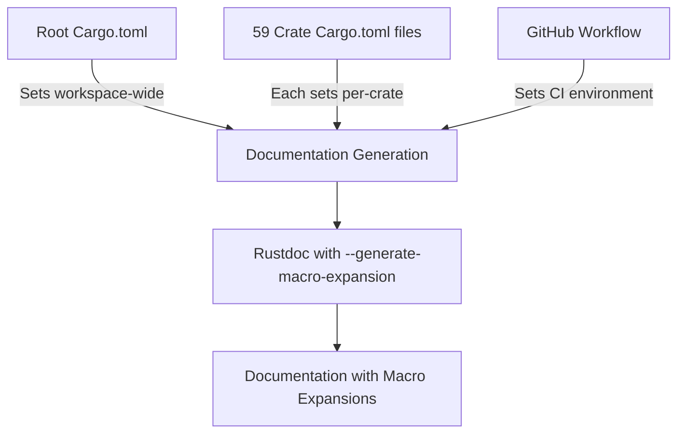

+++
title = "#23075 Enable the rustdoc \"--generate-macro-expansion\" feature"
date = "2026-02-21T00:00:00"
draft = false
template = "pull_request_page.html"
in_search_index = true

[taxonomies]
list_display = ["show"]

[extra]
current_language = "en"
available_languages = {"en" = { name = "English", url = "/pull_request/bevy/2026-02/pr-23075-en-20260221" }, "zh-cn" = { name = "中文", url = "/pull_request/bevy/2026-02/pr-23075-zh-cn-20260221" }}
labels = ["C-Docs", "A-Build-System", "A-Cross-Cutting", "D-Straightforward"]
+++

# Title

## Basic Information
- **Title**: Enable the rustdoc "--generate-macro-expansion" feature
- **PR Link**: https://github.com/bevyengine/bevy/pull/23075
- **Author**: GuillaumeGomez
- **Status**: MERGED
- **Labels**: C-Docs, A-Build-System, A-Cross-Cutting, D-Straightforward, S-Needs-Review
- **Created**: 2026-02-20T12:31:58Z
- **Merged**: 2026-02-21T00:55:38Z
- **Merged By**: mockersf

## Description Translation
You can see this feature in action in the compiler docs like [here](https://doc.rust-lang.org/nightly/nightly-rustc/src/rustc_ast_lowering/errors.rs.html#323) or [here](https://doc.rust-lang.org/nightly/nightly-rustc/src/rustc_ast_lowering/format.rs.html#89).

## The Story of This Pull Request

This PR addresses a documentation improvement for the Bevy game engine by enabling the rustdoc `--generate-macro-expansion` feature across the entire codebase. The change is straightforward but widespread, affecting documentation generation for all Bevy crates.

The core issue was that developers reading Bevy's documentation couldn't easily see the expanded code when macros were used. In Rust, macros can generate complex code, and understanding what a macro actually produces requires either manually expanding it or relying on external tools. The `--generate-macro-expansion` rustdoc flag solves this by automatically including macro expansions in the generated documentation.

The implementation approach was systematic: enable this feature at multiple levels where documentation is generated. First, the root `Cargo.toml` was updated to add `--generate-macro-expansion` to the `rustdoc-args` for the entire workspace. This ensures that when running `cargo doc` from the workspace root, the feature is enabled.

However, documentation generation on docs.rs uses per-crate metadata settings, not workspace-level settings. Therefore, the PR needed to update every single crate's `Cargo.toml` file to include the flag in their `[package.metadata.docs.rs]` sections. This explains why 59 crate files were modified - each Bevy crate needed this configuration to ensure documentation built on docs.rs includes macro expansions.

The GitHub workflow for documentation also required updating. The `.github/workflows/docs.yml` file needed the flag added to the `RUSTDOCFLAGS` environment variable to ensure CI-built documentation includes the macro expansions.

The technical implementation is consistent across all files: each crate's `Cargo.toml` had a `rustdoc-args` array that previously contained `-Zunstable-options` and `--generate-link-to-definition`. The PR simply adds `--generate-macro-expansion` as a third argument in the array.

The `-Zunstable-options` flag is necessary because `--generate-macro-expansion` is still an unstable rustdoc feature. This aligns with Bevy's existing documentation setup, which already uses other unstable rustdoc features like `--generate-link-to-definition`.

This change has a low runtime impact - it only affects documentation generation, not the actual compilation or execution of Bevy code. The documentation builds might take slightly longer and produce larger output due to the inclusion of macro expansions, but this is an acceptable tradeoff for improved developer experience.

The benefit is clear: developers can now click to see macro expansions directly in the documentation, making it easier to understand what macros like `derive` attributes or procedural macros actually generate. This is particularly valuable in a game engine like Bevy where macros are extensively used for ECS components, resources, and other abstractions.

## Visual Representation



## Key Files Changed

### Root Configuration Files

1. **File: `.github/workflows/docs.yml`**
   - **Change**: Added `--generate-macro-expansion` to `RUSTDOCFLAGS`
   - **Purpose**: Ensures CI-generated documentation includes macro expansions
   - **Code snippet**:
```yaml
# Before:
RUSTDOCFLAGS: -Zunstable-options --cfg=docsrs --generate-link-to-definition --html-after-content docs-rs/trait-tags.html

# After:
RUSTDOCFLAGS: -Zunstable-options --cfg=docsrs --generate-link-to-definition --generate-macro-expansion --html-after-content docs-rs/trait-tags.html
```

2. **File: `Cargo.toml` (root)**
   - **Change**: Added `--generate-macro-expansion` to workspace `rustdoc-args`
   - **Purpose**: Sets default for `cargo doc` commands in the workspace
   - **Code snippet**:
```toml
# Before:
rustdoc-args = [
  "-Zunstable-options",
  "--generate-link-to-definition",
]

# After:
rustdoc-args = [
  "-Zunstable-options",
  "--generate-link-to-definition",
  "--generate-macro-expansion",
]
```

### Crate Configuration Files (Representative Example)

3. **File: `crates/bevy_ecs/Cargo.toml`**
   - **Change**: Added `--generate-macro-expansion` to crate's `rustdoc-args`
   - **Purpose**: Ensures docs.rs documentation for this crate includes macro expansions
   - **Code snippet**:
```toml
# Before:
[package.metadata.docs.rs]
rustdoc-args = ["-Zunstable-options", "--generate-link-to-definition"]

# After:
[package.metadata.docs.rs]
rustdoc-args = [
  "-Zunstable-options",
  "--generate-link-to-definition",
  "--generate-macro-expansion",
]
```

**Note**: The same pattern was applied to all 59 crate `Cargo.toml` files, including:
- `crates/bevy_app/Cargo.toml`
- `crates/bevy_render/Cargo.toml` 
- `crates/bevy_ecs/macros/Cargo.toml`
- And 56 other crate configuration files

## Further Reading

- [Rustdoc Documentation on Unstable Features](https://doc.rust-lang.org/rustdoc/unstable-features.html)
- [Rust Blog: Macro Expansions in rustdoc](https://blog.rust-lang.org/inside-rust/2023/09/27/macro-expansions-in-rustdoc.html)
- [Rustdoc `--generate-link-to-definition` Feature](https://doc.rust-lang.org/rustdoc/unstable-features.html#generate-link-to-definition)
- [Cargo Documentation on `package.metadata.docs.rs`](https://doc.rust-lang.org/cargo/reference/cargo-targets.html#configuring-a-target)