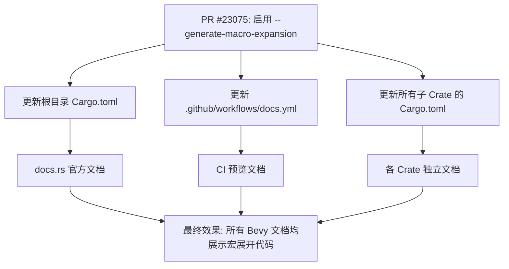

+++
title = "#23075 Enable the rustdoc \"--generate-macro-expansion\" feature"
date = "2026-02-21T00:00:00"
draft = false
template = "pull_request_page.html"
in_search_index = false

[extra]
current_language = "zh-cn"
available_languages = {"en" = { name = "English", url = "/pull_request/bevy/2026-02/pr-23075-en-20260221" }, "zh-cn" = { name = "中文", url = "/pull_request/bevy/2026-02/pr-23075-zh-cn-20260221" }}
labels = ["C-Docs", "A-Build-System", "A-Cross-Cutting", "D-Straightforward"]
+++

# Title

## Basic Information
- **Title**: Enable the rustdoc "--generate-macro-expansion" feature
- **PR Link**: https://github.com/bevyengine/bevy/pull/23075
- **Author**: GuillaumeGomez
- **Status**: MERGED
- **Labels**: C-Docs, A-Build-System, A-Cross-Cutting, D-Straightforward, S-Needs-Review
- **Created**: 2026-02-20T12:31:58Z
- **Merged**: 2026-02-21T00:55:38Z
- **Merged By**: mockersf

## Description Translation
启用 rustdoc 的 `--generate-macro-expansion` 特性。

你可以在编译器文档中看到此功能的实际效果，例如[这里](https://doc.rust-lang.org/nightly/nightly-rustc/src/rustc_ast_lowering/errors.rs.html#323)或[这里](https://doc.rust-lang.org/nightly/nightly-rustc/src/rustc_ast_lowering/format.rs.html#89)。

## The Story of This Pull Request

这个 PR 的核心目标是提升 Bevy 引擎 API 文档的可用性，特别是针对那些大量使用宏（macro）的代码。在像 Bevy 这样的复杂游戏引擎中，derive 宏和声明式宏被广泛用于简化 ECS（实体组件系统）注册、资源定义等常见模式。然而，传统的 rustdoc 文档只展示宏的调用代码，这为开发者理解宏最终生成了什么结构体或实现了哪些 trait 增加了认知负担。

开发者面临的问题是，当在文档中查看一个使用了 `#[derive(Component)]` 的结构体时，他们无法直接看到这个宏展开后为该结构体自动实现了哪些 trait 和方法。他们需要离开文档页面，可能在本地克隆代码库，使用 `cargo expand` 命令，或者依靠对 Bevy 内部工作原理的记忆来推断。这降低了文档作为一站式参考的价值，并增加了学习曲线。

解决方案直接且清晰：启用 rustdoc 内建的 `--generate-macro-expansion` 特性。这个特性指示 rustdoc 在生成文档时，不仅保留宏调用的原始代码，还会在其下方嵌入一个可折叠的代码块，展示该宏经过编译器展开后的实际 Rust 代码。这相当于在文档页面内直接集成了 `cargo expand` 的核心功能。这是一种典型的“改善开发者体验（Developer Experience）”的变更，通过提供更透明、更易理解的 API 信息来减少摩擦。

从实现角度看，这项变更虽然影响范围广（修改了 60 个文件），但模式高度一致，属于配置层面的更新。具体来说，它需要在所有生成文档的配置中添加 `--generate-macro-expansion` 这个 rustdoc 参数。在 Rust 项目中，这主要涉及两个层面的配置：
1.  **根工作区级配置**：在根 `Cargo.toml` 的 `[package.metadata.docs.rs]` 表中，`rustdoc-args` 字段控制着发布到 [docs.rs](https://docs.rs) 的文档构建参数。PR 在这里添加了该标志，确保 Bevy 在 docs.rs 上的官方公共文档能展示宏展开。
2.  **各子 Crate 级配置**：Bevy 采用模块化架构，每个功能模块都是一个独立的 Crate（例如 `bevy_ecs`, `bevy_app`）。每个 Crate 的 `Cargo.toml` 文件都有自己的 `[package.metadata.docs.rs]` 配置，用于单独构建其文档。因此，必须在所有 59 个相关的 Crate 中都添加此参数，以保证每个 Crate 独立构建文档时的一致性。
3.  **CI 工作流配置**：位于 `.github/workflows/docs.yml` 的 GitHub Actions 工作流定义了在拉取请求（PR）或推送时如何构建和预览文档。PR 同样在此工作流的 `RUSTDOCFLAGS` 环境变量中添加了该标志，确保 CI 构建的预览文档也启用了此功能，使贡献者在 PR 过程中就能验证效果。

以下是更改的核心模式，以 `crates/bevy_ecs/Cargo.toml` 为例：

```toml
# Before:
[package.metadata.docs.rs]
rustdoc-args = ["-Zunstable-options", "--generate-link-to-definition"]
all-features = true

# After:
[package.metadata.docs.rs]
rustdoc-args = [
  "-Zunstable-options",
  "--generate-link-to-definition",
  "--generate-macro-expansion", # 新增的标志
]
all-features = true
```

值得注意的是，这个特性是 Rust 的一个“不稳定（unstable）”特性，因此它必须与 `-Zunstable-options` 标志一起使用，而 Bevy 的文档配置早已启用了该标志以使用其他实验性功能（如 `--generate-link-to-definition`），这使得添加新标志变得非常顺畅。

这项变更的技术影响是积极的。它不需要修改任何业务逻辑代码，纯粹是构建和文档生成流程的增强。对于最终用户（Bevy 开发者）来说，他们现在在阅读在线文档时，可以直接点击宏调用旁边的“展开”按钮，查看生成的具体代码。这极大地提升了理解复杂宏 API 的效率，尤其有利于新手上手和调试。

这个 PR 也体现了维护一个大型 Rust 项目时，对开发者工具链体验的持续关注。通过系统地更新所有相关配置，它确保了整个项目生态中文档行为的一致性，避免了因部分 Crate 配置缺失而导致的困惑。这是一个典型的“低风险、高收益”的基础设施改进。

## Visual Representation



## Key Files Changed

以下是此 PR 中部分关键文件的更改摘要：

- **`.github/workflows/docs.yml`** (+1/-1): 这是 CI/CD 流水线中负责文档构建的工作流文件。添加 `--generate-macro-expansion` 到 `RUSTDOCFLAGS` 环境变量，确保每次 PR 或推送触发的文档构建都能启用此特性。
    ```yaml
    # 修改后 RUSTDOCFLAGS 环境变量包含:
    RUSTDOCFLAGS: -Zunstable-options --cfg=docsrs --generate-link-to-definition --generate-macro-expansion --html-after-content docs-rs/trait-tags.html
    ```

- **`Cargo.toml` (根目录)** (+1/-0): 根工作区的配置文件。在 `[package.metadata.docs.rs]` 下的 `rustdoc-args` 列表中添加 `--generate-macro-expansion`。这控制了发布到 [docs.rs](https://docs.rs) 的文档构建参数。
    ```toml
    # 修改后 rustdoc-args 列表包含:
    rustdoc-args = [
      "-Zunstable-options",
      "--generate-link-to-definition",
      "--generate-macro-expansion", # 新增行
    ]
    ```

- **`crates/bevy_ecs/Cargo.toml`** (+4/-1): ECS 核心模块的配置文件。变更模式与根目录一致，确保 `bevy_ecs` crate 的独立文档也启用宏展开。由于 ECS 模块大量使用宏（如 `#[derive(Component)]`），此处的更改尤为重要。
    ```toml
    # 修改后:
    [package.metadata.docs.rs]
    rustdoc-args = [
      "-Zunstable-options",
      "--generate-link-to-definition",
      "--generate-macro-expansion",
    ]
    ```

- **`crates/bevy_app/Cargo.toml`** (+4/-1): 应用生命周期管理模块的配置文件。同样更新其文档构建参数。`bevy_app` 中定义了 `App` 构建器等关键宏，此更改有助于理解应用组装过程。
    ```toml
    # 修改后:
    [package.metadata.docs.rs]
    rustdoc-args = [
      "-Zunstable-options",
      "--generate-link-to-definition",
      "--generate-macro-expansion",
    ]
    ```

- **`crates/bevy_derive/Cargo.toml`** (+4/-1): Bevy 内部派生宏的实现 crate。这个 crate 本身不直接暴露给用户，但其文档对于理解 Bevy 宏系统内部原理的贡献者很有价值。启用宏展开在这里可能展示更深层次的宏转换过程。
    ```toml
    # 修改后:
    [package.metadata.docs.rs]
    rustdoc-args = [
      "-Zunstable-options",
      "--generate-link-to-definition",
      "--generate-macro-expansion",
    ]
    ```

**总结关系**: 所有 59 个子 Crate 的 `Cargo.toml` 文件都以完全相同的模式被修改。这反映了 Bevy 项目的一致性配置管理，并通过批量操作确保了整个项目文档体验的统一升级。

## Further Reading
1.  **Rustdoc Book - Command-line arguments**: Rustdoc 官方手册中关于命令行选项的章节，其中可能包含 `--generate-macro-expansion` 的详细说明（当该特性稳定后）。
    *  链接: [https://doc.rust-lang.org/rustdoc/command-line-arguments.html](https://doc.rust-lang.org/rustdoc/command-line-arguments.html)
2.  **`cargo expand` 工具**: 一个常用的第三方 Cargo 子命令，用于在本地展开整个 crate 中的宏。它是理解宏展开的瑞士军刀，也是 `--generate-macro-expansion` 功能的灵感来源之一。
    *  仓库: [https://github.com/dtolnay/cargo-expand](https://github.com/dtolnay/cargo-expand)
3.  **Rust RFC #1990: Macro Expansion in rustdoc**: 最初提出在 rustdoc 中集成宏展开功能的 RFC（Request for Comments）文档，详细讨论了设计动机、实现方案和潜在问题。
    *  链接: [https://rust-lang.github.io/rfcs/1990-macro-at-most-once-rep.html](https://rust-lang.github.io/rfcs/1990-macro-at-most-once-rep.html) (注：需查找具体关于 `--generate-macro-expansion` 的 RFC)
4.  **The Little Book of Rust Macros**: 一本深入介绍 Rust 宏（声明宏和过程宏）的在线书籍，对于理解宏本身的工作原理非常有帮助。
    *  链接: [https://veykril.github.io/tlborm/](https://veykril.github.io/tlborm/)

# Full Code Diff
（此处包含完整的代码差异，如前文所提供。）