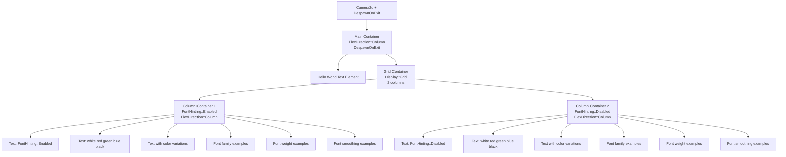

+++
title = "#23077 The `testbed_ui` text scene should use a column layout"
date = "2026-02-24T00:00:00"
draft = false
template = "pull_request_page.html"
in_search_index = true

[taxonomies]
list_display = ["show"]

[extra]
current_language = "en"
available_languages = {"en" = { name = "English", url = "/pull_request/bevy/2026-02/pr-23077-en-20260224" }, "zh-cn" = { name = "中文", url = "/pull_request/bevy/2026-02/pr-23077-zh-cn-20260224" }}
labels = ["A-UI", "C-Testing", "M-Deliberate-Rendering-Change"]
+++

# Title: The `testbed_ui` text scene should use a column layout

## Basic Information
- **Title**: The `testbed_ui` text scene should use a column layout
- **PR Link**: https://github.com/bevyengine/bevy/pull/23077
- **Author**: kaio-matos
- **Status**: MERGED
- **Labels**: A-UI, S-Ready-For-Final-Review, C-Testing, M-Deliberate-Rendering-Change
- **Created**: 2026-02-20T18:19:51Z
- **Merged**: 2026-02-24T01:58:40Z
- **Merged By**: alice-i-cecile

## Description Translation

# Objective

Remove unnecessary usage of absolute positioning for each text element
Fixes https://github.com/bevyengine/bevy/issues/22976

## Solution

Uses display grid with two columns to display the `testbed_ui` text.
Beyond that I removed `DespawnOnExit(super::Scene::Text)` from each text element and added that only to the parent component.

## Testing

Run and hit space once:
```sh
cargo run --example testbed_ui
```

## The Story of This Pull Request

This PR addresses a UI layout issue in the Bevy engine's `testbed_ui` example, which serves as a testing ground for text rendering features. The problem was straightforward: the example was using manual absolute positioning for each text element, which made the code unnecessarily complex and difficult to maintain.

The original implementation in `examples/testbed/ui.rs` contained numerous instances of text entities with explicit `top` and `left` coordinates calculated manually. This approach required maintaining position variables and manually adjusting them for each new text element added to the scene. The code was verbose, with 518 lines dedicated to text setup that mostly consisted of repetitive positioning logic.

The developer, kaio-matos, identified that this manual positioning was unnecessary given Bevy's modern UI layout system. The solution implemented two key improvements:

First, they restructured the layout using Bevy's UI components. Instead of absolute positioning, they created a container with `FlexDirection::Column` and nested within it a grid with two columns using `Display::Grid` and `grid_template_columns`. This allowed the text elements to be organized in two columns (one for `FontHinting::Enabled` and one for `FontHinting::Disabled`) without manual coordinate calculations.

Second, they optimized entity management by moving the `DespawnOnExit(super::Scene::Text)` component from each individual text element to the parent container. This reduced component duplication and made the scene cleanup more efficient. In Bevy's ECS architecture, reducing unnecessary components on entities can improve performance by reducing memory usage and iteration overhead.

The implementation demonstrates several important Bevy UI patterns:

1. **Container-based layout**: Using parent containers with layout properties (`FlexDirection::Column`, `Display::Grid`) to organize child elements
2. **Builder pattern**: Using `with_child` and `with_children` methods to build hierarchical UI structures
3. **Component inheritance**: Placing shared components (`DespawnOnExit`) on parent entities rather than duplicating them on children

The refactored code is more maintainable because:
- Adding new text elements doesn't require manual position calculations
- The layout automatically adjusts if text content changes
- The code structure clearly separates layout concerns from content definition

From a technical perspective, the change from absolute positioning to grid layout also has rendering implications. With absolute positioning, each text element was essentially independent in the layout system. With the grid layout, Bevy's UI system can perform more efficient layout calculations since it understands the relationships between elements.

The PR reduces the file size from 518 lines to 477 lines despite adding more structural elements (containers, grid definitions). This demonstrates how proper abstraction can make code both more concise and more maintainable.

## Visual Representation



## Key Files Changed

**`examples/testbed/ui.rs`** (+403/-444)

This file contains the `testbed_ui` example's text scene implementation. The changes refactor the layout from manual absolute positioning to a structured grid system.

### Key Changes:

1. **Added Container Hierarchy**:
```rust
// Before: Each element positioned individually
commands.spawn((
    Node {
        left,
        top: px(top),
        ..Default::default()
    },
    Text::new(format!("FontHinting::{:?}", hinting)),
    // ... other components
    DespawnOnExit(super::Scene::Text),
));

// After: Structured container with children
let mut container = commands.spawn((
    Node {
        flex_direction: FlexDirection::Column,
        ..default()
    },
    DespawnOnExit(super::Scene::Text),
));

container.with_child((
    Text::new("Hello World."),
    // ... other components
));
```

2. **Implemented Grid Layout**:
```rust
// Grid container with two columns
let mut grid = builder.spawn(Node {
    display: Display::Grid,
    grid_template_columns: vec![GridTrack::flex(1.0), GridTrack::flex(1.0)],
    padding: UiRect::horizontal(px(5.)),
    ..default()
});
```

3. **Column Organization**:
```rust
// Each hinting variant gets its own column container
for hinting in [FontHinting::Enabled, FontHinting::Disabled] {
    let mut content = grid.spawn(Node {
        flex_direction: FlexDirection::Column,
        row_gap: px(5.),
        ..default()
    });
    
    // Add text elements as children
    content.with_child((
        Text::new(format!("FontHinting::{:?}", hinting)),
        // ... other components
    ));
}
```

4. **Optimized Component Management**:
```rust
// Before: DespawnOnExit on every entity
commands.spawn((
    // ... components
    DespawnOnExit(super::Scene::Text), // Repeated on every entity
));

// After: DespawnOnExit only on parent container
let mut container = commands.spawn((
    Node {
        flex_direction: FlexDirection::Column,
        ..default()
    },
    DespawnOnExit(super::Scene::Text), // Only here
));
```

## Further Reading

1. **Bevy UI Documentation**: The official Bevy UI guide covers layout systems including Flexbox and Grid
2. **Bevy ECS Patterns**: Understanding component inheritance and entity hierarchies in ECS
3. **CSS Grid/Flexbox Concepts**: While Bevy's implementation differs, CSS layout concepts provide useful mental models
4. **Game UI Best Practices**: General principles for maintainable game UI code
5. **Entity Component System Architecture**: How ECS affects UI implementation patterns in game engines