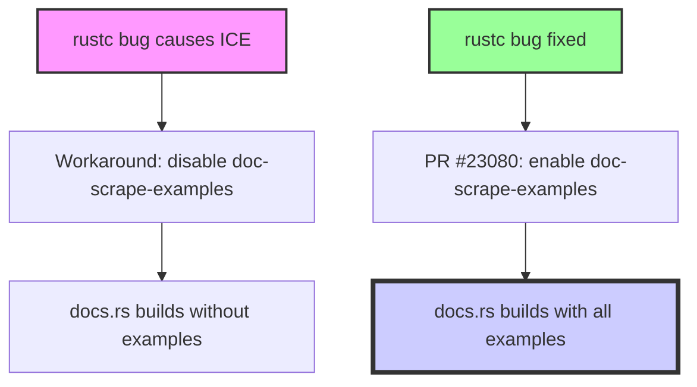

+++
title = "#23080 docs: scrape all examples"
date = "2026-02-21T00:00:00"
draft = false
template = "pull_request_page.html"
in_search_index = false

[extra]
current_language = "zh-cn"
available_languages = {"en" = { name = "English", url = "/pull_request/bevy/2026-02/pr-23080-en-20260221" }, "zh-cn" = { name = "中文", url = "/pull_request/bevy/2026-02/pr-23080-zh-cn-20260221" }}
+++

# docs: scrape all examples

## 基本信息
- **标题**: docs: scrape all examples
- **PR 链接**: https://github.com/bevyengine/bevy/pull/23080
- **作者**: mockersf
- **状态**: 已合并
- **标签**: C-Docs
- **创建时间**: 2026-02-20T20:36:56Z
- **合并时间**: 2026-02-21T09:48:43Z
- **合并者**: mockersf

## 描述翻译
- 由于 rustc 中的 bug，许多示例的文档抓取被禁用
- 该 bug 现已解决
- 抓取所有示例

## 这个 Pull Request 的故事

### 问题与背景
这个 PR 处理的是 Bevy 引擎中一个长期存在的问题：文档生成系统无法处理大部分示例代码。问题源于 rustc（Rust 编译器）中的一个内部编译器错误（Internal Compiler Error，ICE），该错误在 docs.rs 平台上构建文档时触发。作为临时的解决方案，开发团队在 `Cargo.toml` 文件中为每个受影响的示例添加了 `doc-scrape-examples = false` 配置，并附上注释说明原因。

这种解决方案确保了文档能够正常构建，但代价是这些示例代码无法出现在生成的 API 文档中，影响了开发者的学习体验和文档的完整性。

### 解决方案
随着 rustc 中相关 bug 的修复，现在可以重新启用所有示例的文档抓取功能。这个 PR 的目标很简单：将所有被禁用的 `doc-scrape-examples` 配置从 `false` 改为 `true`。

从技术角度看，这是一个典型的"开关翻转"式修复。不需要修改任何实际的代码逻辑，只是更新构建配置。然而，由于 Bevy 项目拥有大量示例（超过 300 个），这个看似简单的修改需要批量操作多个配置文件条目。

### 实现细节
从代码变更来看，这个 PR 只修改了 `Cargo.toml` 文件。每个修改都遵循相同的模式：

```toml
# 修改前：
[[example]]
name = "context_menu"
path = "examples/usage/context_menu.rs"
# Causes an ICE on docs.rs
doc-scrape-examples = false

# 修改后：
[[example]]
name = "context_menu"
path = "examples/usage/context_menu.rs"
doc-scrape-examples = true
```

整个 diff 文件包含 308 行添加和 616 行删除，反映了大规模但机械式的配置更新。值得注意的是，注释 `# Causes an ICE on docs.rs` 也被移除了，因为问题已经解决。

### 技术见解
这个修复展示了软件工程中常见的工作流程：当上游依赖（如编译器）存在 bug 时，项目需要实现临时的变通方案；一旦 bug 修复，就需要回滚这些变通方案。

`doc-scrape-examples` 是 Cargo 的一个特性，用于控制在生成文档时是否包含示例代码。启用这个选项后，示例代码会被编译并包含在生成的 API 文档中，这有助于开发者理解如何使用库中的各种功能。

### 影响
这个变更的直接影响是显著提升了 Bevy 文档的质量和实用性。现在开发者可以在文档中看到所有的示例代码，这大大降低了学习曲线。从维护角度看，这个变更也简化了配置管理，不再需要为特定的示例设置特殊标志。

不过，这个变更也可能带来一些风险：如果 rustc 的修复不够彻底，或者在不同环境下仍存在问题，重新启用文档抓取可能会导致构建失败。但从 PR 的描述来看，维护团队已经确认问题完全解决。

## 可视化表示



## 关键文件变更

### `Cargo.toml`
这是唯一被修改的文件，包含了 300 多个示例的配置更新。

**变更示例**：
```toml
# 文件：Cargo.toml
# 修改前：
[[example]]
name = "hello_world"
path = "examples/hello_world.rs"
# Causes an ICE on docs.rs
doc-scrape-examples = false

[package.metadata.example.hello_world]
hidden = true

# 修改后：
[[example]]
name = "hello_world"
path = "examples/hello_world.rs"
doc-scrape-examples = true

[package.metadata.example.hello_world]
hidden = true
```

**影响**：这个更改重新启用了该示例在文档生成过程中的代码抓取，使得 `hello_world` 示例的代码现在会出现在生成的 API 文档中。

## 扩展阅读

1. [Cargo 文档关于示例配置的部分](https://doc.rust-lang.org/cargo/reference/cargo-targets.html#examples) - 了解 Cargo 如何管理示例
2. [Rustdoc 文档生成](https://doc.rust-lang.org/rustdoc/what-is-rustdoc.html) - 了解 Rust 文档生成工具的工作原理
3. [docs.rs 平台](https://docs.rs/about) - 了解 Rust 包的自动文档生成服务
4. [Rust 编译器错误报告](https://github.com/rust-lang/rust/issues) - 了解如何报告和跟踪 rustc 中的 bug