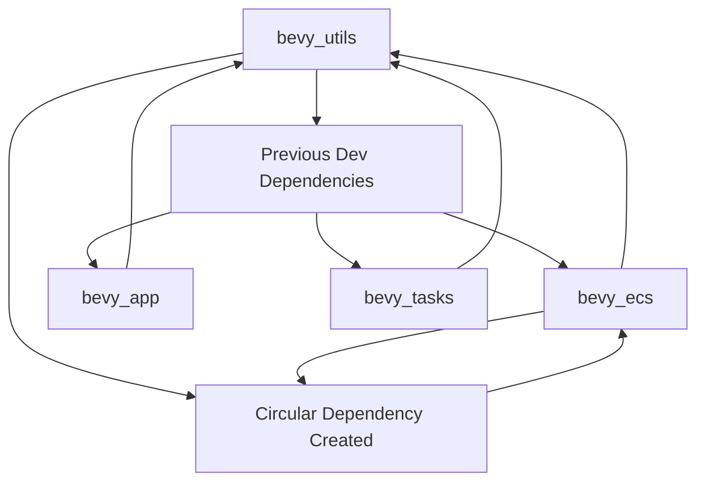

+++
title = "#23081 remove circular dependency"
date = "2026-02-21T00:00:00"
draft = false
template = "pull_request_page.html"
in_search_index = true

[taxonomies]
list_display = ["show"]

[extra]
current_language = "en"
available_languages = {"en" = { name = "English", url = "/pull_request/bevy/2026-02/pr-23081-en-20260221" }, "zh-cn" = { name = "中文", url = "/pull_request/bevy/2026-02/pr-23081-zh-cn-20260221" }}
labels = ["C-Bug", "D-Trivial", "A-Utils"]
+++

# Title
remove circular dependency

## Basic Information
- **Title**: remove circular dependency
- **PR Link**: https://github.com/bevyengine/bevy/pull/23081
- **Author**: mockersf
- **Status**: MERGED
- **Labels**: C-Bug, D-Trivial, S-Ready-For-Final-Review, A-Utils
- **Created**: 2026-02-20T20:57:45Z
- **Merged**: 2026-02-21T00:56:45Z
- **Merged By**: mockersf

## Description Translation

# Objective

- #22297 introduced circular dependencies that would make it impossible to release Bevy

## Solution

- Remove it

## The Story of This Pull Request

This PR addresses a straightforward but critical issue in the Bevy engine's build system: a circular dependency that was blocking the project's ability to release new versions. The problem originated from PR #22297, which unintentionally created a dependency cycle between `bevy_utils` and other core Bevy crates.

Circular dependencies in Rust workspaces create problems for the build system and can prevent publishing crates to crates.io. When multiple crates depend on each other in a cycle, the build tool cannot determine a valid compilation order, and cargo publish operations fail because each crate requires the others to already be published.

The issue was located in the `bevy_utils` crate, which had added development dependencies on three other Bevy crates: `bevy_ecs`, `bevy_app`, and `bevy_tasks`. These dev-dependencies were only used for documentation examples, specifically in the `buffered_channel.rs` file's doc comment. However, since `bevy_ecs`, `bevy_app`, and `bevy_tasks` themselves depend on `bevy_utils`, this created a circular dependency chain during development builds.

The solution was direct and practical: remove the problematic dependencies and the documentation example that required them. The PR author took the simplest approach to resolve the blocking issue, prioritizing build system health over preserving the example. While the example provided valuable context for using `BufferedChannel` within Bevy's task system, its removal was necessary to maintain the project's ability to release.

This type of circular dependency issue is common in large Rust workspaces where examples and tests need to demonstrate integration between crates. The typical trade-off is between comprehensive documentation and clean dependency graphs. In this case, the release-blocking nature of the circular dependency made the decision straightforward.

From a technical perspective, the fix involved two key changes:
1. Removing the three dev-dependencies from `Cargo.toml`
2. Removing the comprehensive usage example from the `BufferedChannel` documentation

The removal of 49 lines of example code might seem significant, but it only affects documentation, not the actual functionality of the `BufferedChannel`. The struct remains fully functional and available for use, just without the illustrative example showing integration with Bevy's task system.

This PR demonstrates an important principle in managing Rust workspaces: documentation and examples should not create hard dependencies that compromise the build system. Alternative approaches could have included moving the example to integration tests or using feature flags, but for a straightforward release-blocking issue, the direct removal was the most pragmatic solution.

## Visual Representation



## Key Files Changed

### `crates/bevy_utils/Cargo.toml` (+0/-3)
This change removed three development dependencies that were creating the circular dependency.

Before:
```toml
[dev-dependencies]
static_assertions = "1.1.0"
bevy_ecs = { path = "../bevy_ecs", version = "0.19.0-dev", default-features = false }
bevy_app = { path = "../bevy_app", version = "0.19.0-dev", default-features = false }
bevy_tasks = { path = "../bevy_tasks", version = "0.19.0-dev", default-features = false }
```

After:
```toml
[dev-dependencies]
static_assertions = "1.1.0"
```

### `crates/bevy_utils/src/buffered_channel.rs` (+0/-49)
This change removed a large documentation example that was using the removed dev-dependencies to demonstrate how `BufferedChannel` works with Bevy's task system.

The removed code was a comprehensive example showing:
- How to use `BufferedChannel` with Bevy's `TaskPoolPlugin`
- Integration with `bevy_ecs` systems
- Usage of `bevy_tasks::ComputeTaskPool` for parallel processing
- A complete example of producer-consumer pattern using the channel

The example spanned 55 lines (from line 13 to line 67 in the original file) and included detailed comments about the benefits of buffered channels for parallel processing with serial consumers.

## Further Reading

1. [Rust Cargo Workspaces Documentation](https://doc.rust-lang.org/cargo/reference/workspaces.html) - Understanding how Rust manages multi-crate projects
2. [Circular Dependencies in Rust](https://doc.rust-lang.org/cargo/guide/dependencies.html) - How to avoid and resolve circular dependencies
3. [Bevy Engine Architecture](https://bevyengine.org/learn/book/introduction/) - Understanding Bevy's modular crate structure
4. [Rust Doc-test Documentation](https://doc.rust-lang.org/rustdoc/write-documentation/documentation-tests.html) - How documentation examples work as tests
5. [PR #22297](https://github.com/bevyengine/bevy/pull/22297) - The original PR that introduced the circular dependency

# Full Code Diff
diff --git a/crates/bevy_utils/Cargo.toml b/crates/bevy_utils/Cargo.toml
index 96d726009c10a..a6f0189d34924 100644
--- a/crates/bevy_utils/Cargo.toml
+++ b/crates/bevy_utils/Cargo.toml
@@ -29,9 +29,6 @@ async-channel = { version = "2.3.0", optional = true }
 
 [dev-dependencies]
 static_assertions = "1.1.0"
-bevy_ecs = { path = "../bevy_ecs", version = "0.19.0-dev", default-features = false }
-bevy_app = { path = "../bevy_app", version = "0.19.0-dev", default-features = false }
-bevy_tasks = { path = "../bevy_tasks", version = "0.19.0-dev", default-features = false }
 
 [lints]
 workspace = true
diff --git a/crates/bevy_utils/src/buffered_channel.rs b/crates/bevy_utils/src/buffered_channel.rs
index e717380b7ddfa..f7e0b73fab2a9 100644
--- a/crates/bevy_utils/src/buffered_channel.rs
+++ b/crates/bevy_utils/src/buffered_channel.rs
@@ -13,55 +13,6 @@ use core::ops::{Deref, DerefMut};
 /// tasks. Unlike `Parallel`, this allows you to execute a consuming task while producing tasks are
 /// concurrently sending data into the channel, enabling you to run a serial processing consumer
 /// at the same time as many parallel processing producers.
-///
-/// # Usage
-///
-/// ```
-/// use bevy_utils::BufferedChannel;
-/// use bevy_app::{App, TaskPoolPlugin, Update};
-/// use bevy_ecs::system::Local;
-/// use bevy_tasks::ComputeTaskPool;
-///
-/// App::new()
-///     .add_plugins(TaskPoolPlugin::default())
-///     .add_systems(Update, parallel_system)
-///     .update();
-///
-/// fn parallel_system(channel: Local<BufferedChannel<u64>>) {
-///     let (rx, tx) = channel.unbounded();
-///     ComputeTaskPool::get().scope(|scope| {
-///         // Spawn a single consumer task that reads from the producers. Note we can spawn this
-///         // first and have it immediately start processing the messages produced in parallel.
-///         // Because we are receiving asynchronously, we avoid deadlocks even on a single thread.
-///         scope.spawn(async move {
-///             let mut total = 0;
-///             let mut count = 0;
-///             while let Ok(mut chunk) = rx.recv().await {
-///                 count += chunk.len();
-///                 total += chunk.iter().sum::<u64>();
-///             }
-///             assert_eq!(count, 500_000);
-///             assert_eq!(total, 24_999_750_000);
-///         });
-///
-///         // Spawn a few producing tasks in parallel that send data into the buffered channel.
-///         for _ in 0..5 {
-///             let mut tx = tx.clone();
-///             scope.spawn(async move {
-///                 // Because this is buffered, we can iterate over hundreds of thousands of
-///                 // entities in each task while avoiding allocation and channel overhead.
-///                 // The buffer is flushed periodically, sending chunks of data to the receiver.
-///                 for i in 0..100_000 {
-///                     tx.send(i).await;
-///                 }
-///             });
-///         }
-///
-///         // Drop the unused sender so the channel can close.
-///         drop(tx);
-///     });
-/// }
-/// ```
 pub struct BufferedChannel<T: Send> {
     /// The minimum length of a `Vec` of buffered data before it is sent through the channel.
     pub chunk_size: usize,