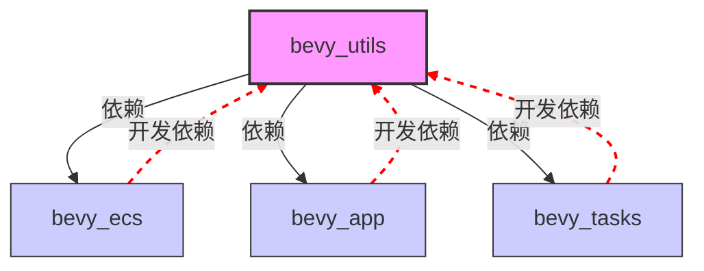

+++
title = "#23081 移除循环依赖 (remove circular dependency)"
date = "2026-02-21T00:00:00"
draft = false
template = "pull_request_page.html"
in_search_index = false

[extra]
current_language = "zh-cn"
available_languages = {"en" = { name = "English", url = "/pull_request/bevy/2026-02/pr-23081-en-20260221" }, "zh-cn" = { name = "中文", url = "/pull_request/bevy/2026-02/pr-23081-zh-cn-20260221" }}
+++

# Title

## Basic Information
- **标题**: 移除循环依赖 (remove circular dependency)
- **PR 链接**: https://github.com/bevyengine/bevy/pull/23081
- **作者**: mockersf
- **状态**: 已合并 (MERGED)
- **标签**: C-Bug, D-Trivial, S-Ready-For-Final-Review, A-Utils
- **创建时间**: 2026-02-20T20:57:45Z
- **合并时间**: 2026-02-21T00:56:45Z
- **合并者**: mockersf

## 描述翻译

### 目标 (Objective)
- #22297 引入了循环依赖，这将导致无法发布 Bevy

### 解决方案 (Solution)
- 移除它

---

## 该 PR 的技术分析

这是一个典型的维护性修复 PR，主要解决由先前 PR #22297 引入的循环依赖问题。循环依赖在 Rust 的 Cargo 构建系统中会导致编译失败，尤其是在准备发布构建时，因此必须立即修复。

问题的核心在于开发依赖项 (dev-dependencies) 的配置错误。在 `crates/bevy_utils/Cargo.toml` 中，开发者添加了三个对同级 crate 的开发依赖：`bevy_ecs`、`bevy_app` 和 `bevy_tasks`。然而，`bevy_utils` 本身是 Bevy 生态系统中的一个基础工具库，被许多其他核心 crate（包括这三个）所依赖。当这些依赖项反过来又作为开发依赖引用 `bevy_utils` 时，就创建了一个循环依赖图。

具体来说，这个循环依赖在运行测试或示例时才会显现，因为开发依赖只在运行 `cargo test` 或构建示例时才会被拉入。这种依赖结构会阻止 Cargo 正确解析依赖关系，导致构建失败。对于项目发布而言，这是一个致命问题，因为发布流程通常包括运行测试以确保代码质量。

解决方案直接而有效：移除导致循环的开发依赖。然而，这个决定有一个连带影响——`buffered_channel.rs` 文件中包含的一个完整使用示例依赖于这些被移除的 crate。这个示例原本展示了如何在 Bevy 应用系统中使用 `BufferedChannel` 类型，结合 `bevy_app`、`bevy_ecs` 和 `bevy_tasks` 来执行并行任务。

从工程角度看，这里有几种可能的处理方式：
1. 保留开发依赖但重构依赖结构（复杂且耗时）
2. 将示例移至不会产生循环依赖的地方（可能需要重构代码组织）
3. 完全移除示例（最简单直接的解决方案）

开发者选择了第三种方案，这是合理的，因为：
- 这个示例不是 API 文档的核心部分，更像是集成测试
- 移除示例可以立即解决问题，不影响核心功能
- `BufferedChannel` 类型本身的功能不受影响，仍可通过单元测试验证

`BufferedChannel` 是一个为高效并行处理设计的实用工具，它允许生产者任务批量发送数据，而消费者任务可以并发处理这些批次。虽然示例被移除，但类型的设计和功能保持不变。未来可以考虑在不引入循环依赖的情况下，通过其他方式（如独立的集成测试或文档示例）来演示其用法。

这个修复展示了依赖管理在大型 Rust 项目中的重要性。开发依赖虽然只在测试时使用，但如果配置不当，仍然会破坏整个项目的构建。这也提醒我们，在添加跨模块的依赖时，必须仔细分析依赖图，避免循环。

## 视觉表示



## 关键文件变更

### 1. `crates/bevy_utils/Cargo.toml`

**变更说明**: 移除了三个导致循环依赖的开发依赖项。

**变更前**:
```toml
[dev-dependencies]
static_assertions = "1.1.0"
bevy_ecs = { path = "../bevy_ecs", version = "0.19.0-dev", default-features = false }
bevy_app = { path = "../bevy_app", version = "0.19.0-dev", default-features = false }
bevy_tasks = { path = "../bevy_tasks", version = "0.19.0-dev", default-features = false }
```

**变更后**:
```toml
[dev-dependencies]
static_assertions = "1.1.0"
```

**影响**: 解决了循环依赖问题，但移除了在示例中使用的这些 crate。

### 2. `crates/bevy_utils/src/buffered_channel.rs`

**变更说明**: 移除了依赖于被删除开发依赖项的大型使用示例。

**变更前** (示例代码片段):
```rust
/// # Usage
///
/// ```
/// use bevy_utils::BufferedChannel;
/// use bevy_app::{App, TaskPoolPlugin, Update};
/// use bevy_ecs::system::Local;
/// use bevy_tasks::ComputeTaskPool;
///
/// App::new()
///     .add_plugins(TaskPoolPlugin::default())
///     .add_systems(Update, parallel_system)
///     .update();
///
/// // ... 大量示例代码
/// ```
pub struct BufferedChannel<T: Send> {
```

**变更后**:
```rust
pub struct BufferedChannel<T: Send> {
```

**影响**: `BufferedChannel` 类型的文档现在没有使用示例，但其核心文档（关于设计目的和工作原理的描述）仍然保留。类型的功能本身没有变化。

## 延伸阅读

1. **Rust Cargo 文档 - 依赖管理**: https://doc.rust-lang.org/cargo/reference/specifying-dependencies.html
2. **循环依赖问题讨论**: https://github.com/rust-lang/cargo/issues/4242
3. **Bevy 工程结构**: https://github.com/bevyengine/bevy/blob/main/ARCHITECTURE.md
4. **Rust 模块系统最佳实践**: https://doc.rust-lang.org/book/ch07-02-defining-modules-to-control-scope-and-privacy.html

---

## 完整代码差异

```diff
diff --git a/crates/bevy_utils/Cargo.toml b/crates/bevy_utils/Cargo.toml
index 96d726009c10a..a6f0189d34924 100644
--- a/crates/bevy_utils/Cargo.toml
+++ b/crates/bevy_utils/Cargo.toml
@@ -29,9 +29,6 @@ async-channel = { version = "2.3.0", optional = true }
 
 [dev-dependencies]
 static_assertions = "1.1.0"
-bevy_ecs = { path = "../bevy_ecs", version = "0.19.0-dev", default-features = false }
-bevy_app = { path = "../bevy_app", version = "0.19.0-dev", default-features = false }
-bevy_tasks = { path = "../bevy_tasks", version = "0.19.0-dev", default-features = false }
 
 [lints]
 workspace = true
diff --git a/crates/bevy_utils/src/buffered_channel.rs b/crates/bevy_utils/src/buffered_channel.rs
index e717380b7ddfa..f7e0b73fab2a9 100644
--- a/crates/bevy_utils/src/buffered_channel.rs
+++ b/crates/bevy_utils/src/buffered_channel.rs
@@ -13,55 +13,6 @@ use core::ops::{Deref, DerefMut};
 /// tasks. Unlike `Parallel`, this allows you to execute a consuming task while producing tasks are
 /// concurrently sending data into the channel, enabling you to run a serial processing consumer
 /// at the same time as many parallel processing producers.
-///
-/// # Usage
-///
-/// ```
-/// use bevy_utils::BufferedChannel;
-/// use bevy_app::{App, TaskPoolPlugin, Update};
-/// use bevy_ecs::system::Local;
-/// use bevy_tasks::ComputeTaskPool;
-///
-/// App::new()
-///     .add_plugins(TaskPoolPlugin::default())
-///     .add_systems(Update, parallel_system)
-///     .update();
-///
-/// fn parallel_system(channel: Local<BufferedChannel<u64>>) {
-///     let (rx, tx) = channel.unbounded();
-///     ComputeTaskPool::get().scope(|scope| {
-///         // Spawn a single consumer task that reads from the producers. Note we can spawn this
-///         // first and have it immediately start processing the messages produced in parallel.
-///         // Because we are receiving asynchronously, we avoid deadlocks even on a single thread.
-///         scope.spawn(async move {
-///             let mut total = 0;
-///             let mut count = 0;
-///             while let Ok(mut chunk) = rx.recv().await {
-///                 count += chunk.len();
-///                 total += chunk.iter().sum::<u64>();
-///             }
-///             assert_eq!(count, 500_000);
-///             assert_eq!(total, 24_999_750_000);
-///         });
-///
-///         // Spawn a few producing tasks in parallel that send data into the buffered channel.
-///         for _ in 0..5 {
-///             let mut tx = tx.clone();
-///             scope.spawn(async move {
-///                 // Because this is buffered, we can iterate over hundreds of thousands of
-///                 // entities in each task while avoiding allocation and channel overhead.
-///                 // The buffer is flushed periodically, sending chunks of data to the receiver.
-///                 for i in 0..100_000 {
-///                     tx.send(i).await;
-///                 }
-///             });
-///         }
-///
-///         // Drop the unused sender so the channel can close.
-///         drop(tx);
-///     });
-/// }
-/// ```
 pub struct BufferedChannel<T: Send> {
     /// The minimum length of a `Vec` of buffered data before it is sent through the channel.
     pub chunk_size: usize,
```