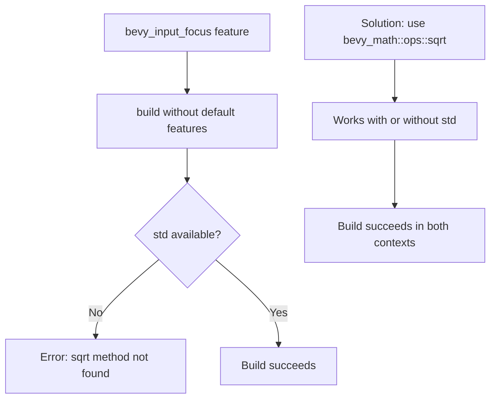

+++
title = "#23082 building bevy with only feature bevy_input_focus fails"
date = "2026-02-21T00:00:00"
draft = false
template = "pull_request_page.html"
in_search_index = true

[taxonomies]
list_display = ["show"]

[extra]
current_language = "en"
available_languages = {"en" = { name = "English", url = "/pull_request/bevy/2026-02/pr-23082-en-20260221" }, "zh-cn" = { name = "中文", url = "/pull_request/bevy/2026-02/pr-23082-zh-cn-20260221" }}
labels = ["C-Bug", "D-Trivial", "A-UI"]
+++

# Title

## Basic Information
- **Title**: building bevy with only feature bevy_input_focus fails
- **PR Link**: https://github.com/bevyengine/bevy/pull/23082
- **Author**: mockersf
- **Status**: MERGED
- **Labels**: C-Bug, D-Trivial, A-UI, S-Ready-For-Final-Review
- **Created**: 2026-02-20T21:12:00Z
- **Merged**: 2026-02-21T01:03:16Z
- **Merged By**: alice-i-cecile

## Description

# Objective

- `cargo build --features bevy_input_focus --no-default-features` fails
```
error[E0599]: no method named `sqrt` found for type `f32` in the current scope
   --> crates/bevy_input_focus/src/navigator.rs:112:40
    |
112 |     let distance = (dx * dx + dy * dy).sqrt();
    |                                        ^^^^ method not found in `f32`
```

## Solution

- use `sqrt` from bevy_math

## The Story of This Pull Request

This PR addresses a straightforward compilation issue in the Bevy engine. When building Bevy with only the `bevy_input_focus` feature enabled and without default features, the build fails due to a missing dependency on the standard library's mathematical functions. 

The problem occurs because when building without the standard library (a `no_std` context), certain mathematical methods like `f32::sqrt()` are not available. The `bevy_input_focus` crate contains a navigation system that calculates distances between UI elements, which requires computing square roots. The original code used the standard library's `sqrt` method, which isn't available when building without `std`.

The solution is pragmatic: instead of relying on the standard library's mathematical functions, use Bevy's own mathematical utilities. The `bevy_math` crate provides a `sqrt` function that works in both `std` and `no_std` contexts. This approach aligns with Bevy's architecture, where the engine provides its own mathematical abstractions that work consistently across different compilation contexts.

The fix is minimal and focused - a single line change that replaces the method call `(dx * dx + dy * dy).sqrt()` with the function call `bevy_math::ops::sqrt(dx * dx + dy * dy)`. This change ensures that the navigation system works correctly regardless of whether the standard library is available, making the `bevy_input_focus` feature more robust and compatible with different build configurations.

This issue highlights an important consideration when developing features for Bevy: mathematical operations should use Bevy's own math utilities rather than standard library methods when building features that need to work in `no_std` contexts. The `bevy_math` crate serves as an abstraction layer that provides consistent mathematical operations across different compilation targets and feature configurations.

The fix demonstrates good dependency management practice. By using `bevy_math::ops::sqrt`, the code explicitly declares its dependency on Bevy's math utilities, making the build requirements clearer and ensuring compatibility with the engine's architecture. This approach also future-proofs the code against changes in how mathematical operations are implemented in different compilation contexts.

## Visual Representation



## Key Files Changed

### `crates/bevy_input_focus/src/navigator.rs` (+1/-1)

This file contains the navigation logic for UI focus management. The change replaces a standard library method call with Bevy's math utility function to ensure compatibility with `no_std` builds.

**Before:**
```rust
let distance = (dx * dx + dy * dy).sqrt();
```

**After:**
```rust
let distance = bevy_math::ops::sqrt(dx * dx + dy * dy);
```

The change is in the `score_candidate` function, which calculates a distance score for UI navigation candidates. The function computes the Euclidean distance between UI elements using the Pythagorean theorem, which requires calculating the square root of the sum of squared differences. The switch to `bevy_math::ops::sqrt` ensures this calculation works correctly when building without the standard library.

## Further Reading

- [Bevy Math Documentation](https://docs.rs/bevy_math/latest/bevy_math/) - Documentation for Bevy's mathematical utilities
- [Rust no_std Programming](https://docs.rust-embedded.org/book/intro/no-std.html) - Guide to writing Rust code without the standard library
- [Bevy Features and Cargo](https://bevyengine.org/learn/quick-start/features/) - How to work with Bevy's feature system
- [Rust Conditional Compilation](https://doc.rust-lang.org/reference/conditional-compilation.html) - Using features and conditional compilation in Rust

# Full Code Diff
```diff
diff --git a/crates/bevy_input_focus/src/navigator.rs b/crates/bevy_input_focus/src/navigator.rs
index 2e984b0088beb..d5504652b1432 100644
--- a/crates/bevy_input_focus/src/navigator.rs
+++ b/crates/bevy_input_focus/src/navigator.rs
@@ -109,7 +109,7 @@ fn score_candidate(
     let dy = (candidate_rect.min.y - origin_rect.max.y)
         .max(origin_rect.min.y - candidate_rect.max.y)
         .max(0.0);
-    let distance = (dx * dx + dy * dy).sqrt();
+    let distance = bevy_math::ops::sqrt(dx * dx + dy * dy);
 
     // Check max distance
     if let Some(max_dist) = config.max_search_distance {
```