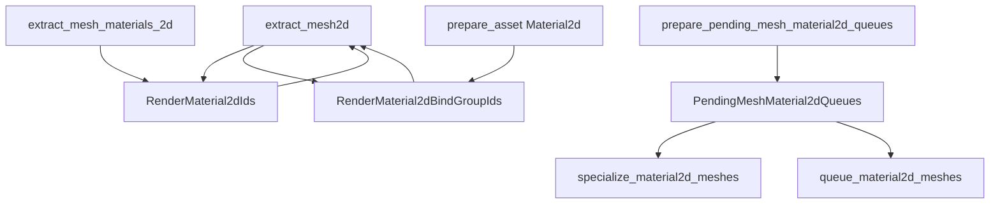

+++
title = "#23083 Fix 2d specialization w/ change lists."
date = "2026-02-22T00:00:00"
draft = false
template = "pull_request_page.html"
in_search_index = true

[taxonomies]
list_display = ["show"]

[extra]
current_language = "en"
available_languages = {"en" = { name = "English", url = "/pull_request/bevy/2026-02/pr-23083-en-20260222" }, "zh-cn" = { name = "中文", url = "/pull_request/bevy/2026-02/pr-23083-zh-cn-20260222" }}
labels = ["C-Bug", "A-Rendering", "P-Regression"]
+++

# Title

## Basic Information
- **Title**: Fix 2d specialization w/ change lists.
- **PR Link**: https://github.com/bevyengine/bevy/pull/23083
- **Author**: tychedelia
- **Status**: MERGED
- **Labels**: C-Bug, A-Rendering, S-Ready-For-Final-Review, P-Regression
- **Created**: 2026-02-20T21:32:53Z
- **Merged**: 2026-02-22T04:53:04Z
- **Merged By**: alice-i-cecile

## Description Translation
Some fixes for 2d post #22966. 

This is complicated because, unlike 3d, 2d material systems are generic over their material and not type erased. Which means we have to be defensive against all the weird scenarios that can happen when different material systems race against each other.

I am not confident this is correct. The ultimate solution is just to get rid of all these bespoke 2d systems.

The main fixes are:
- `material_bind_group_id` is no longer reset to default every frame. `extract_mesh2d` was setting `material_bind_group_id` on every extraction. Previously this was overwritten later during queuing every frame, but with dirty tracking, entities aren't re-queued every frame so the default sticks.
- `prepare_for_new_frame` moved to a non-generic system.
- More careful about not adding wrong material type entities to the pending queue where they'll churn forever without getting specialized.
- Dequeue no longer cross-type stomps. When a view is dirty, we were returning all visible entities, which was problematic in the context of multiple materials.

## The Story of This Pull Request

The problem started with PR #22966, which introduced change list (dirty tracking) optimizations to Bevy's rendering systems. While these optimizations reduced unnecessary work, they exposed several edge cases in the 2D rendering pipeline that weren't apparent when everything was re-processed every frame.

The core issue is that 2D material systems in Bevy are generic over their material types and not type-erased, unlike the 3D systems. This creates complex interactions when multiple material systems run concurrently, especially when entities change material types or become invisible. Without the safety net of processing everything every frame, these edge cases cause rendering artifacts and infinite loops.

The first major issue was with `material_bind_group_id`. In the extraction phase, `extract_mesh2d` was resetting this ID to its default value on every frame. Previously, this didn't matter because the queuing system would overwrite it later in the same frame. But with dirty tracking, entities that haven't changed aren't re-queued, so the default value persists, causing incorrect bind groups to be used during rendering.

The second issue involved the pending queue system. Each material type maintains its own queue of entities that need specialization. The `prepare_for_new_frame` logic was running as a generic system, which meant each material type was independently managing view states. This led to races where different material systems could have inconsistent views of which views exist.

Third, the system was incorrectly adding entities to pending queues for material types they didn't belong to. When an entity changed from Material A to Material B, Material A's system would still try to process it, adding it to its pending queue where it would never get specialized because Material A's system doesn't handle Material B's assets.

Finally, the dequeue logic had a cross-type stomping problem. When a view was marked dirty, the system would return all visible entities for dequeueing, not just entities of the current material type. This meant Material A's system could remove render phase entries for entities that should be handled by Material B's system.

The solution involved four coordinated fixes. First, the bind group ID persistence was fixed by creating a global registry that maps entities to their material IDs, and material IDs to their bind group IDs. This allows `extract_mesh2d` to look up the correct bind group ID even for entities that aren't being re-queued.

Second, `prepare_for_new_frame` was moved to a non-generic system that runs once per frame, before any material-specific systems. This ensures all material systems see a consistent view state.

Third, the specialization system now carefully filters out entities that don't have the current material type. If an entity's material ID isn't found in the current material's registry, it's simply skipped rather than being added to a pending queue where it can't be processed.

Fourth, the dequeue logic was refined to only remove entities that are truly no longer relevant to the current material system. The system now distinguishes between entities that were removed entirely and entities that changed material types, ensuring that cross-type interference doesn't occur.

These changes highlight the complexity of maintaining parallel, type-generic rendering systems. The PR author notes that the ultimate solution would be to refactor the 2D systems to use type-erased approaches similar to 3D, which would eliminate these race conditions entirely. However, as a practical fix for the regression introduced by change lists, these changes restore correctness while maintaining the performance benefits of dirty tracking.

## Visual Representation



## Key Files Changed

### 1. `crates/bevy_sprite_render/src/mesh2d/material.rs` (+83/-44)

This file contains the core fixes for the 2D material specialization system. The changes introduce new resources for tracking material bind group IDs and refactor the pending queue management.

**Key changes:**
- Added `RenderMaterial2dIds` resource to map entities to material IDs
- Added `RenderMaterial2dBindGroupIds` resource to map material IDs to bind group IDs
- Created non-generic `prepare_pending_mesh_material2d_queues` system
- Fixed specialization system to skip entities with wrong material types
- Refined dequeue logic to avoid cross-type interference

**Code snippets:**

```rust
// Added new resources
#[derive(Resource, Default, Deref, DerefMut)]
pub struct RenderMaterial2dBindGroupIds(HashMap<UntypedAssetId, Material2dBindGroupId>);

#[derive(Resource, Default, Deref, DerefMut)]
pub struct RenderMaterial2dIds(MainEntityHashMap<UntypedAssetId>);

// Modified extract_mesh_materials_2d to update both resources
fn add_mesh_instance<M>(
    entity: Entity,
    material: &MeshMaterial2d<M>,
    material_instances: &mut RenderMaterial2dInstances<M>,
    render_material_2d_ids: &mut RenderMaterial2dIds,
) {
    material_instances.insert(entity.into(), material.id());
    render_material_2d_ids.insert(entity.into(), material.id().into());
}

// New non-generic system for preparing pending queues
pub fn prepare_pending_mesh_material2d_queues(
    mut pending_mesh_material2d_queues: ResMut<PendingMeshMaterial2dQueues>,
    views: Query<&ExtractedView>,
) {
    let mut all_views: HashSet<RetainedViewEntity, FixedHasher> = HashSet::default();
    for view in &views {
        all_views.insert(view.retained_view_entity);
        pending_mesh_material2d_queues.prepare_for_new_frame(view.retained_view_entity);
    }
    pending_mesh_material2d_queues.expire_stale_views(&all_views);
}

// Fixed specialization to skip wrong material types
let Some(material_asset_id) = render_material_instances.get(visible_entity) else {
    // Entity doesn't have this material type. Skip it; the
    // correct material type's specialize system will handle it.
    continue;
};
```

### 2. `crates/bevy_sprite_render/src/mesh2d/mesh.rs` (+20/-3)

This file handles mesh extraction and was modified to use the new material ID tracking system to preserve bind group IDs across frames.

**Key changes:**
- Initialized the new material ID tracking resources
- Modified `extract_mesh2d` to look up bind group IDs from the global registries
- Added the non-generic pending queue preparation system to the render schedule

**Code snippets:**

```rust
// Initialization of new resources in plugin
.init_resource::<RenderMaterial2dBindGroupIds>()
.allow_ambiguous_resource::<RenderMaterial2dBindGroupIds>()
.init_resource::<RenderMaterial2dIds>()
.allow_ambiguous_resource::<RenderMaterial2dIds>()

// Modified extract_mesh2d to preserve bind group IDs
let material_bind_group_id = render_material_instances
    .get(&main_entity)
    .and_then(|material_id| render_material_2d_bind_group_ids.get(material_id))
    .copied()
    .unwrap_or_default();

render_mesh_instances.insert(
    main_entity,
    RenderMesh2dInstance {
        transforms: Mesh2dTransforms {
            world_from_local: transform.affine().into(),
            flags: MeshFlags::empty().bits(),
        },
        mesh_asset_id: handle.0.id(),
        material_bind_group_id, // Now preserved from previous frames
        automatic_batching: !no_automatic_batching,
        tag: tag.map_or(0, |i| **i),
    },
);
```

## Further Reading

1. **Bevy's ECS System Scheduling**: Understanding system ordering and execution is crucial for working with Bevy's rendering pipeline. The official Bevy Book has a comprehensive section on this.

2. **Rendering Pipelines and Change Lists**: The concept of dirty tracking in rendering systems is common in game engines. Articles on "scene graph optimization" and "incremental rendering" cover similar ground.

3. **Type Erasure in Rust**: For understanding why the 2D/3D material system difference matters, resources on trait objects, `Any` type, and type erasure patterns in Rust would be helpful.

4. **PR #22966**: The original change list implementation that necessitated these fixes provides important context for understanding the regression.

5. **Bevy's Render Graph Documentation**: The Bevy render graph documentation explains how materials, meshes, and views interact in the rendering pipeline.