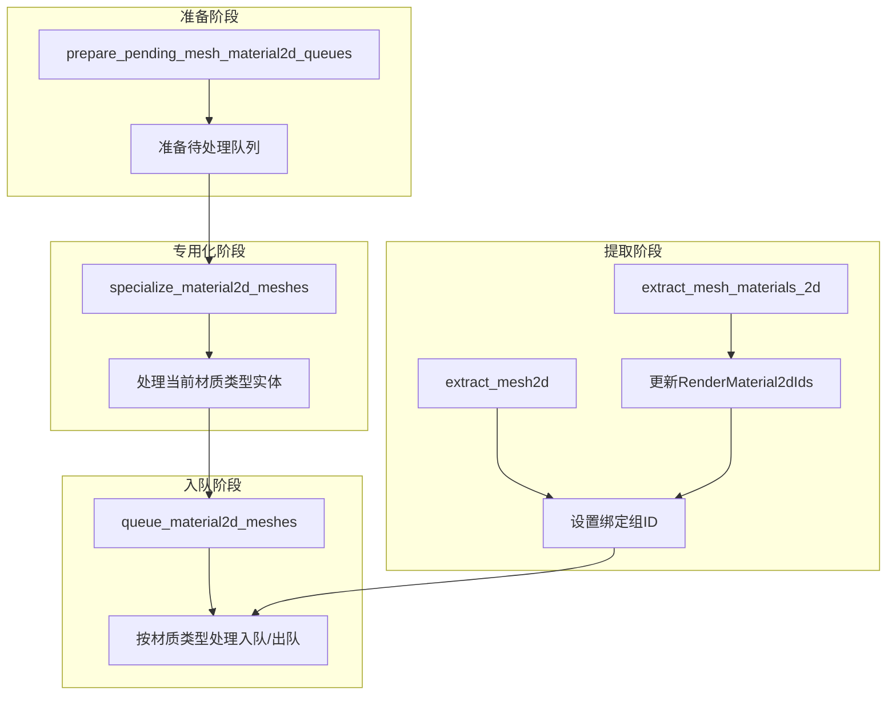

+++
title = "#23083 Fix 2d specialization w/ change lists."
date = "2026-02-22T00:00:00"
draft = false
template = "pull_request_page.html"
in_search_index = false

[extra]
current_language = "zh-cn"
available_languages = {"en" = { name = "English", url = "/pull_request/bevy/2026-02/pr-23083-en-20260222" }, "zh-cn" = { name = "中文", url = "/pull_request/bevy/2026-02/pr-23083-zh-cn-20260222" }}
labels = ["C-Bug", "A-Rendering", "P-Regression"]
+++

# Title
## Basic Information
- **Title**: Fix 2d specialization w/ change lists.
- **PR Link**: https://github.com/bevyengine/bevy/pull/23083
- **Author**: tychedelia
- **Status**: MERGED
- **Labels**: C-Bug, A-Rendering, S-Ready-For-Final-Review, P-Regression
- **Created**: 2026-02-20T21:32:53Z
- **Merged**: 2026-02-22T04:53:04Z
- **Merged By**: alice-i-cecile

## Description Translation
对 #22966 之后 2D 渲染的一些修复。

这很复杂，因为与 3D 不同，2D 材质系统是针对其材质的泛型，而非类型擦除的。这意味着我们必须防范不同材质系统相互竞争时可能出现的各种奇怪情况。

我不确定这是否完全正确。最终的解决方案是摆脱所有这些定制的 2D 系统。

主要的修复点包括：
- `material_bind_group_id` 不再每帧重置为默认值。`extract_mesh2d` 原本在每次提取时设置 `material_bind_group_id`。在此之前，这个值会在后续每帧的队列处理中被覆盖，但有了脏跟踪后，实体不会每帧都重新入队，因此默认值就保留下来了。
- `prepare_for_new_frame` 移动到了一个非泛型系统中。
- 更小心地避免将错误材质类型的实体添加到待处理队列中，否则它们会永远无法被专用化。
- 出队操作不再跨类型覆盖。当视图变脏时，我们之前返回所有可见实体，这在存在多种材质的情况下会带来问题。

## The Story of This Pull Request

这个 PR 开始于开发者注意到，在引入变更列表（change list）优化后，2D 渲染出现了一些回归问题。问题的核心在于，2D 的材质系统是泛型的，这与 3D 的类型擦除系统不同，导致了多材质类型竞争时的复杂性。

第一个主要问题是关于材质绑定组 ID 的生命周期管理。在 `extract_mesh2d` 系统中，每次提取时都会将 `material_bind_group_id` 设置为默认值（`Material2dBindGroupId::default()`）。在旧的渲染循环中，这个默认值会在每帧的 `queue_material2d_meshes` 中被正确的绑定组 ID 覆盖。然而，引入脏跟踪优化后，实体只在必要时才重新入队，这意味着如果实体没有被标记为脏，那么错误的默认绑定组 ID 就会一直保留，导致渲染问题。

修复方法是将绑定组 ID 的查找移到了提取阶段。通过引入两个新的资源来跨材质类型共享信息：
- `RenderMaterial2dIds`: 一个从实体到未类型化材质 ID 的映射
- `RenderMaterial2dBindGroupIds`: 一个从未类型化材质 ID 到实际绑定组 ID 的映射

在 `extract_mesh2d` 中，我们现在查找实体的材质 ID，然后通过该材质 ID 找到对应的绑定组 ID。这确保了实体在提取阶段就获得了正确的绑定组 ID，而不是依赖后续阶段的覆盖。

第二个问题涉及泛型系统与变更列表的交互。原来的 `specialize_material2d_meshes` 系统是一个泛型系统（每个材质类型一个实例），它负责初始化每个视图的待处理队列（`prepare_for_new_frame`）。这导致每个材质类型都会为同一视图初始化队列，造成冗余工作，并且可能产生竞争条件。

解决方案是将队列准备逻辑提取到一个独立的、非泛型的系统 `prepare_pending_mesh_material2d_queues` 中。这个系统在所有材质专用化系统之前运行（通过 `.after(prepare_pending_mesh_material2d_queues)` 顺序约束确保），为所有视图统一准备待处理队列。这消除了冗余，并保证了队列状态的一致性。

第三个问题是关于实体入队和出队的逻辑。之前，当视图变脏时，系统会遍历所有需要出队的实体（包括那些只是对当前材质类型不可见的实体）。这可能导致一种材质类型的系统错误地移除另一种材质类型的实体，因为出队逻辑是基于通用的 `dirty_specializations` 数据，而不是按材质类型过滤的。

新的实现更加精确地处理出队：
1. 只移除那些真正变得不可见或完全丢失网格/材质的实体
2. 对于切换材质类型的实体（在 `changed_renderables` 中），则推迟到入队循环中处理，这样每个材质类型只处理自己的实体
3. 在添加新的渲染项之前，先移除旧项，这样可以安全地处理排序键（bin key）的变化

这些变化共同解决了 2D 渲染在引入变更列表优化后出现的多个问题。虽然作者提到，最终的解决方案可能是重构整个 2D 系统以避免这些复杂性问题，但当前的修复提供了稳定且正确的工作状态。

## Visual Representation



## Key Files Changed

### 1. `crates/bevy_sprite_render/src/mesh2d/material.rs` (+83/-44)
**变更描述**：这是修复的主要文件，包含了对 2D 材质系统的核心逻辑修改。

**关键修改**：
1. 添加了新的资源类型来跟踪材质 ID 和绑定组 ID：
```rust
#[derive(Resource, Default, Deref, DerefMut)]
pub struct RenderMaterial2dBindGroupIds(HashMap<UntypedAssetId, Material2dBindGroupId>);

#[derive(Resource, Default, Deref, DerefMut)]
pub struct RenderMaterial2dIds(MainEntityHashMap<UntypedAssetId>);
```

2. 修改了 `extract_mesh_materials_2d` 函数，现在会更新 `RenderMaterial2dIds` 资源：
```rust
// 之前：只更新 material_instances
fn add_mesh_instance<M>(...)
where M: Material2d {
    material_instances.insert(entity.into(), material.id());
}

// 之后：同时更新两个资源
fn add_mesh_instance<M>(...)
where M: Material2d {
    material_instances.insert(entity.into(), material.id());
    render_material_2d_ids.insert(entity.into(), material.id().into());
}
```

3. 添加了新的非泛型系统 `prepare_pending_mesh_material2d_queues`：
```rust
pub fn prepare_pending_mesh_material2d_queues(
    mut pending_mesh_material2d_queues: ResMut<PendingMeshMaterial2dQueues>,
    views: Query<&ExtractedView>,
) {
    let mut all_views: HashSet<RetainedViewEntity, FixedHasher> = HashSet::default();
    for view in &views {
        all_views.insert(view.retained_view_entity);
        pending_mesh_material2d_queues.prepare_for_new_frame(view.retained_view_entity);
    }
    pending_mesh_material2d_queues.expire_stale_views(&all_views);
}
```

4. 修改了出队逻辑，避免跨材质类型的问题：
```rust
// 之前：使用 iter_to_dequeue 获取所有需要出队的实体
for &main_entity in
    dirty_specializations.iter_to_dequeue(view.retained_view_entity, visible_entities)
{
    transparent_phase.remove(Entity::PLACEHOLDER, main_entity);
    opaque_phase.remove(main_entity);
    alpha_mask_phase.remove(main_entity);
}

// 之后：更精确地选择需要出队的实体
for main_entity in visible_entities
    .removed_entities
    .iter()
    .map(|(_, main_entity)| main_entity)
    .chain(
        dirty_specializations
            .removed_renderables
            .iter()
            .filter(|e| !dirty_specializations.changed_renderables.contains(*e)),
    )
{
    transparent_phase.remove(Entity::PLACEHOLDER, *main_entity);
    opaque_phase.remove(*main_entity);
    alpha_mask_phase.remove(*main_entity);
}
```

### 2. `crates/bevy_sprite_render/src/mesh2d/mesh.rs` (+20/-3)
**变更描述**：修改了 2D 网格的提取逻辑，使用新的资源系统来获取正确的绑定组 ID。

**关键修改**：
1. 初始化新的资源：
```rust
.init_resource::<RenderMaterial2dBindGroupIds>()
.allow_ambiguous_resource::<RenderMaterial2dBindGroupIds>()
.init_resource::<RenderMaterial2dIds>()
.allow_ambiguous_resource::<RenderMaterial2dIds>()
```

2. 在 `extract_mesh2d` 中查找绑定组 ID：
```rust
// 之前：总是使用默认值
material_bind_group_id: Material2dBindGroupId::default(),

// 之后：从资源中查找
let material_bind_group_id = render_material_instances
    .get(&main_entity)
    .and_then(|material_id| render_material_2d_bind_group_ids.get(material_id))
    .copied()
    .unwrap_or_default();
```

## Further Reading
1. [Bevy 渲染管线架构](https://bevyengine.org/learn/quick-start/getting-started/systems/)
2. [ECS 系统中的变更检测](https://bevyengine.org/learn/quick-start/getting-started/change-detection/)
3. [现代图形 API 中的绑定组概念](https://learnopengl.com/Advanced-OpenGL/Advanced-GLSL)
4. [泛型编程在游戏引擎中的应用](https://rust-lang.github.io/api-guidelines/future-proofing.html)