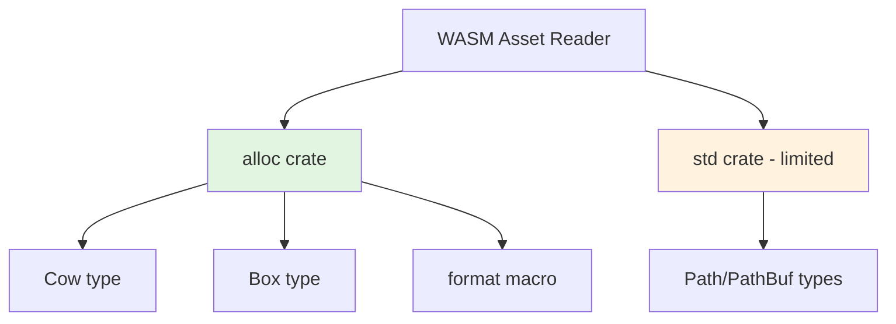

+++
title = "#23084 bevy_assets in wasm: use Cow from alloc"
date = "2026-02-21T00:00:00"
draft = false
template = "pull_request_page.html"
in_search_index = true

[taxonomies]
list_display = ["show"]

[extra]
current_language = "en"
available_languages = {"en" = { name = "English", url = "/pull_request/bevy/2026-02/pr-23084-en-20260221" }, "zh-cn" = { name = "中文", url = "/pull_request/bevy/2026-02/pr-23084-zh-cn-20260221" }}
labels = ["A-Assets", "C-Code-Quality"]
+++

# Title

## Basic Information
- **Title**: bevy_assets in wasm: use Cow from alloc
- **PR Link**: https://github.com/bevyengine/bevy/pull/23084
- **Author**: mockersf
- **Status**: MERGED
- **Labels**: A-Assets, C-Code-Quality, S-Ready-For-Final-Review
- **Created**: 2026-02-20T22:18:43Z
- **Merged**: 2026-02-21T01:03:16Z
- **Merged By**: alice-i-cecile

## Description Translation
The PR description is already in English:

# Objective

- In wasm, bevy_assets uses Cow from std

## Solution

- Use it from alloc

## The Story of This Pull Request

This pull request addresses a specific technical issue related to WebAssembly (WASM) compilation in Bevy's asset system. The problem was straightforward: the WASM implementation of the asset reader was importing the `Cow` (Copy-on-Write) type from Rust's standard library (`std`) instead of from the `alloc` crate. This created a compilation issue for WASM targets because WebAssembly environments often operate in `no_std` contexts where the full standard library isn't available.

The Rust standard library has dependencies on operating system features that don't exist in WASM environments. However, Rust provides the `alloc` crate as a subset of `std` that contains only the heap allocation functionality without OS dependencies. For code that needs to work in both standard and `no_std` environments, types like `Cow`, `String`, `Vec`, and other allocation-dependent types should be imported from `alloc` rather than `std`.

Looking at the WASM asset reader implementation in `wasm.rs`, the code was already structured to work in a `no_std` environment - it imported several types from `alloc` including `ToOwned`, `Box`, and `format`. However, the `Cow` type was accidentally imported from `std::borrow::Cow` instead of `alloc::borrow::Cow`. This inconsistency meant the code wouldn't compile properly for WASM targets that don't have access to the full standard library.

The fix was simple but important: move the `Cow` import from the `std` module to the existing `alloc` import statement. The developer reorganized the imports to group related items together, importing `Cow` and `ToOwned` from `alloc::borrow` in a single statement. This change maintains the same functionality while ensuring compatibility with `no_std` WASM targets.

The implementation change demonstrates a common pattern in Rust cross-platform development: when writing code that needs to work in both standard and `no_std` environments, always import allocation-dependent types from `alloc` rather than `std`. This practice ensures maximum compatibility across different target environments without sacrificing functionality.

The impact of this change is that Bevy's asset system now properly compiles for WASM targets without requiring the full standard library. This is particularly important for web-based game development where WASM is the primary deployment target. The change doesn't affect runtime behavior or performance - it's purely a compilation fix that enables broader compatibility.

## Visual Representation



## Key Files Changed

### `crates/bevy_asset/src/io/wasm.rs` (+6/-5)

This file contains the WebAssembly-specific implementation of the asset reader. The changes fix an import inconsistency that prevented proper compilation for WASM targets operating in `no_std` mode.

**Before:**
```rust
use crate::io::{
    get_meta_path, AssetReader, AssetReaderError, EmptyPathStream, PathStream, Reader, VecReader,
};
use alloc::{borrow::ToOwned, boxed::Box, format};
use js_sys::{Uint8Array, JSON};
use std::{
    borrow::Cow,
    path::{Path, PathBuf},
};
```

**After:**
```rust
use crate::io::{
    get_meta_path, AssetReader, AssetReaderError, EmptyPathStream, PathStream, Reader, VecReader,
};
use alloc::{
    borrow::{Cow, ToOwned},
    boxed::Box,
    format,
};
use js_sys::{Uint8Array, JSON};
use std::path::{Path, PathBuf};
```

The key change is moving the `Cow` import from `std::borrow::Cow` to `alloc::borrow::Cow`. This aligns with the rest of the imports from `alloc` and ensures the code works correctly in `no_std` WASM environments. The `ToOwned` import is also moved into the same `alloc::borrow` import statement for better organization.

## Further Reading

1. [Rust `alloc` crate documentation](https://doc.rust-lang.org/alloc/index.html) - Understanding Rust's allocation library for `no_std` environments
2. [Rust and WebAssembly book](https://rustwasm.github.io/docs/book/) - Comprehensive guide to Rust WASM development
3. [Bevy WASM documentation](https://bevyengine.org/learn/quick-start/platforms/wasm/) - Official Bevy guide for WebAssembly targets
4. [Rust `no_std` programming](https://docs.rust-embedded.org/book/intro/no-std.html) - Introduction to embedded Rust without the standard library

# Full Code Diff
```
diff --git a/crates/bevy_asset/src/io/wasm.rs b/crates/bevy_asset/src/io/wasm.rs
index f44445fa0cf32..517310cc04a74 100644
--- a/crates/bevy_asset/src/io/wasm.rs
+++ b/crates/bevy_asset/src/io/wasm.rs
@@ -1,12 +1,13 @@
 use crate::io::{
     get_meta_path, AssetReader, AssetReaderError, EmptyPathStream, PathStream, Reader, VecReader,
 };
-use alloc::{borrow::ToOwned, boxed::Box, format};
-use js_sys::{Uint8Array, JSON};
-use std::{
-    borrow::Cow,
-    path::{Path, PathBuf},
+use alloc::{
+    borrow::{Cow, ToOwned},
+    boxed::Box,
+    format,
 };
+use js_sys::{Uint8Array, JSON};
+use std::path::{Path, PathBuf};
 use tracing::error;
 use wasm_bindgen::{prelude::wasm_bindgen, JsCast, JsValue};
 use wasm_bindgen_futures::JsFuture;
```