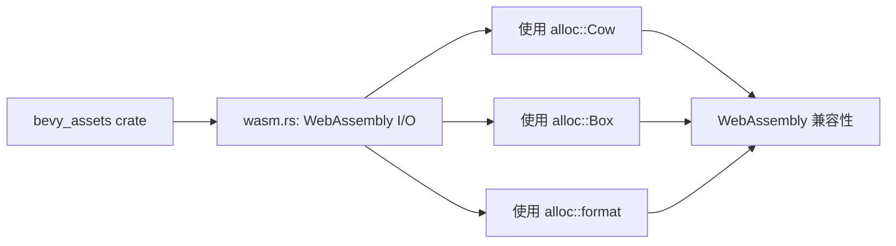

+++
title = "#23084 bevy_assets in wasm: use Cow from alloc"
date = "2026-02-21T00:00:00"
draft = false
template = "pull_request_page.html"
in_search_index = false

[extra]
current_language = "zh-cn"
available_languages = {"en" = { name = "English", url = "/pull_request/bevy/2026-02/pr-23084-en-20260221" }, "zh-cn" = { name = "中文", url = "/pull_request/bevy/2026-02/pr-23084-zh-cn-20260221" }}
+++

# Title

## 基本信息
- **标题**: bevy_assets in wasm: use Cow from alloc
- **PR链接**: https://github.com/bevyengine/bevy/pull/23084
- **作者**: mockersf
- **状态**: 已合并
- **标签**: A-Assets, C-Code-Quality, S-Ready-For-Final-Review
- **创建时间**: 2026-02-20T22:18:43Z
- **合并时间**: 2026-02-21T01:03:16Z
- **合并者**: alice-i-cecile

## 描述翻译
### 目标
- 在 WebAssembly (wasm) 环境中，bevy_assets 使用了来自 std 的 Cow 类型

### 解决方案
- 改用来自 alloc 的 Cow 类型

## 这个PR的故事

这个PR解决了一个在WebAssembly环境下的代码一致性问题。bevy_assets是Bevy游戏引擎的资源管理系统，需要支持多种目标平台，包括WebAssembly。WebAssembly环境有其特殊性，特别是在标准库支持方面。

问题出现在`wasm.rs`文件中的导入语句。这个文件专门处理WebAssembly平台的资源I/O操作。原始代码中混合使用了来自不同crate的导入：`alloc`用于一些基础类型，但`Cow`却从`std::borrow`导入。在WebAssembly环境中，`std` crate可能不完全可用或者有额外的依赖，而`alloc` crate是专门为无标准库环境设计的，提供了内存分配相关的核心功能。

从技术角度看，`Cow`（Copy-on-Write）类型在两个crate中都存在，功能相同，但来源不同。在WebAssembly环境下，应该优先使用`alloc`中的版本，因为：
1. 代码已经大量使用了`alloc`中的其他类型（如`Box`、`format`）
2. 保持导入来源的一致性
3. 避免在WebAssembly环境中引入不必要的`std`依赖

解决方法是简单的重构：将`Cow`的导入从`std::borrow::Cow`改为`alloc::borrow::Cow`。同时，代码重新组织了导入语句，将相关的导入分组在一起，提高了代码的可读性。

这个变化虽然小，但对于WebAssembly构建的健壮性很重要。它确保了在资源受限或无标准库环境中，代码能够正确编译和运行。这种关注跨平台兼容性的细节体现了Bevy团队对代码质量的重视。

## 可视化表示



## 关键文件变更

### `crates/bevy_asset/src/io/wasm.rs` (+6/-5)

这个文件包含了Bevy资源系统在WebAssembly平台上的具体实现。主要变化是重新组织了导入语句，将`Cow`类型从`std`的导入改为从`alloc`导入。

**变更前：**
```rust
use alloc::{borrow::ToOwned, boxed::Box, format};
use js_sys::{Uint8Array, JSON};
use std::{
    borrow::Cow,
    path::{Path, PathBuf},
};
```

**变更后：**
```rust
use alloc::{
    borrow::{Cow, ToOwned},
    boxed::Box,
    format,
};
use js_sys::{Uint8Array, JSON};
use std::path::{Path, PathBuf};
```

主要变化：
1. 将`Cow`从`std::borrow::Cow`移动到`alloc::borrow::Cow`
2. 重新组织了`alloc`的导入，将所有相关导入放在一个use语句中
3. `std`的导入现在只包含`path`模块，因为`Cow`已经被移除

这些变化确保在WebAssembly环境中，代码完全依赖于`alloc` crate而不是`std`，这对于无标准库环境很重要。

## 延伸阅读

1. Rust官方文档 - `alloc` crate: https://doc.rust-lang.org/alloc/
2. Rust官方文档 - `Cow`类型: https://doc.rust-lang.org/std/borrow/enum.Cow.html
3. The Rustonomicon - 无标准库编程: https://doc.rust-lang.org/nomicon/
4. WebAssembly与Rust: https://rustwasm.github.io/docs/book/
5. Bevy引擎WebAssembly支持文档: https://bevyengine.org/learn/quick-start/platforms/wasm/

# 完整代码差异
```diff
diff --git a/crates/bevy_asset/src/io/wasm.rs b/crates/bevy_asset/src/io/wasm.rs
index f44445fa0cf32..517310cc04a74 100644
--- a/crates/bevy_asset/src/io/wasm.rs
+++ b/crates/bevy_asset/src/io/wasm.rs
@@ -1,12 +1,13 @@
 use crate::io::{
     get_meta_path, AssetReader, AssetReaderError, EmptyPathStream, PathStream, Reader, VecReader,
 };
-use alloc::{borrow::ToOwned, boxed::Box, format};
-use js_sys::{Uint8Array, JSON};
-use std::{
-    borrow::Cow,
-    path::{Path, PathBuf},
+use alloc::{
+    borrow::{Cow, ToOwned},
+    boxed::Box,
+    format,
 };
+use js_sys::{Uint8Array, JSON};
+use std::path::{Path, PathBuf};
 use tracing::error;
 use wasm_bindgen::{prelude::wasm_bindgen, JsCast, JsValue};
 use wasm_bindgen_futures::JsFuture;
```