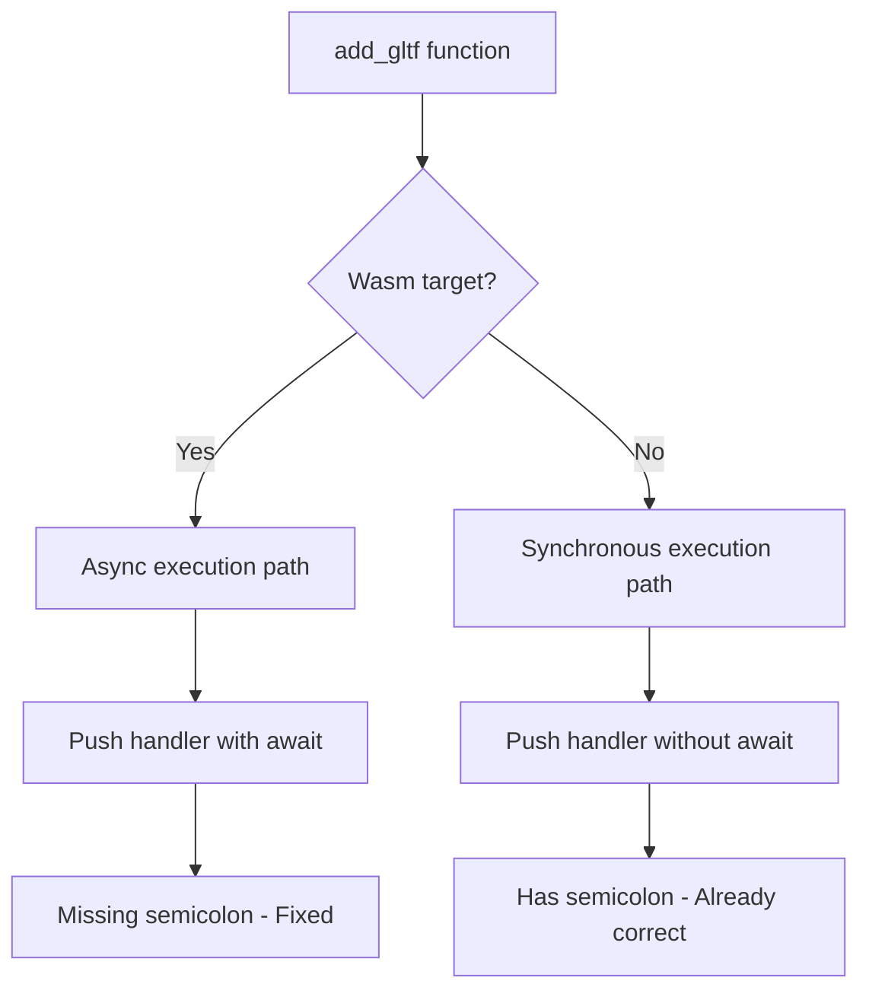

+++
title = "#23085 bevy_pbr format in wasm"
date = "2026-02-21T00:00:00"
draft = false
template = "pull_request_page.html"
in_search_index = true

[taxonomies]
list_display = ["show"]

[extra]
current_language = "en"
available_languages = {"en" = { name = "English", url = "/pull_request/bevy/2026-02/pr-23085-en-20260221" }, "zh-cn" = { name = "中文", url = "/pull_request/bevy/2026-02/pr-23085-zh-cn-20260221" }}
labels = ["D-Trivial", "C-Code-Quality"]
+++

# Title: bevy_pbr format in wasm

## Basic Information
- **Title**: bevy_pbr format in wasm
- **PR Link**: https://github.com/bevyengine/bevy/pull/23085
- **Author**: mockersf
- **Status**: MERGED
- **Labels**: D-Trivial, C-Code-Quality, S-Ready-For-Final-Review
- **Created**: 2026-02-20T22:46:54Z
- **Merged**: 2026-02-21T01:24:49Z
- **Merged By**: mockersf

## Description Translation

```
error: consider adding a `;` to the last statement for consistent formatting
  --> crates/bevy_pbr/src/gltf.rs:16:9
   |
16 | /         app.world_mut()
17 | |             .resource_mut::<GltfExtensionHandlers>()
18 | |             .0
19 | |             .write()
20 | |             .await
21 | |             .push(Box::new(GltfExtensionHandlerPbr))
   | |____________________________________________________^
   |
   = help: for further information visit https://rust-lang.github.io/rust-clippy/beta/index.html#semicolon_if_nothing_returned
   = note: `-D clippy::semicolon-if-nothing-returned` implied by `-D warnings`
   = help: to override `-D warnings` add `#[allow(clippy::semicolon_if_nothing_returned)]`
help: add a `;` here
   |
16 |         app.world_mut()
...
20 |             .await
21 ~             .push(Box::new(GltfExtensionHandlerPbr));
```

do it

## The Story of This Pull Request

This PR addresses a straightforward Clippy lint warning in Bevy's Physically Based Rendering (PBR) module. The issue involves a missing semicolon in a conditional compilation block for WebAssembly targets, which violates Rust's consistent formatting guidelines.

The problem originated from a subtle inconsistency in the codebase. Within the `add_gltf` function in the `gltf.rs` module, two conditional compilation blocks handle different execution environments. The WebAssembly (`wasm`) version lacked a terminating semicolon on the final statement, while the non-WebAssembly version correctly included one. This inconsistency triggered Clippy's `semicolon-if-nothing-returned` warning when the code was compiled with strict warnings enabled.

The solution approach is minimal and focused: add the missing semicolon to match Rust's idiomatic style and resolve the lint warning. No architectural changes were needed since the functional behavior of the code remains identical with or without the semicolon. This is a pure formatting fix that improves code consistency across the codebase.

Looking at the implementation details, the `add_gltf` function registers a GLTF extension handler for PBR materials. The function uses conditional compilation to handle asynchronous execution differently between WebAssembly and native targets due to WebAssembly's different concurrency model. Both code paths perform the same operation—pushing a `GltfExtensionHandlerPbr` box into a resource's collection—but the WebAssembly version uses async/await syntax.

The technical insight here is about Rust's expression-oriented nature and statement termination. In Rust, expressions return values, while statements end with semicolons and discard their return values. The Clippy warning emphasizes consistent style: when the last expression in a block isn't being used for its return value (as in this case where it's being called for its side effect), it should be terminated with a semicolon to make it a statement. This clarity helps readers understand that the return value (`()` in this case) isn't being used.

The impact of this change is minimal from a functional perspective but contributes to code quality maintenance. Consistent formatting reduces cognitive load for developers reading the code and ensures that lint checks pass without warnings. For teams enforcing strict linting policies, such fixes prevent build failures and maintain a clean codebase. The change also demonstrates Bevy's commitment to code quality standards, even for minor formatting issues.

## Visual Representation



## Key Files Changed

### `crates/bevy_pbr/src/gltf.rs` (+1/-1)

This file contains the GLTF extension handling logic for Bevy's PBR module. The change fixes a missing semicolon in the WebAssembly-specific conditional compilation block to match Rust's formatting conventions and resolve a Clippy warning.

**Key modifications:**

```rust
// File: crates/bevy_pbr/src/gltf.rs
// Before (lines 13-21):
#[cfg(target_family = "wasm")]
app.world_mut()
    .resource_mut::<GltfExtensionHandlers>()
    .0
    .write()
    .await
    .push(Box::new(GltfExtensionHandlerPbr))

// After (lines 13-21):
#[cfg(target_family = "wasm")]
app.world_mut()
    .resource_mut::<GltfExtensionHandlers>()
    .0
    .write()
    .await
    .push(Box::new(GltfExtensionHandlerPbr));
```

The change adds a semicolon at the end of the statement in the WebAssembly conditional block, making it consistent with the non-WebAssembly block below it and resolving the Clippy warning about consistent formatting.

## Further Reading

1. **Rust Clippy Documentation**: [semicolon-if-nothing-returned](https://rust-lang.github.io/rust-clippy/master/index.html#semicolon_if_nothing_returned) - Official documentation for the specific Clippy lint addressed in this PR.

2. **Rust Style Guide**: [Statements and Expressions](https://doc.rust-lang.org/book/ch03-03-how-functions-work.html#statements-and-expressions) - Understanding the difference between expressions and statements in Rust, which is fundamental to this fix.

3. **Bevy Conditional Compilation**: [Conditional Compilation in Bevy](https://bevyengine.org/learn/advanced-topics/conditional-compilation/) - How Bevy uses conditional compilation for platform-specific code, particularly for WebAssembly targets.

4. **Rust WebAssembly Guide**: [Async/Await in WebAssembly](https://rustwasm.github.io/docs/wasm-bindgen/whirlwind-tour/async-await.html) - Understanding the async/await patterns in WebAssembly Rust code, which explains why the WebAssembly path uses async syntax.

5. **GLTF Extension System**: [Bevy GLTF Documentation](https://docs.rs/bevy/latest/bevy/gltf/struct.GltfExtensionHandlers.html) - Documentation for Bevy's GLTF extension handler system that this code modifies.

# Full Code Diff
```
diff --git a/crates/bevy_pbr/src/gltf.rs b/crates/bevy_pbr/src/gltf.rs
index 9923a8d74a079..ef9e67bcacc57 100644
--- a/crates/bevy_pbr/src/gltf.rs
+++ b/crates/bevy_pbr/src/gltf.rs
@@ -18,7 +18,7 @@ pub(crate) fn add_gltf(app: &mut App) {
             .0
             .write()
             .await
-            .push(Box::new(GltfExtensionHandlerPbr))
+            .push(Box::new(GltfExtensionHandlerPbr));
     });
 
     #[cfg(not(target_family = "wasm"))]
```