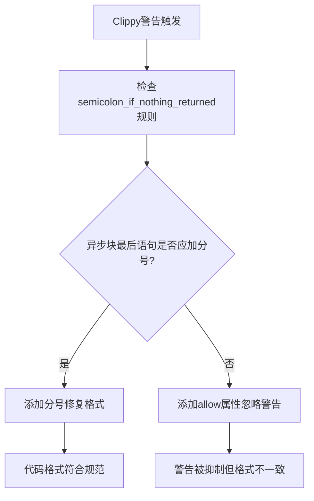

+++
title = "#23085 bevy_pbr format in wasm"
date = "2026-02-21T00:00:00"
draft = false
template = "pull_request_page.html"
in_search_index = false

[extra]
current_language = "zh-cn"
available_languages = {"en" = { name = "English", url = "/pull_request/bevy/2026-02/pr-23085-en-20260221" }, "zh-cn" = { name = "中文", url = "/pull_request/bevy/2026-02/pr-23085-zh-cn-20260221" }}
+++

# Title
## bevy_pbr format in wasm

## 基本信息
- **标题**: bevy_pbr format in wasm
- **PR链接**: https://github.com/bevyengine/bevy/pull/23085
- **作者**: mockersf
- **状态**: 已合并
- **标签**: D-Trivial, C-Code-Quality, S-Ready-For-Final-Review
- **创建时间**: 2026-02-20T22:46:54Z
- **合并时间**: 2026-02-21T01:24:49Z
- **合并者**: mockersf

## 描述翻译
```
error: consider adding a `;` to the last statement for consistent formatting
  --> crates/bevy_pbr/src/gltf.rs:16:9
   |
16 | /         app.world_mut()
17 | |             .resource_mut::<GltfExtensionHandlers>()
18 | |             .0
19 | |             .write()
20 | |             .await
21 | |             .push(Box::new(GltfExtensionHandlerPbr))
   | |____________________________________________________^
   |
   = help: for further information visit https://rust-lang.github.io/rust-clippy/beta/index.html#semicolon_if_nothing_returned
   = note: `-D clippy::semicolon-if-nothing-returned` implied by `-D warnings`
   = help: to override `-D warnings` add `#[allow(clippy::semicolon_if_nothing_returned)]`
help: add a `;` here
   |
16 |         app.world_mut()
...
20 |             .await
21 ~             .push(Box::new(GltfExtensionHandlerPbr));
```

执行修复

## 本次Pull Request的完整分析

这次PR的核心是解决一个Clippy警告。开发者在编译项目时，Rust的代码质量检查工具Clippy报告了一个关于代码格式一致性的问题，具体涉及一个缺失的分号。

问题出现在`bevy_pbr`模块的gltf.rs文件中，在一个async块中的最后一条语句缺少了分号。根据Clippy的`semicolon_if_nothing_returned`规则，当函数或块的最后一个表达式不返回值时，应该添加分号以保持格式一致性。这个规则是代码格式化标准的一部分，有助于提高代码的可读性和维护性。

从技术角度看，这个修复虽然微小，但体现了对代码质量标准的严格遵守。在Bevy这样的游戏引擎项目中，保持代码质量非常重要，因为即使是小的格式问题也可能影响团队的协作效率和代码审查流程。

修复方法非常简单直接：在异步块的最后一行语句末尾添加分号。原代码中，第21行调用`.push(Box::new(GltfExtensionHandlerPbr))`后没有分号，而根据Rust的语法，在async块中如果最后一个表达式不返回值，应该以分号结束。

这个修改对功能没有任何影响，纯粹是代码格式的优化。然而，在软件开发中，保持代码格式一致性是一个重要的工程实践。它使得：
1. 代码审查更加高效，审查者可以专注于逻辑而非格式问题
2. 自动化工具（如Clippy、rustfmt）能够更好地工作
3. 团队协作更加顺畅，所有开发者遵循相同的代码风格

从架构角度看，这段代码位于glTF扩展处理器的初始化路径中。glTF是Bevy引擎支持的一种3D模型格式，而`GltfExtensionHandlerPbr`是处理PBR（基于物理的渲染）相关扩展的处理器。这个async块在非WASM环境下运行，用于向glTF扩展处理器列表中添加PBR处理器。

值得注意的是，这个PR还显示了Bevy项目对代码质量的高标准。项目配置了严格的警告检查（`-D warnings`），这包括Clippy的`semicolon-if-nothing-returned`规则。这种严格的配置有助于在开发早期发现潜在问题，而不是等到代码合并后才修复。

## 可视化表示



## 关键文件变更

### `crates/bevy_pbr/src/gltf.rs` (+1/-1)

这个文件包含了glTF格式支持的实现，特别是PBR（基于物理的渲染）相关的扩展处理器。

**变更描述**: 修复了Clippy警告，在一个异步块的最后一条语句末尾添加了分号，以符合`clippy::semicolon_if_nothing_returned`规则的要求。

**代码对比**:
```rust
// 修复前:
async {
    app.world_mut()
        .resource_mut::<GltfExtensionHandlers>()
        .0
        .write()
        .await
        .push(Box::new(GltfExtensionHandlerPbr))  // 缺少分号
}

// 修复后:
async {
    app.world_mut()
        .resource_mut::<GltfExtensionHandlers>()
        .0
        .write()
        .await
        .push(Box::new(GltfExtensionHandlerPbr));  // 添加了分号
}
```

**与PR目的的关联**: 这个变更直接解决了PR描述中提到的Clippy警告，确保了代码格式的一致性。虽然变更很小，但它体现了对代码质量标准的遵守。

## 进一步阅读

1. **Rust Clippy文档**: https://rust-lang.github.io/rust-clippy/
   - 特别是`semicolon_if_nothing_returned`规则的详细说明

2. **Rust异步编程指南**: https://rust-lang.github.io/async-book/
   - 理解async块和语句的语法

3. **Bevy引擎glTF支持文档**: https://bevyengine.org/learn/3d/gltf
   - 了解glTF在Bevy中的实现和使用

4. **Rust代码格式化标准**: https://github.com/rust-lang/rfcs/blob/master/text/2436-style-guide.md
   - Rust社区推荐的代码风格指南

# 完整代码差异
```diff
diff --git a/crates/bevy_pbr/src/gltf.rs b/crates/bevy_pbr/src/gltf.rs
index 9923a8d74a079..ef9e67bcacc57 100644
--- a/crates/bevy_pbr/src/gltf.rs
+++ b/crates/bevy_pbr/src/gltf.rs
@@ -18,7 +18,7 @@ pub(crate) fn add_gltf(app: &mut App) {
             .0
             .write()
             .await
-            .push(Box::new(GltfExtensionHandlerPbr))
+            .push(Box::new(GltfExtensionHandlerPbr));
     });
 
     #[cfg(not(target_family = "wasm"))]
```