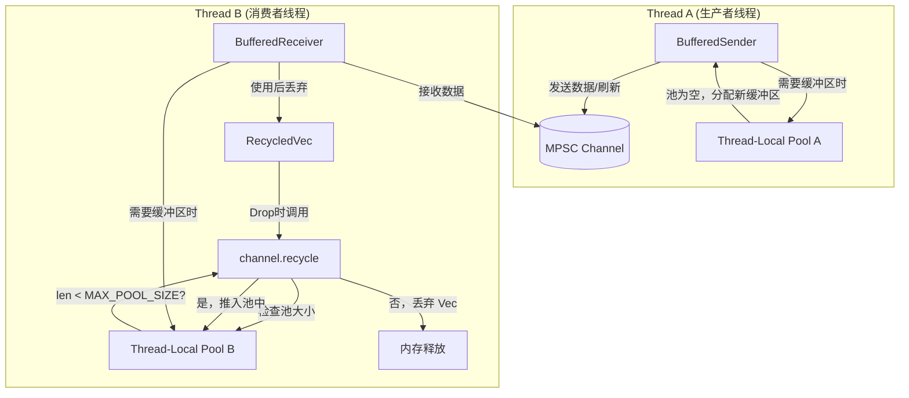

+++
title = "#23086 Fix buffered channel memory leak"
date = "2026-02-21T00:00:00"
draft = false
template = "pull_request_page.html"
in_search_index = false

[extra]
current_language = "zh-cn"
available_languages = {"en" = { name = "English", url = "/pull_request/bevy/2026-02/pr-23086-en-20260221" }, "zh-cn" = { name = "中文", url = "/pull_request/bevy/2026-02/pr-23086-zh-cn-20260221" }}
labels = ["C-Bug", "P-Regression", "A-Transform", "A-Tasks"]
+++

# Fix buffered channel memory leak

## Basic Information
- **Title**: Fix buffered channel memory leak
- **PR Link**: https://github.combevyengine/bevy/pull/23086
- **Author**: aevyrie
- **Status**: MERGED
- **Labels**: C-Bug, S-Ready-For-Final-Review, P-Regression, A-Transform, A-Tasks
- **Created**: 2026-02-20T23:05:09Z
- **Merged**: 2026-02-21T11:08:19Z
- **Merged By**: mockersf

## Description Translation
### 目标
- 修复一个当生产者和消费者在不同线程且永不切换时可能发生的内存泄漏问题。

### 解决方案
- 为对象池设置一个最大尺寸以避免无限制的增长。

### 测试
- 在 `bevy_city` 项目中使用移动的汽车复现了内存泄漏。
- 验证了应用此补丁后泄漏不再出现。

关闭了 #23038
该问题由 #22297 引入

## The Story of This Pull Request

这个PR修复了Bevy引擎中 `buffered_channel` 模块存在的一个边界情况下的内存泄漏问题。问题的根源在于一个为性能而设计的对象池（Object Pool）逻辑存在缺陷，在特定线程调度模式下会无限增长。

**问题根源：意外的无界增长**
`BufferedChannel` 是一个用于在系统间高效传递数据（特别是`Vec<T>`类型数据）的通道。为了提高性能，它实现了一个对象池机制：当发送方（`BufferedSender`）或接收方（`BufferedReceiver`）使用完一个`Vec`缓冲区后，不会立即释放其内存，而是将其清空并放入一个线程本地（thread-local）的对象池中。这样，下次需要新的缓冲区时，可以直接从池中取出复用，避免频繁的内存分配。

然而，泄漏的发生与这个线程本地池的交互方式有关。在PR #22297的原始实现中，无论是发送方刷空缓冲区（`flush`），还是接收方持有的`RecycledVec`被丢弃（`Drop`），都会无条件地将清空后的`Vec`推入其所属线程的本地池中。这里存在一个关键假设：生产者和消费者会定期切换线程，或者共享同一个线程本地池。

但现实场景可能打破这个假设。考虑一个典型的“生产者-消费者”模式，如果生产者线程持续在`thread A`上运行并发送数据，而消费者线程持续在``thread B`上运行并接收数据，那么：
1.  生产者在`thread A`上创建缓冲区，发送后，缓冲区被移动到通道中，最终被消费者在`thread B`上接收。
2.  消费者在`thread B`上使用完缓冲区后，`RecycledVec`的`Drop`实现会将该缓冲区推入`thread B`的本地池。
3.  之后，当`thread A`上的生产者需要新的缓冲区时，它会从`thread A`的本地池中获取。但由于缓冲区都被回收到了`thread B`的池里，`thread A`的池始终为空，导致生产者必须持续分配新的缓冲区。
4.  与此同时，`thread B`的本地池会持续接收来自消费者的、被清空的缓冲区。由于原始实现没有设置上限，这个池会随着消息的传递无限增长，造成内存泄漏。

**解决方案：为池设置容量上限**
修复方案直接且有效：为每个线程本地对象池引入一个最大容量（`MAX_POOL_SIZE`）。当需要回收一个缓冲区时，首先检查当前线程的池是否已满。如果未满，则将其放入池中以备复用；如果已满，则直接丢弃该缓冲区，让Rust的内存管理器回收其内存。

这个方案引入了一个新的常量和方法：
- `const MAX_POOL_SIZE: usize = 8`: 定义了池的最大容量。选择8作为容量是一个工程上的权衡，既能缓存足够多的缓冲区以减少常见情况下的分配开销，又能严格防止无限制增长。
- `fn recycle(&self, mut chunk: Vec<T>)`: 这是新增的核心方法，封装了回收逻辑。它首先检查缓冲区的容量是否符合复用标准（大于等于`chunk_size`），然后检查当前线程本地池的长度。只有池未满时，才会将清空后的`Vec`推入池中。

**实现的调整**
修复方案涉及对两处现有代码的修改：
1.  `RecycledVec<'a, T>` 的 `Drop` 实现：原本直接操作`pool`，现在改为调用统一的`channel.recycle(buffer)`方法。
2.  `BufferedSender<'a, T>` 的 `flush` 方法：在发送空缓冲区时，原本也是直接推入池中，现在同样改为调用`channel.recycle(buffer)`。此外，`flush`方法从私有（`fn`）改为公开（`pub fn`），这可能是为了方便用户手动控制刷新时机，虽然这与修复泄漏本身关系不大。

**修复的效果与验证**
这个修复确保了在任何线程调度模式下，每个线程本地对象池的内存占用量都不会超过 `MAX_POOL_SIZE * (单个 Vec 的容量)`。这是一个确定的上界，彻底解决了无界增长导致的内存泄漏问题。
PR作者在描述中提到，他们成功在`bevy_city`示例中复现了由移动汽车触发的泄漏，并在应用此补丁后确认泄漏消失。这证实了修复方案的有效性。

**技术要点总结**
这是一个典型的“功能在正确性边界上失效”的案例。对象池模式旨在提升性能，但其实现必须仔细考虑资源生命周期和所有边界条件，尤其是在多线程环境中。这里的教训是：**任何缓存或池化机制都必须有一个明确的逐出（eviction）或大小限制策略，以防止资源耗尽**。简单的“无限缓存”策略在动态系统中往往是危险的。

## Visual Representation



## Key Files Changed

### `crates/bevy_utils/src/buffered_channel.rs` (+21/-5)

这是本次PR唯一修改的文件。改动引入了一个对象池容量限制，以修复特定多线程场景下的内存泄漏。

**1. 新增 `recycle` 方法及常量**
这是修复的核心逻辑，为 `BufferedChannel<T>` 实现添加了一个最大池大小常量和一个统一的回收方法。
```rust
// 新增代码:
impl<T: Send> BufferedChannel<T> {
    const MAX_POOL_SIZE: usize = 8; // 定义池的最大容量

    fn recycle(&self, mut chunk: Vec<T>) {
        if chunk.capacity() < self.chunk_size {
            return; // 容量太小的缓冲区不值得回收
        }
        chunk.clear();
        let mut pool = self.pool.borrow_local_mut();
        if pool.len() < Self::MAX_POOL_SIZE {
            // 关键修改：只在池未满时才回收缓冲区
            // 避免了因生产者和消费者线程不切换导致的内存泄漏
            pool.push(chunk);
        }
        // 如果池已满，chunk 在这里被丢弃，内存得以释放
    }
}
```

**2. 修改 `RecycledVec` 的 `Drop` 实现**
将原来直接操作对象池的逻辑改为调用新的 `recycle` 方法。
```rust
// 修改后的代码:
impl<'a, T: Send> Drop for RecycledVec<'a, T> {
    fn drop(&mut self) {
        if let Some(buffer) = self.buffer.take() {
            self.channel.recycle(buffer); // 改为调用统一的回收方法
        }
    }
}

// 修改前的逻辑（供对比）:
// fn drop(&mut self) {
//     if let Some(mut buffer) = self.buffer.take() {
//         buffer.clear();
//         self.channel.pool.borrow_local_mut().push(buffer); // 直接推入，无限制
//     }
// }
```

**3. 修改 `BufferedSender` 的 `flush` 方法**
在刷新空缓冲区时，同样改为调用 `recycle` 方法。此外，该方法被改为 `pub`。
```rust
// 修改后的代码:
pub fn flush(&mut self) { // 方法变为公开
    if let Some(buffer) = self.buffer.take() {
        if !buffer.is_empty() {
            let _ = bevy_platform::future::block_on(self.tx.send(buffer));
        } else {
            // 对于空缓冲区，也使用 recycle 方法
            self.channel.recycle(buffer);
        }
    }
}

// 修改前的逻辑（供对比，仅展示else分支）:
// } else {
//     self.channel.pool.borrow_local_mut().push(buffer); // 直接推入，无限制
// }
```

## Further Reading
1.  **MPSC Channels**: 了解多生产者单消费者通道的基本原理，这是`BufferedChannel`的基础。
    *   [Rust `std::sync::mpsc` documentation](https://doc.rust-lang.org/std/sync/mpsc/index.html)
2.  **Memory Pool Pattern (对象池模式)**: 学习这种用于提升性能、减少内存分配次数的设计模式及其常见陷阱。
    *   Wikipedia: [Object Pool Pattern](https://en.wikipedia.org/wiki/Object_pool_pattern)
3.  **Rust Ownership and Drop Trait**: 理解Rust的所有权系统和`Drop`特征如何自动管理资源生命周期，这是`RecycledVec`能自动回收缓冲区的关键。
    *   [The Rust Programming Language: Drop](https://doc.rust-lang.org/book/ch15-03-drop.html)
4.  **Thread-Local Storage (线程本地存储)**: 了解`thread_local!`宏和`LocalKey`，这是实现线程本地对象池的机制。
    *   [Rust `std::thread::LocalKey` documentation](https://doc.rust-lang.org/std/thread/struct.LocalKey.html)