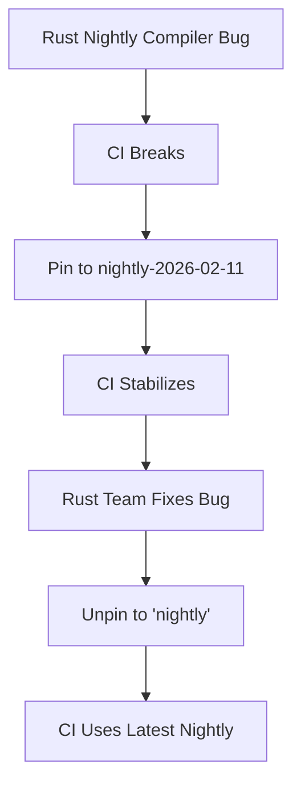

+++
title = "#23088 unpin nightly in CI"
date = "2026-02-21T00:00:00"
draft = false
template = "pull_request_page.html"
in_search_index = true

[taxonomies]
list_display = ["show"]

[extra]
current_language = "en"
available_languages = {"en" = { name = "English", url = "/pull_request/bevy/2026-02/pr-23088-en-20260221" }, "zh-cn" = { name = "中文", url = "/pull_request/bevy/2026-02/pr-23088-zh-cn-20260221" }}
labels = ["D-Trivial", "A-Build-System"]
+++

# Title

## Basic Information
- **Title**: unpin nightly in CI
- **PR Link**: https://github.com/bevyengine/bevy/pull/23088
- **Author**: mockersf
- **Status**: MERGED
- **Labels**: D-Trivial, A-Build-System, S-Ready-For-Final-Review
- **Created**: 2026-02-20T23:56:38Z
- **Merged**: 2026-02-21T09:48:43Z
- **Merged By**: mockersf

## Description Translation
Reverts bevyengine/bevy#22927, bug has been fixed in nightly

## The Story of This Pull Request

This PR addresses a straightforward but essential maintenance task in the Bevy game engine's continuous integration (CI) pipeline. The core issue was that the CI workflows had been temporarily pinned to a specific nightly Rust toolchain version (`nightly-2026-02-11`) due to a bug in the Rust nightly compiler that broke the build. With the bug now fixed in the nightly channel, this PR reverts that pin, allowing the CI to use the latest nightly version again.

The context for this change is common in projects that rely on Rust's nightly channel for development. The nightly toolchain provides access to cutting-edge language features and compiler improvements but can occasionally introduce regressions or breaking changes. When such an issue arises, the standard practice is to pin the CI to a known-working nightly version to maintain build stability while the upstream Rust team addresses the problem. This PR represents the follow-up step: once the fix is confirmed in the nightly channel, the pin is removed to resume testing with the latest compiler, ensuring the project stays up-to-date and can catch new issues early.

The solution approach is minimal and surgical. The developer identified the four GitHub Actions workflow files where the `NIGHTLY_TOOLCHAIN` environment variable was set to the pinned version and updated them all to simply `nightly`. This change ensures that the `rustup` tool will install the most recent nightly version available at the time each CI run is executed.

From an engineering perspective, this change involves a calculated trade-off. Pinning provides immediate stability but carries the risk of drifting behind critical fixes or new features. Unpinning restores the project's ability to detect new compiler-related issues early but reintroduces the possibility of nightly breakages. The clean, comment-preserving implementation in this PR demonstrates good CI hygiene—the explanatory comment remains in place to guide future maintainers when similar issues inevitably occur.

The technical impact is immediate: all future CI runs will use the latest nightly Rust compiler. This ensures that Bevy's codebase is continuously validated against the most recent compiler changes, helping to identify new issues promptly. For the development team, this means faster feedback on potential compatibility problems and the ability to adopt new nightly features sooner. The change also simplifies maintenance by removing the need to manually update the pinned version, though it does mean that occasional nightly breakages may require quick responses from the team.

## Visual Representation



## Key Files Changed

All changes follow the same pattern: updating the `NIGHTLY_TOOLCHAIN` environment variable from a specific pinned version to the generic `nightly` channel.

1. **`.github/workflows/ci.yml`** - The main CI workflow that runs tests and builds.
```yaml
# File: .github/workflows/ci.yml
# Before:
# If nightly is breaking CI, modify this variable to target a specific nightly version.
NIGHTLY_TOOLCHAIN: "nightly-2026-02-11"

# After:
# If nightly is breaking CI, modify this variable to target a specific nightly version.
NIGHTLY_TOOLCHAIN: nightly
```

2. **`.github/workflows/docs.yml`** - The workflow that builds and deploys documentation.
```yaml
# File: .github/workflows/docs.yml
# Before:
# If nightly is breaking CI, modify this variable to target a specific nightly version.
NIGHTLY_TOOLCHAIN: "nightly-2026-02-11"

# After:
# If nightly is breaking CI, modify this variable to target a specific nightly version.
NIGHTLY_TOOLCHAIN: nightly
```

3. **`.github/workflows/update-caches.yml`** - The workflow that updates CI dependency caches.
```yaml
# File: .github/workflows/update-caches.yml
# Before:
# If nightly is breaking CI, modify this variable to target a specific nightly version.
NIGHTLY_TOOLCHAIN: "nightly-2026-02-11"

# After:
# If nightly is breaking CI, modify this variable to target a specific nightly version.
NIGHTLY_TOOLCHAIN: nightly
```

4. **`.github/workflows/validation-jobs.yml`** - The workflow that runs additional validation jobs including iOS builds.
```yaml
# File: .github/workflows/validation-jobs.yml
# Before:
# If nightly is breaking CI, modify this variable to target a specific nightly version.
NIGHTLY_TOOLCHAIN: "nightly-2026-02-11"

# After:
# If nightly is breaking CI, modify this variable to target a specific nightly version.
NIGHTLY_TOOLCHAIN: nightly
```

## Further Reading

- [Rustup Toolchain Management](https://rust-lang.github.io/rustup/concepts/toolchains.html) - Official documentation on managing Rust toolchains, including nightly versions
- [GitHub Actions Workflow Syntax](https://docs.github.com/en/actions/using-workflows/workflow-syntax-for-github-actions) - Reference for understanding the YAML structure used in these workflow files
- [Rust Release Channels](https://rust-lang.github.io/rfcs/0507-release-channels.html) - Explanation of Rust's stable, beta, and nightly release channels
- [Continuous Integration Best Practices](https://docs.github.com/en/actions/automating-builds-and-tests/building-and-testing-rust) - GitHub's guide to CI for Rust projects