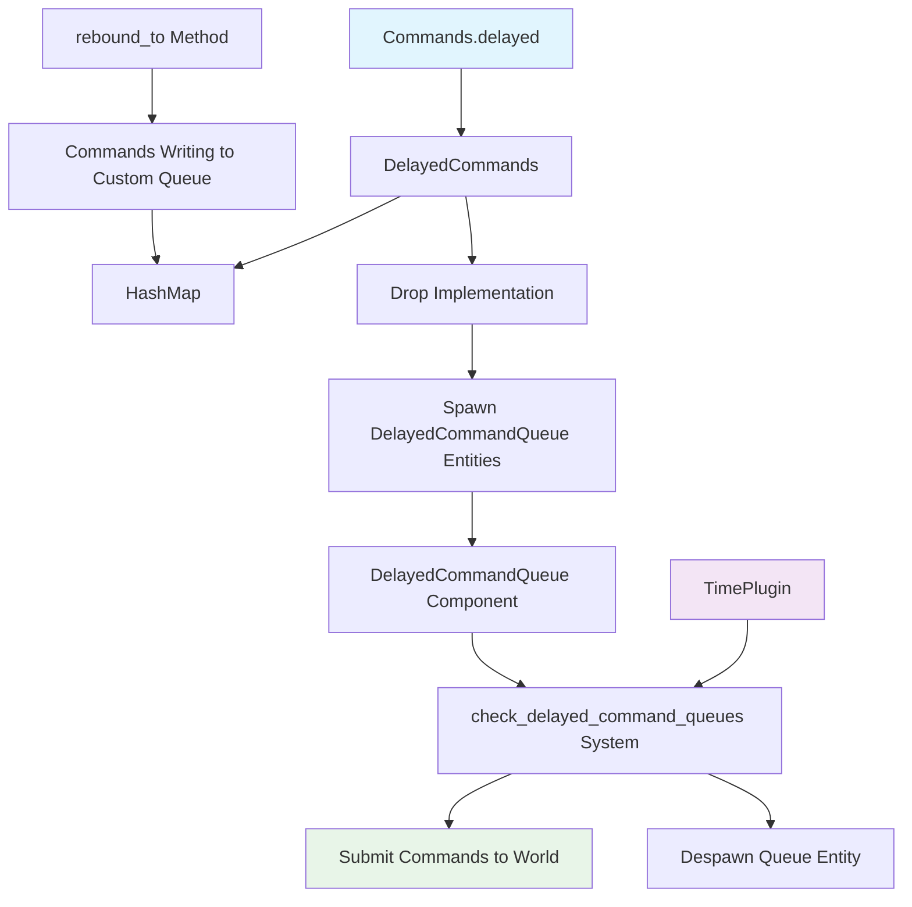

+++
title = "#23090 Add a `DelayedCommands` helper to support arbitrary delayed commands"
date = "2026-02-25T00:00:00"
draft = false
template = "pull_request_page.html"
in_search_index = true

[taxonomies]
list_display = ["show"]

[extra]
current_language = "en"
available_languages = {"en" = { name = "English", url = "/pull_request/bevy/2026-02/pr-23090-en-20260225" }, "zh-cn" = { name = "中文", url = "/pull_request/bevy/2026-02/pr-23090-zh-cn-20260225" }}
labels = ["C-Feature", "A-ECS", "A-Time", "M-Release-Note", "D-Modest"]
+++

# Title
Add a `DelayedCommands` helper to support arbitrary delayed commands

## Basic Information
- **Title**: Add a `DelayedCommands` helper to support arbitrary delayed commands
- **PR Link**: https://github.com/bevyengine/bevy/pull/23090
- **Author**: Runi-c
- **Status**: MERGED
- **Labels**: C-Feature, A-ECS, S-Ready-For-Final-Review, A-Time, M-Release-Note, D-Modest
- **Created**: 2026-02-21T00:42:37Z
- **Merged**: 2026-02-25T00:04:33Z
- **Merged By**: alice-i-cecile

## Description Translation

# Objective

- A generalized mechanism for "doing something later" is desirable for many games, especially when it comes to gameplay logic and VFX.
- Fixes https://github.com/bevyengine/bevy/issues/15129
- Closes #20155

## Solution

- Build off the work in https://github.com/bevyengine/bevy/pull/20155#issuecomment-3702483127, especially @laundmo's comment.
- Add a `DelayedCommands` helper obtainable via `commands.delayed()` that owns `CommandQueue`s and hands out new `Commands` bound to them.
- When the `DelayedCommands` helper is dropped, push spawn commands onto the host `Commands` to spawn the queues as `DelayedCommandQueue` entities.
- The entities are ticked by a new system added by `TimePlugin`. When the timer fires, the queue is submitted onto that system's `Commands`.

## Testing

- Added a new test in `bevy_time` and it seems to work.
- I'm not very familiar with doing hacky things like using `Drop` like this and would therefore appreciate careful review and guidance if changes are requested.

---

## Showcase

```rust
fn my_cool_system(mut commands: Commands) {
    // fairly unobtrusive one-line delayed spawn
    commands.delayed().secs(0.1).spawn(DummyComponent);

    // the DelayedCommands can be stored to reuse more tersely
    let mut delayed = commands.delayed();
    // allocation happens immediately so you can even queue
    // further operations on entities that aren't spawned yet
    let entity = delayed.secs(0.5).spawn_empty().id();
    delayed.secs(0.7).entity(entity).insert(DummyComponent);

    // `delayed.secs` and `delayed.duration` both simply return a
    // `Commands` rebound to the stored `CommandQueue`, so you can additionally
    // just store that and reuse it to queue multiple commands with the same delay
    let mut in_1_sec = delayed.duration(Duration::from_secs_f32(1.0));
    in_1_sec.spawn(DummyComponent);
    in_1_sec.spawn(DummyComponent);
    in_1_sec.spawn(DummyComponent);
}
```

## The Story of This Pull Request

### The Problem and Context
In game development, scheduling actions to occur after a delay is a common requirement. Whether it's spawning projectiles with a wind-up animation, timing power-up effects, or creating visual feedback with delays, developers frequently need to execute ECS commands at specific times in the future. Prior to this PR, Bevy lacked a built-in, general-purpose mechanism for this. Developers had to implement their own solutions using timers, custom components, and systems, which often led to boilerplate code and inconsistent patterns across different projects.

The GitHub issue #15129 specifically requested such a feature, and PR #20155 had previously explored the concept but wasn't merged. This PR builds upon the discussion in that previous PR, particularly leveraging insights from @laundmo's comment about using `CommandQueue` entities with timer components.

### The Solution Approach
The developer chose an approach that integrates cleanly with Bevy's existing ECS patterns. The core insight was to leverage the existing `CommandQueue` type, which already provides deferred command execution, and combine it with timer functionality. Instead of creating an entirely new system, the solution extends the existing `Commands` API with a new `delayed()` method that returns a helper type.

The key design decisions were:
1. **API Ergonomics**: Make the API feel natural as an extension of the existing `Commands` system
2. **Optimization**: Group commands by delay duration to minimize entity creation
3. **Automatic Cleanup**: Use Rust's `Drop` trait to automatically submit delayed commands when the helper goes out of scope
4. **Entity Pre-allocation**: Allow entity IDs to be allocated immediately so they can be referenced in subsequent delayed commands

### The Implementation
The implementation introduces several new components that work together:

**1. Core Data Structures**
The `DelayedCommands` struct is the main interface that developers interact with. It internally maintains a HashMap of `CommandQueue`s keyed by duration:

```rust
pub struct DelayedCommands<'w, 's> {
    /// Used to own queues and deduplicate them by their duration.
    queues: HashMap<Duration, CommandQueue>,
    /// The wrapped `Commands` - used to provision out new `Commands`
    /// and to spawn the queues as entities when the struct is dropped.
    commands: Commands<'w, 's>,
}
```

The `DelayedCommandQueue` component stores the actual command queue along with its scheduled execution time:

```rust
pub struct DelayedCommandQueue {
    /// The elapsed time from startup when `queue` should be submitted.
    pub submit_at: Duration,
    /// The queue to be submitted when time is up.
    pub queue: CommandQueue,
}
```

**2. API Extension Pattern**
The PR follows Bevy's pattern of using extension traits to add functionality to core types. The `DelayedCommandsExt` trait extends `Commands` with the `delayed()` method:

```rust
pub trait DelayedCommandsExt<'w> {
    fn delayed(&mut self) -> DelayedCommands<'w, '_>;
}
```

This pattern keeps the API discoverable and maintains consistency with other Bevy extensions.

**3. Smart Drop Implementation**
The clever use of the `Drop` trait ensures that delayed commands are automatically submitted when the `DelayedCommands` instance goes out of scope:

```rust
impl<'w, 's> Drop for DelayedCommands<'w, 's> {
    fn drop(&mut self) {
        self.submit();
    }
}
```

The `submit()` method converts relative durations to absolute times and spawns `DelayedCommandQueue` entities:

```rust
fn submit(&mut self) {
    let mut queues = self
        .queues
        .drain()
        .map(|(submit_at, queue)| DelayedCommandQueue { submit_at, queue })
        .collect::<Vec<_>>();

    self.commands.queue(move |world: &mut World| {
        let time = world.resource::<Time>();
        let elapsed = time.elapsed();
        for queue in queues.iter_mut() {
            // Turn relative delays into absolute elapsed times
            queue.submit_at += elapsed;
        }
        spawn_batch(queues).apply(world);
    });
}
```

**4. Execution System**
A new system `check_delayed_command_queues` runs in the `PreUpdate` schedule (added by `TimePlugin`) to process delayed commands:

```rust
pub fn check_delayed_command_queues(
    queues: Query<(Entity, &mut DelayedCommandQueue)>,
    time: Res<Time>,
    mut commands: Commands,
) {
    let elapsed = time.elapsed();
    for (e, mut queue) in queues {
        if queue.submit_at <= elapsed {
            // Write the contained delayed commands to the world.
            commands.append(&mut queue.queue);
            commands.entity(e).despawn();
        }
    }
}
```

**5. Supporting Infrastructure**
The PR also adds a new `rebound_to()` method to `Commands` that allows creating a new `Commands` instance bound to a different queue:

```rust
pub fn rebound_to<'q>(&self, queue: &'q mut CommandQueue) -> Commands<'w, 'q> {
    Commands::new_from_entities(queue, self.allocator, self.entities)
}
```

This is essential for the implementation because it allows `DelayedCommands` to create `Commands` instances that write to its internal queues instead of the main world queue.

### Technical Insights
**Entity ID Pre-allocation**: One of the subtle but important features is that entity IDs are allocated immediately when `spawn_empty()` is called, even though the entity won't be created until the delay expires. This allows developers to reference the entity in subsequent delayed commands, enabling patterns like:

```rust
let entity = delayed.secs(0.5).spawn_empty().id();
delayed.secs(0.7).entity(entity).insert(DummyComponent);
```

**Duration Deduplication**: By using a HashMap keyed by duration, the implementation efficiently groups all commands with the same delay into a single `DelayedCommandQueue` entity. This reduces entity count and improves performance for scenarios where many commands share the same delay.

**Time Conversion**: The implementation converts relative durations to absolute elapsed times during submission. This ensures that delays are measured from the time of submission rather than from when the command was originally queued, which is more intuitive for game logic.

**Limitation Note**: The implementation currently only works with the default `Time` resource (virtual time). The documentation explicitly notes this limitation and suggests that developers needing custom clock behavior should implement their own solution.

### The Impact
This PR provides a clean, ergonomic solution for a common game development requirement. The API is designed to be intuitive for developers already familiar with Bevy's `Commands` system. The implementation is efficient, leveraging existing ECS patterns while adding minimal overhead.

The feature enables new gameplay patterns and visual effects that were previously more cumbersome to implement. For example, the included demo shows how to create ripple effects with distance-based delays, which would have required custom timer management before this PR.

From a codebase perspective, the changes are well-contained:
- A new module in `bevy_time` for the delayed commands functionality
- A small addition to the `Commands` API for queue rebinding
- Integration into `TimePlugin` to run the checking system
- Documentation and examples to demonstrate usage

The implementation also serves as a good example of how to extend Bevy's ECS patterns in a way that feels native to the engine.

## Visual Representation



## Key Files Changed

### `crates/bevy_time/src/delayed_commands.rs` (+224/-0)
This new file contains the core implementation of the delayed commands feature:
- `DelayedCommands` struct and its methods
- `DelayedCommandQueue` component
- `DelayedCommandsExt` trait for extending `Commands`
- `check_delayed_command_queues` system
- Comprehensive test suite

Key code snippet showing the main API:
```rust
impl<'w, 's> DelayedCommands<'w, 's> {
    /// Return a [`Commands`] whose commands will be delayed by `duration`.
    #[must_use = "The returned Commands must be used to submit commands with this delay."]
    pub fn duration(&mut self, duration: Duration) -> Commands<'w, '_> {
        let queue = self.queues.entry(duration).or_default();
        self.commands.rebound_to(queue)
    }
    
    /// Return a [`Commands`] whose commands will be delayed by `secs` seconds.
    #[inline]
    #[must_use = "The returned Commands must be used to submit commands with this delay."]
    pub fn secs(&mut self, secs: f32) -> Commands<'w, '_> {
        self.duration(Duration::from_secs_f32(secs))
    }
}
```

### `examples/ecs/delayed_commands.rs` (+60/-0)
A new example demonstrating practical usage with a visual effect:
- Creates a grid of squares
- When clicked, changes square colors with distance-based delays
- Shows how to use the delayed commands API in a real scenario

Key code snippet showing the example's main logic:
```rust
fn click(
    click: On<Pointer<Click>>,
    mut commands: Commands,
    squares: Query<(Entity, &Transform), With<BlinkySquare>>,
    cameras: Query<(&Camera, &GlobalTransform)>,
) {
    let (camera, camera_transform) = cameras.single().unwrap();
    let mut delayed = commands.delayed();
    for (entity, transform) in squares.iter() {
        let mouse_world_pos = camera
            .viewport_to_world_2d(camera_transform, click.pointer_location.position)
            .unwrap();
        
        let dist = mouse_world_pos.distance(transform.translation.truncate());
        let delay = dist / 1000.0;
        delayed
            .secs(delay)
            .entity(entity)
            .insert(Sprite::from_color(Color::WHITE, SQUARE_SIZE));
        delayed
            .secs(delay + 0.1)
            .entity(entity)
            .insert(Sprite::from_color(Color::BLACK, SQUARE_SIZE));
    }
}
```

### `crates/bevy_ecs/src/system/commands/mod.rs` (+14/-0)
Adds the `rebound_to` method to `Commands`, which is essential for the implementation:
```rust
pub fn rebound_to<'q>(&self, queue: &'q mut CommandQueue) -> Commands<'w, 'q> {
    Commands::new_from_entities(queue, self.allocator, self.entities)
}
```

### `crates/bevy_time/src/lib.rs` (+11/-0)
Integrates the delayed commands system into the TimePlugin:
```rust
impl Plugin for TimePlugin {
    fn build(&self, app: &mut App) {
        // ... existing code ...
        app.add_systems(PreUpdate, check_delayed_command_queues)
        // ... more existing code ...
    }
}
```

### `Cargo.toml` (+11/-0)
Adds the new example to the workspace:
```toml
[[example]]
name = "delayed_commands"
path = "examples/ecs/delayed_commands.rs"
doc-scrape-examples = true

[package.metadata.example.delayed_commands]
name = "Delayed Commands"
description = "Demonstrates how to schedule ECS commands with a delay"
category = "ECS (Entity Component System)"
wasm = true
```

### `release-content/release-notes/delayed_commands.md` (+28/-0)
Adds release notes documenting the new feature and its usage patterns.

## Further Reading

1. **Bevy Commands System**: Understanding Bevy's command system is fundamental to using this feature effectively. The [Bevy Cheatbook section on Commands](https://bevy-cheatbook.github.io/programming/commands.html) provides a good overview.

2. **ECS Patterns**: The [Bevy ECS Guide](https://bevyengine.org/learn/quick-start/ecs-intro/) explains the Entity Component System patterns that this feature builds upon.

3. **Time Management in Games**: For broader context on why delayed commands are useful, game development resources on [game loops and timing](https://gameprogrammingpatterns.com/game-loop.html) provide helpful background.

4. **Rust Drop Trait**: The implementation uses Rust's `Drop` trait creatively. The [Rust Book chapter on Drop](https://doc.rust-lang.org/book/ch15-03-drop.html) explains this pattern.

5. **Previous Discussion**: The [original PR #20155](https://github.com/bevyengine/bevy/pull/20155) and its discussion provide historical context and alternative approaches that were considered.