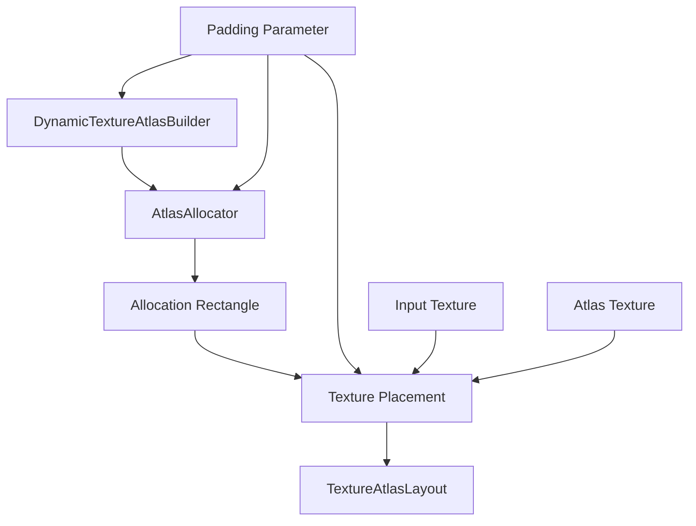

+++
title = "#23091 Fix `DynamicTextureAtlasBuilder` incorrectly padding added textures."
date = "2026-02-21T00:00:00"
draft = false
template = "pull_request_page.html"
in_search_index = true

[taxonomies]
list_display = ["show"]

[extra]
current_language = "en"
available_languages = {"en" = { name = "English", url = "/pull_request/bevy/2026-02/pr-23091-en-20260221" }, "zh-cn" = { name = "中文", url = "/pull_request/bevy/2026-02/pr-23091-zh-cn-20260221" }}
labels = ["C-Bug", "A-UI", "D-Straightforward", "M-Deliberate-Rendering-Change"]
+++

# Title

## Basic Information
- **Title**: Fix `DynamicTextureAtlasBuilder` incorrectly padding added textures.
- **PR Link**: https://github.com/bevyengine/bevy/pull/23091
- **Author**: andriyDev
- **Status**: MERGED
- **Labels**: C-Bug, A-UI, S-Ready-For-Final-Review, D-Straightforward, M-Deliberate-Rendering-Change
- **Created**: 2026-02-21T01:37:24Z
- **Merged**: 2026-02-21T21:03:17Z
- **Merged By**: alice-i-cecile

## Description Translation
# Objective

- #22939 has been introducing diffs in the testbed_ui Text example, but the only thing that was changing was the order that glyphs are allocated to the font atlas. The font atlas **should be** resilient to this and produce no diffs in that case.
- Another PR had similar diffs and also seemed to be due to changing the order of glyphs being allocated.

## Solution

- Previously `DynamicTextureAtlasBuilder` would allocate glyph size + padding, and then copy the glyph into that rectangle - but this means that copying would start at (0,0) meaning we would "blend" with the top and left edges (which breaks things).
- Now we copy to (padding, padding).
- Remove (padding, padding) allocate-able space from the bottom and right to ensure we don't accidentally put textures on the right or bottom edges.

## Testing

- Added unit tests to ensure that allocation works and that padding works.
- The rendering change here is quite interesting! https://pixel-eagle.com/project/B04F67C0-C054-4A6F-92EC-F599FEC2FD1D?filter=PR-23091 Some cases, like the `l` in `black` in the Text screenshot look **substantially** better!

Note this is orthogonal to #23056 which is about `TextureAtlasBuilder`, not `DynamicTextureAtlasBuilder`.

## The Story of This Pull Request

This PR addresses a subtle bug in Bevy's `DynamicTextureAtlasBuilder` where texture padding was incorrectly handled. The issue manifested as visual artifacts when glyphs were allocated to the font atlas in different orders, causing unexpected rendering diffs in UI text.

The problem stemmed from how the atlas builder managed the padding between textures. In texture atlases, padding is essential to prevent bleeding artifacts during texture sampling - when a texture is sampled at its edges, hardware bilinear filtering can sample from neighboring textures if there's no padding. The `DynamicTextureAtlasBuilder` was designed to add padding around each texture, but the implementation had two critical flaws.

First, when allocating space for a texture, the builder would request a rectangle of size `texture dimensions + padding`, but then copy the texture data starting at coordinate (0,0) within that allocated rectangle. This meant the texture was positioned at the top-left corner of the allocated space, leaving the top and left padding effectively unused. More importantly, this caused the texture to potentially "blend" with whatever was already in the atlas at those coordinates, leading to visual corruption.

Second, the builder was subtracting padding from the right and bottom edges after allocation, but this approach was inconsistent with how the allocation actually worked. The correct approach needed to ensure padding on all sides of each texture.

The fix involved three key changes to the implementation logic:

1. **Initialize the atlas allocator with reduced size**: The `AtlasAllocator` (from the `guillotiere` crate) is now created with dimensions `size - padding`, ensuring there's always padding space at the right and bottom edges of the entire atlas. This prevents textures from being placed at the very edges where they would lack padding on those sides.

2. **Offset texture placement within allocations**: When copying texture data into the atlas, the implementation now starts at coordinate `(padding, padding)` within the allocated rectangle. This ensures the texture is centered within its allocated space with padding on all sides.

3. **Simplify rectangle handling**: The rectangle stored in the `TextureAtlasLayout` now represents the actual texture area (without padding), making the API more intuitive for consumers.

The implementation changes are minimal but impactful. Here's the core logic in the `add_texture` method:

```rust
if let Some(mut allocation) = allocation {
    // ... validation code ...
    
    let rect = &mut allocation.rectangle;
    // Remove the padding from the top and left (bottom and right padding is taken care of
    // by the "next" allocation and the border restriction).
    rect.min.x += self.padding as i32;
    rect.min.y += self.padding as i32;

    self.place_texture(atlas_texture, allocation, texture)?;
    Ok(atlas_layout.add_texture(to_rect(allocation.rectangle)))
}
```

The `place_texture` method was also simplified - it no longer needs to adjust the rectangle's maximum coordinates since the rectangle already represents the correct texture area.

From a technical perspective, this fix demonstrates the importance of clear coordinate system management in graphics code. The bug occurred because of mismatched assumptions about whether coordinates represented texture area or allocated area (including padding). The solution establishes a consistent convention: allocated rectangles include padding, but texture placement is offset within them, and the layout stores only the texture area.

The PR also adds comprehensive unit tests that verify both allocation without padding and with padding. The padding test is particularly valuable because it demonstrates the edge-case behavior: when padding is applied, textures that would otherwise fit in a row get pushed to the next row to maintain proper padding on the right edge.

The visual impact is significant, especially for text rendering. As noted in the PR description, characters like the 'l' in "black" show substantial improvement because their thin vertical strokes no longer suffer from bleeding artifacts from adjacent glyphs. This improvement is orthogonal to another similar fix (#23056) for the non-dynamic `TextureAtlasBuilder`, highlighting that both atlas implementations needed the same correction.

This fix makes the font atlas truly resilient to allocation order changes, which is important for deterministic rendering and for preventing visual regressions when unrelated code changes affect the order in which glyphs are processed.

## Visual Representation



## Key Files Changed

### `crates/bevy_image/src/dynamic_texture_atlas_builder.rs` (+220/-9)

This is the only file modified in the PR. The changes fix the padding logic in `DynamicTextureAtlasBuilder` and add comprehensive unit tests.

**Key changes:**

1. **Constructor documentation and validation**: Updated documentation to clarify that padding applies to atlas edges too, and added a debug assertion.

```rust
// Before:
/// * `padding` - gap added between textures in the atlas, both in x axis and y axis

// After:
/// * `padding` - gap added between textures in the atlas (and the atlas edge), both in x axis
///   and y axis
pub fn new(size: UVec2, padding: u32) -> Self {
    // This doesn't need to be >= since `AtlasAllocator` requires non-zero size.
    debug_assert!(size.x > padding && size.y > padding);
    Self {
        // Leave out padding at the right and bottom, so we don't put textures on the edge of
        // atlas.
        atlas_allocator: AtlasAllocator::new(to_size2(size - padding)),
        padding,
    }
}
```

2. **Fixed texture allocation logic**: The `add_texture` method now properly offsets the texture within the allocated rectangle.

```rust
// Before:
if let Some(allocation) = allocation {
    // ... code ...
    self.place_texture(atlas_texture, allocation, texture)?;
    let mut rect: URect = to_rect(allocation.rectangle);
    rect.max = rect.max.saturating_sub(UVec2::splat(self.padding));
    Ok(atlas_layout.add_texture(rect))
}

// After:
if let Some(mut allocation) = allocation {
    // ... code ...
    let rect = &mut allocation.rectangle;
    // Remove the padding from the top and left (bottom and right padding is taken care of
    // by the "next" allocation and the border restriction).
    rect.min.x += self.padding as i32;
    rect.min.y += self.padding as i32;

    self.place_texture(atlas_texture, allocation, texture)?;
    Ok(atlas_layout.add_texture(to_rect(allocation.rectangle)))
}
```

3. **Simplified texture placement**: The `place_texture` method no longer needs to adjust the rectangle bounds.

```rust
// Before:
let mut rect = allocation.rectangle;
rect.max.x -= self.padding as i32;
rect.max.y -= self.padding as i32;

// After:
let rect = &allocation.rectangle;
```

4. **Added comprehensive unit tests**: The PR adds 220 lines of unit tests covering allocation with and without padding, verifying both layout correctness and actual pixel data.

```rust
#[test]
fn allocate_textures() {
    // Tests basic allocation without padding
}

#[test]
fn allocate_textures_with_padding() {
    // Tests allocation with padding, including edge-case behavior
}
```

## Further Reading

1. **Texture Atlas Fundamentals**: Learn about texture atlasing techniques and why padding is necessary to prevent texture bleeding artifacts.
2. **Guillotiere Algorithm**: The `guillotiere` crate implements the Guillotine algorithm for rectangle packing, which is what Bevy uses for dynamic texture atlas allocation.
3. **Bilinear Filtering and Texture Borders**: Understanding how GPU texture sampling works helps explain why padding is critical for correct rendering.
4. **PR #23056**: The related fix for the non-dynamic `TextureAtlasBuilder` that addresses similar padding issues.
5. **Bevy's UI System**: How text rendering works in Bevy's UI system and the role of font atlases in efficient text rendering.

# Full Code Diff
(See original PR for full diff)