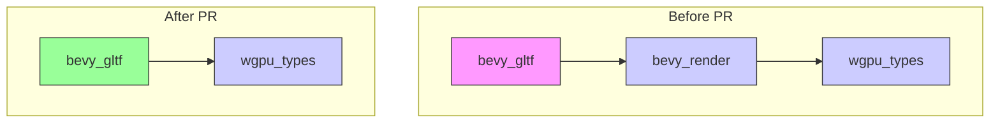

+++
title = "#23095 Remove `bevy_gltf` dependency on `bevy_render`"
date = "2026-02-24T00:00:00"
draft = false
template = "pull_request_page.html"
in_search_index = true

[taxonomies]
list_display = ["show"]

[extra]
current_language = "en"
available_languages = {"en" = { name = "English", url = "/pull_request/bevy/2026-02/pr-23095-en-20260224" }, "zh-cn" = { name = "中文", url = "/pull_request/bevy/2026-02/pr-23095-zh-cn-20260224" }}
labels = ["D-Trivial", "A-Rendering"]
+++

# Title

## Basic Information
- **Title**: Remove `bevy_gltf` dependency on `bevy_render`
- **PR Link**: https://github.com/bevyengine/bevy/pull/23095
- **Author**: Zeophlite
- **Status**: MERGED
- **Labels**: D-Trivial, A-Rendering, S-Ready-For-Final-Review
- **Created**: 2026-02-21T10:59:04Z
- **Merged**: 2026-02-24T02:18:02Z
- **Merged By**: alice-i-cecile

## Description Translation

# Objective

- Remove `bevy_gltf` dependency on `bevy_render`

## Solution

- Remove `Face` re-export from `bevy_render`

## Testing

- `cargo run --example animated_mesh`

## The Story of This Pull Request

This PR addresses a straightforward but meaningful architectural improvement: eliminating an unnecessary dependency between the `bevy_gltf` crate and the `bevy_render` crate. The core issue was that `bevy_gltf` was importing the `Face` type from `bevy_render::render_resource::Face`, when `bevy_render` itself was re-exporting this type from the underlying graphics API crate, `wgpu_types`.

The problem context involves dependency management in a modular game engine. `bevy_gltf` handles loading and parsing GLTF files, which includes processing materials with properties like face culling. The `Face` enum (representing culling faces like Front, Back, or None) is needed for material configuration when loading GLTF assets. However, `bevy_gltf` doesn't actually need the full rendering engine functionality; it just needs this specific type definition.

The solution approach was simple: instead of going through `bevy_render` as an intermediary, import `Face` directly from `wgpu_types`. This removes the transitive dependency chain and makes the crate dependencies more accurate. `wgpu_types` is already a direct dependency of `bevy_gltf`, so there's no additional dependency burden.

Looking at the implementation details, the change required three modifications:

1. Removing `bevy_render` from the Cargo.toml dependencies
2. Updating a documentation comment that referenced the old import path
3. Changing the import statement in the loader module

The technical insight here is about proper layering in a modular architecture. When a type is re-exported through multiple layers, downstream crates should import from the most direct source that provides the required functionality. This reduces coupling and compile times, and makes the dependency graph more transparent. The `Face` type is a good example - it's a fundamental graphics concept defined by the WebGPU API (`wgpu_types`), not something specific to Bevy's rendering system.

The impact of this change is primarily architectural rather than functional. It doesn't change runtime behavior, but it improves the codebase organization by eliminating an unnecessary dependency edge. This makes the build graph cleaner and potentially reduces compilation times by avoiding pulling in the entire `bevy_render` crate just for one type. It also makes the intent clearer - `bevy_gltf` depends on the graphics API types directly, not on the rendering engine's higher-level abstractions.

From an engineering perspective, this is a good example of "dependency hygiene" - regularly reviewing and minimizing crate dependencies to maintain a clean, understandable architecture. The change is low-risk because it doesn't alter any logic, just import paths and documentation.

## Visual Representation



## Key Files Changed

### 1. `crates/bevy_gltf/Cargo.toml`

**What changed**: Removed `bevy_render` from the dependency list.
**Why**: The crate no longer needs to depend on `bevy_render` since it imports `Face` directly from `wgpu_types`.

```toml
# Before:
bevy_render = { path = "../bevy_render", version = "0.19.0-dev" }

# After:
# (line removed)
```

### 2. `crates/bevy_gltf/src/label.rs`

**What changed**: Updated a documentation comment to reference `wgpu_types::Face` instead of `bevy_render::render_resource::Face`.
**Why**: The documentation should point to the actual source of the type now that the import path has changed.

```rust
// Before:
/// Used to set the [`Face`](bevy_render::render_resource::Face) of the material,

// After:
/// Used to set the [`Face`](wgpu_types::Face) of the material,
```

### 3. `crates/bevy_gltf/src/loader/mod.rs`

**What changed**: Replaced the import of `Face` from `bevy_render::render_resource` with an import from `wgpu_types`.
**Why**: This is the core change that enables removing the `bevy_render` dependency.

```rust
// Before:
use bevy_render::render_resource::Face;

// After:
use wgpu_types::Face;
```

## Further Reading

- [Bevy Engine Architecture](https://bevyengine.org/learn/quick-start/introduction/) - Understanding Bevy's modular crate structure
- [wgpu-types Documentation](https://docs.rs/wgpu-types/) - The WebGPU types crate that provides fundamental graphics API types
- [Rust Dependency Management](https://doc.rust-lang.org/cargo/reference/specifying-dependencies.html) - How to specify and manage dependencies in Cargo.toml
- [Module System in Rust](https://doc.rust-lang.org/book/ch07-00-managing-growing-projects-with-packages-crates-and-modules.html) - Understanding Rust's module and crate system

# Full Code Diff
diff --git a/crates/bevy_gltf/Cargo.toml b/crates/bevy_gltf/Cargo.toml
index d1e3aa8605a6c..40629bf4cf393 100644
--- a/crates/bevy_gltf/Cargo.toml
+++ b/crates/bevy_gltf/Cargo.toml
@@ -32,7 +32,6 @@ bevy_mesh = { path = "../bevy_mesh", version = "0.19.0-dev", features = [
   "bevy_mikktspace",
 ] }
 bevy_reflect = { path = "../bevy_reflect", version = "0.19.0-dev" }
-bevy_render = { path = "../bevy_render", version = "0.19.0-dev" }
 bevy_material = { path = "../bevy_material", version = "0.19.0-dev" }
 bevy_scene = { path = "../bevy_scene", version = "0.19.0-dev" }
 bevy_transform = { path = "../bevy_transform", version = "0.19.0-dev" }
diff --git a/crates/bevy_gltf/src/label.rs b/crates/bevy_gltf/src/label.rs
index a1e6d900c3ee9..94492e283fd45 100644
--- a/crates/bevy_gltf/src/label.rs
+++ b/crates/bevy_gltf/src/label.rs
@@ -58,7 +58,7 @@ pub enum GltfAssetLabel {
     Material {
         /// Index of this material
         index: usize,
-        /// Used to set the [`Face`](bevy_render::render_resource::Face) of the material,
+        /// Used to set the [`Face`](wgpu_types::Face) of the material,
         /// useful if it is used with negative scale
         is_scale_inverted: bool,
     },
diff --git a/crates/bevy_gltf/src/loader/mod.rs b/crates/bevy_gltf/src/loader/mod.rs
index 48395c746cba0..7225335eb6b35 100644
--- a/crates/bevy_gltf/src/loader/mod.rs
+++ b/crates/bevy_gltf/src/loader/mod.rs
@@ -36,7 +36,6 @@ use bevy_mesh::{
 };
 use bevy_platform::collections::{HashMap, HashSet};
 use bevy_reflect::TypePath;
-use bevy_render::render_resource::Face;
 use bevy_scene::Scene;
 #[cfg(not(target_arch = "wasm32"))]
 use bevy_tasks::IoTaskPool;
@@ -53,6 +52,7 @@ use smallvec::SmallVec;
 use std::{io::Error, sync::Mutex};
 use thiserror::Error;
 use tracing::{error, info_span, warn};
+use wgpu_types::Face;
 
 use crate::{
     convert_coordinates::ConvertCoordinates as _, vertex_attributes::convert_attribute, Gltf,