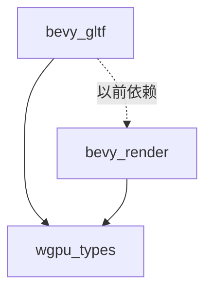

+++
title = "#23095 Remove `bevy_gltf` dependency on `bevy_render`"
date = "2026-02-24T00:00:00"
draft = false
template = "pull_request_page.html"
in_search_index = false

[extra]
current_language = "zh-cn"
available_languages = {"en" = { name = "English", url = "/pull_request/bevy/2026-02/pr-23095-en-20260224" }, "zh-cn" = { name = "中文", url = "/pull_request/bevy/2026-02/pr-23095-zh-cn-20260224" }}
labels = ["D-Trivial", "A-Rendering"]
+++

# Title
Remove `bevy_gltf` dependency on `bevy_render`

## Basic Information
- **Title**: Remove `bevy_gltf` dependency on `bevy_render`
- **PR Link**: https://github.com/bevyengine/bevy/pull/23095
- **Author**: Zeophlite
- **Status**: MERGED
- **Labels**: D-Trivial, A-Rendering, S-Ready-For-Final-Review
- **Created**: 2026-02-21T10:59:04Z
- **Merged**: 2026-02-24T02:18:02Z
- **Merged By**: alice-i-cecile

## Description Translation
### 目标
- 移除 `bevy_gltf` 对 `bevy_render` 的依赖

### 解决方案
- 移除从 `bevy_render` 重新导出的 `Face` 类型

### 测试
- `cargo run --example animated_mesh`

## The Story of This Pull Request

这个PR的核心目标是清理Bevy引擎中的依赖关系，具体来说是移除`bevy_gltf`模块对`bevy_render`模块的不必要依赖。依赖管理在大型代码库中至关重要，因为它直接影响编译时间、二进制大小以及代码的可维护性。

问题出现在`bevy_gltf`仅使用了`bevy_render`中的一个类型——`Face`，但这个类型实际上来自更底层的`wgpu_types`。`bevy_render`作为渲染管道的核心模块，包含了大量复杂的渲染逻辑和资源管理代码。当`bevy_gltf`（GLTF文件加载器）依赖`bevy_render`时，实际上引入了大量不必要的代码依赖，这会导致编译时间增加，并且违反了最小依赖原则。

从技术角度看，`Face`枚举定义了渲染时的多边形正面方向（正面剔除或背面剔除），它是一个从`wgpu_types`重新导出的类型。在GLTF加载器中，这个类型仅用于文档注释中的一个引用，以及实际代码中的一个导入。

解决方案非常直接：将依赖从`bevy_render`改为直接依赖`wgpu_types`。这样做有几个技术优势：
1. 编译优化：减少间接依赖链，缩短编译时间
2. 关注点分离：`bevy_gltf`专注于资源加载，不需要了解完整的渲染管线
3. 架构清晰：依赖关系更准确地反映了实际使用情况

从实现细节来看，这个PR只修改了三处：
1. 在`Cargo.toml`中移除`bevy_render`依赖
2. 更新文档注释中的类型引用
3. 修改导入语句指向正确的模块

这种改动虽然小，但体现了良好的工程实践——定期审视和清理依赖关系，确保每个模块只依赖它真正需要的部分。在大型项目中，这种细粒度的依赖管理能够显著降低技术债务，使代码库更容易维护和扩展。

从测试角度来看，由于这只是依赖关系的调整，没有改变任何实际功能，所以运行现有的`animated_mesh`示例就足以验证改动没有破坏现有功能。这种改动属于重构范畴，风险较低但长期收益明显。

## Visual Representation



## Key Files Changed

### `crates/bevy_gltf/Cargo.toml`
- **修改内容**: 移除`bevy_render`依赖
- **原因**: `bevy_gltf`不再需要`bevy_render`模块的任何功能
- **代码对比**:
```toml
# Before:
bevy_render = { path = "../bevy_render", version = "0.19.0-dev" }

# After:
# bevy_render依赖被完全移除
```

### `crates/bevy_gltf/src/label.rs`
- **修改内容**: 更新文档注释中的类型引用
- **原因**: `Face`类型现在直接从`wgpu_types`导入，而不是通过`bevy_render`
- **代码对比**:
```rust
// Before:
/// Used to set the [`Face`](bevy_render::render_resource::Face) of the material,

// After:
/// Used to set the [`Face`](wgpu_types::Face) of the material,
```

### `crates/bevy_gltf/src/loader/mod.rs`
- **修改内容**: 修改导入语句
- **原因**: 直接导入`wgpu_types::Face`而不是通过`bevy_render`
- **代码对比**:
```rust
// Before:
use bevy_render::render_resource::Face;

// After:
use wgpu_types::Face;
```

## Further Reading

1. **Cargo依赖管理最佳实践**: https://doc.rust-lang.org/cargo/guide/dependencies.html
2. **Rust模块系统和可见性**: https://doc.rust-lang.org/book/ch07-02-defining-modules-to-control-scope-and-privacy.html
3. **Bevy引擎架构文档**: https://bevyengine.org/learn/book/getting-started/architecture/
4. **WGPU类型文档**: https://docs.rs/wgpu-types/latest/wgpu_types/
5. **GLTF格式规范**: https://www.khronos.org/gltf/

# Full Code Diff
diff --git a/crates/bevy_gltf/Cargo.toml b/crates/bevy_gltf/Cargo.toml
index d1e3aa8605a6c..40629bf4cf393 100644
--- a/crates/bevy_gltf/Cargo.toml
+++ b/crates/bevy_gltf/Cargo.toml
@@ -32,7 +32,6 @@ bevy_mesh = { path = "../bevy_mesh", version = "0.19.0-dev", features = [
   "bevy_mikktspace",
 ] }
 bevy_reflect = { path = "../bevy_reflect", version = "0.19.0-dev" }
-bevy_render = { path = "../bevy_render", version = "0.19.0-dev" }
 bevy_material = { path = "../bevy_material", version = "0.19.0-dev" }
 bevy_scene = { path = "../bevy_scene", version = "0.19.0-dev" }
 bevy_transform = { path = "../bevy_transform", version = "0.19.0-dev" }
diff --git a/crates/bevy_gltf/src/label.rs b/crates/bevy_gltf/src/label.rs
index a1e6d900c3ee9..94492e283fd45 100644
--- a/crates/bevy_gltf/src/label.rs
+++ b/crates/bevy_gltf/src/label.rs
@@ -58,7 +58,7 @@ pub enum GltfAssetLabel {
     Material {
         /// Index of this material
         index: usize,
-        /// Used to set the [`Face`](bevy_render::render_resource::Face) of the material,
+        /// Used to set the [`Face`](wgpu_types::Face) of the material,
         /// useful if it is used with negative scale
         is_scale_inverted: bool,
     },
diff --git a/crates/bevy_gltf/src/loader/mod.rs b/crates/bevy_gltf/src/loader/mod.rs
index 48395c746cba0..7225335eb6b35 100644
--- a/crates/bevy_gltf/src/loader/mod.rs
+++ b/crates/bevy_gltf/src/loader/mod.rs
@@ -36,7 +36,6 @@ use bevy_mesh::{
 };
 use bevy_platform::collections::{HashMap, HashSet};
 use bevy_reflect::TypePath;
-use bevy_render::render_resource::Face;
 use bevy_scene::Scene;
 #[cfg(not(target_arch = "wasm32"))]
 use bevy_tasks::IoTaskPool;
@@ -53,6 +52,7 @@ use smallvec::SmallVec;
 use std::{io::Error, sync::Mutex};
 use thiserror::Error;
 use tracing::{error, info_span, warn};
+use wgpu_types::Face;
 
 use crate::{
     convert_coordinates::ConvertCoordinates as _, vertex_attributes::convert_attribute, Gltf,