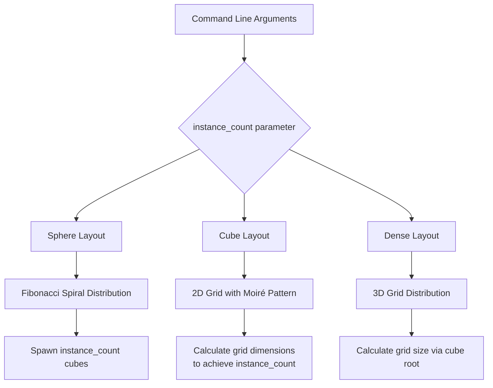

+++
title = "#23101 Add the ability to set the number of cubes in `many_cubes`."
date = "2026-02-24T00:00:00"
draft = false
template = "pull_request_page.html"
in_search_index = true

[taxonomies]
list_display = ["show"]

[extra]
current_language = "en"
available_languages = {"en" = { name = "English", url = "/pull_request/bevy/2026-02/pr-23101-en-20260224" }, "zh-cn" = { name = "中文", url = "/pull_request/bevy/2026-02/pr-23101-zh-cn-20260224" }}
labels = ["A-Rendering", "C-Examples"]
+++

# Title
Add the ability to set the number of cubes in `many_cubes`

## Basic Information
- **Title**: Add the ability to set the number of cubes in `many_cubes`.
- **PR Link**: https://github.com/bevyengine/bevy/pull/23101
- **Author**: pcwalton
- **Status**: MERGED
- **Labels**: A-Rendering, C-Examples, S-Ready-For-Final-Review
- **Created**: 2026-02-21T22:05:05Z
- **Merged**: 2026-02-24T02:35:54Z
- **Merged By**: alice-i-cecile

## Description Translation
Surprisingly, despite the number of settings in `many_cubes`, it was missing the most obvious one: setting the number of cubes. This commit adds this feature. It's a little more complicated than one might expect, because of the way the number of cubes is never actually set directly, as well as the fact that the demo supports three different patterns.

## The Story of This Pull Request

The `many_cubes` example in Bevy serves as a stress test for the rendering system, but it had a significant limitation: users couldn't directly control the number of cubes rendered. While the example offered various configuration options like different layouts (Cube, Sphere, Dense) and material variations, the actual instance count was hardcoded and derived from `WIDTH` and `HEIGHT` constants.

The problem was that each of the three layout patterns used different calculations to determine instance counts. The Cube layout spawned approximately 0.81 × WIDTH × HEIGHT instances (after accounting for the moiré pattern skip), the Sphere layout used WIDTH × HEIGHT × 4 instances, and the Dense layout used WIDTH × HEIGHT × 2 instances. This inconsistency made it difficult to predict or control the actual number of cubes rendered.

The solution was to add an `instance_count` command-line argument that directly controls the number of cubes. However, implementing this required modifying each layout pattern to respect this parameter while maintaining their specific distribution characteristics.

For the Sphere layout, the implementation was straightforward since it uses a Fibonacci spiral distribution where each point corresponds to one cube. The code simply replaced the hardcoded `N_POINTS` calculation with the `instance_count` parameter.

For the Dense layout, which arranges cubes in a 3D grid, the implementation needed to calculate a grid dimension that would produce approximately the requested number of cubes. The code uses a cube root calculation to determine the size of the grid in each dimension.

The Cube layout presented the most complexity. This layout arranges cubes in a 2D grid with a moiré pattern that skips every 10th row and column, and it spawns 4 instances per grid cell. To achieve the target instance count, the code calculates a scaling factor that adjusts the grid dimensions while maintaining the same skip pattern and 4-instance-per-cell behavior.

The material initialization code also needed updating. When material data varies per instance, the code now uses `instance_count` directly to allocate the correct capacity for material handles, rather than using layout-specific calculations.

The implementation demonstrates several engineering considerations:
1. Maintaining backward compatibility by providing sensible defaults
2. Handling floating-point calculations carefully to avoid precision issues
3. Ensuring each layout pattern maintains its intended visual characteristics while respecting the new instance count parameter
4. Using appropriate mathematical operations (sqrt, cbrt) for dimension calculations

This change makes the `many_cubes` example more useful as a benchmark tool, allowing developers to precisely control the workload and better understand performance characteristics at different scales.

## Visual Representation



## Key Files Changed

### `examples/stress_tests/many_cubes.rs` (+39/-14)

This file contains the main implementation of the `many_cubes` example. The changes add a new command-line parameter to control the number of cubes and update all three layout patterns to respect this parameter.

**Key modifications:**

1. Added `instance_count` parameter to the `Args` struct:
```rust
/// the number of cubes
#[argh(option, default = "1600000")]
instance_count: usize,
```

2. Updated Sphere layout to use `instance_count`:
```rust
// Before:
const N_POINTS: usize = WIDTH * HEIGHT * 4;

// After:
let n_points: usize = args.instance_count;
```

3. Updated Cube layout with complex dimension calculation:
```rust
// Added math::ops::sqrt import
use math::ops::{cbrt, sqrt}

// Complex calculation to determine grid dimensions
let factor = (5.0 / 9.0) * sqrt(args.instance_count as f32)
    / (sqrt(HEIGHT as f32) * sqrt(WIDTH as f32));
let dimensions = (vec2(WIDTH as f32, HEIGHT as f32) * factor)
    .ceil()
    .as_uvec2();
```

4. Updated Dense layout to use `instance_count`:
```rust
// Before:
let count = WIDTH * HEIGHT * 2;

// After:
let count = args.instance_count;
```

5. Updated material initialization to use `instance_count`:
```rust
let capacity = if args.vary_material_data_per_instance {
    args.instance_count  // Changed from layout-specific calculations
} else {
    args.material_texture_count
}
```

These changes ensure that all three layout patterns respect the `instance_count` parameter while maintaining their specific distribution patterns and visual characteristics.

## Further Reading

1. **Bevy Examples Documentation**: The `many_cubes` example is part of Bevy's stress tests, which are designed to push the rendering system to its limits.
2. **Fibonacci Spiral Algorithm**: The Sphere layout uses a Fibonacci spiral distribution for evenly distributing points on a sphere.
3. **Moiré Patterns**: The Cube layout uses a skip pattern to avoid visual artifacts that occur with regular grid distributions.
4. **Bevy Command-Line Argument Parsing**: The example uses the `argh` crate for command-line argument parsing, which is integrated into Bevy's example framework.