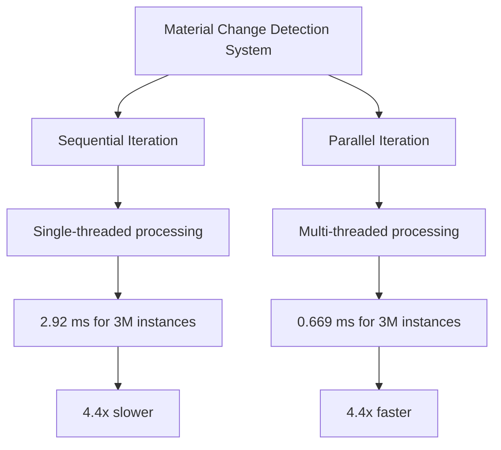

+++
title = "#23103 Parallelize `mark_meshes_as_changed_if_their_materials_changed`."
date = "2026-02-24T00:00:00"
draft = false
template = "pull_request_page.html"
in_search_index = true

[taxonomies]
list_display = ["show"]

[extra]
current_language = "en"
available_languages = {"en" = { name = "English", url = "/pull_request/bevy/2026-02/pr-23103-en-20260224" }, "zh-cn" = { name = "中文", url = "/pull_request/bevy/2026-02/pr-23103-zh-cn-20260224" }}
labels = ["D-Trivial", "A-Rendering", "C-Performance"]
+++

# Parallelize `mark_meshes_as_changed_if_their_materials_changed`

## Basic Information
- **Title**: Parallelize `mark_meshes_as_changed_if_their_materials_changed`.
- **PR Link**: https://github.com/bevyengine/bevy/pull/23103
- **Author**: pcwalton
- **Status**: MERGED
- **Labels**: D-Trivial, A-Rendering, C-Performance, S-Ready-For-Final-Review
- **Created**: 2026-02-21T22:32:58Z
- **Merged**: 2026-02-24T02:35:54Z
- **Merged By**: alice-i-cecile

## Description Translation
This tiny system loops over all instances and can actually show up in the profile when the instance count reaches the millions. This PR fixes that. The `mark_meshes_as_changed_if_their_materials_changed` system in `many_cubes --no-cpu-culling --instance-count 3000000` (with PR #23101 applied) goes from 2.92 ms per frame to 0.669 ms per frame with this patch applied, a 4.4x speedup.

Before and after:


## The Story of This Pull Request

This PR addresses a performance bottleneck in Bevy's rendering system that becomes significant when working with large numbers of mesh instances. The issue was discovered during profiling of scenarios with millions of mesh instances, where a seemingly simple system was consuming noticeable frame time.

The problem centers around the `mark_meshes_as_changed_if_their_materials_changed` system, which runs in Bevy's ECS (Entity Component System). This system is responsible for detecting when materials associated with meshes have changed and marking those meshes as changed so that the rendering system can properly update them. When material properties change (such as color, texture, or other material parameters), the system needs to notify the renderer that the affected meshes require re-rendering.

The original implementation used a sequential loop to iterate over all meshes with changed materials:

```rust
for mut mesh in &mut changed_meshes_query {
    mesh.set_changed();
}
```

While this approach works correctly and is efficient for small numbers of meshes, it becomes a performance issue when dealing with millions of instances. The problem is that the loop processes each mesh sequentially on a single CPU core, which doesn't take advantage of modern multi-core processors.

The solution implemented in this PR is straightforward: replace the sequential loop with a parallel iteration using Bevy's parallel query API. The key insight is that marking meshes as changed is an embarrassingly parallel operation - each mesh can be processed independently without requiring synchronization with other meshes.

The implementation change is minimal but impactful:

```rust
changed_meshes_query.par_iter_mut().for_each(|mut mesh| {
    mesh.set_changed();
});
```

This change leverages Bevy's built-in parallel iteration capabilities through the `par_iter_mut()` method, which automatically distributes the work across available CPU cores. The `for_each` method then applies the `set_changed()` operation to each mesh in parallel.

The performance improvement is substantial: in a benchmark with 3 million cube instances (using the `many_cubes` example with `--no-cpu-culling --instance-count 3000000`), the system's execution time dropped from 2.92 ms to 0.669 ms per frame - a 4.4x speedup. This improvement directly translates to better frame rates and more CPU time available for other game logic and systems.

The change is particularly elegant because it maintains the same safety guarantees as the sequential version. Bevy's parallel query system ensures thread safety by only allowing parallel iteration when the operations are safe to run concurrently. In this case, marking each mesh as changed doesn't require synchronization between threads since each mesh is an independent entity.

This optimization demonstrates an important principle in game engine development: even small, simple systems can become performance bottlenecks at scale. What works efficiently for hundreds or thousands of entities may need reconsideration for millions of entities. The solution also shows the value of Bevy's design, which makes parallel processing accessible through simple API changes rather than requiring complex manual thread management.

The PR is labeled as "trivial" (D-Trivial) because the code change is minimal and the concept is straightforward, but the performance impact is significant for large-scale scenarios. This makes it an excellent example of a high-leverage optimization - a small change with substantial benefits for specific use cases.

## Visual Representation



## Key Files Changed

### `crates/bevy_pbr/src/material.rs`

This file contains the material system implementation for Bevy's PBR (Physically Based Rendering) pipeline. The change modifies a system function that handles material change detection for meshes.

**What changed and why**: The system `mark_meshes_as_changed_if_their_materials_changed` was modified to use parallel iteration instead of sequential iteration when marking meshes as changed. This optimization provides significant performance improvements when processing large numbers of mesh instances.

**Code change**:
```rust
// Before:
for mut mesh in &mut changed_meshes_query {
    mesh.set_changed();
}

// After:
changed_meshes_query.par_iter_mut().for_each(|mut mesh| {
    mesh.set_changed();
});
```

**How it relates to the overall purpose**: This change directly addresses the performance bottleneck described in the PR. By parallelizing the mesh marking operation, the system can process millions of instances much more efficiently, reducing frame time by 4.4x in the benchmark scenario.

## Further Reading

1. **Bevy ECS Parallel Queries**: The official Bevy documentation on parallel query iteration provides details on how to use `par_iter()` and `par_iter_mut()` for performance optimization.

2. **Embarrassingly Parallel Problems**: This optimization is a classic example of an embarrassingly parallel problem where tasks can be executed independently with minimal synchronization.

3. **Bevy Performance Guidelines**: The Bevy engine's performance optimization patterns and best practices for writing efficient systems.

4. **CPU Parallelism in Game Engines**: General techniques for leveraging multi-core processors in real-time systems like game engines.

5. **The `many_cubes` Benchmark**: Understanding Bevy's benchmarking examples and how to use them to identify performance bottlenecks.