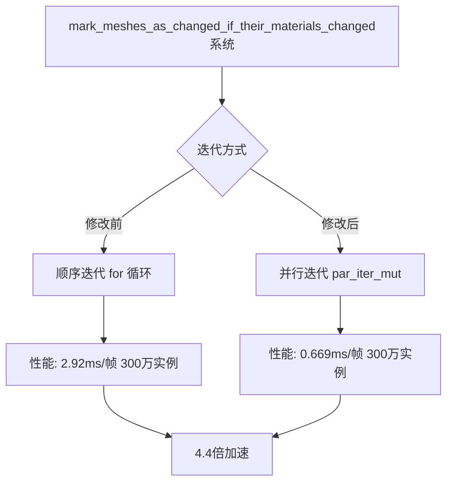

+++
title = "#23103 Parallelize `mark_meshes_as_changed_if_their_materials_changed`."
date = "2026-02-24T00:00:00"
draft = false
template = "pull_request_page.html"
in_search_index = false

[extra]
current_language = "zh-cn"
available_languages = {"en" = { name = "English", url = "/pull_request/bevy/2026-02/pr-23103-en-20260224" }, "zh-cn" = { name = "中文", url = "/pull_request/bevy/2026-02/pr-23103-zh-cn-20260224" }}
labels = ["D-Trivial", "A-Rendering", "C-Performance"]
+++

# Title
## Parallelize `mark_meshes_as_changed_if_their_materials_changed`.

## Basic Information
- **Title**: Parallelize `mark_meshes_as_changed_if_their_materials_changed`.
- **PR Link**: https://github.com/bevyengine/bevy/pull/23103
- **Author**: pcwalton
- **Status**: MERGED
- **Labels**: D-Trivial, A-Rendering, C-Performance, S-Ready-For-Final-Review
- **Created**: 2026-02-21T22:32:58Z
- **Merged**: 2026-02-24T02:35:54Z
- **Merged By**: alice-i-cecile

## 描述翻译
这个小型系统会循环遍历所有实例，当实例数量达到数百万时，它确实会在性能分析中显示出来。这个PR修复了这个问题。在 `many_cubes --no-cpu-culling --instance-count 3000000` 测试场景中（应用了 PR #23101），应用此补丁后，`mark_meshes_as_changed_if_their_materials_changed` 系统从每帧 2.92 毫秒降至每帧 0.669 毫秒，实现了 4.4 倍的加速。

前后对比：


## 本次 Pull Request 的故事

这个 PR 源于一个性能分析中的发现。在 Bevy 渲染管线的 `bevy_pbr` 模块中，有一个名为 `mark_meshes_as_changed_if_their_materials_changed` 的系统。这个系统的功能很直接：当网格的材质发生变化时，它需要遍历所有相关的网格实例并标记它们为已更改（`set_changed()`），以便后续的渲染系统能正确处理这些更新。

问题出现在这个遍历过程上。最初，该系统使用了一个简单的 `for` 循环来顺序处理查询结果。在大多数场景中，这个操作的性能开销可以忽略不计。然而，当场景中的网格实例数量急剧增加——例如达到数百万时——这个线性扫描操作就会成为性能瓶颈，在性能分析中显现出来，消耗数毫秒的帧时间。这正是 PR 作者在运行 `many_cubes` 基准测试（禁用 CPU 裁剪，使用 300 万个实例）时观察到的现象。

解决方案的思路很直接：将顺序遍历改为并行遍历。Bevy 的 ECS 查询支持通过 `par_iter_mut()` 方法进行并行迭代，这正是利用了 Rayon 库提供的并行能力。这种优化属于“简单并行化”的范畴，即当任务可以独立执行且没有数据竞争时，将工作负载分发到多个线程上。

实施过程非常简洁。在 `crates/bevy_pbr/src/material.rs` 文件中，只需要修改三行代码。将原来的 `for` 循环替换为 `par_iter_mut().for_each()` 调用。这里的关键技术点是：
1. `par_iter_mut()` 返回一个并行迭代器。
2. 由于每个网格实例的 `set_changed()` 操作是独立的（它只修改该实体组件内部的状态），因此不存在数据竞争，满足并行执行的安全条件。
3. 这个改动不需要任何额外的同步原语或锁，因为 ECS 架构确保了查询的并发安全性。

从技术实现角度看，这个 PR 展示了一个在游戏引擎中常见的优化模式：识别并并行化“令人尴尬的并行”任务。原始循环的每次迭代都是相互独立的，这正是并行化的理想候选。修改后的代码保持了相同的功能语义，只是执行方式从串行变为了并行，这是此类重构的一个重要特质——它不应该改变程序的可观察行为。

性能提升的结果非常显著。在作者的测试中，该系统从每帧 2.92 毫秒降至 0.669 毫秒，加速比达到 4.4 倍。这种提升直接转化为更流畅的游戏体验和更高的帧率，尤其是在处理大规模实体渲染的场景中。这个优化也提醒我们，即使是看似简单的系统，在极端负载下也可能成为性能瓶颈，需要通过分析工具来发现。

这个 PR 的另一个重要方面是它的简洁性和非侵入性。它没有改变任何 API，没有引入新的依赖，也没有增加代码复杂度。它只是将现有的循环结构替换为并行等效结构。这种“低风险、高回报”的优化在大型代码库中特别有价值。

从更广泛的工程视角来看，这个 PR 还体现了几个重要的实践原则：
1. **基于数据的性能优化**：作者通过性能分析（profiling）确定了具体的瓶颈，而不是基于猜测进行优化。
2. **利用现有抽象**：通过使用 Bevy ECS 已经提供的并行迭代器接口，避免了手动线程管理的复杂性。
3. **保持改变的局部性**：优化被限制在单个函数内，降低了审查和回归测试的负担。

## 可视化表示



## 关键文件更改

**crates/bevy_pbr/src/material.rs** (+2/-2)

这个文件包含了 Bevy 的 PBR（基于物理的渲染）材质系统实现。具体修改是在 `mark_meshes_as_changed_if_their_materials_changed` 函数中，将网格实例的遍历从顺序执行改为并行执行。

```rust
// 文件: crates/bevy_pbr/src/material.rs
// 修改前 (第 654-658 行):
for mut mesh in &mut changed_meshes_query {
    mesh.set_changed();
}

// 修改后:
changed_meshes_query.par_iter_mut().for_each(|mut mesh| {
    mesh.set_changed();
});
```

修改说明：
1. 函数签名和上下文保持不变，只修改了循环体。
2. `&mut changed_meshes_query` 改为 `changed_meshes_query.par_iter_mut()` 以获取并行迭代器。
3. `for` 循环体被替换为 `for_each` 闭包，保持相同的操作逻辑。
4. 这个改动直接对应 PR 的目标：通过并行化提高该系统的执行效率。

## 延伸阅读

1. **Bevy ECS 并行查询**：了解 Bevy 的 ECS 系统如何支持并行处理
   - 官方文档：https://bevyengine.org/learn/quick-start/ecs/
   
2. **Rayon 数据并行库**：了解底层使用的并行迭代器实现
   - GitHub 仓库：https://github.com/rayon-rs/rayon
   
3. **性能分析与优化**：学习如何识别和解决渲染性能瓶颈
   - "Systems Performance: Enterprise and the Cloud" 第 2 章
   
4. **Bevy 渲染管线架构**：理解材质系统在完整渲染管线中的位置
   - Bevy 源码中的 `crates/bevy_pbr/src/lib.rs`

5. **Embarrassingly Parallel 问题**：了解更多关于可轻松并行化的问题模式
   - Wikipedia: https://en.wikipedia.org/wiki/Embarrassingly_parallel

# 完整代码差异
```
diff --git a/crates/bevy_pbr/src/material.rs b/crates/bevy_pbr/src/material.rs
index b947c7076df24..43658872dac72 100644
--- a/crates/bevy_pbr/src/material.rs
+++ b/crates/bevy_pbr/src/material.rs
@@ -654,9 +654,9 @@ fn mark_meshes_as_changed_if_their_materials_changed<M>(
 ) where
     M: Material,
 {
-    for mut mesh in &mut changed_meshes_query {
+    changed_meshes_query.par_iter_mut().for_each(|mut mesh| {
         mesh.set_changed();
-    }
+    });
 }
 
 /// Fills the [`RenderMaterialInstances`] resources from the meshes in the
```