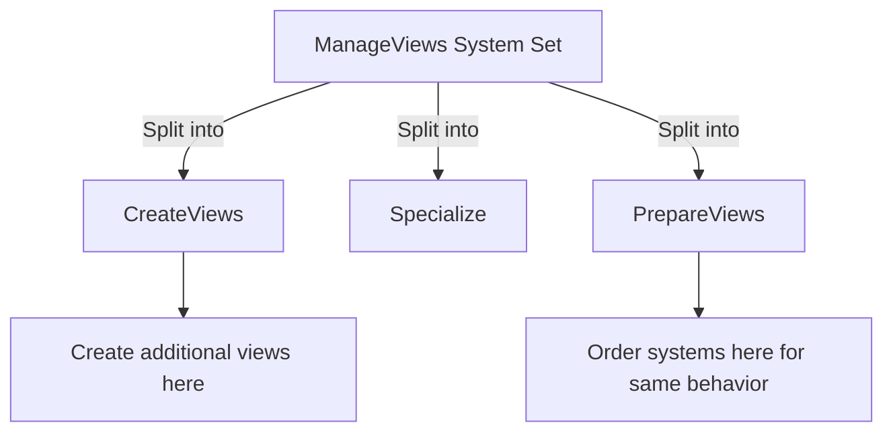

+++
title = "#23104 ManageViews migration guide"
date = "2026-02-22T00:00:00"
draft = false
template = "pull_request_page.html"
in_search_index = true

[taxonomies]
list_display = ["show"]

[extra]
current_language = "en"
available_languages = {"en" = { name = "English", url = "/pull_request/bevy/2026-02/pr-23104-en-20260222" }, "zh-cn" = { name = "中文", url = "/pull_request/bevy/2026-02/pr-23104-zh-cn-20260222" }}
labels = ["C-Docs", "A-Rendering", "M-Migration-Guide"]
+++

# Title
## `RenderSystems::ManageViews` has been split into three system sets

## Basic Information
- **Title**: ManageViews migration guide
- **PR Link**: https://github.com/bevyengine/bevy/pull/23104
- **Author**: atlv24
- **Status**: MERGED
- **Labels**: C-Docs, A-Rendering, S-Ready-For-Final-Review, M-Migration-Guide
- **Created**: 2026-02-22T03:39:05Z
- **Merged**: 2026-02-22T04:37:37Z
- **Merged By**: alice-i-cecile

## Description Translation
# Objective

- #22949 had breaking changes but no migration guide

## Solution

- add a migration guide

## Testing

- gee i sure hope this doesnt break anything

## The Story of This Pull Request

This PR addresses a straightforward but important documentation gap in the Bevy game engine. When PR #22949 introduced breaking changes to the rendering system, it failed to include a migration guide explaining how developers should update their code. Without clear migration instructions, developers relying on the old API would encounter build errors and uncertainty about how to adapt their code to the new system.

The core issue was that the `RenderSystems::ManageViews` system set had become overloaded with responsibility, making it difficult to resolve render system order ambiguities. In game engine architecture, system ordering is critical for ensuring that rendering operations happen in the correct sequence - for example, creating views must happen before preparing them for rendering. When a single system set handles multiple distinct phases of work, it becomes harder to specify precise ordering between systems that need to run at different points within that combined phase.

PR #22949 addressed this architectural problem by splitting `ManageViews` into three distinct system sets: `CreateViews`, `Specialize`, and `PrepareViews`. This separation of concerns follows standard software engineering principles - each phase now has a clear, single responsibility. However, this restructuring constituted a breaking API change, meaning existing code that referenced `ManageViews` would no longer compile.

This migration guide PR serves as the missing documentation bridge. It doesn't change any code functionality but provides the essential information developers need to update their projects. The guide clearly explains the reasoning behind the change ("was previously somewhat overloaded with responsibility") and provides concrete guidance for two common scenarios. For most users who were ordering systems against `ManageViews`, they can now order against `PrepareViews` for identical behavior. For developers creating additional views (such as for cubemap rendering), the guide directs them to use the new `CreateViews` phase.

The implementation is minimal and focused - a single new markdown file that follows Bevy's existing migration guide structure. The author includes a link to the original PR (#22949) for context and keeps the explanation concise while covering the essential information. This approach follows good documentation practices: it explains the "why" behind the change, provides clear migration paths, and references the source change for developers who need deeper technical understanding.

## Visual Representation



## Key Files Changed

### `release-content/migration-guides/manage-views.md` (+9/-0)

This is a completely new file created to document the migration path for developers affected by the breaking changes in PR #22949. The file follows Bevy's standard migration guide format with frontmatter metadata and clear, actionable content.

```markdown
---
title: "`RenderSystems::ManageViews` has been split into three system sets"
pull_requests: [22949]
---

`ManageViews` was previously somewhat overloaded with responsibility, and made resolving render system order ambiguities difficult.
To amend this, it has been split into three phases: `CreateViews`, `Specialize`, and `PrepareViews`.
It is very likely whatever you were ordering against `ManageViews` can now be ordered against `PrepareViews` and have identical behavior.
If you are creating additional views, for example for cubemap rendering, please do so in `CreateViews`.
```

**What changed and why**: A new migration guide was created to help developers transition from the old `ManageViews` system set to the new three-phase system sets (`CreateViews`, `Specialize`, `PrepareViews`). The guide explains the architectural reasoning and provides specific migration instructions.

**Key aspects**:
1. **Frontmatter**: Includes title and links to the original PR for context
2. **Problem statement**: Clearly explains why `ManageViews` was problematic (overloaded responsibility, difficult ordering)
3. **Solution description**: States the three new system sets
4. **Migration guidance**: Provides two specific pieces of advice for common use cases

**Relationship to PR purpose**: This file directly addresses the PR's objective of providing migration documentation for the breaking changes introduced in #22949.

## Further Reading

1. **Bevy Engine Documentation**: [System Sets and Ordering](https://bevyengine.org/learn/book/next/programming/systems/system-sets/) - Explains the concept of system sets and ordering in Bevy
2. **Original PR #22949**: The implementation that introduced the breaking changes this migration guide addresses
3. **Bevy Rendering Architecture**: Understanding how Bevy's render graph and view management work would provide context for why this change was necessary
4. **Migration Guide Best Practices**: General principles for writing effective migration documentation in open source projects